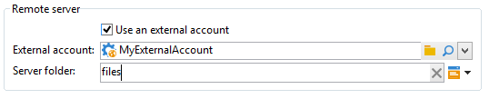

# ファイル転送{#file-transfer}

「**ファイル転送**」アクティビティでは、ファイルの送受信、ファイルの有無の確認、サーバー上のファイルのリストアップが可能です。Azure Blob Storage、Amazon Simple Storage Service (S3)、FTP、SFTP のいずれかのプロトコルを使用します。
S3、Azure Blob Storage、SFTP 接続のいずれかを使用すると、Adobe のリアルタイム顧客データプラットフォームで、セグメントデータを Adobe Campaign にインポートすることもできます。詳しくは、[このドキュメント](https://experienceleague.adobe.com/docs/experience-platform/destinations/catalog/email-marketing/adobe-campaign.html?lang=ja)を参照してください。

>[!NOTE]
>
>SFTP サーバー使用のベストプラクティスおよびトラブルシューティングについて詳しくは、こちらを参照してください。

## プロパティ {#properties}

「**[!UICONTROL アクション]**」フィールドのドロップダウンリストで、アクティビティのアクションを選択します。

設定は、選択したアクションによって異なります。

1. **ファイルの受信**

   リモートサーバーからファイルをダウンロードするには、「**[!UICONTROL アクション]**」フィールドの「**[!UICONTROL ファイルのダウンロード]**」を選択します。URL を該当するフィールドに入力する必要があります。

   

   「**[!UICONTROL 外部アカウントを使用]**」のチェックボックスをオンにして、ツリーの&#x200B;**[!UICONTROL 管理／プラットフォーム／外部アカウント]**&#x200B;ノードに設定されている Azure Blob storage アカウント、S3 アカウント、FTP アカウントまたは SFTP アカウントからアカウントを選択します。次に、ダウンロードするファイルが含まれているサーバーのディレクトリを指定します。

   

1. **ファイル転送**

   ファイルをサーバーに送信するには、「**[!UICONTROL アクション]**」フィールドの「**[!UICONTROL ファイルのアップロード]**」を選択します。エディターの「**[!UICONTROL リモートサーバー]**」セクションで、ターゲットサーバーを指定します。パラメーターは、上述のファイルのダウンロードと同じです。

   送信するファイルは、前のアクティビティのものを指定できます。その場合には、「**[!UICONTROL 前のアクティビティで生成されたファイルを使用]**」オプションを選択する必要があります。

   

   また、このオプションは、その他のファイルを対象とする場合があります。具体的にファイルを指定するには、このオプションを選択解除し、「**[!UICONTROL 挿入]**」をクリックします。送信するファイルのパスを指定します。さらにファイルを追加する場合は、もう一度「**[!UICONTROL 挿入]**」をクリックします。これで各ファイルにそれぞれタブが作成されます。

   

   矢印を使用してタブの順序を変更します。これで送信するファイルの順番を決められます。

   「**[!UICONTROL 送信済みファイルの履歴を保持]**」オプションで、送信済みのファイルをトラッキングできます。この履歴にはディレクトリからアクセスできます。

1. **ファイルが存在するかどうかをテスト**

   サーバー上のファイルの有無を確認するには、「**[!UICONTROL アクション]**」フィールドの「**[!UICONTROL ファイルが存在するかどうかをテスト]**」オプションを選択します。リモートサーバーの設定は、ファイルのダウンロードの設定と同じです。詳しくは、この[節](#properties)を参照してください。

   

1. **ファイルの表示**

   ファイルを表示するには、「**[!UICONTROL アクション]**」フィールドの「**[!UICONTROL ファイルリスト]**」オプションを選択します。リモートサーバーの設定は、ファイル受信の設定と同じです。詳しくは、この[節](#properties)を参照してください。

   「**[!UICONTROL ファイルリスト]**」アクションを選択すると、「**[!UICONTROL すべてのファイルを表示]**」オプションが表示されます。このオプションで、イベント変数 **vars.filenames** 内にサーバー上のすべてのファイルを格納できます。変数内のファイル名は `\n` 文字で区切ります。

すべてのファイルを転送する場合、次の 2 つのオプションがあります。

* 「**[!UICONTROL 不明なファイルを処理]**」オプションは、指定したディレクトリにファイルがない場合に有効化されるトランジションを追加します。
* 「**[!UICONTROL エラーを処理]**」オプションについて詳しくは、[エラーを処理](monitor-workflow-execution.md#processing-errors)を参照してください。

「**[!UICONTROL 詳細設定パラメーター]**」リンクを使用して、次のオプションにアクセスできます。

* **[!UICONTROL 転送後にソースファイルを削除]**

   リモートサーバー上のファイルを消去します。このオプションを選択しない場合は、SFTP ディレクトリにあるアーカイブ済みコンテンツのサイズを手動で監視するようにしてください。

* **[!UICONTROL SSL を使用]**

   SSL プロトコルを使用したファイル転送で、セキュア接続を使用できます。

* **[!UICONTROL セッションログを表示]**

   Azure Blob Storage、S3、FTP または SFTP 転送のログを回復し、ワークフローのログに含めることができます。

* **[!UICONTROL 休止モードを無効にする]**

   データ転送に使用する接続ポートを指定できます。

「**[!UICONTROL ファイル履歴化設定...]**」リンクでアクセスできるオプションについて詳しくは、[Web ダウンロード](web-download.md)（**[!UICONTROL ファイル履歴化]**&#x200B;の手順）を参照してください。

## 入力パラメーター {#input-parameters}

* filename

   送信したファイルの名前を入力します。

## 出力パラメーター {#output-parameters}

* filename

   「**[!UICONTROL 前のアクティビティで生成されたファイルを使用]**」オプションを選択している場合は、受信したファイルの名前をを入力します。
