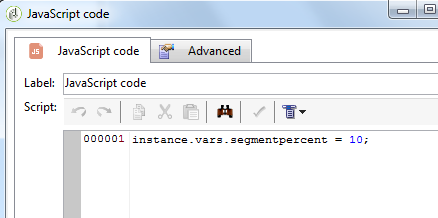

# JavaScript のスクリプトとテンプレート{#javascript-scripts-and-templates}


スクリプトを使用すると、値を計算したり、プロセス内の異なるタスク間でデータを交換したりできるほか、SOAP コールを使用して個別の操作を実行することが可能です。

スクリプトは、次のように、ワークフローダイアグラムのあらゆる場所に存在します。

* どのアクティビティにも、初期化スクリプトがあります。アクティビティが有効になったときや、アクティビティを使用して変数を初期化したりプロパティを変更したりするときには、初期化スクリプトが実行されます。
* スクリプトを実行する場合には、JavaScript コードのアクティビティが使用されます。
* 「テスト」アクティビティでは、JavaScript の式を評価して、適切なトランジションを有効化します。
* ほとんどのテキストフィールドは、JavaScript テンプレートになっています。JavaScript の式は、&lt;%= と %> の間に記述します。これらのフィールドにはドロップダウンリストを開くボタンがあり、式を簡単に入力できるようになっています。

   

## 公開されるオブジェクト {#objects-exposed}

ワークフローのコンテキストで実行される JavaScript は、一連の追加グローバルオブジェクトにアクセスします。

* **インスタンス**：実行されるワークフローを表します。このオブジェクトのスキーマは「**xtk:workflow**」です。
* **タスク**：実行されるタスクを表します。このオブジェクトのスキーマは「**xtk:workflowTask**」です。
* **イベント**：実行されるタスクを有効化したイベントを表します。このオブジェクトのスキーマは「**xtk:workflowEvent**」です。このオブジェクトは、複数のトランジションから有効化された「**AND 結合**」タイプアクティビティについては初期化されません。
* **イベント**：現在のタスクを有効化したイベントのリストを表します。このオブジェクトのスキーマは「**xtk:workflowEvent**」です。このテーブルでは通常、エレメントは 1 つですが、複数のトランジションをもとに有効化された「**AND 結合**」タイプアクティビティの場合、エレメントが複数になることがあります。
* **アクティビティ**：実行されるタスクのモデルを表します。このオブジェクトのスキーマは、アクティビティタイプに応じて決まります。このオブジェクトは、初期化スクリプトを使用して変更することができます。ほかのスクリプでは変更できません。

スクリプトツールバーの右側にあるボタンをクリックすると、オブジェクトで利用できるプロパティがドロップダウンリストに表示されます。

>[!CAUTION]
>
>オブジェクトのプロパティは、vars プロパティのサブプロパティ以外は読み取り専用です。
>  
>これらのプロパティのほとんどは、基本タスクの実行後や、インスタンスを不活性化したときに、更新のみがおこなわれます。読み取られた値は必ずしも現在のステータスとは一致せず、前のステータスと同じになっていることがあります。

**例**

この例と以降の例では、以下のダイアグラムに示すような、「**JavaScript コード**」アクティビティと「**終了**」アクティビティを含むワークフローを作成します。


「**JavaScript コード**」アクティビティをダブルクリックして、以下のスクリプトを挿入します。

```
logInfo("Label: " + instance.label)
logInfo("Start date: " + task.creationDate)
```

関数 **[!UICONTROL logInfo(message)]** は、ログにメッセージを挿入します。

「**[!UICONTROL OK]**」をクリックして作成ウィザードを閉じ、ワークフローのリストの右上にあるアクションボタンを使用して、ワークフローを起動します。最後に、ログを確認します。スクリプトに対応して 2 つのメッセージがあるのがわかります。一方には、ワークフローのラベルが、もう一方には、スクリプトがアーカイブされた日付がそれぞれ表示されています。

## 変数 {#variables}

変数とは、**[!UICONTROL instance]**、**[!UICONTROL task]** および **[!UICONTROL event]** オブジェクトの自由なプロパティです。これらの変数に許可されている JavaScript タイプは、**[!UICONTROL string]**、**[!UICONTROL number]** および **[!UICONTROL Date]** です。

### インスタンス変数 {#instance-variables}

インスタンス変数（**[!UICONTROL instance.vars.xxx]**）はグローバル変数に相当します。この変数は、すべてのアクティビティで共有されます。

### タスク変数 {#task-variables}

タスク変数（**[!UICONTROL task.vars.xxx]**）はローカル変数に相当します。現在のタスクにのみ使用されます。この変数は、永続的なアクティビティでデータの維持に使用されるほか、同じアクティビティの異なるスクリプト間でデータを交換する場合に使用されることもあります。

### イベント変数 {#event-variables}

イベント変数（**[!UICONTROL vars.xxx]**）を使用すると、ワークフロープロセスの各基本タスク間でデータを交換できます。この変数は、進行中のタスクを有効化したタスクによって受け渡されます。イベント変数は、修正したり新規に作成したりでき、次のアクティビティに渡されます。

>[!CAUTION]
>
>「[AND 結合](and-join.md)」タイプアクティビティの場合、この変数は結合されますが、同じ変数を 2 回定義した場合、競合が生じ、値が未確定になります。

イベントは最も使用されることの多い変数です。インスタンス変数より優先して使用することをお勧めします。

特定のイベント変数は、さまざまなアクティビティが変更し、読み取ります。これらのイベント変数はすべて文字列タイプの変数です。例えば、エクスポートでは、エクスポートされたファイルの完全名が、変数 **[!UICONTROL vars.filename]** に設定されます。すべての読み取られた変数および変更された変数については、アクティビティの「**入力パラメーター**」と「**出力パラメーター**」のセクションにある[アクティビティについて](activities.md)を参照してください。

### 使用例 {#example}

>[!NOTE]
>
>その他のワークフローユースケースについては、[この節](workflow-use-cases.md)を参照してください。

**例 1**

この例では、インスタンス変数を使用して、母集団に適用する分割率を動的に計算します。

1. ワークフローを作成し、開始アクティビティを追加します。

1. インスタンス変数を定義する JavaScript コードアクティビティを追加および設定します。

   次に例を示します。`instance.vars.segmentpercent = 10;`

   

1. 必要に応じて、クエリアクティビティを追加し、受信者をターゲットにします。

1. 分割アクティビティを追加し、入力母集団のランダムサンプリングを実行するように設定します。サンプリングの割合は任意の値に設定できます。この例では、50％に設定されています。

   この割合は、前に定義したインスタンス変数によって動的に更新されます。

   

1. 分割アクティビティの「詳細設定」タブの「初期化スクリプト」セクション内で、JS 条件を定義します。JS 条件は、分割アクティビティから発生する最初のトランジションのランダムサンプリング率を選択し、前に作成したインスタンス変数によって設定された値に更新します。

   ```
   activity.transitions.extractOutput[0].limiter.percent = instance.vars.segmentpercent;
   ```

   

1. 分割アクティビティの個別のトランジションで補集合が生成され、各アウトバウンドトランジションの後に終了アクティビティが追加されることを確認します。

1. 保存して、ワークフローを実行します。インスタンス変数に応じて動的サンプリングが適用されます。

   

**例 2**

1. 前の例のワークフローを利用します。「**JavaScript コード**」アクティビティのスクリプトを以下のスクリプトと入れ替えます。

   ```
   instance.vars.foo = "bar1"
   vars.foo = "bar2"
   task.vars.foo = "bar3"
   ```

1. 以下のスクリプトを、「**終了**」アクティビティの初期化スクリプトに追加します。

   ```
   logInfo("instance.vars.foo = " + instance.vars.foo)
   logInfo("vars.foo = " + vars.foo)
   logInfo("task.vars.foo = " + task.vars.foo)
   ```

1. ワークフローを起動し、ログを確認します。

   ```
   Workflow finished
   task.vars.foo = undefined
   vars.foo = bar2
   instance.vars.foo = bar1
   Starting workflow (operator 'admin')
   ```

この例では、**JavaScript コード**&#x200B;に続くアクティビティがインスタンス変数とイベント変数にアクセスします。一方、外部（「未定義」）からタスク変数にアクセスすることはできません。

### クエリでのインスタンス変数の呼び出し {#calling-an-instance-variable-in-a-query}

アクティビティでインスタンス変数の指定が完了したら、その変数はワークフロークエリで再利用できます。

変数「**instance.vars.xxx = &quot;yyy&quot;**」をフィルターで呼び出すには、「**$(instance/vars/xxx)**」と入力します。

次に例を示します。

1. インスタンス変数を作成し、**[!UICONTROL JavaScript コード]**&#x200B;の **instance.vars.deliveryIN = &quot;DM42&quot;** で配信の内部名を定義します。

   

1. ターゲティングディメンションとフィルタリングディメンションが受信者のクエリを作成します。この変数で指定した配信を送信した先の受信者すべてを検索するように条件を指定します。

   この情報は、配信ログに格納されます。

   「**[!UICONTROL 値]**」列のインスタンス変数を参照するには、「**$(instance/vars/@deliveryIN)**」と入力します。

   ワークフローは DM42 配信の受信者を返します。

   

## 高度な関数 {#advanced-functions}

標準の JavaScript 関数に加え、特殊な関数も使用できます。これらの関数では、ファイルの操作、データベース内のデータの読み取りや変更、ログへのメッセージの追加などが可能になります。

### ジャーナル {#journal}

**[!UICONTROL logInfo(message)]** は上記の例で詳しく記述されています。この機能では、情報メッセージをジャーナルに追加します。

**[!UICONTROL logError(message)]** はエラーメッセージをログに追加します。このスクリプトは処理の実行を中止し、ワークフローのステータスがエラーに変わります（デフォルトでは、インスタンスは一時停止します）。

## 初期化スクリプト {#initialization-script}

一定の条件のもとで、実行時にアクティビティのプロパティを変更することができます。

アクティビティのほとんどのプロパティは動的に割り出すことができます。この場合、JavaScript テンプレートを使用します。または、スクリプトを使用してワークフロープロパティで明示的に値を割り出します。

一方、その他のプロパティでは、初期化スクリプトを使用する必要があります。スクリプトはタスクの実行前に評価されます。変数 **[!UICONTROL activity]** は、タスクに対応するアクティビティを参照します。このアクティビティのプロパティは変更することが可能で、タスクにのみ影響を与えます。

**関連トピック**
[ワークフローでの JavaScript コードの例](javascript-in-workflows.md)
