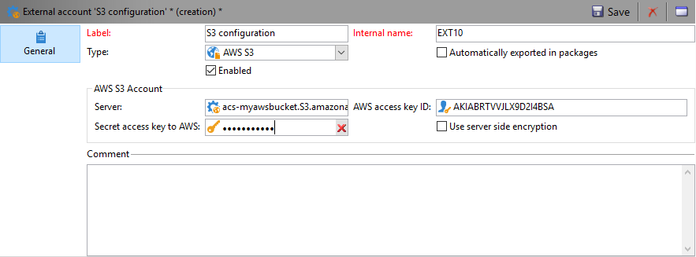
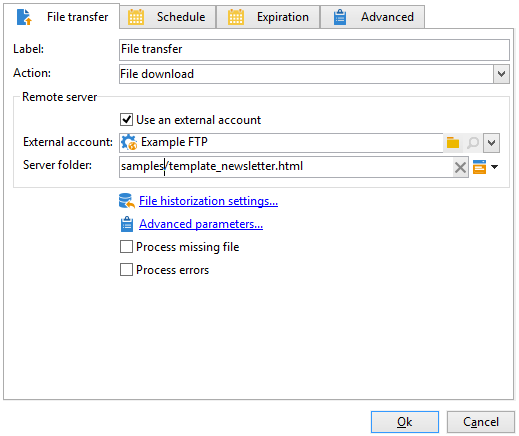
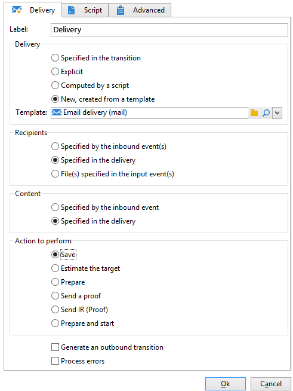
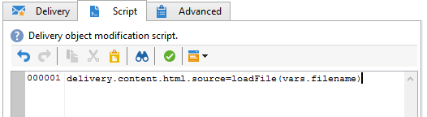

# 配信コンテンツの読み込み{#loading-delivery-content}


Amazon S3、FTP または SFTP サーバー上の HTML ファイルに配信コンテンツが格納されている場合、このコンテンツを Adobe Campaign 配信に容易に読み込むことができます。

手順は次のとおりです。

1. Adobe Campaign とコンテンツファイルが格納されている（S）FTP サーバーとの間の接続をまだ定義していない場合、**[!UICONTROL 管理]**／**[!UICONTROL プラットフォーム]**／**[!UICONTROL 外部アカウント]**&#x200B;で S3、FTP または SFTP 外部アカウントを新規作成します。この外部アカウントで、S3 または（S）FTP サーバーへの接続を確立するために使用するアドレスと資格情報を指定します。

   以下に S3 外部アカウントの例を示します。

   

1. **[!UICONTROL プロファイルとターゲット]**／**[!UICONTROL ジョブ]**／**[!UICONTROL ターゲティングワークフロー]**&#x200B;などから、新しいワークフローを作成します。
1. **[!UICONTROL ファイル転送]**&#x200B;アクティビティをワークフローに追加し、以下を指定して設定します。

   * S3 または（S）FTP サーバーへの接続に使用する外部アカウント。
   * S3 または（S）FTP サーバー上のファイルへのパス。

   

1. **[!UICONTROL 配信]**&#x200B;アクティビティを追加し、**[!UICONTROL ファイル転送]**&#x200B;アクティビティのアウトバウンドトランジションに接続します。次のように設定します。

   * 配信：必要に応じて、システム内に既に作成されている特定の配信または既存のテンプレートに基づいた新しい配信を使用します。
   * 受信者：この例では、配信がターゲットを指定するものとします。
   * コンテンツ：前のアクティビティでコンテンツをインポート済みであっても、「**[!UICONTROL 配信で指定]**」を選択します。リモートサーバー上のファイルから直接コンテンツがインポートされるので、ワークフローの処理時には識別子がなく、インバウンドイベントから取得したものとして識別することができません。
   * 実行するアクション：「**[!UICONTROL 保存]**」を選択して配信を保存すると、ワークフローの実行後に&#x200B;**[!UICONTROL キャンペーン管理]**／**[!UICONTROL 配信]**&#x200B;から配信にアクセスできるようになります。

   

1. **[!UICONTROL 配信]**&#x200B;アクティビティの「**[!UICONTROL スクリプト]**」タブで、次のコマンドを追加して、インポートしたファイルのコンテンツを配信に読み込むようにします。

   ```
   delivery.content.md.source=loadFile(vars.filename)
   ```

   

1. 保存して、ワークフローを実行します。読み込まれたコンテンツを含む新しい配信が&#x200B;**[!UICONTROL キャンペーン管理]**／**[!UICONTROL 配信]**&#x200B;の下に作成されます。

>[!NOTE]
>
>SFTP サーバー使用のベストプラクティスとトラブルシューティングについて詳しく説明しています。
