# ローカルの承認アクティビティを使用{#using-the-local-approval-activity}

ターゲティングワークフローに統合されている&#x200B;**[!UICONTROL ローカルの承認]**&#x200B;アクティビティでは、配信の前に受信者の認証プロセスを設定することができます。

>[!CAUTION]
>
>この機能を利用するには、キャンペーンのオプション、分散型マーケティングモジュールを購入する必要があります。使用許諾契約書を確認してください。

この使用例を設定するうえで、以下のターゲティングワークフローを作成しました。

ローカルの承認プロセスの主な手順は次のとおりです。

1. データ配分モデルを使用する「**[!UICONTROL 分割]**」タイプのアクティビティにより、ターゲティングによって生じる母集団の数を制限します。

   

1. 「**[!UICONTROL ローカルの承認]**」アクティビティは通知メールを引き継ぎ、ローカルの個々のスーパーバイザーに送信します。ローカルの個々のスーパーバイザーが各自に割り当てられた受信者を承認するまでは、アクティビティは保留されます。

1. 承認の期限を過ぎると、ワークフローが再度開始されます。この例では、「**[!UICONTROL 配信]**」アクティビティが開始された後に、承認済みターゲットに配信がおこなわれています。

   >[!NOTE]
   >
   >承認の期限を過ぎると、受信者を承認することはできなくなり、ターゲティングから除外されます。

   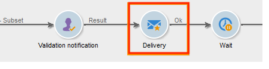

1. 数日が経過した後、2 番目の「**[!UICONTROL ローカルの承認]**」アクティビティがローカルの各スーパーバイザーに通知メールを送信します。このメールには、各受信者がおこなったアクションの概要（クリック、開封など）が記載されています。

## 手順 1:データ配分テンプレートの作成 {#step-1--creating-the-data-distribution-template-}

データ配分テンプレートを使用すると、ターゲティングによって生じる母集団の数をデータのグループ別に制限できるほか、個々の値をローカルのスーパーバイザーに割り当てることが可能です。この例では、配分フィールドとして「**[!UICONTROL E メールアドレスドメイン]**」フィールドを定義し、各ローカルスーパーバイザーにドメインを割り当てています。

データ配分テンプレートの作成について詳しくは、[データ配分ごとのサブセットレコード数の制限](split.md#limiting-the-number-of-subset-records-per-data-distribution)を参照してください。

1. データ配分テンプレートを作成するには、**[!UICONTROL リソース／キャンペーン管理／データ配分]**&#x200B;の順にノードを移動し、「**[!UICONTROL 新規]**」をクリックします。

   

1. 「**[!UICONTROL 一般]**」タブを選択します。

   

1. 「**[!UICONTROL ラベル]**」と「**[!UICONTROL 配分のコンテキスト]**」の内容を入力します。この例では、配分フィールドとして、「**[!UICONTROL 受信者]**」ターゲティングスキーマと「**[!UICONTROL E メールドメイン]**」フィールドを選択しています。受信者のリストが、ドメインごとに分割されます。
1. 「**[!UICONTROL 配分]**」タブの「**[!UICONTROL 配分タイプ]**」フィールドで、ターゲットの制限値の表示形式を選択します。ここでは「**[!UICONTROL 割合]**」を選択します。
1. 「**[!UICONTROL 承認ストレージ]**」フィールドに、使用中のターゲティングスキーマと一致する承認のストレージスキーマを入力します。ここでは、デフォルトのストレージスキーマである、「**[!UICONTROL 受信者のローカル承認]**」を使用します。
1. 「**[!UICONTROL 詳細設定パラメーター]**」リンクをクリックします。

   

1. 承認対象の受信者のリストからすべての受信者が事前に選択されるよう、「**[!UICONTROL ターゲティングされたメッセージを承認]**」オプションはチェックしたままにします。
1. 「**[!UICONTROL 配信ラベル]**」フィールドで、式をデフォルト（配信文字列の計算）のままにします。フィードバックの通知には、標準の配信ラベルを使用します。
1. 承認およびフィードバックの通知で受信者を表示するためのグループ化フィールドとして、「**[!UICONTROL グループ化フィールド]**」セクションで、「**[!UICONTROL 性別]**」フィールドを選択します。
1. 「**[!UICONTROL ターゲットメッセージを編集]**」セクションで、「**[!UICONTROL 受信者を編集]**」Web アプリケーションと「**[!UICONTROL recipientId]**」パラメーターを選択します。承認およびフィードバックの通知で受信者をクリックできるようになります。受信者は、Web アプリケーションの URL をポイントします。追加の URL パラメーターは、**[!UICONTROL recipientId]** になります。
1. 「**[!UICONTROL 配分]**」タブをクリックします。各ドメインについて、以下のフィールドの内容を入力します。

   

   * **[!UICONTROL 値]**：ドメイン名の値を入力します。
   * **[!UICONTROL 割合／固定]**：各ドメインについて、配信対象の受信者の最大数を入力します。この例では、ドメインあたりの配信を 10% に制限します。
   * **[!UICONTROL ラベル]**：承認およびフィードバックの通知で表示するドメインのラベルを入力します。
   * **[!UICONTROL グループまたはオペレーター]**：ドメインに割り当てるオペレーターまたはオペレーターのグループを選択します。

      >[!CAUTION]
      >
      >オペレーターには必ず適切な権限を付与するようにしてください。

## 手順 2:ターゲティングワークフローの作成 {#step-2--creating-the-targeting-workflow}

この使用例を設定するうえで、以下のターゲティングワークフローを作成しました。

以下のアクティビティを追加します。

* 2 つの&#x200B;**[!UICONTROL クエリ]**&#x200B;アクティビティ
* 1 つの&#x200B;**[!UICONTROL 積集合]**&#x200B;アクティビティ
* 1 つの&#x200B;**[!UICONTROL 分割]**&#x200B;アクティビティ
* 1 つの&#x200B;**[!UICONTROL ローカルの承認]**&#x200B;アクティビティ
* 1 つの&#x200B;**[!UICONTROL 配信]**&#x200B;アクティビティ
* 1 つの&#x200B;**[!UICONTROL 待機]**&#x200B;アクティビティ
* 2 つ目の&#x200B;**[!UICONTROL ローカルの承認]**&#x200B;アクティビティ
* 1 つの&#x200B;**[!UICONTROL 終了]**&#x200B;アクティビティ

### クエリ、積集合および分割 {#queries--intersection-and-split}

上流のターゲティングは、2 つのクエリ、1 つの積集合、1 つの分割で構成されます。データ配分テンプレートを使用する&#x200B;**[!UICONTROL 分割]**&#x200B;アクティビティでは、ターゲティングによって生じる母集団の数を制限することができます。

分割アクティビティの設定について詳しくは、[分割](split.md)を参照してください。データ配分テンプレートの作成について詳しくは、[データ配分ごとのサブセットレコード数の制限](split.md#limiting-the-number-of-subset-records-per-data-distribution)を参照してください。

クエリによる母集団の数を制限しない場合は、「**[!UICONTROL クエリ]**」、「**[!UICONTROL 積集合]**」、および「**[!UICONTROL 分割]**」アクティビティを使用する必要はありません。このケースでは、1 つ目の「**[!UICONTROL ローカルの承認]**」アクティビティで、データ配分テンプレートの作成を完了させます。

1. 「**[!UICONTROL レコード数の制限]**」セクションで「**[!UICONTROL 選択レコード数の制限]**」オプションを選択し、「**[!UICONTROL 編集]**」リンクをクリックします。

   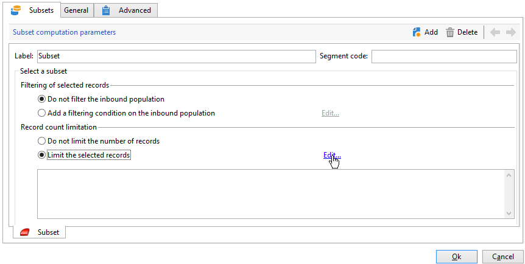

1. 「**[!UICONTROL 並べ替えの後に最初のレコードのみ保持]**」オプションを選択し、「**[!UICONTROL 次へ]**」をクリックします。

   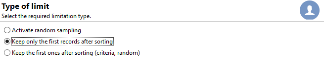

1. 「**[!UICONTROL 列を並べ替え]**」セクションで、並べ替えを適用するフィールドを追加します。ここでは、「**[!UICONTROL E メール]**」フィールドを選択します。「**[!UICONTROL 次へ]**」をクリックします。

   

1. 「**[!UICONTROL データ配分別]**」オプションで、前に作成した配分テンプレート（[手順 1：データ配分テンプレートの作成](#step-1--creating-the-data-distribution-template-)を参照）を選択し、「**[!UICONTROL 終了]**」をクリックします。

   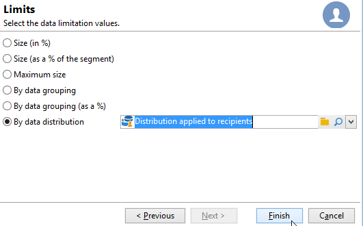

ワークフローに表示される値と一致するよう、配分テンプレートで、グループ値別の母集団を 10% に制限します（340 の入力に対して出力が 34 になります）。

### 承認通知 {#approval-notification}

「**[!UICONTROL ローカルの承認]**」アクティビティでは、ローカルの個々のスーパーバイザーに通知を送信できます。

「**[!UICONTROL ローカルの承認]**」アクティビティの設定について詳しくは、[ローカルの承認](local-approval.md)を参照してください。

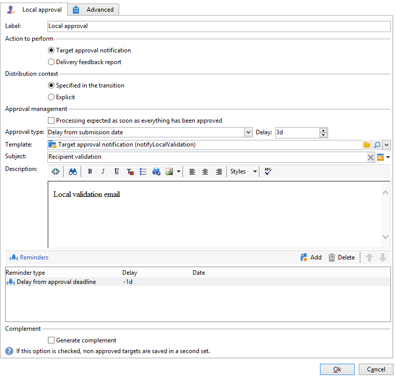

以下のフィールドの内容を入力する必要があります。

1. 「**[!UICONTROL 実行するアクション]**」セクションで、「**[!UICONTROL ターゲットの承認通知]**」オプションを選択します。
1. 「**[!UICONTROL 配分のコンテキスト]**」セクションで、「**[!UICONTROL トランジションで指定]**」オプションを選択します。

   ターゲット母集団の数を制限しない場合は、ここで「**[!UICONTROL 明示]**」オプションを選択し、「**[!UICONTROL データ配分]**」フィールドで前に作成した配分テンプレートを入力します。

1. 「**[!UICONTROL 通知]**」セクションで、配分テンプレートと、通知 E メールで使用する件名を選択します。ここでは、デフォルトのテンプレートである「**[!UICONTROL ローカルの承認通知]**」を選択します。
1. 「**[!UICONTROL 承認されたスケジュール]**」セクションで、承認期限をデフォルトのまま（3 日）にして、リマインダーを追加します。承認が開始されてから 3 日間、配信が有効になります。承認期限が経過すると、承認されていない受信者はターゲティングの対象から除外されます。

通知 E メールが **[!UICONTROL ローカルの承認]** アクティビティをローカルのスーパーバイザーに送信します。

### 待機 {#wait}

「待機」アクティビティを使用すると、フィードバック通知を配信する 2 つ目の「ローカルの承認」アクティビティの開始を延期することができます。「**[!UICONTROL 待機期間]**」フィールドで、値「**[!UICONTROL 5d]**」（5 日）を入力します。配信後の 5 日間に受信者がおこなったアクションがフィードバック通知に記載されます。

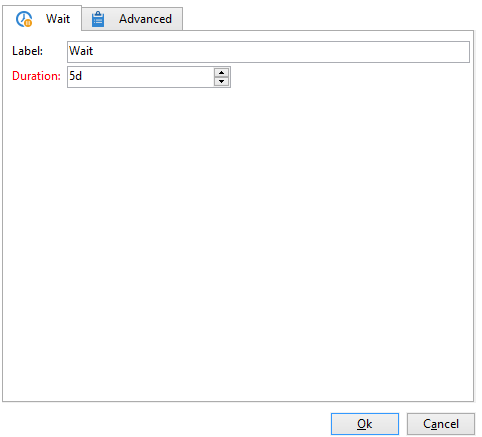

### フィードバック通知 {#feedback-notification}

2 つ目の「**[!UICONTROL ローカルの承認]**」アクティビティでは、ローカルの個々のスーパーバイザーにフィードバック通知を送信できます。

以下のフィールドの内容を入力する必要があります。

1. 「**[!UICONTROL 実行するアクション]**」セクションで、「**[!UICONTROL 配信のフィードバックレポート]**」を選択します。
1. 「**[!UICONTROL 配信]**」セクションで、「**[!UICONTROL トランジションで指定]**」を選択します。
1. 「**[!UICONTROL 通知]**」セクションで、配分テンプレートと、通知 E メールで使用する件名を選択します。

「待機」アクティビティで設定した期限を経過すると、2 つ目の「**[!UICONTROL ローカルの承認]**」アクティビティはローカルの個々のスーパーバイザーに、

### 管理者による承認トラッキング {#approval-tracking-by-the-administrator}

「ローカルの承認」アクティビティが起動されるごとに、承認タスクが作成されます。管理者は、これらの承認タスクを個々に管理することができます。

キャンペーンのターゲティングワークフローに移動して、「**[!UICONTROL ローカルの承認タスク]**」タブをクリックします。

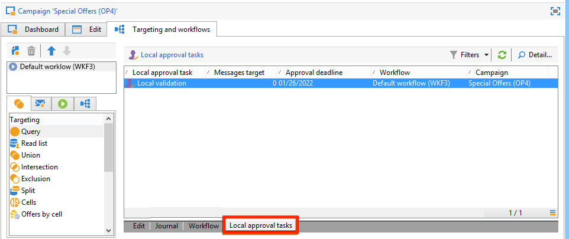

「データ配分」テンプレートの「**[!UICONTROL 承認タスク]**」タブからは、ローカルの承認タスクのリストにアクセスすることができます。

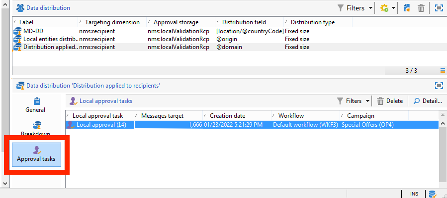

監視するタスクを選択し、「**[!UICONTROL 詳細]**」ボタンをクリックします。ローカルの承認タスクの「**[!UICONTROL 一般]**」タブでは、タスクに関する情報を確認できます。必要に応じて、承認の日付やリマインダーの日付を変更することもできます。

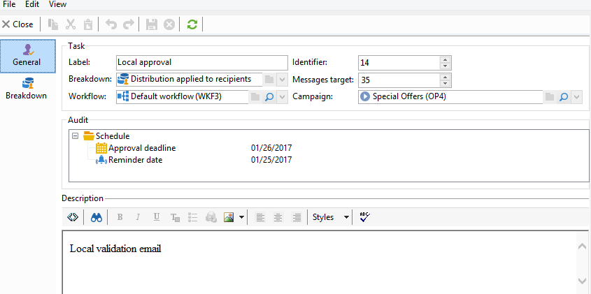

このタブには、以下の情報が表示されます。

* タスクのラベルとその ID
* 使用する配分テンプレート
* ターゲットメッセージの数
* リンク先のワークフローとキャンペーン
* タスクのスケジュール

タスクの「**[!UICONTROL 配分]**」タブでは、承認ログとそのステータス、ターゲットメッセージの数、承認日のほか、配信を承認したオペレーターを確認することができます。

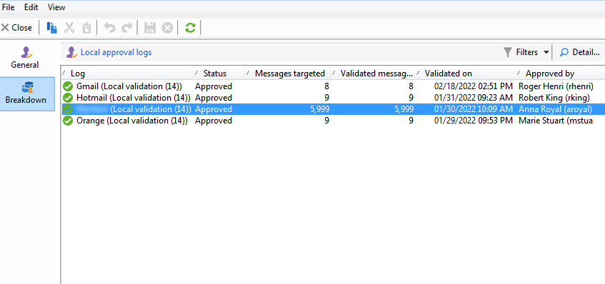

承認ログを選択し、「**[!UICONTROL 詳細]**」ボタンをクリックして、詳細情報を表示します。ローカル承認ログの「**[!UICONTROL 一般]**」タブでは、ログの一般的な情報を表示できます。ここでは、承認ステータスを変更することもできます。

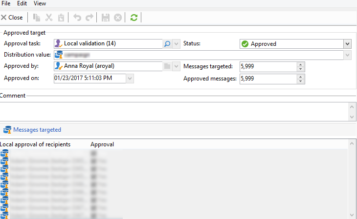

このタブには、以下の情報が表示されます。

* リンク先の承認タスク
* 承認ステータス（「**[!UICONTROL 承認済み]**」または「**[!UICONTROL 保留中]**」）
* 使用する配分テンプレート
* 承認をおこなったローカルのスーパーバイザーと承認日
* ターゲットメッセージの数と承認済みメッセージの数

承認ログの「**[!UICONTROL ターゲット]**」タブには、ターゲットの受信者とその承認ステータスが一覧表示されます。このステータスは必要に応じて変更できます。

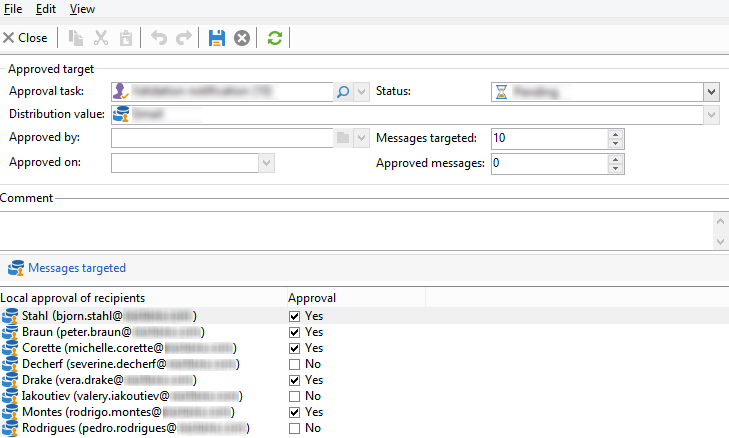
