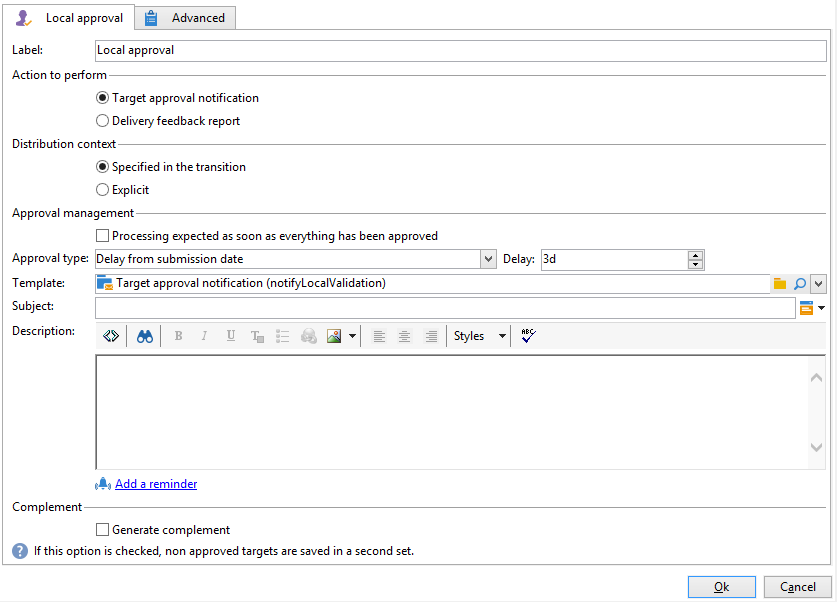
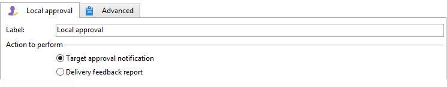
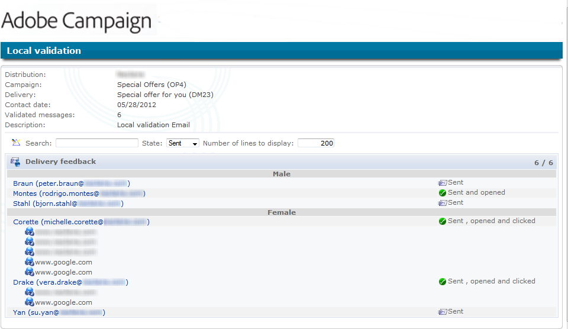
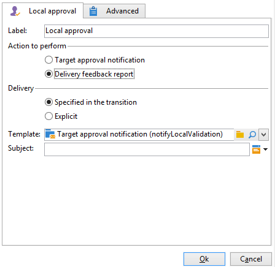

# ローカルの承認{#local-approval}

ターゲティングワークフローに統合する場合、「**[!UICONTROL ローカルの承認]**」アクティビティでは、配信が送信される前に受信者の承認プロセスを設定できます。

>[!CAUTION]
>
>このアクティビティを使用するには、キャンペーンオプションの 1 つである分散型マーケティングモジュールを購入する必要があります。使用許諾契約書を確認してください。

配分テンプレートを使用した「**[!UICONTROL ローカルの承認]**」アクティビティの例については、[ローカルの承認アクティビティの使用](local-approval-activity.md)を参照してください。

まず、アクティビティのラベルを入力し、「**[!UICONTROL 実行するアクション]**」フィールドを指定します。

* 「**[!UICONTROL ターゲットの承認通知]**」オプションを選択し、配信前にローカルのスーパーバイザーに通知メールを送信し、それらのスーパーバイザーに割り当てられている受信者の承認を依頼します。

* **増分処理クエリ**：クエリを実行し、実行を計画します。[増分処理クエリ](incremental-query.md)の節を参照してください。

   

## ターゲットの承認通知 {#target-approval-notification}

この例では、「**[!UICONTROL ローカルの承認]**」アクティビティは、アップストリームターゲティングと配信の間に配置されています。

ターゲットの承認通知のために、以下のようにフィールドに入力します。

* **[!UICONTROL 配分のコンテキスト]**：「**[!UICONTROL 分割]**」タイプアクティビティを使用してターゲット母集団を限定する場合、「**[!UICONTROL トランジションで指定]**」オプションを選択します。この場合、配分テンプレートは分割アクティビティに入力されます。ターゲット母集団を限定しない場合、ここで「**[!UICONTROL 手動で指定]**」オプションを選択し、「**[!UICONTROL データ配分]**」フィールドに配分テンプレートを入力します。

   データ配分テンプレートの作成について詳しくは、[データ配分ごとのサブセットレコード数の制限](split.md#limiting-the-number-of-subset-records-per-data-distribution)を参照してください。

* **[!UICONTROL 承認管理]**

   * E メール通知に使用する配信テンプレートと件名を選択します。デフォルトテンプレートの「**[!UICONTROL ローカルの承認通知]**」を使用できます。また、承認通知およびフィードバック通知内の受信者リストの上に表示される説明を追加できます。
   * 承認期限（日付または承認の開始日からの日数で指定）に対応する「**[!UICONTROL 承認タイプ]**」を指定します。この日付をもって、ワークフローが再開し、それまでに承認されなかった受信者はターゲティング対象から外れます。通知が送信されると、ローカルのスーパーバイザーが連絡先を承認できるように、アクティビティはキューに入ります。

      >[!NOTE]
      >
      >デフォルトでは、承認プロセスが開始されると、アクティビティは 3 日間保留されます。

      リマインダーを 1 つ以上設定し、承認期限が迫っていることをローカルのスーパーバイザーに知らせることができます。それには、「**[!UICONTROL リマインダーを追加]**」リンクをクリックします。

* **[!UICONTROL 補集合]**：「**[!UICONTROL 補集合を生成]**」オプションでは、未承認のターゲットをすべて集めた 2 番目のセットを生成できます。

   >[!NOTE]
   >
   >このオプションはデフォルトでは無効です。

## 配信のフィードバックレポート {#delivery-feedback-report}

この例では、「**[!UICONTROL ローカルの承認]**」アクティビティは、配信の後に配置されています。

配信のフィードバックレポートの場合、次のフィールドに入力する必要があります。

* 配信が先行アクティビティ中に入力された場合「**[!UICONTROL トランジションで指定]**」オプションを選択します。「**[!UICONTROL 手動で指定]**」を選択して、「ローカルの承認」アクティビティでの配信を指定します。
* 配信テンプレートと、通知 E メールのオブジェクトを選択します。デフォルトテンプレートの「**[!UICONTROL ローカルの承認通知]**」を選択します。

## 例：ワークフロー配信の承認 {#example--approving-a-workflow-delivery}

この例では、ワークフロー配信の承認プロセスのセットアップ方法を示します。配信ワークフローの作成について詳しくは、[例：配信ワークフロー](delivery.md#example--delivery-workflow)の節を参照してください。

オペレーターは、2 つの方法（メールメッセージ内にリンクされた Web ページを使用するか、コンソール経由）のいずれかで、配信を承認できます。

* Web 承認

   管理者グループのオペレーターに送信されたメールで、配信ターゲットを承認できます。メッセージは定義されたテキストと JavaScript 式を使用し、JavaScript 式は計算値によって置き換えられます（ここでは「574」）。

   配信を承認するには、該当するリンクをクリックし、Adobe Campaign コンソールにログオンします。

   

   承認するかどうかを選択して、「**[!UICONTROL 送信]**」をクリックします。

   

* コンソールからの承認

   ツリー構造の、**[!UICONTROL 管理／プロダクション／自動作成オブジェクト／承認待ち]**&#x200B;ノードに、現在接続中のオペレーターから承認されたタスクのリストが含まれています。このリストは、1 行で表示されます。応答するには、この行をダブルクリックします。次のウィンドウが表示されます。

「**はい**」を選択し、「**[!UICONTROL 承認]**」をクリックします。応答が記録されたことを通知するメッセージが表示されます。

ワークフロー画面に戻ります。10 秒ほど経過すると、ダイアグラムの表示が以下のようになります。

ワークフローによって「**[!UICONTROL 配信コントロール]**」タスクが実行されます。ここでは、以前に作成された配信を開始します。ワークフローは、エラーを生成せずに完了しました。
