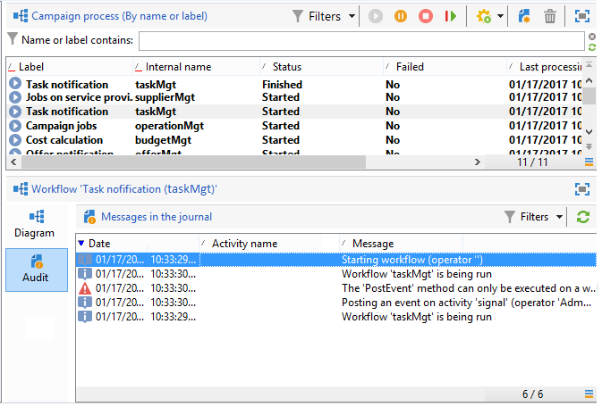
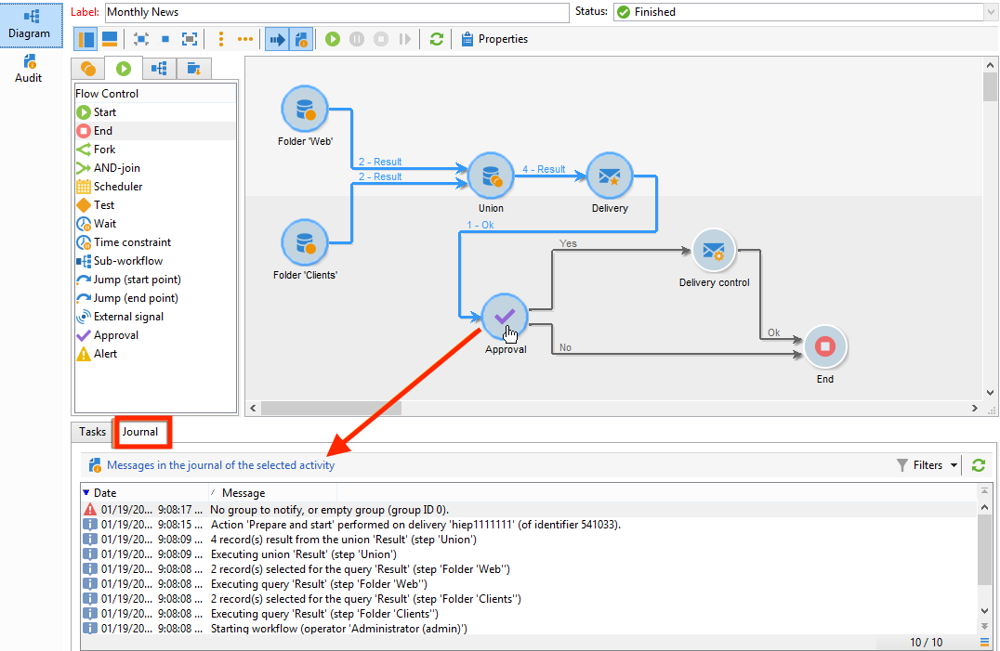
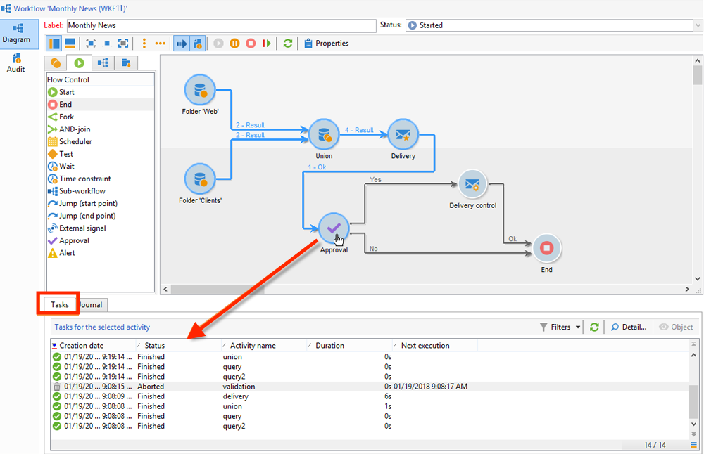
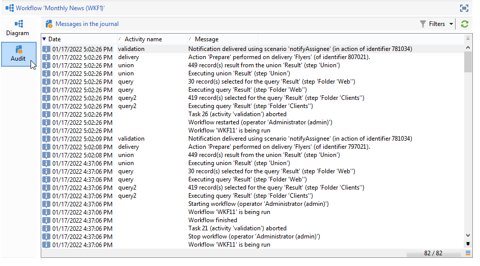
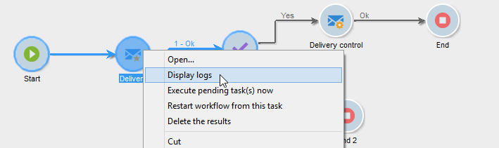
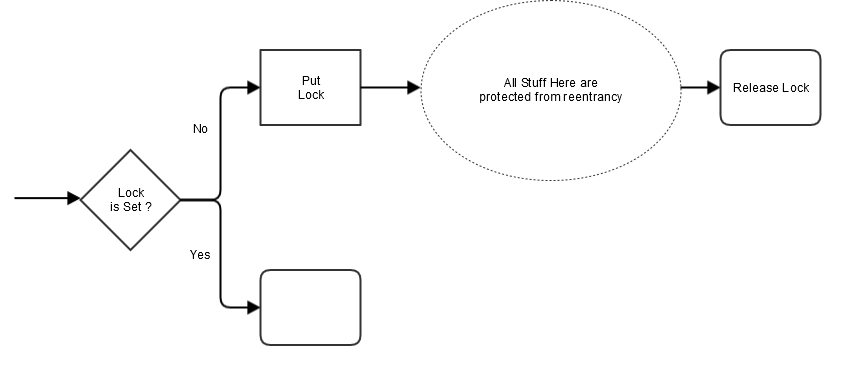

# ワークフロー実行の監視 {#monitoring-workflow-execution}


この節では、ワークフローの実行を監視する方法について説明します。

[この節](workflow-supervision.md#supervising-workflows)では、一連のワークフローの状態（一時停止、停止、エラーあり）を監視できるワークフローの作成方法に関する使用例も示します。

さらに、インスタンスの管理者は、**監査記録**&#x200B;を使用して、アクティビティ、ワークフローに最後に加えられた変更およびワークフローの状態を確認できます。詳しくは、 を参照してください。

様々なキャンペーンプロセスを監視するその他の方法については、を参照してください。

## 進捗状況の表示 {#displaying-progress}

ツールバーの各アイコンを使用して、進行情報を表示し、実行を監視することができます。

「**[!UICONTROL 進行情報を表示]**」アイコンを使用して、ステータスとアクティビティの結果を実行画面に表示できます。


このオプションを選択した場合、実行したアクティビティは青で、保留中のアクティビティは点滅表示で、警告はオレンジで、エラーは赤色で表示されます。また、アウトバウンドトランジションのアクティビティの結果を表示し、1 秒を超えた場合に、アクティビティのプロパティで定義された結果ラベルと、ジョブの期間をその後に表示します。


## ログの表示 {#displaying-logs}

ログには、ワークフローの履歴または監査証跡が含まれます。ログには、すべてのユーザーアクション、実行されたすべての操作、および発生したすべてのエラーが記録されます。次の操作をおこなうことができます。

* 詳細で、「**[!UICONTROL トラッキング]**」タブを選択します。このリストには、すべてのワークフローメッセージが含まれます。

   

* アクティビティごとにログメッセージをフィルターします。ダイアグラムの上にあるツールバーから「**[!UICONTROL タスクとログを表示]**」をクリックし、ダイアグラムの下に「**[!UICONTROL ログ]**」と「**[!UICONTROL タスク]**」のタブを表示します。アクティビティを選択すると、そのアクティビティに関するメッセージだけが表示されます。アクティビティが何も選択されていない場合、すべてのメッセージが表示されます。

   

   >[!NOTE]
   >
   >ダイアグラムの背景をクリックすると、すべての要素の選択を解除できます。

* 指定されたタスクにリンクされているメッセージのみを表示します。それには、「**[!UICONTROL タスク]**」タブを選択し、ダイアグラムからアクティビティを選択してリストを制限します。タスクをダブルクリックして情報を表示します。ウィンドウの最後のタブには、ログが表示されます。

   

   「**[!UICONTROL 詳細...]**」ボタンをクリックすると、アクティビティの実行に関するすべての関連情報を表示できます。例えば、検証オペレーターを表示したり、該当する場合は承認中に入力したコメントを表示したりできます。

>[!NOTE]
>
>このログは、ワークフローが再起動した場合にパージされません。すべてのメッセージは保存されます。以前の実行のメッセージを破棄したい場合、履歴をパージする必要があります。

ログに、ターゲティングワークフローのアクティビティに関連する実行メッセージのリストが時系列で表示されます。

* ターゲティングキャンペーンのログ

   ターゲティングキャンペーンが実行されたら、「**[!UICONTROL トラッキング]**」タブをクリックして実行トレースを表示します。

   

   実行されたキャンペーン、警告やエラーなど、すべてのキャンペーンメッセージが表示されます。

* アクティビティのログ

   さらに、実行ログと、各アクティビティの詳細も表示できます。それには、次の 2 つの方法があります。

   1. ターゲット済みアクティビティを選択し、「**[!UICONTROL タスクとログを表示]**」アイコンをクリックします。

      

      ダイアログの下部セクションに、「ログ」と「タスク」の 2 つのタブが表示されます。

      ダイアグラム内で選択済みのアクティビティは、ログとタスクのリストに対するフィルターとして機能します。

      

   1. ターゲット済みのアクティビティを右クリックし、「**[!UICONTROL ログを表示]**」を選択します。

      

      ログは別のウィンドウに表示されます。

## ログのパージ {#purging-the-logs}

ワークフローの履歴は自動でパージされません。すべてのメッセージは、デフォルトで保持されます。履歴は、**[!UICONTROL ファイル／アクション]**&#x200B;メニューを選択するか、リストの上にあるツールバー内の「**[!UICONTROL アクション]**」ボタンをクリックすることでパージできます。「**[!UICONTROL 履歴をパージ]**」を選択します。**[!UICONTROL アクション]**&#x200B;メニューで使用可能なオプションについて詳しくは、[アクションツールバー](start-a-workflow.md)の節を参照してください。


## ワークテーブルとワークフローのスキーマ {#worktables-and-workflow-schema}

ワークフローは、特定のアクティビティ経由で操作されるワークテーブルを伝達します。
Adobe Campaign では、データ管理アクティビティ経由で、ワークフローの作業用テーブルの列の編集、名前変更およびエンリッチメントが可能です。例えば、契約の共同受益者に関する追加情報を集める際に、クライアントのニーズに従った命名法に応じて列の名前を付けることができます。

さらに、各種作業のディメンション間にリンクを作成したり、ディメンションの変更を定義することもできます。例えば、データベース内に記録された各契約について、契約のメイン所有者を指名し、追加情報内の共同所有者データを使用します。

ワークフローが停止すると、ワークフローのワークテーブルは自動的に削除されます。
作業用テーブルを保持したい場合、**[!UICONTROL リストの更新]**&#x200B;アクティビティを使用してリストに保存します（[リストの更新](list-update.md)を参照）。

## エラーの管理 {#managing-errors}

エラーが発生すると、ワークフローが一時停止し、エラー発生時に実行中だったアクティビティが赤く点滅します。「**[!UICONTROL 監視]**」タブのワークフロー概要で「**[!UICONTROL ワークフロー]**」リンクをクリックすると、以下に示すように、エラーのあるワークフローのみ表示できます。


Adobe Campaign エクスプローラーでは、デフォルトでワークフローリストに「**[!UICONTROL 失敗]**」列が表示されます。


ワークフローでエラーが発生すると、そのワークフローのスーパーバイザーグループに所属しているオペレーターに、E メールによる通知が送られます（プロファイルに E メールアドレスが記載されている場合）。このグループは、ワークフロープロパティの「**[!UICONTROL スーパーバイザー]**」フィールドで選択されています。


通知の内容は、「**[!UICONTROL ワークフローマネージャーの通知]**」デフォルトテンプレート内に設定されています。このテンプレートは、ワークフロープロパティの「**[!UICONTROL 実行]**」タブで選択されています。通知には、エラーの発生したワークフローの名前と、問題のタスクが記載されます。

通知の例：


ログインしている場合、通知内のリンクをクリックすると、Web モードの Adobe Campaign コンソールが表示され、エラーの発生したワークフローに対処することができます。


エラーが発生した場合に一時停止せず実行を継続するように、ワークフローを設定することもできます。それには、ワークフローの&#x200B;**[!UICONTROL プロパティ]**&#x200B;を編集し、「**[!UICONTROL エラー管理]**」セクションの「**[!UICONTROL エラーの場合]**」フィールドで「**[!UICONTROL 無視]**」オプションを選択します。無視できる連続エラー数を指定します。連続エラーがこの数を超えると、プロセスが一時停止します。

この場合、エラータスクは中止になります。このモードは、キャンペーンを定期的アクションで後から再試行するように設計されたワークフローに最適です。


>[!NOTE]
>
>この設定は、各アクティビティに個別に適用できます。それには、アクティビティのプロパティを編集し、「**[!UICONTROL 詳細設定]**」タブでエラー管理モードを選択します。

ワークフローの実行のトラブルシューティングについて詳しくは、を参照してください。

## 処理エラー {#processing-errors}

アクティビティについては、「**[!UICONTROL エラーを処理]**」オプションに、エラー発生時に有効にされる特定のトランジションが表示されます。この場合、ワークフローはエラーモードに入らず、実行は継続されます。

対象となるエラーは、ファイルシステムエラーです（ファイルを移動できない、ディレクトリにアクセスできない、など）。

このオプションは、無効な値など、アクティビティの設定に関するエラーは処理しません。設定の誤りに関するエラー（ディレクトリが存在しないなど）では、このトランジションは有効になりません。

エラーの発生後、手動または自動でワークフローが一時停止した場合、「**[!UICONTROL 開始]**」ボタンを押すと、一時停止した位置からワークフローの実行が再開します。エラーが発生したアクティビティ（一時停止したアクティビティ）は、再実行されます。それより前のアクティビティは再実行されません。

すべてのワークフローを再実行するには、「**[!UICONTROL 再起動]**」ボタンを使用します。

既に実行済みのアクティビティを変更した場合、ワークフローの実行を再開した際に、変更内容は反映されません。

実行前のアクティビティを変更した場合、ワークフローの実行を再開した際に、変更内容は反映されます。

一時停止したアクティビティを変更した場合、ワークフローを再開した際に、変更内容が正確に反映されません。

可能であれば、変更をおこなった場合には、ワークフローを完全に再起動することをお勧めします。

## インスタンスの監視 {#instance-supervision}

**[!UICONTROL インスタンスの監視]**&#x200B;ページでは、Adobe Campaign サーバーのアクティビティを確認したり、エラーが発生したワークフローと配信のリストを表示することができます。

このページにアクセスするには、「**[!UICONTROL 監視]** 」タブに移動し、「**[!UICONTROL 一般ビュー]**」リンクをクリックします。


すべてのワークフローを表示するには、「**[!UICONTROL ワークフロー]**」リンクをクリックします。ドロップダウンリストを使用して、ステータス別にプラットフォーム内のワークフローを表示します。


エラーが発生したワークフローのリンクをクリックし、そのワークフローを開いてログを表示します。


## 同時複数実行の防止 {#preventing-simultaneous-multiple-executions}

1 つのワークフローでは、同時に複数の実行が可能です。場合によっては、これが発生するのを防ぐ必要があります。

例えば、1 時間ごとにワークフローの実行をトリガーするようにスケジューラーを設定できますが、ワークフロー全体の実行に 1 時間以上かかる場合があります。ワークフローが既に実行中の場合、実行をスキップしたいことがあります。

ワークフロー開始時にシグナルアクティビティがある場合、ワークフローが実行中であればシグナルをスキップしたいことがあります。

一般的な原則を次に示します。



解決策としては、インスタンス変数を使用します。インスタンス変数は、ワークフローのすべての並列実行で共有されます。

次に、シンプルなテストワークフローを示します。


**[!UICONTROL スケジューラー]**&#x200B;は、1 分ごとにイベントをトリガーします。次の「**[!UICONTROL テスト]**」アクティビティは、**isRunning** インスタンス変数をテストして、実行を継続するかどうかを判定します。


>[!NOTE]
>
>**isRunning** は、この例のために選択した変数名です。これは、ビルトイン変数ではありません。

**はい**&#x200B;分岐の&#x200B;**[!UICONTROL テスト]**&#x200B;の直後のアクティビティの&#x200B;**初期化スクリプト**&#x200B;にインスタンス変数を設定する必要があります。

```
instance.vars.isRunning = true
```

**はい**&#x200B;分岐の最後のアクティビティは、その&#x200B;**初期化スクリプト**&#x200B;で変数を false に戻す必要があります。

```
instance.vars.isRunning = false
```

注意：

* ワークフローの&#x200B;**プロパティ**&#x200B;の「**変数**」タブで、インスタンス変数の現在の値をチェックできます。
* インスタンス変数は、ワークフローを再開するとリセットされます。
* JavaScript では、テストでの未定義の値は false で、初期化前でもインスタンス変数をテストできます。
* 終了のない初期化スクリプトにログ手順を追加することで、このメカニズムが原因で処理されないアクティビティを監視できます。

   ```
   logInfo("Workflow already running, parallel execution not allowed.");
   ```

使用例については、[データ更新の調整](coordinate-data-updates.md)の節で説明しています。

## データベースのメンテナンス {#database-maintenance}

ワークフローは、多くのワークテーブルを使用します。ワークテーブルは、メンテナンスしないと、領域を消費し、プラットフォーム全体の低速化を招きます。
データベースメンテナンスについて詳しくは、こちらを参照してください。

**管理／プロダクション／テクニカルワークフロー**&#x200B;ノードからアクセスできる&#x200B;**データベースクリーンアップ**&#x200B;ワークフローを使用すると、古いデータを削除して、データベースの急激な増加を回避できます。ワークフローは、ユーザーの操作なしで自動的にトリガーされます。参照  .

また、特定のテクニカルワークフローを作成して、ディスク容量を消費する不必要なデータをパージできます。とを参照してください。 [セクション](#purging-the-logs).

## 一時停止したワークフローの処理 {#handling-of-paused-workflows}

デフォルトでは、ワークフローを一時停止してもワークテーブルはパージされません。
ビルド 8880 以降では、長期間一時停止状態が続いているワークフローは自動的に停止され、作業用テーブルがパージされます。この動作は次のようにトリガーされます。

* 一時停止状態になっている期間が 7 日を超えたワークフローは監視ダッシュボード（および監視 API）に警告として表示され、スーパーバイザーグループに通知が送信されます。
* 同じことが毎週、**[!UICONTROL cleanupPausedWorkflows]** テクニカルワークフローがトリガーされたときに繰り返されます。ワークフローについて詳しくは、[この節](delivery.md)を参照してください。
* 4 回目の通知後（デフォルトでは一時停止状態が 1 か月続いた後）、ワークフローは無条件に停止します。停止後、ワークフローにログが表示されます。テーブルは次回の&#x200B;**[!UICONTROL クリーンアップ]**&#x200B;ワークフローの実行時にパージされます。

停止までの期間は NmsServer_PausedWorkflowPeriod オプションを通じて設定できます。

ワークフローのスーパーバイザーには通知が届きます。作成者および最後にワークフローを変更したユーザーにも通知が届きます。管理者には通知は届きません。

## ステータスに応じたワークフローのフィルタリング{#filtering-workflows-status}

Campaign Classic インターフェイスを使用すると、事前定義された&#x200B;**表示**&#x200B;を使用して、インスタンス上のすべてのワークフローの実行ステータスを監視できます。これらの表示にアクセスするには、**[!UICONTROL 管理]**／**[!UICONTROL 監査]**／**[!UICONTROL ワークフローステータス]**&#x200B;ノードを開きます。

以下の表示を使用できます。

* **[!UICONTROL 実行中]**：実行中のすべてのワークフローを表示します。
* **[!UICONTROL 一時停止]**：一時停止されたすべてのワークフローを表示します。
* **[!UICONTROL 失敗]**：失敗したすべてのワークフローを表示します。
* ** )。


デフォルトでは、これらの表示は&#x200B;**[!UICONTROL 監査]**&#x200B;フォルダー内でアクセスできます。ただし、フォルダーツリーで選択した場所に再作成できます。これにより、管理権限のない標準ユーザーも利用できるようになります。

手順は次のとおりです。

1. 表示を追加するフォルダーを右クリックします。
1. **[!UICONTROL 新規フォルダーを追加]**／**[!UICONTROL 管理]**&#x200B;で、追加する表示を選択します。
1. フォルダーをツリーに追加したら、元のフォルダーに関係なく、すべてのワークフローが表示されるように、表示として設定していることを確認します。表示の設定方法について詳しくは、を参照してください。

また、これらの表示に加えて、実行ステータスに応じてワークフローのリストをフィルタリングできるフィルターフォルダーを設定できます。手順は次のとおりです。

1. ワークフロータイプのフォルダーにアクセスし、**[!UICONTROL フィルター]**／**[!UICONTROL フィルター詳細設定]**&#x200B;メニューを選択します。
1. ワークフローの「**[!UICONTROL @status]**」フィールドが選択した状態と等しくなるようにフィルターを設定します。
1. フィルターを保存し、名前を付けます。これで、フィルターリストから直接使用できるようになります。


詳しくは、次の節を参照してください。