# 配信情報のクエリ {#querying-delivery-information}

## 特定の配信のクリック数 {#number-of-clicks-for-a-specific-delivery}

この例では、特定の配信のクリック数を収集します。これらのクリック数は、特定の期間にわたって取得された受信者トラッキングログに記録されています。受信者は E メールアドレスで識別されます。このクエリでは、**[!UICONTROL 受信者トラッキングログ]**&#x200B;テーブルを使用します。

* どのテーブルを選択する必要がありますか。

   受信者ログトラッキングテーブル（**[!UICONTROL nms:trackingLogRcp]**）

* 出力列に選択するフィールドは何ですか。

   「プライマリキー」（カウントあり）と「E メール」

* どのような条件に基づいて情報をフィルターしますか。

   特定の期間および配信ラベルの要素

この例を実行するには、次の手順に従います。

1. **[!UICONTROL 汎用クエリエディター]**&#x200B;を開き、「**[!UICONTROL 受信者トラッキングログ]**」スキーマを選択します。

   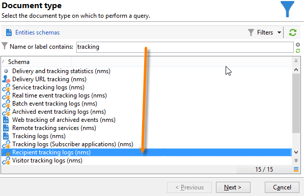

1. **[!UICONTROL 抽出するデータ]**&#x200B;ウィンドウで、情報を収集するための集計を作成します。そのためには、プライマリキー（**[!UICONTROL 受信者トラッキングログ]**&#x200B;のメイン要素の上部にある）を追加します。トラッキングログカウントは、この「**[!UICONTROL プライマリキー]**」フィールドに対して実行されます。編集された式は **[!UICONTROL x=count(プライマリキー)]** となります。この式により、様々なトラッキングログの合計が単一の E メールアドレスにリンクされます。

   手順は次のとおりです。

   * 「**[!UICONTROL 出力列]**」フィールドの右側にある&#x200B;**[!UICONTROL 追加]**&#x200B;アイコンをクリックします。**[!UICONTROL 数式のタイプ]**&#x200B;ウィンドウで「**[!UICONTROL 式を使用して数式を編集]**」オプションを選択し、「**[!UICONTROL 次へ]**」をクリックします。**[!UICONTROL 式を編集]**&#x200B;ウィンドウで、「**[!UICONTROL 詳細選択]**」をクリックします。

      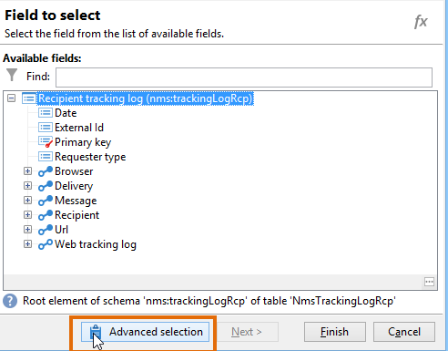

   * **[!UICONTROL 数式のタイプ]**&#x200B;ウィンドウで、集計関数のプロセスを実行します。このプロセスはプライマリキーカウントになります。

      「**[!UICONTROL 集計]**」セクションで「**[!UICONTROL 集計関数のプロセス]**」を選択し、「**[!UICONTROL カウント]**」をクリックします。

      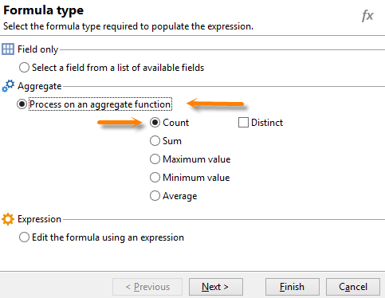

      「**[!UICONTROL 次へ]**」をクリックします。

   * 「**[!UICONTROL プライマリキー（@id）]**」フィールドを選択します。「**[!UICONTROL count (プライマリキー)]**」出力列が設定されます。

      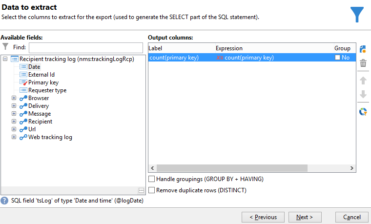

1. 出力列に表示するその他のフィールドを選択します。「**[!UICONTROL 使用可能フィールド]**」列で「**[!UICONTROL 受信者]**」ノードを開き、「**[!UICONTROL E メール]**」を選択します。「**[!UICONTROL グループ]**」ボックスをオンにして「**[!UICONTROL はい]**」にし、E メールアドレスでトラッキングログをグループ化します。このグループにより各ログがその受信者にリンクされます。

   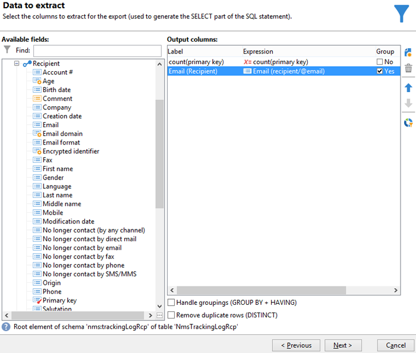

1. 最もアクティブな受信者（最もトラッキングログが多い受信者）が最初に表示されるように列の並べ替えを設定します。「**[!UICONTROL 降順ソート]**」列で「**[!UICONTROL はい]**」をオンにします。

   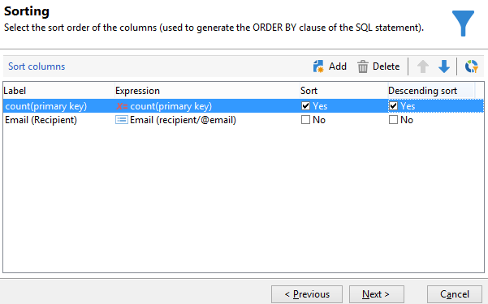

1. 次に、関心のあるログ（2 週間以内のログや営業関連の配信を対象とするログなど）をフィルターする必要があります。

   手順は次のとおりです。

   * データのフィルターを設定します。そのためには、「**[!UICONTROL フィルター条件]**」を選択し、「**[!UICONTROL 次へ]**」をクリックします。

      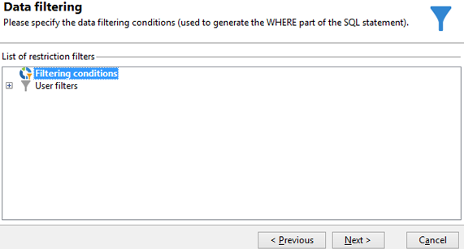

   * 特定の配信の特定の期間におけるトラッキングログを収集します。必要になるフィルター条件は、現在の日付の 2 週間前から現在の日付の前日までの検索期間を設定するための 2 つの日付条件と、検索を特定の配信に制限するための条件の 3 つです。

      **[!UICONTROL ターゲット要素]**&#x200B;ウィンドウで、考慮に入れるトラッキングログの開始日を設定します。「**[!UICONTROL 追加]**」をクリックします。条件ラインが表示されます。**[!UICONTROL 式を編集]**&#x200B;機能をクリックして、「**[!UICONTROL 式]**」列を編集します。**[!UICONTROL 選択するフィールド]**&#x200B;ウィンドウで、「**[!UICONTROL 日付（@logDate）]**」をクリックします。

      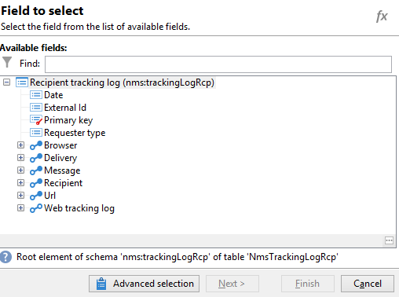

      「**[!UICONTROL 後]**」演算子を選択します。「**[!UICONTROL 値]**」列で&#x200B;**[!UICONTROL 式を編集]**&#x200B;を選択し、**[!UICONTROL 数式のタイプ]**&#x200B;ウィンドウで「**[!UICONTROL 日付で処理]**」を選択します。最後に、「**[!UICONTROL 現在の日付 - n 日]**」に &quot;15&quot; と入力します。

      「**[!UICONTROL 完了]**」をクリックします。

      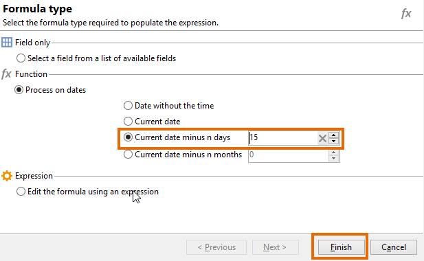

   * トラッキングログの検索終了日を選択するには、「**[!UICONTROL 追加]**」をクリックして 2 番目の条件を作成します。「**[!UICONTROL 式]**」列で、「**[!UICONTROL 日付（@logDate）]**」を再度選択します。

      「**[!UICONTROL 前]**」演算子を選択します。「**[!UICONTROL 値]**」列で、**[!UICONTROL 式を編集]**&#x200B;をクリックします。日付処理については、**[!UICONTROL 数式のタイプ]**&#x200B;ウィンドウに移動し、「**[!UICONTROL 現在の日付 - n 日]**」に &quot;1&quot; と入力します。

      「**[!UICONTROL 完了]**」をクリックします。

      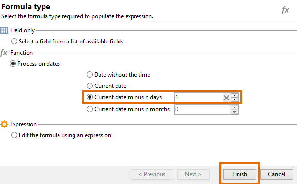

      次に、クエリが対象とする配信ラベルなど、3 番目のフィルター条件を設定します。

   * 「**[!UICONTROL 追加]**」機能をクリックして別のフィルター条件を作成します。「**[!UICONTROL 式]**」列で、**[!UICONTROL 式を編集]**&#x200B;をクリックします。**[!UICONTROL 選択するフィールド]**&#x200B;ウィンドウで、「**[!UICONTROL 、「配信]**」ノードの「ラベル」を選択します。****

      「**[!UICONTROL 完了]**」をクリックします。

      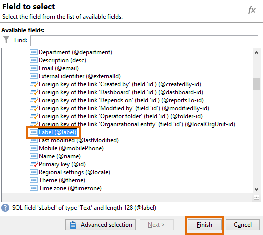

      「sales」という単語を含む配信を検索します。正確なラベルを覚えていない場合は、「**[!UICONTROL 次を含む]**」演算子を選択し、「**[!UICONTROL 値]**」列に &quot;sales&quot; と入力します。

      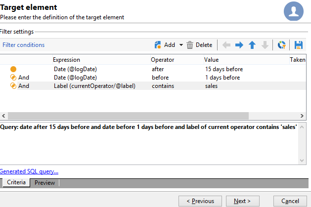

1. **[!UICONTROL データのプレビュー]**&#x200B;ウィンドウが表示されるまで「**[!UICONTROL 次へ]**」をクリックします。ここでは書式設定は必要ありません。
1. **[!UICONTROL データのプレビュー]**&#x200B;ウィンドウで「**[!UICONTROL データのプレビューを開始]**」をクリックし、各配信の受信者のトラッキングログ数を確認します。

   結果は降順で表示されます。

   

   この例では、特定のユーザーのログの最大数が 6 で、5 人の異なるユーザーが配信 E メールを開いたり、E メールのいずれかのリンクをクリックしたということになります。

## いずれの配信も開封していない受信者 {#recipients-who-did-not-open-any-delivery}

この例では、過去 7 日間、E メールを開封していない受信者をフィルターします。

この例を作成するには、次の手順に従います。

1. ワークフローに「**[!UICONTROL クエリ]**」アクティビティをドラッグ＆ドロップし、アクティビティを開きます。
1. 「**[!UICONTROL クエリを編集]**」をクリックし、ターゲットディメンションとフィルタリングディメンションを「**[!UICONTROL 受信者]**」に設定します。

   

1. 「**[!UICONTROL フィルター条件]**」を選択し、「**[!UICONTROL 次へ]**」をクリックします。
1. 「**[!UICONTROL 追加]**」ボタンをクリックし、「**[!UICONTROL トラッキングログ]**」を選択します。
1. 「**[!UICONTROL トラッキングログ]**」式の「**[!UICONTROL 演算子]**」を「**[!UICONTROL 次の場合には存在しません]**」に設定します。

   

1. 別の式を追加します。「**[!UICONTROL URL]**」カテゴリの「**[!UICONTROL タイプ]**」を選択します。
1. 次に、「**[!UICONTROL 演算子]**」を「**[!UICONTROL 次と等しい]**」に、その「**[!UICONTROL 値]**」を「**[!UICONTROL オープン]**」に設定します。

   

1. 別の式を追加し、「**[!UICONTROL 日付]**」を選択します。「**[!UICONTROL 演算子]**」は「**[!UICONTROL 以降]**」に設定する必要があります。

   

1. 値を過去 7 日間に設定するには、「**[!UICONTROL 値]**」フィールドで「**[!UICONTROL 式を編集]**」ボタンをクリックします。
1. 「**[!UICONTROL 関数]**」カテゴリで、「**[!UICONTROL 現在の日付 - n 日]**」を選択し、ターゲティングする日数を追加します。ここでは、過去 7 日間をターゲティングします。

   

アウトバウンドトランジションには、過去 7 日間、E メールを開封していない受信者が含まれます。

反対に、1 件以上の E メールを開封した受信者をフィルターする場合、クエリは次のようになります。この場合、「**[!UICONTROL フィルタリングディメンション]**」は「**[!UICONTROL トラッキングログ (Recipients)]**」に設定してください。

## 配信を開封した受信者 {#recipients-who-have-opened-a-delivery}

次の例では、過去 2 週間以内に配信を開封したプロファイルをターゲティングする方法を示します。

1. 配信を開封したプロファイルをターゲティングするには、トラッキングログを使用する必要があります。ログはリンクされたテーブルに保存されています。まず、下図に示すように、「**[!UICONTROL フィルタリングディメンション]**」フィールドのドロップダウンリストからこのテーブルを選択します。

   

1. フィルター条件については、トラッキングログのサブツリー構造に表示される基準の「**[!UICONTROL 式を編集]**」アイコンをクリックします。「**[!UICONTROL 日付]**」フィールドを選択します。

   

   「**[!UICONTROL 完了]**」をクリックして選択内容を確定します。

   過去 2 週間以内のトラッキングログのみを取り出すには、「**[!UICONTROL 次より大きい]**」演算子を選択します。

   

   次に、「**[!UICONTROL 値]**」列で&#x200B;**[!UICONTROL 式を編集]**&#x200B;アイコンをクリックし、適用する計算式を定義します。数式「**[!UICONTROL 現在の日付 - n 日]**」を選択し、関連するフィールドに「15」と入力します。

   

   数式ウィンドウで「**[!UICONTROL 完了]**」ボタンをクリックします。フィルターウィンドウで、「**[!UICONTROL プレビュー]**」タブをクリックしてターゲット条件を確認します。

   

## 配信後の受信者の行動のフィルタリング {#filtering-recipients--behavior-folllowing-a-delivery}

ワークフローで、**[!UICONTROL クエリ]**&#x200B;および&#x200B;**[!UICONTROL 分割]**&#x200B;ボックスを使用して、前の配信に続く行動を選択できます。この選択は、「**[!UICONTROL 配信の受信者]**」フィルターを使用して実行します。

* 例の目的

   配信ワークフローには、最初の E メール通信をフォローアップする複数の方法があります。このタイプの操作では、**[!UICONTROL 分割]**&#x200B;ボックスを使用する必要があります。

* コンテキスト

   「サマースポーツキャンペーン」配信が送信されます。配信の 4 日後、他の 2 つの配信が送信されます。1 つは「ウォータースポーツキャンペーン」、もう 1 つは最初の「サマースポーツキャンペーン」配信のフォローアップです。

   「ウォータースポーツキャンペーン」配信は、最初の配信の「ウォータースポーツ」リンクをクリックした受信者に送信されます。このクリックは、受信者がトピックに関心があることを示しています。これらの受信者を類似のオファーに導くことは理にかなっています。
ただし、「サマースポーツキャンペーン」をクリックしなかった受信者には同じ内容を再度送信します。

次の手順では、2 つの異なる行動を統合することによって&#x200B;**[!UICONTROL 分割]**&#x200B;ボックスを設定する方法を示します。

1. ワークフローに&#x200B;**[!UICONTROL 分割]**&#x200B;ボックスを挿入します。このボックスでは、最初の配信の受信者を次の 2 つの配信に分類します。分類は、最初の配信における受信者の行動にリンクされたフィルター条件に基づいておこなわれます。

   

1. **[!UICONTROL 分割]**&#x200B;ボックスを開きます。「**[!UICONTROL 一般]**」タブで、ラベルを入力します（例えば、「**ユーザーアクション別に分割**」など）。

   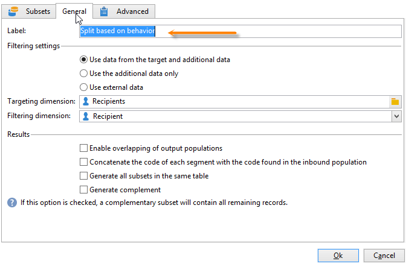

1. 「**[!UICONTROL サブセット]**」タブで、最初の分割分岐を定義します。例えば、この分岐に対してラベルとして 「**クリックした**」と入力します。
1. 「**[!UICONTROL インバウンド母集団に対するフィルターを追加]**」オプションをオンにします。「**[!UICONTROL 編集]**」をクリックします。
1. **[!UICONTROL ターゲティングとフィルタリングディメンション]**&#x200B;ウィンドウで、「**[!UICONTROL 配信の受信者]**」フィルターをダブルクリックします。

   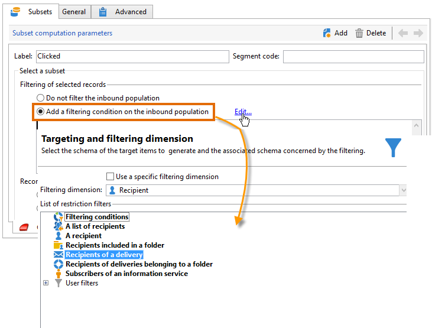

1. **[!UICONTROL ターゲット要素]**&#x200B;ウィンドウで、この分岐に適用する行動、「**[!UICONTROL （E メールを）クリックした受信者]**」を選択します。

   その下で、「**[!UICONTROL トランジションで指定された配信]**」オプションをオンにします。この機能では、最初の配信でターゲットとされた受信者が自動的に収集されます。

   これは「ウォータースポーツキャンペーン」配信です。

   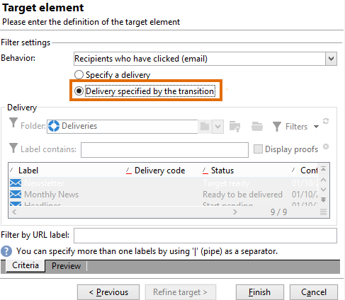

1. 2 番目の分岐を定義します。この分岐には、最初の配信と同じ内容のフォローアップ E メールが含まれます。「**[!UICONTROL サブセット]**」タブに移動し、「**[!UICONTROL 追加]**」をクリックします。

   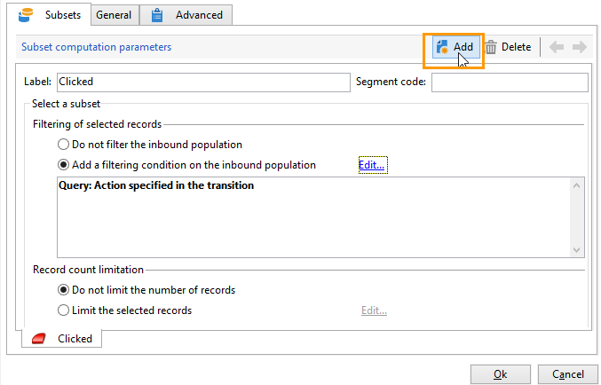

1. もう 1 つのサブタブが表示されます。このサブタブに、「**クリックしなかった**」という名前を付けます。
1. 「**[!UICONTROL インバウンド母集団に対するフィルターを追加]**」をクリックします。次に「**[!UICONTROL 編集...]**」をクリックします。

   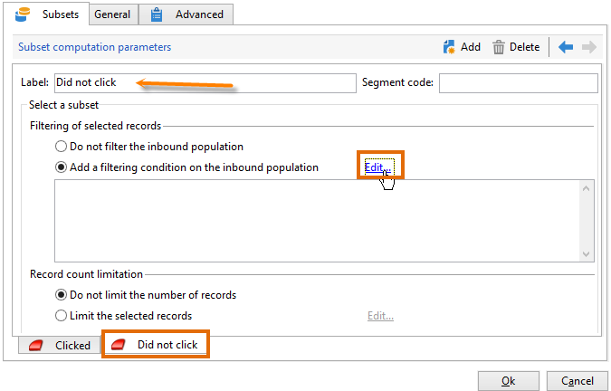

1. **[!UICONTROL ターゲティングとフィルタリングディメンション]**&#x200B;ウィンドウで、「**[!UICONTROL 配信の受信者]**」をクリックします。
1. **[!UICONTROL ターゲット要素]**&#x200B;ウィンドウで、「**[!UICONTROL クリックしていない受信者（E メール）]**」行動を選択します。前の分岐で示したように、「**[!UICONTROL トランジションで指定された配信]**」オプションをオンにします。

   これで、**[!UICONTROL 分割]**&#x200B;ボックスの設定が完了しました。

   

次に、デフォルトで設定されている各種コンポーネントのリストを示します。

* **[!UICONTROL すべての受信者]**
* **[!UICONTROL 正常に送信されたメッセージに関連付けられている受信者]**
* **[!UICONTROL （E メールを）開いた、またはクリックした受信者]**
* **[!UICONTROL （E メールを）クリックした受信者]**
* **[!UICONTROL 失敗したメッセージに関連付けられている受信者]**
* **[!UICONTROL （E メールを）開封またはクリックしなかった受信者]**
* **[!UICONTROL クリックしていない受信者（E メール）]**

   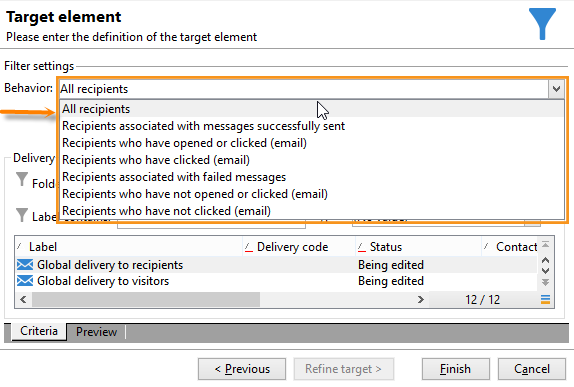
