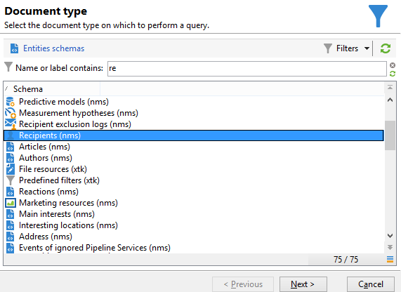
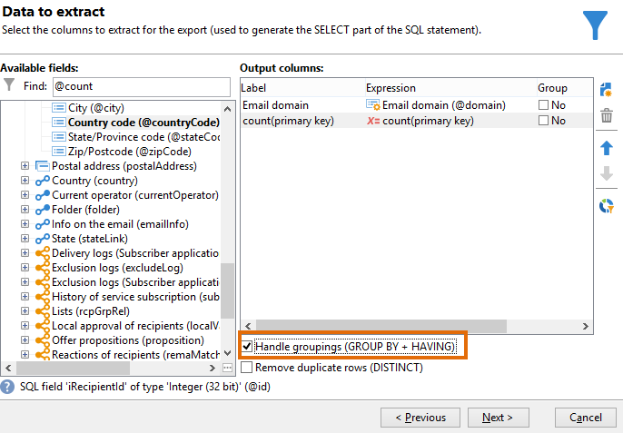
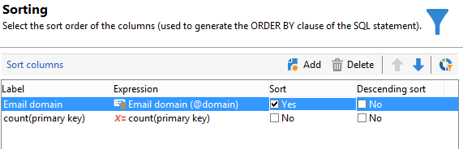
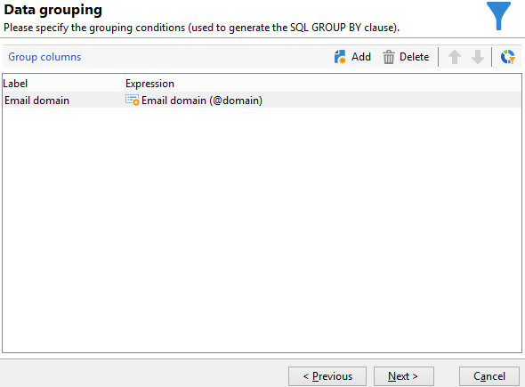
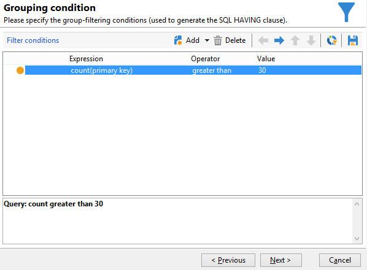
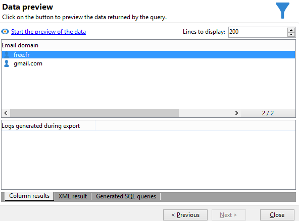

# グループ管理を使用したクエリ {#querying-using-grouping-management}

この例では、クエリを実行して、以前の配信でターゲットとされた回数が 30 回を超えるすべてのメールドメインを検索します。

* どのテーブルを選択する必要がありますか。

  受信者テーブル（nms:recipient）

* 出力列に選択するフィールドは何ですか。

  「メールドメイン」と「プライマリキー」（カウントあり）

* データをグループ化する基準は何ですか。

  プライマリキーのカウントが 30 を超えるメールドメインを基準にします。この操作は、「**[!UICONTROL Group by + Having]**」オプションで実行されます。「**[!UICONTROL Group by + Having]**」では、データをグループ化し（「group by」）、グループ化した対象を選択（「having」）できます。

この例を作成するには、次の手順に従います。

1. **[!UICONTROL 汎用クエリエディター]**&#x200B;を開き、受信者テーブル（**nms:recipient**）を選択します。

   

1. **[!UICONTROL 抽出するデータ]**&#x200B;ウィンドウで、「**[!UICONTROL メールドメイン]**」フィールドおよび「**[!UICONTROL プライマリキー]**」フィールドを選択します。「**[!UICONTROL プライマリキー]**」フィールドでカウントを実行します。

1. 「**[!UICONTROL グループを処理（GROUP BY + HAVING）]**」ボックスをオンにします。

   

1. **[!UICONTROL 並べ替え]**&#x200B;ウィンドウで、メールドメインを降順で並べ替えます。そのためには、「**[!UICONTROL 降順ソート]**」列で「**[!UICONTROL はい]**」をオンにします。「**[!UICONTROL 次へ]**」をクリックします。

   

1. **[!UICONTROL データのフィルター]**&#x200B;で、「**[!UICONTROL フィルター条件]**」を選択します。**[!UICONTROL ターゲット要素]**&#x200B;ウィンドウに移動し、「**[!UICONTROL 次へ]**」をクリックします。
1. **[!UICONTROL データのグループ化]**&#x200B;ウィンドウで、「**[!UICONTROL 追加]**」をクリックして「**[!UICONTROL メールドメイン]**」を選択します。

   このデータのグループ化ウィンドウは、「**[!UICONTROL グループを処理（GROUP BY + HAVING）]**」ボックスをオンにした場合にのみ表示されます。

   

1. 結果で 30 回より多くターゲットとされたメールドメインのみが返される必要があるので、**[!UICONTROL グループ化条件]**&#x200B;ウィンドウで 30 より大きいプライマリキーカウントを指定します。

   このウィンドウは、「**[!UICONTROL グループを管理（GROUP BY + HAVING）]**」ボックスをオンにした場合に表示されます。このボックスでは、グループの結果をフィルターします（HAVING）。

   

1. **[!UICONTROL データフォーマット]**&#x200B;ウィンドウで、「**[!UICONTROL 次へ]**」をクリックします。ここでは書式設定は必要ありません。
1. データのプレビューウィンドウで、「**[!UICONTROL データのプレビューを開始]**」をクリックします。ここでは、ターゲットとされた回数が 30 回を超える 3 つの異なるメールドメインが返されます。

   
