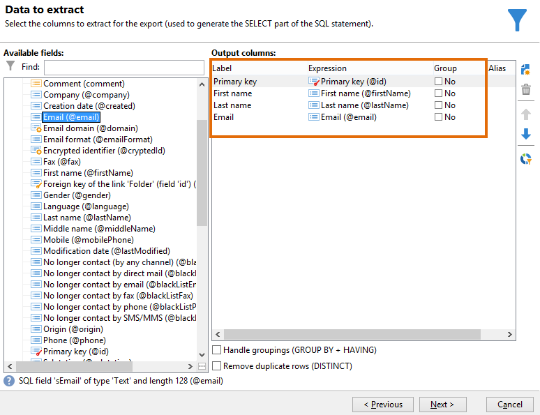
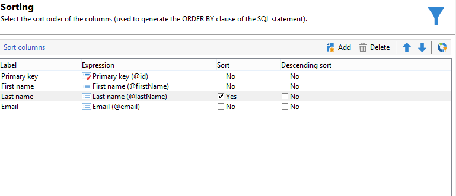
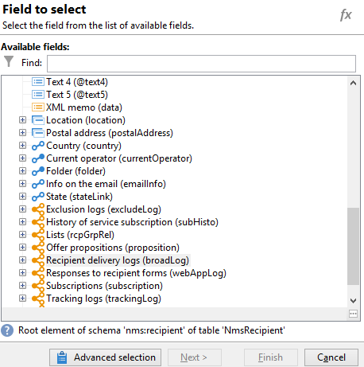
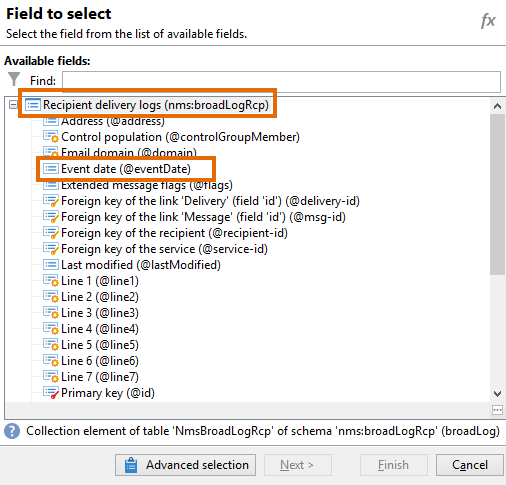
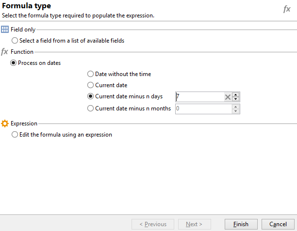
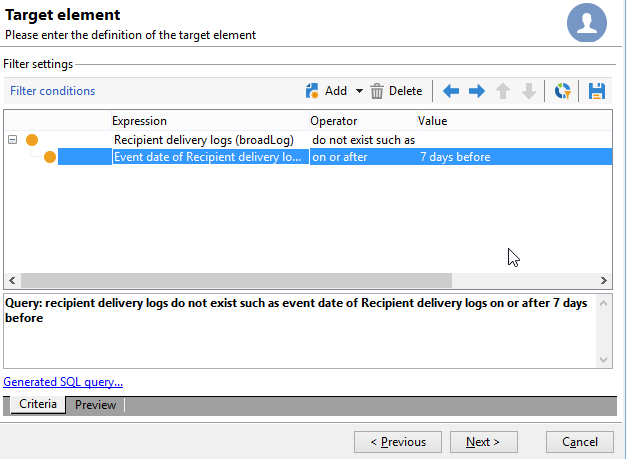
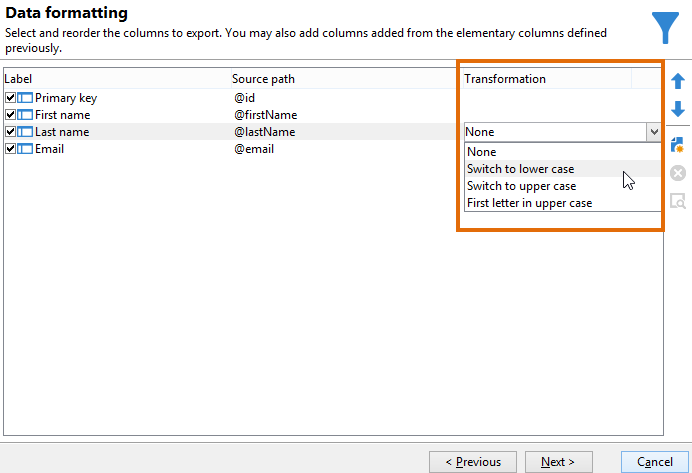
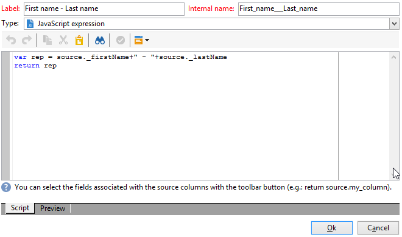
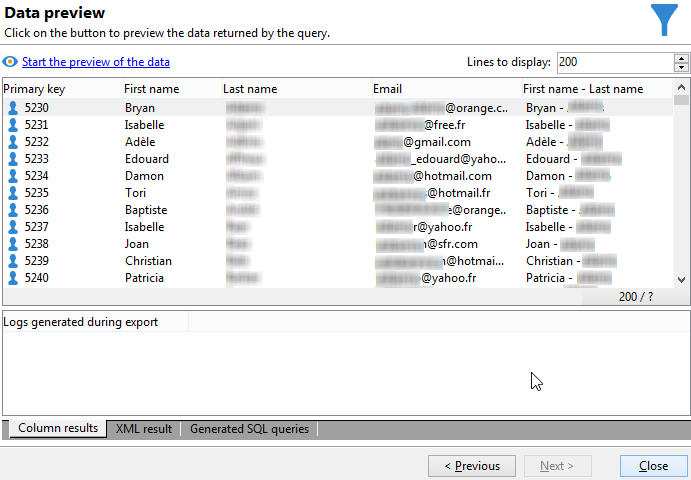

# 多対多の関係を使用したクエリ {#querying-using-a-many-to-many-relationship}


この例では、過去 7 日間連絡されていない受信者を収集します。このクエリは、すべての配信を対象とします。

この例では、任意に選択したコレクション要素（オレンジ色のノード）に関連するフィルターを設定する方法も示します。コレクション要素は、**[!UICONTROL 選択するフィールド]**&#x200B;ウィンドウで使用できます。

* どのテーブルを選択する必要がありますか。

   受信者テーブル（**nms:recipient**）

* 出力列に選択するフィールドは何ですか。

   「プライマリキー」、「姓」、「名」および「E メール」

* どのような条件に基づいて情報をフィルターしますか。

   過去 7 日間の受信者の配信ログに基づきます。

次の手順に従います。

1. 汎用クエリエディターを開き、受信者テーブル&#x200B;**[!UICONTROL （nms:recipient）]**&#x200B;を選択します。
1. **[!UICONTROL 抽出するデータ]**&#x200B;ウィンドウで、「**[!UICONTROL プライマリキー]**」、「**[!UICONTROL 名]**」、「**[!UICONTROL 姓]**」および「**[!UICONTROL E メール]**」を選択します。

   

1. 並べ替えウィンドウで、名前をアルファベット順で並べ替えます。

   

1. **[!UICONTROL データのフィルター]**&#x200B;ウィンドウで、「**[!UICONTROL フィルター条件]**」を選択します。
1. **[!UICONTROL ターゲット要素]**&#x200B;ウィンドウで、過去 7 日間トラッキングログがないプロファイルを抽出するためのフィルター条件には、2 つの手順が必要です。選択する必要がある要素は多対多のリンクです。

   * まず、最初の「**[!UICONTROL 式]**」列に対して、**[!UICONTROL 受信者配信ログ（broadlog）]**&#x200B;コレクション要素（オレンジ色のノード）を選択します。

      

      「**[!UICONTROL 次の場合には存在しません]**」演算子を選択します。このラインで 2 番目の値を選択する必要はありません。

   * 2 番目のフィルター条件の内容は、最初のフィルター条件によって異なります。ここでは、**[!UICONTROL 受信者配信ログ]**&#x200B;テーブルへのリンクがあるので、このテーブルの「**[!UICONTROL イベントの日付]**」フィールドが直接提供されます。

      

      「**[!UICONTROL イベントの日付]**」を「**[!UICONTROL 以降]**」演算子とともに選択します。**[!UICONTROL DaysAgo（7）]**&#x200B;の値を選択します。そのためには、「**[!UICONTROL 値]**」フィールドで&#x200B;**[!UICONTROL 式を編集]**&#x200B;をクリックします。**[!UICONTROL 数式のタイプ]**&#x200B;ウィンドウで「**[!UICONTROL 日付で処理]**」および「**[!UICONTROL 現在の日付 - n 日]**」を選択し、値に &quot;7&quot; を指定します。

      

      フィルター条件が設定されました。

      

1. **[!UICONTROL データフォーマット]**&#x200B;ウィンドウで、列の変換はおこなう必要はありません。次のステップに進みます。************

   

1. **[!UICONTROL 計算フィールドを追加]**&#x200B;機能を使用して、列をデータのプレビューウィンドウに追加します。

   この例では、受信者の名と姓を含む計算フィールドを単一の列で追加します。**[!UICONTROL 計算フィールドを追加]**&#x200B;機能をクリックします。**[!UICONTROL 計算済みフィールドの定義をエクスポート]**&#x200B;ウィンドウでラベルと内部名を入力し、「**[!UICONTROL JavaScript 式]**」タイプを選択します。次の式を入力します。

   ```
   var rep = source._firstName+" - "+source._lastName
   return rep
   ```

   

   「**[!UICONTROL OK]**」をクリックします。**[!UICONTROL データフォーマット]**&#x200B;ウィンドウが設定されました。

   計算フィールドの追加について詳しくは、この節を参照してください。

1. **[!UICONTROL データのプレビュー]**&#x200B;ウィンドウに結果が表示されます。過去7日間連絡されていない受信者が表示されます。名と姓の列が作成されました。

   
