# クエリ{#query}

## クエリを作成します。 {#creating-a-query}

クエリを使用すると、条件に応じてターゲットを選択できます。セグメントコードをクエリの結果に関連付け、結果に追加データを挿入することができます。
クエリサンプルの詳細は、[この節](querying-recipient-table.md)を参照してください。

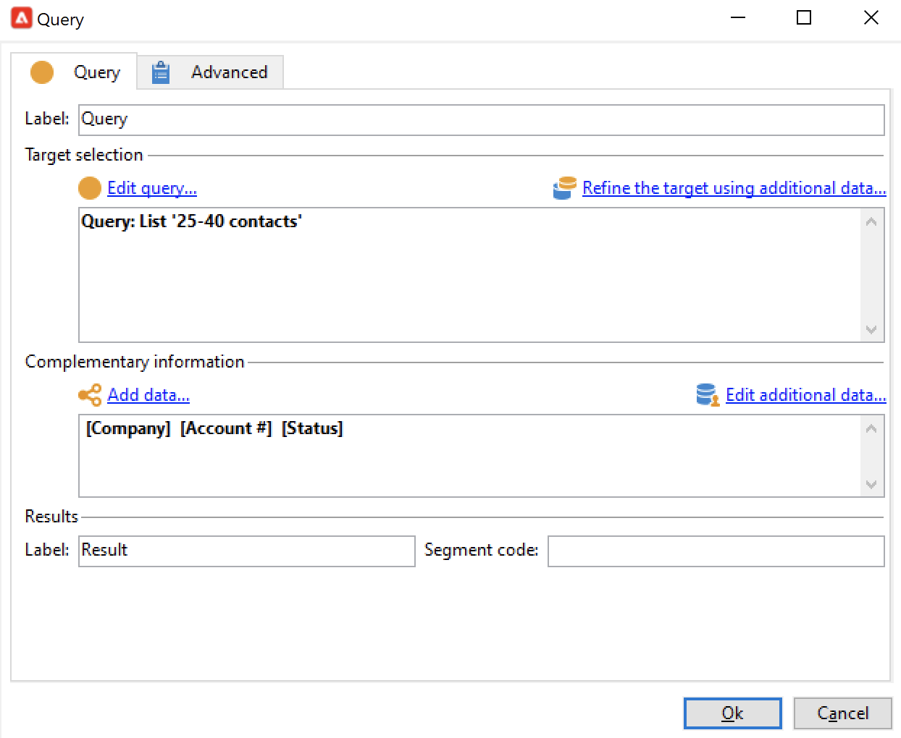

追加データの使用と管理について詳しくは、[データの追加](#adding-data)を参照してください。

「**[!UICONTROL クエリを編集...]**」リンクを使用して、以下の方法で、母集団のターゲティングタイプおよび制限、選択基準を定義します。

1. ターゲティングとフィルタリングディメンションを選択します。デフォルトでは、ターゲットが受信者から選択されます。制限フィルターのリストは、配信ターゲティングに使用されるリストと同じです。

   ターゲティングディメンションは、操作のターゲットにされた母集団など、作業対象の要素のタイプと一致します。

   フィルタリングディメンションにより、ターゲットされた個人に関連する情報など、これらの要素の収集が可能になります（連絡先、最終的な合意内容など）。

   詳しくは、[ターゲティングとフィルタリングディメンション](targeting-workflows.md#targeting-and-filtering-dimensions)を参照してください。

   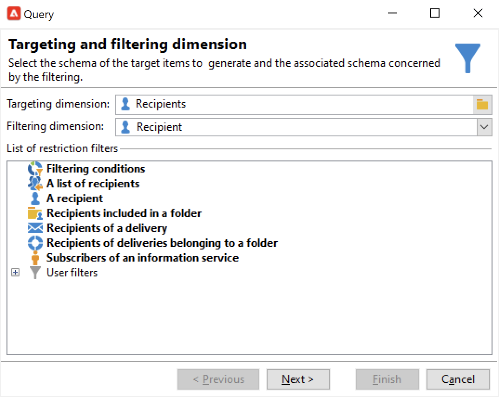

   必要に応じて、ターゲティングとフィルタリングディメンションを選択した場合に&#x200B;**[!UICONTROL 一時スキーマ]**&#x200B;を選択することで、インバウンドトランジションのデータに基づいてクエリを作成できます。

   

1. ウィザードを使用して母集団を定義します。入力するフィールドは、ターゲットのタイプに応じて変わる場合があります。「**[!UICONTROL プレビュー]**」タブを使用して、現在の条件によるターゲット母集団をプレビューできます。

   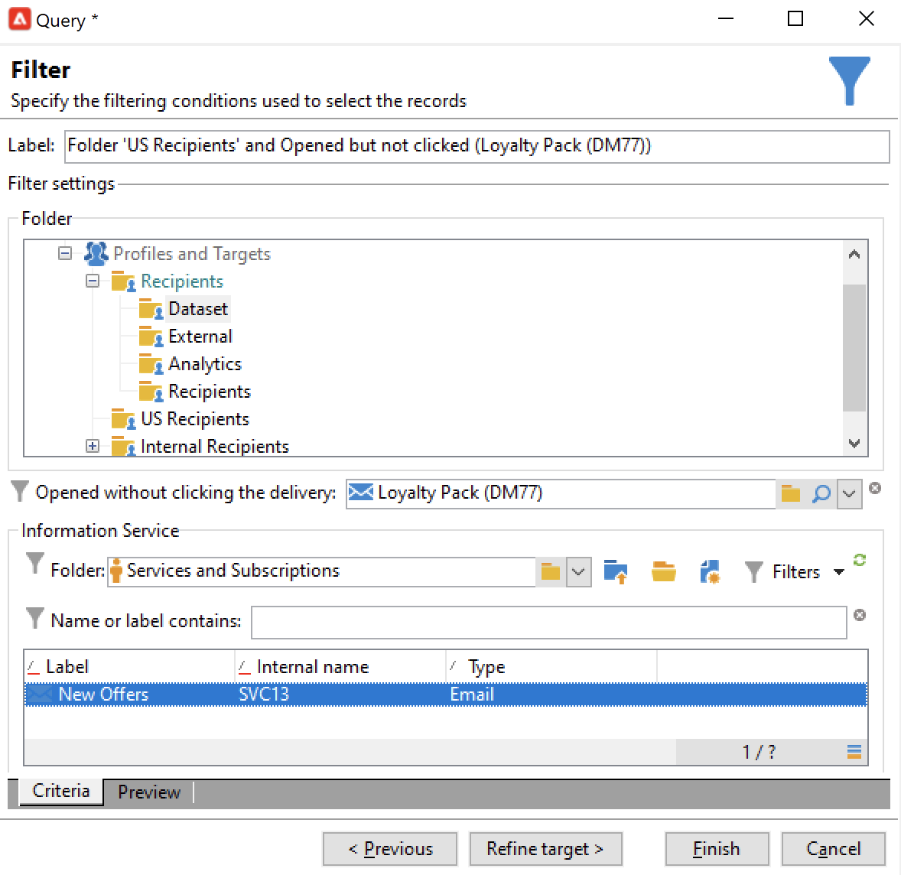

1. 手順 1 で「**[!UICONTROL フィルター条件]**」を選択した場合、または&#x200B;**[!UICONTROL フィルター]**／**[!UICONTROL 詳細設定フィルター]**&#x200B;オプションを使用する場合、後からフィルター条件を手動で追加する必要があります。

   また、対応するボックスを選択することで、データのグループ化条件を追加できます。それには、フィルタリングディメンションが、クエリのターゲティングディメンションとは異なっている必要があります。グループ化について詳しくは、この[節](query-grouping-management.md)を参照してください。

   式ビルダーを、AND、OR、EXCEPT などの論理オプションと組み合わせて使用することで、条件をさらに追加することもできます。

   後で再利用したい場合、フィルターを保存します。

## データを追加 {#adding-data}

追加の列を使用して、契約番号やニュースレターの購読状況、接触チャネルなど、ターゲット母集団についての追加情報を収集できます。このデータは、Adobe Campaign データベースまたは外部データベースに保存できます。

「**[!UICONTROL データを追加...]**」リンクをクリックすると、収集する追加データを選択できます。

まず、追加するデータのタイプを選択します。

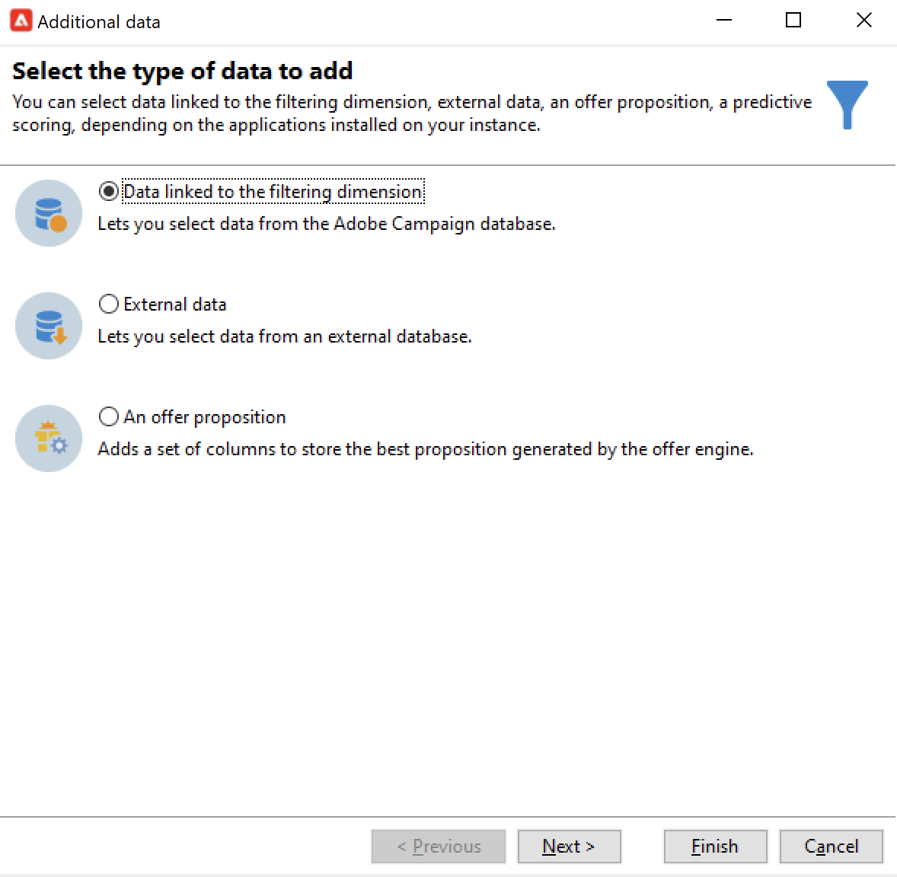

* 「**[!UICONTROL フィルタリングディメンションにリンクされたデータ]**」を選択し、Adobe Campaign データベース内のデータを選択します。
* 「**[!UICONTROL 外部データ]**」を選択し、外部データベース内のデータを追加します。このオプションは、**Federated Data Access** オプションを購入済みである場合のみ、使用できます。詳しくは、[外部データベースへのアクセス（FDA）](accessing-an-external-database--fda-.md)を参照してください。
* 「**[!UICONTROL オファーの提案]**」オプションを選択し、オファーエンジンによって生成された最良の提案を保存する列セットを追加します。このオプションは、**インタラクション**&#x200B;モジュールを購入済みである場合のみ、使用できます。

プラットフォームにオプションモジュールが何もインストールされていない場合、このステージは表示されません。次のステージに直接移動します。

Adobe Campaign データベースからデータを追加するには：

1. 追加するデータのタイプを選択します。これは、フィルター条件に属するデータまたは、リンクされたテーブルに保存されたテーブルのどちらかになります。

   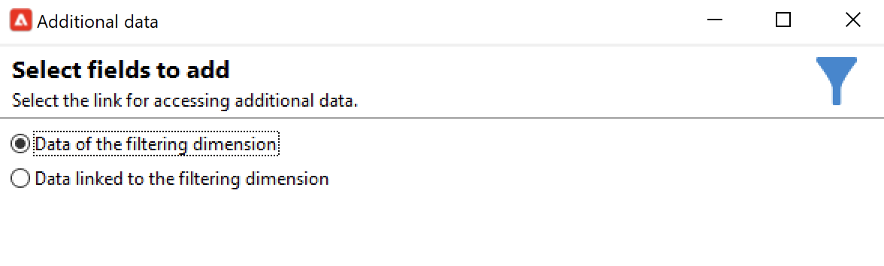

1. データがクエリのフィルター条件に属している場合、使用可能なフィールドのリストから選択するだけで、出力列に表示されます。

   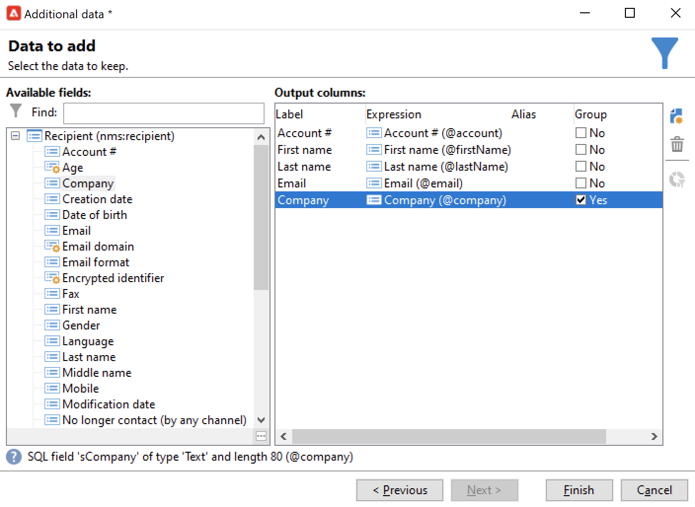

   以下を追加できます。

   * ターゲット母集団から取り出したデータに基づいて自動生成されるフィールド、または集計（先月の保留中の購入の件数、レシートの平均額など）。一例は、[データの選択](targeting-workflows.md#selecting-data)を参照してください。
   * 出力列のリストの右側にある「**[!UICONTROL 新規]**」ボタンを使用して作成された新規フィールド。

      例えば、契約者のリスト、最新 5 回の配達といった情報コレクションを追加することもできます。コレクションは、同じプロファイルで複数の値を持つことができるフィールドと一致します（1-N 関係）。詳しくは、[追加データの編集](targeting-workflows.md#editing-additional-data)を参照してください。

ターゲット母集団にリンクされたデータコレクションを追加するには：

1. ウィザードの最初の手順で、「**[!UICONTROL フィルタリングディメンションにリンクされたデータ]**」オプションを選択します。
1. 収集対象のデータを含んでいるテーブルを選択し、「**[!UICONTROL 次へ]**」をクリックします。

   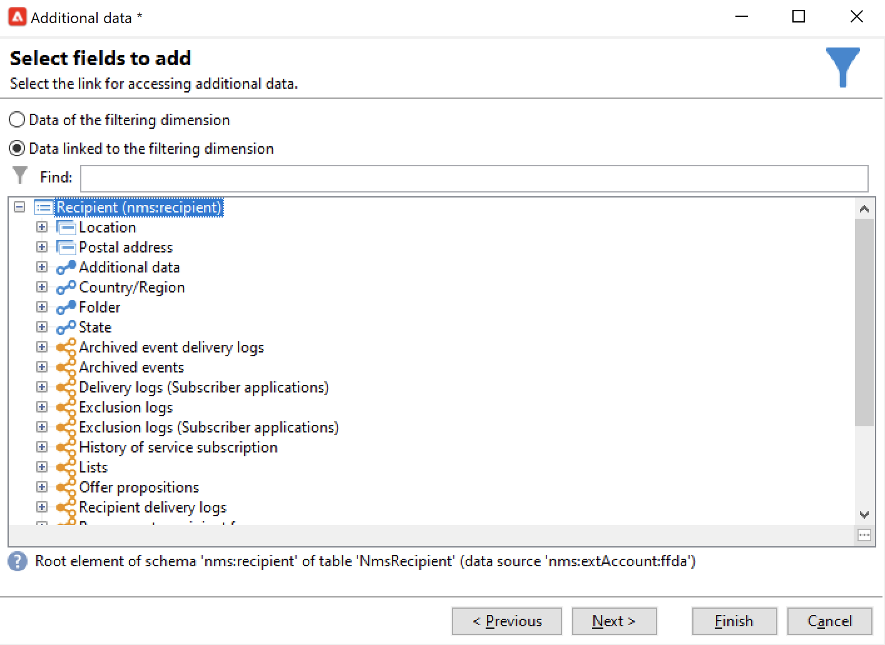

1. 必要に応じて、「**[!UICONTROL 収集されたデータ]**」フィールドの値のいずれかを選択し、保持するコレクションの要素の数を指定します。デフォルトで、コレクションのすべての行が収集され、次の手順で指定される条件に応じて、フィルタリングされます。

   * コレクションの 1 つの要素が、このコレクションのフィルター条件と一致する場合、「**[!UICONTROL 収集されたデータ]**」フィールドの「**[!UICONTROL 1 行]**」を選択します。

      >[!IMPORTANT]
      >
      >このモードでは、コレクション要素を直接結合することで、生成される SQL クエリを最適化します。
      >
      >初期の条件が考慮されない場合、結果は不完全なものになります（行が不足または重複）。

   * 複数行を収集を選択した場合（「**[!UICONTROL ライン数を制限]**」）、収集する行数を指定できます。
   * 宣言されたエラーの数や、サイトでの平均購入額など、収集した列に集計が含まれる場合、「**[!UICONTROL 集計]**」値を使用できます。

   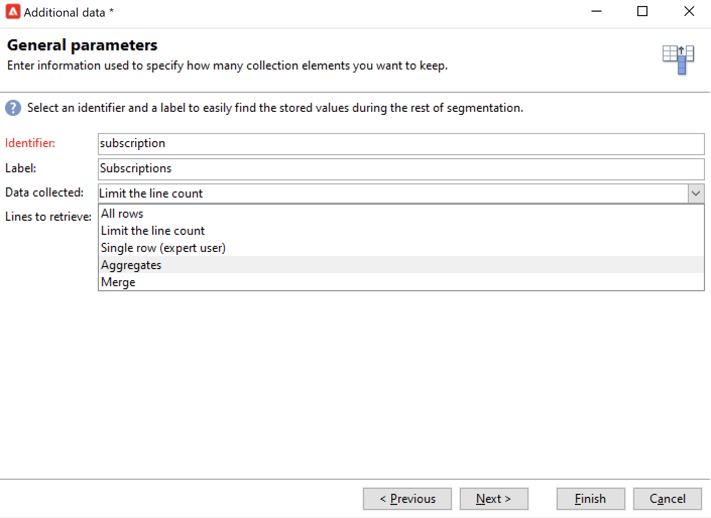

1. コレクションの補助選択範囲を指定します。

   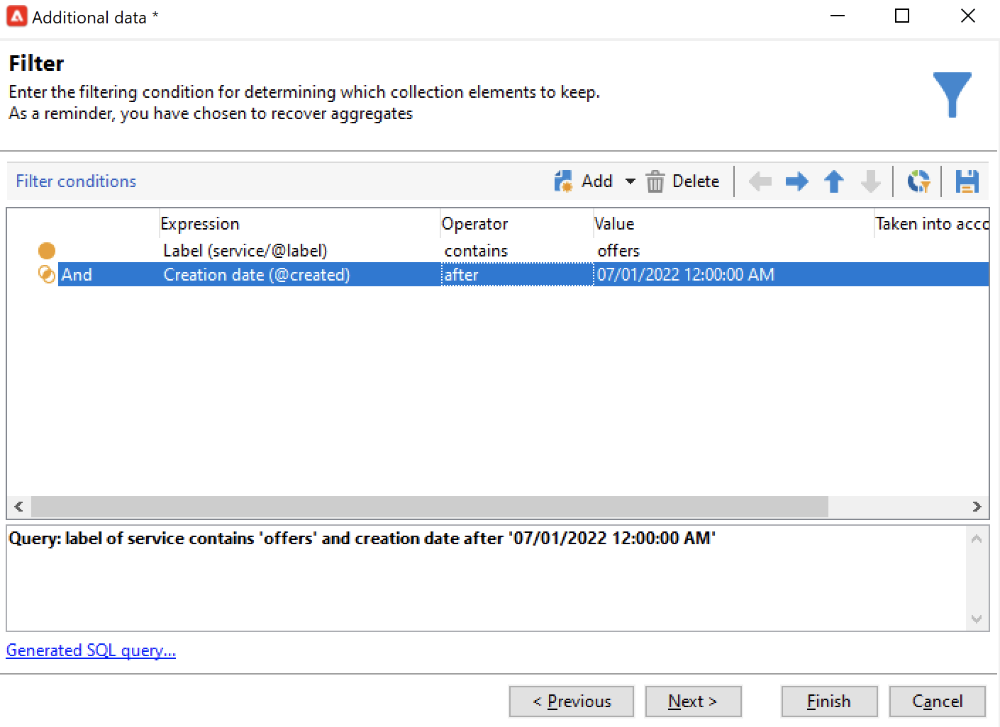

1. 「**[!UICONTROL ライン数を制限]**」オプションを選択した場合、収集データをフィルターする順序を定義します。収集したライン数が制限ライン数を超えた場合、このフィルターの順序により、維持されるラインが決まります。

## 例：シンプルな受信者属性に基づくターゲティング {#example--targeting-on-simple-recipient-attributes}

以下の例のクエリは、フランス在住の 18 歳から 30 歳の男性を識別しようとしています。例えば、このクエリは、対象の男性に限定オファーを提供するワークフローなどで使用されます。

>[!NOTE]
>
>追加のクエリのサンプルについては、[この節](querying-recipient-table.md)を参照してください。

1. クエリに名前を付けて、**[!UICONTROL クエリを編集...]** リンクを選択します。
1. 使用可能なフィルターのタイプのリストから、「**[!UICONTROL フィルター条件]**」を選択します。
1. 提案されたターゲットについて、異なる条件を入力します。AND オプションを使用して組み合わせた条件を以下に示します。選択範囲に含めるには、受信者が次の条件を満たす必要があります。

   * 敬称が「Mr」である受信者（「**性別**」フィールドの値を「**男性**」を指定して特定できます）
   * 30 歳以下の受信者
   * 18 歳以上の受信者
   * フランスに住んでいる受信者

   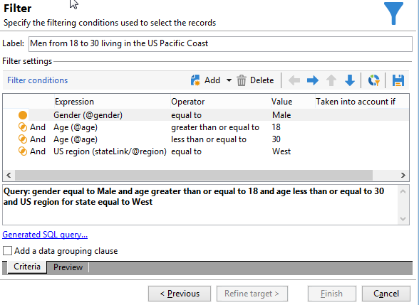

   条件の組み合わせと一致する SQL を確認できます。

   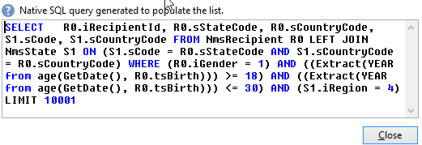

1. 条件が正しいかどうか確認するには、関連するタブで、クエリと一致する受信者をプレビューします。

   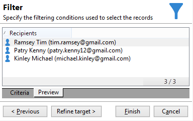

1. フィルターを保存し、**[!UICONTROL 完了]**／**[!UICONTROL OK]** をクリックすることで、将来再利用できます。
1. ほかのアクティビティを追加して、ワークフローを引き続き編集します。ワークフローが開始され、先行するクエリの手順が完了したら、見つかった受信者の数が表示されます。マウスのポップアップメニューを使用して、詳細を表示できます（トランジションを右クリックして、「**[!UICONTROL ターゲットを表示...]**」を選択）。

   

## 出力パラメーター {#output-parameters}

* tableName
* schema
* recCount

この 3 つの値セットは、クエリのターゲットとなる母集団を識別します。**[!UICONTROL tableName]** はターゲットの識別子を記録するテーブル名、**[!UICONTROL schema]** は母集団のスキーマ（通常は nms:recipient）、**[!UICONTROL recCount]** はテーブル内の要素の数です。

この値は、ワークテーブルのスキーマです。
このパラメーターは、**[!UICONTROL tableName]** と **[!UICONTROL schema]** のすべてのトランジションで有効です。

## クエリの最適化 {#optimizing-queries}

以下の節では、Adobe Campaign で実行するクエリを最適化して、データベースの負荷を制限し、ユーザーエクスペリエンスを向上させるためのベストプラクティスを示します。

### 結合およびインデックス {#joins-and-indexes}

* 効率的なクエリにはインデックスが不可欠です。
* すべての結合にインデックスを使用します。
* スキーマ上でリンクを定義すると、結合条件が決定されます。リンクされたテーブルでは、プライマリキーに一意のインデックスが必要で、結合はこのフィールドでおこないます。
* 文字列フィールドではなく数値フィールドにキーを定義して結合を実行します。
* 外部結合の実行を避けます。できる限り、外部結合機能には Zero ID レコードを使用します。
* 結合には正しいデータタイプを使用します。

   `where` 句がフィールドと同じタイプであることを確認します。

   よくあるのは、`iBlacklist='3'` のような間違いです。`iBlacklist` は数値フィールドであるのに、`3` はテキスト値を示しています。

   各クエリの実行計画がどのようなものになるのか知っている必要があります。リアルタイムクエリや毎分実行されるニアリアルタイムクエリの場合は特に、フルテーブルスキャンを避けます。

### 関数 {#functions}

* `Lower(...)` のような関数には注意が必要です。Lower 関数を使用する場合、インデックスは使用されません。
* 「like」演算子または「upper」や「lower」演算子を使用するクエリには注意が必要です。「upper」の適用は、データベースフィールドではなくユーザー入力におこないます。

### フィルタリングディメンション {#filtering-dimensions}

「exists such as」演算子を使用する代わりに、クエリのフィルタリングディメンションを使用します。

クエリでは、フィルターの「exists such as」条件は効率がよくありません。SQL のサブクエリと同等です。

`select iRecipientId from nmsRecipient where iRecipientId IN (select iRecipientId from nmsBroadLog where (...))`

代わりにクエリのフィルタリングディメンションを使用するのがベストプラクティスとなります。

フィルタリングディメンションと同等なのは、SQL の内部結合です。

`select iRecipientId from nmsRecipient INNER JOIN nmsBroadLog ON (...)`

フィルタリングディメンションについて詳しくは、[この節](build-a-workflow.md#targeting-and-filtering-dimensions)を参照してください。

### アーキテクチャ {#architecture}

* 実稼働環境プラットフォームと同様のボリューム、パラメーター、アーキテクチャを持つ開発プラットフォームを構築します。
* 開発環境と実稼働環境では同じ値を使用します。次の項目に関しては、できる限り同じものを使用します。

   * オペレーティングシステム
   * バージョン
   * データ
   * アプリケーション
   * ボリューム

   >[!NOTE]
   >
   >開発環境で動作する機能が、データの異なる実稼働環境では動作しない場合があります。リスクを予測し、解決策を準備するために、主な違いを特定しておくようにします。

* ターゲットボリュームに適した構成を設定します。大容量ボリュームには特定の構成が必要です。10 万人の受信者に対して機能した構成が、1 000 万人の受信者に対しては機能しないこともあります。

   実際に稼働させたとき、システムがどのようにスケールするかを考慮します。小規模で動作したとしても、それが大規模なボリュームに適しているとは限りません。テストは、実稼働中のボリュームと同様のボリュームでおこなう必要があります。また、ピーク時間、ピーク日、およびプロジェクトの全期間におけるボリューム（呼び出し回数、データベースのサイズ）の変化が与える影響も評価する必要があります。
