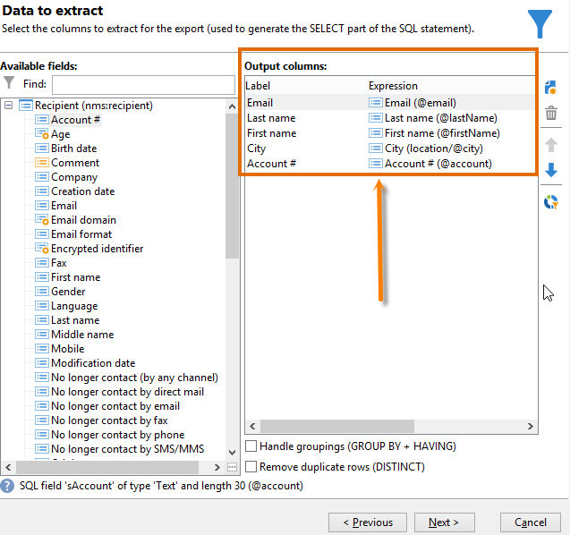
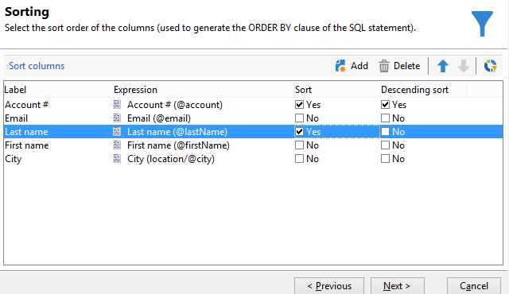
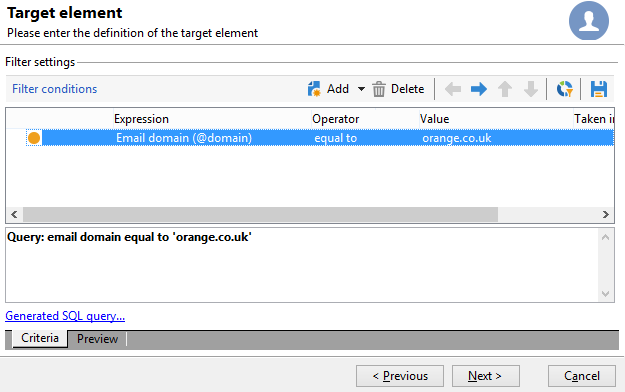
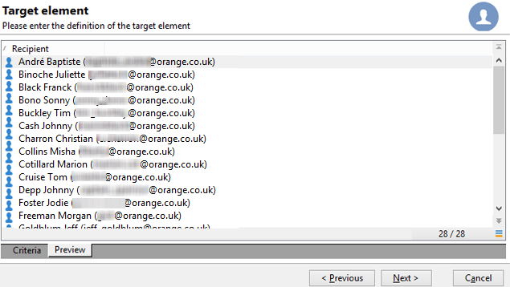
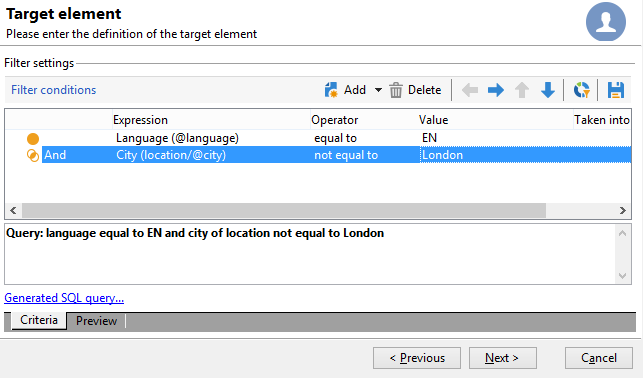
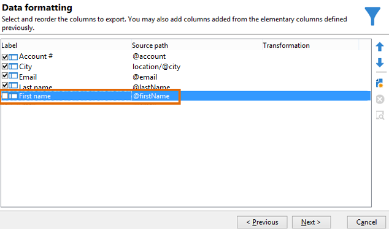
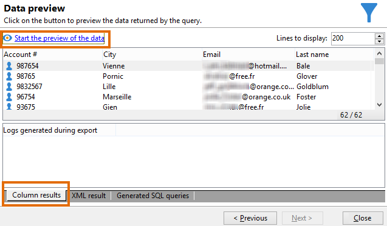
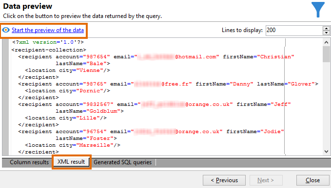
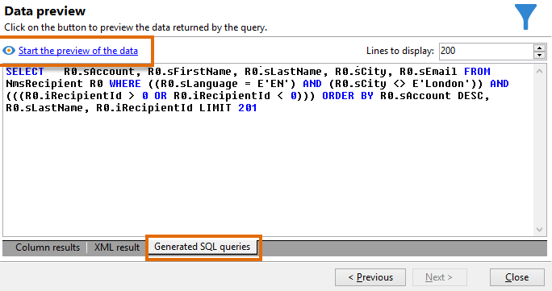

# 受信者テーブルのクエリ {#querying-recipient-table}

この例では、メールドメインが「orange.co.jp」で、横浜市に住んでいない受信者の名前とメールを収集します。

* どのテーブルを選択する必要がありますか。

  受信者テーブル（nms:recipient）

* 出力列として選択するフィールドは何ですか。

  メール、名前、市区町村およびアカウント番号

* 受信者のフィルター条件は何ですか。

  市区町村とメールドメイン

* 並べ替えを設定しますか。

  はい。「**[!UICONTROL アカウント番号]**」および「**[!UICONTROL 姓]**」に基づいて設定します

この例を作成するには、次の手順に従います。

1. **[!UICONTROL ツール／汎用クエリエディター...]** をクリックし、**受信者**（**nms:recipient**）テーブルを選択します。「**[!UICONTROL 次へ]**」をクリックします。
1. 「**[!UICONTROL 姓]**」、「**[!UICONTROL 名]**」、「**[!UICONTROL メール]**」、「**[!UICONTROL 市区町村]**」および「**[!UICONTROL アカウント番号]**」を選択します。これらのフィールドは、「**[!UICONTROL 出力列]**」に追加されます。「**[!UICONTROL 次へ]**」をクリックします。

   

1. 列を並べ替えて適切な順序で表示します。ここでは、アカウント番号を降順、名前をアルファベット順に並べ替えます。「**[!UICONTROL 次へ]**」をクリックします。

   

1. **[!UICONTROL データのフィルター]**&#x200B;ウィンドウで検索を絞り込みます。「**[!UICONTROL フィルター条件]**」を選択し、「**[!UICONTROL 次へ]**」をクリックします。
1. **[!UICONTROL ターゲット要素]**&#x200B;ウィンドウで、フィルター設定を入力できます。

   メールドメインが「orange.co.jp」と等しい受信者というフィルター条件を定義します。そのためには、「**式**」列で「**[!UICONTROL メールドメイン（@domain）]**」を選択し、「**オペレーター**」列で「**[!UICONTROL 次と等しい]**」を選択して「**[!UICONTROL 値]**」列に &quot;orange.co.jp&quot; と入力します。

   

1. 必要に応じて、「**[!UICONTROL 値の配分]**」ボタンをクリックして、見込み客のメールドメインに基づいて配分を表示します。データベースでのメールドメインごとの割合が表示されます。「orange.co.jp」以外のドメインは、フィルターが適用されるまで表示されます。

   ウィンドウの下部に、**メールドメインが「orange.co.uk」に等しい**&#x200B;というクエリの概要が表示されます。

1. 「**[!UICONTROL プレビュー]**」をクリックしてクエリ結果を確認します。メールドメインが「orange.co.jp」のデータのみが表示されます。

   

1. クエリを変更して、横浜市に住んでいない連絡先を検索します。

   「**[!UICONTROL 式]**」列で「**[!UICONTROL 市区町村 (location/@city)]**」を選択し、演算子として「**[!UICONTROL 次と等しくない]**」を選択し、「**[!UICONTROL 値]**」列に 「**[!UICONTROL 横浜市]**」と入力します。

   

1. これにより、**[!UICONTROL データフォーマット]**&#x200B;ウィンドウが表示されます。列の順序を確認します。「市区町村」列を「アカウント番号」列の下に移動します。

   「名」列をオフにしてリストから削除します。

   

1. **[!UICONTROL データのプレビュー]**&#x200B;ウィンドウで、「**[!UICONTROL データのプレビューを開始]**」をクリックします。この機能により、クエリの結果が計算されます。

   「**[!UICONTROL 列の結果]**」タブに、クエリ結果が列で表示されます。

   結果には、メールドメインが「orange.co.jp」で、横浜市に住んでいないすべての受信者が表示されます。前のステージでオフにしたので、「名」列は表示されません。アカウント番号は降順で並べ替えられます。

   

   「**[!UICONTROL XML の結果]**」タブでは、結果が XML フォーマットで表示されます。

   

   「**[!UICONTROL 生成された SQL クエリ]**」タブには、クエリ結果が SQL 形式で表示されます。

   
