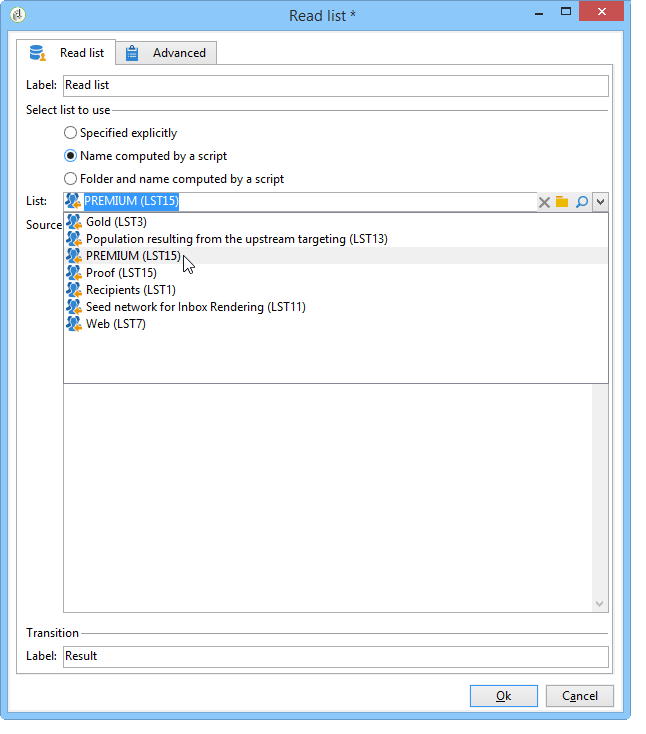

# リスト読み込み{#read-list}

ワークフローで処理されるデータは、（前回のセグメント化またはファイルアップロード後に）あらかじめデータが準備されたか構造化されたリストから取得されます。

「**[!UICONTROL リスト読み込み]**」アクティビティでは、クエリからデータをコピーするのと同様、ワークフローワークテーブル内のリストからデータをコピーできます。その後、コピーされたデータにワークフロー全体を通じてアクセスできます。

処理されるリストは、選択したオプションまたは「**[!UICONTROL リスト更新]**」アクティビティで定義したパラメーターに応じて、明示的に指定されるか、スクリプトで自動生成するか、動的にローカライズされます。

リストが明示的に指定されない場合、構造を調べるテンプレートとして使用されるリストを提供する必要があります。

リストの選択が設定されたら、「**[!UICONTROL クエリを編集]**」オプションを使用してフィルターを追加することで、母集団の特定の部分を次のワークフローのために保持できます。

>[!CAUTION]
>
>リスト読み込みアクティビティ内にフィルターを作成するには、関連するリストが「ファイル」タイプである必要があります。

このリストは、ホームページの&#x200B;**[!UICONTROL プロファイルとターゲット／リスト]**&#x200B;リンク経由で、Adobe Campaign 内で直接作成できます。また、「**[!UICONTROL リスト更新]**」アクティビティを使用して、ワークフロー内でも作成できます。

**例：送信アドレスのリストの除外**

次の例では、E メールアドレスのリストを、E メール配信ターゲットから除外する目的で使用しています。

**新しい連絡先**&#x200B;フォルダーに含まれるプロファイルは、配信アクションのターゲットに設定される必要があります。ターゲットから除外する E メールアドレスは、外部リストに保存されています。この例では、除外に必要な情報は、E メールアドレスのみです。

1. リスト内の情報と整合性を図るには、選択されたプロファイルの E メールアドレスを、**新しい連絡先**&#x200B;フォルダー選択クエリで読み込めるようにする必要があります。

   

1. ここでは、リストは&#x200B;**リスト**&#x200B;フォルダーに保存され、ラベルが自動生成されます。

   

1. 外部リスト内の E メールアドレスをメインターゲットから除外するには、除外アクティビティを設定し、保持するデータが含まれる&#x200B;**新しい連絡先**&#x200B;フォルダーを指定する必要があります。このセットと、除外アクティビティのその他すべてのインバウンドセットとの結合データが、ターゲットから削除されます。

   

   除外ルールは、編集ツールの中央部に設定されています。「**[!UICONTROL 追加]**」ボタンをクリックして、提供される除外のタイプを定義します。

   アクティビティの受信トランジションの数に応じて、複数の除外を定義できます。

1. 「**[!UICONTROL 除外セット]**」フィールドで、「**[!UICONTROL リスト読み込み]**」アクティビティを選択します。このアクティビティ内のデータはメインセットから除外されます。

   この例では、結合に対する除外があります。リストに含まれるデータは、E メールアドレスを含んでいるフィールド経由でメインセットのデータと紐付けされます。結合を設定するには、「**[!UICONTROL ディメンションを変更]**」フィールドで「**[!UICONTROL 結合]**」を選択します。

   

1. 次に、2 つのセット内（ソースおよびディメンション）で E メールアドレスと対応するフィールドを選択します。列がリンクされ、インポートされたアドレスのリストに E メールアドレスが含まれる受信者が、ターゲットから除外されます。
