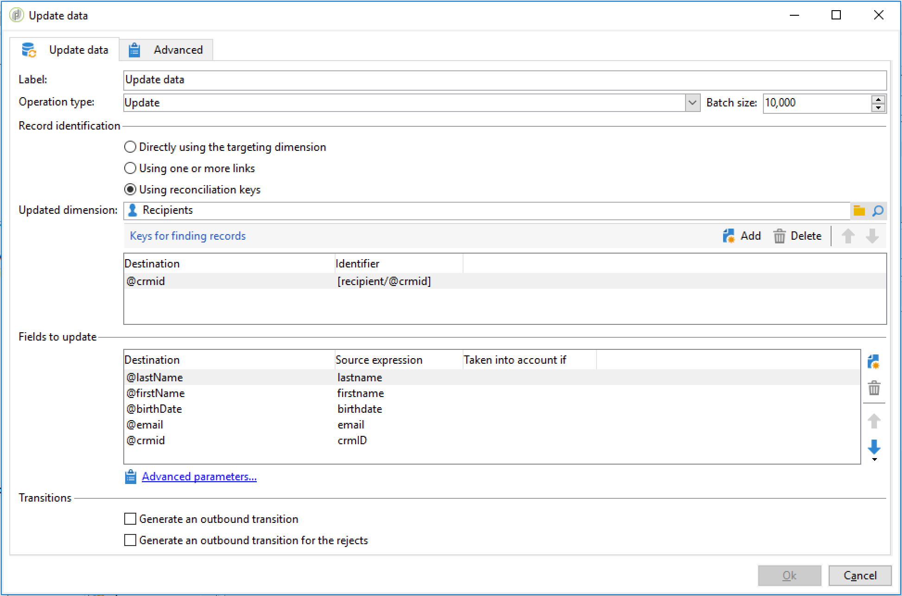

# 繰り返し発生するインポートワークフローの設定 {#setting-up-a-recurring-import}


同じ構造のファイルを定期的にインポートする必要がある場合は、ワークフローテンプレートを使用することをお勧めします。

この例では、Adobe Campaign データベースの CRM からのプロファイルのインポートに再利用できるワークフローを事前設定する方法を示します。各アクティビティで使用できるすべての設定について詳しくは、この[節](activities.md)を参照してください。

1. **[!UICONTROL リソース／テンプレート／ワークフローテンプレート]**&#x200B;から、新しいワークフローテンプレートを作成します。
1. 次のアクティビティを追加します。

   * **[!UICONTROL データ読み込み (ファイル)]**：インポートするデータが含まれるファイルに求められる構造を定義します。
   * **[!UICONTROL エンリッチメント]**：インポートされたデータをデータベースのデータに紐付けします。
   * **[!UICONTROL 分割]**：フィルターを作成して、紐付けできたかどうかによって別々にレコードを処理します。
   * **[!UICONTROL 重複排除]**：データベースに挿入される前に、受信ファイルのデータを重複排除します。
   * **[!UICONTROL データを更新]**：データベースをインポートされたプロファイルで更新します。

   

1. 「**[!UICONTROL データ読み込み（ファイル）]**」アクティビティを設定：

   * サンプルファイルをアップロードすることで、求められる構造を定義します。サンプルファイルには、インポートに必要なすべての列と、いくつかの行のみが含まれている必要があります。ファイルフォーマットをチェックおよび編集して、各列のタイプが正しく設定されていることを確認します（テキスト、日付、整数など）。次に例を示します。

      ```
      lastname;firstname;birthdate;email;crmID
      Smith;Hayden;23/05/1989;hayden.smith@mailtest.com;123456
      ```

   * 「**[!UICONTROL 読み込むファイル名]**」セクションで、「**[!UICONTROL ローカルマシンからファイルをアップロード]**」を選択して、フィールドを空のままにします。このテンプレートから新しいワークフローを作成するたびに、ここで、定義された構造に対応するファイルを指定できます。

      任意のオプションを使用できますが、それに応じてテンプレートを修正する必要があります。例えば、「**[!UICONTROL トランジションで指定]**」を選択する場合、FTP／SFTP サーバーからインポートするファイルを取得する前に、「**[!UICONTROL ファイル転送]**」アクティビティを追加できます。S3 または SFTP 接続を使用すると、アドビのリアルタイムカスタマーデータプラットフォーム（CDP）でセグメントデータを Adobe Campaign にインポートすることもできます。詳しくは、この[ドキュメント](https://experienceleague.adobe.com/docs/experience-platform/destinations/catalog/email-marketing/adobe-campaign.html?lang=ja)を参照してください。

      

1. 「**[!UICONTROL エンリッチメント]**」アクティビティを設定します。ここでのこのアクティビティの目的は、受信データを識別することです。

   * 「**[!UICONTROL エンリッチメント]**」タブで、「**[!UICONTROL データを追加]**」を選択し、インポートされたデータと受信者ターゲティングディメンションの間のリンクを定義します。この例では、結合条件の作成に **CRM ID** カスタムフィールドが使用されています。一意のレコードを識別できる限り、必要なフィールドまたはフィールドの組み合わせを使用します。
   * 「**[!UICONTROL 紐付け]**」タブで、「**[!UICONTROL 作業データからドキュメントを識別]**」オプションを未チェックのままにします。

   

1. 「**[!UICONTROL 分割]**」アクティビティを設定して、あるトランジションで紐付けされた受信者を取得し、2 番目のトランジションで紐付けされていないが十分なデータを持っている受信者を取得します。

   紐付けされた受信者を含むトランジションは、データベースを更新するために使用できます。不明な受信者を含むトランジションは、ファイルで最小限の情報が利用できる場合、データベースに新しい受信者エントリを作成するために使用できます。

   紐付けできず、十分なデータを持たない受信者は、補集合アウトバウンドトランジションで選択され、別のファイルにエクスポートしたり、単純に無視したりできます。

   * アクティビティの「**[!UICONTROL 一般]**」タブで、フィルタリング設定として「**[!UICONTROL 追加データのみを使用]**」を選択して、「**[!UICONTROL ターゲティングディメンション]**」が「**[!UICONTROL エンリッチメント]**」に自動的に設定されていることを確認します。

      「**[!UICONTROL 補集合を生成]**」オプションをチェックして、データベースにレコードを挿入できないかどうかを確認できるようにします。必要に応じて、補完データのさらなる処理（ファイルエクスポート、リスト更新など）を適用できます。

   * 「**[!UICONTROL サブセット]**」タブの最初のサブセットで、インバウンド母集団のフィルタリング条件を追加して、受信者プライマリキーが 0 に等しくないレコードのみを選択します。この方法では、データベースの受信者に紐付けされたファイルのデータがそのサブセットで選択されます。

      

   * データベースに挿入される十分なデータを持つ紐付けられていないレコードを選択する 2 番目のサブセットを追加します（例：E メールアドレス、姓名）。

      サブセットは、作成順に処理されます。つまり、2 番目のサブセットが処理されるときに、データベースに既に存在するすべてのレコードは最初のサブセットで既に選択されています。

      

   * 最初の 2 つのサブセットで選択されていないすべてのレコードは、**[!UICONTROL 補集合]**&#x200B;で選択されます。

1. 以前設定した「**[!UICONTROL 分割]**」アクティビティの最初のアウトバウンドトランジションの後にある「**[!UICONTROL データを更新]**」アクティビティを設定します。

   * インバウンドトランジションのみがデータベースに既に存在する受信者を含むので、「**[!UICONTROL 操作タイプ]**」として「**[!UICONTROL 更新]**」を選択します。
   * 「**[!UICONTROL レコード識別]**」セクションで、「**[!UICONTROL 紐付けキーの使用]**」を選択して、ターゲティングディメンションと&#x200B;**[!UICONTROL エンリッチメント]**&#x200B;で作成したリンクの間のキーを定義します。この例では、**CRM ID** カスタムフィールドが使用されています。
   * 「**[!UICONTROL 更新するフィールド]**」セクションで、ファイルの対応する列の値で更新する受信者ディメンションのフィールドを指定します。ファイル列の名前が受信者ディメンションフィールドの名前と同一またはほとんど同じ場合、自動選択ボタンを使用して、異なるフィールドを自動的に一致させることができます。

      

1. 紐付けられていない受信者を含むトランジションの後にある「**[!UICONTROL 重複排除]**」アクティビティを設定します。

   * 「**[!UICONTROL 設定を編集]**」を選択し、ワークフローの「**[!UICONTROL エンリッチメント]**」アクティビティから生成された一時スキーマにターゲティングディメンションを設定します。

      

   * この例では、一意のプロファイルを見つけるために、E メールフィールドが使用されています。入力されていることがわかっており、一意の組み合わせを構成する任意のフィールドを使用できます。
   * **[!UICONTROL 重複排除方法]**&#x200B;画面で、「**[!UICONTROL 詳細設定パラメーター]**」を選択し、「**[!UICONTROL 0 ID レコードの自動フィルターを無効にする]**」オプションをチェックして、0 に等しいプライマリキーを持つレコード（このトランジションのすべてのレコードである必要がある）が除外されないことを確認します。

   

1. 以前設定した「**[!UICONTROL 重複排除]**」アクティビティの後にある「**[!UICONTROL データを更新]**」アクティビティを設定します。

   * インバウンドトランジションのみがデータベースに存在しない受信者を含むので、「**[!UICONTROL 操作タイプ]**」では「**[!UICONTROL 挿入]**」を選択します。
   * 「**[!UICONTROL レコード識別]**」セクションで、「**[!UICONTROL 直接のターゲティングディメンションの使用]**」を選択して、**[!UICONTROL 受信者]**&#x200B;ディメンションを選択します。
   * 「**[!UICONTROL 更新するフィールド]**」セクションで、ファイルの対応する列の値で更新する受信者ディメンションのフィールドを指定します。ファイル列の名前が受信者ディメンションフィールドの名前と同一またはほとんど同じ場合、自動選択ボタンを使用して、異なるフィールドを自動的に一致させることができます。

      

1. データベースに挿入されていないデータをトラッキングする場合、「**[!UICONTROL 分割]**」アクティビティの 3 番目のトランジションの後に、「**[!UICONTROL データ抽出（ファイル）]**」アクティビティおよび「**[!UICONTROL ファイル転送]**」アクティビティを追加します。これらのアクティビティを設定して、必要な列をエクスポートし、ファイルを取得可能な FTP または SFTP サーバーにファイルを転送します。
1. 「**[!UICONTROL 終了]**」アクティビティを追加し、ワークフローテンプレートを保存します。

これで、テンプレートが使用できるようになり、すべての新規ワークフローに利用できます。必要な操作は、「**[!UICONTROL データ読み込み（ファイル）]**」アクティビティにインポートするデータを含むファイルを指定することです。


