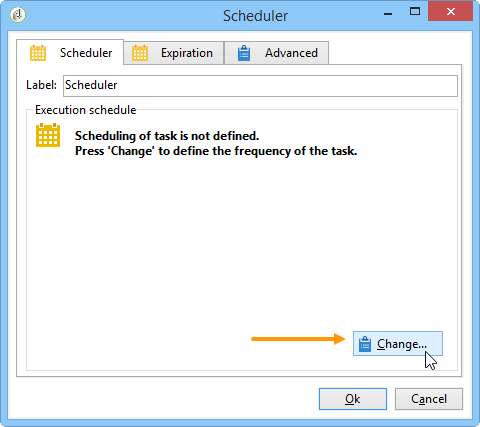

# スケジューラー {#scheduler}

**スケジューラー**&#x200B;は、スケジュールで指定された時間にトランジションを有効化する永続的なタスクです。

「**[!UICONTROL スケジューラー]**」アクティビティは、予約済みの開始とみなされます。アクティビティのグラフ内の配置ルールは、「**[!UICONTROL 開始]**」アクティビティのルールと同じものです。このアクティビティはインバウンドトランジションを持つことはできません。

## ベストプラクティス {#best-practices}

* システム全体のパフォーマンスが落ちたり、データベースにブロックが作成されたりする可能性があるので、ワークフローの実行スケジュールは 15 分以上の間隔を空けてください。

* ワークフロー内のブランチごとに複数の&#x200B;**[!UICONTROL スケジューラー]**&#x200B;アクティビティを使用しないでください。[アクティビティの使用](workflow-best-practices.md#using-activities)を参照してください。

* スケジューラーアクティビティを使用すると、同時に複数のワークフローが実行される場合があります。例えば、1 時間ごとにワークフローの実行をトリガーするようにスケジューラーを設定できますが、ワークフロー全体の実行に 1 時間以上かかる場合があります。

   ワークフローが既に実行中の場合、実行をスキップしたいことがあります。ワークフローの同時実行を防ぐ方法について詳しくは、[このページ](monitor-workflow-execution.md#preventing-simultaneous-multiple-executions)を参照してください。

* なお、ワークフローがインポートなどの長期タスクを実行している場合、または wfserver が当分の間停止している場合は、トランジションを数時間後に有効化することができます。この場合、スケジューラーによって有効化されるタスクの実行の制限が一定期間必要になることがあります。

## 「スケジューラー」アクティビティの設定  {#configuring-scheduler-activity}

スケジューラーは、トランジションの有効化スケジュールを定義します。設定するには、グラフィックオブジェクトをダブルクリックして、「**[!UICONTROL 変更...]**」をクリックします。

ウィザードを使用して、アクティビティの頻度と有効期限を定義できます。設定手順は、以下のとおりです。

1. 有効化の頻度を選択し、「**[!UICONTROL 次へ]**」をクリックします。

   

1. 有効化する時間と曜日を指定します。この手順のパラメーターは、前の手順で選択した頻度によって決まります。アクティビティを 1 日に何度も起動するように選択した場合、設定は以下のようになります。

   

1. スケジュールの有効期限を定義するか、実行回数を指定します。

   

1. 設定を確認して、「**[!UICONTROL 完了]**」をクリックして保存します。

   
