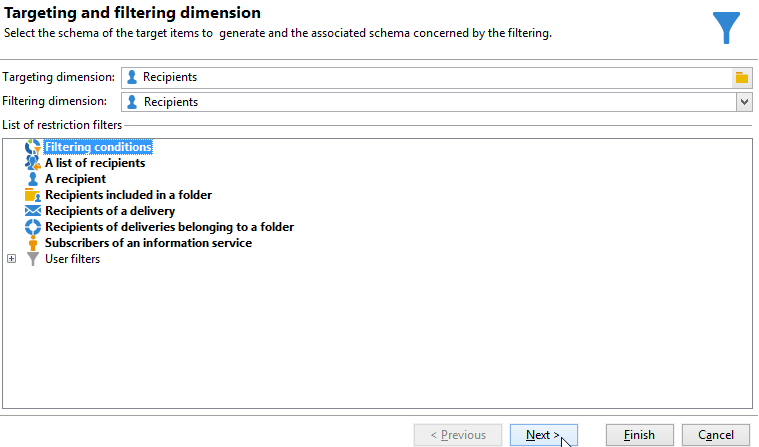
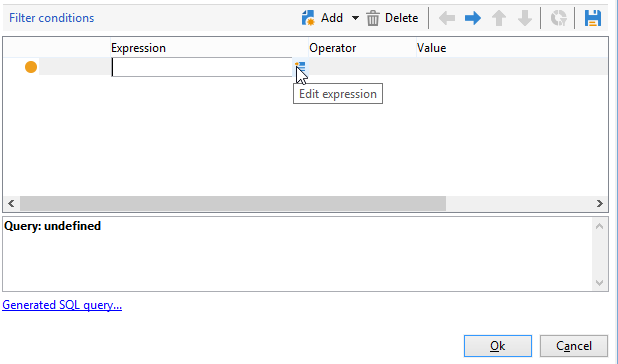
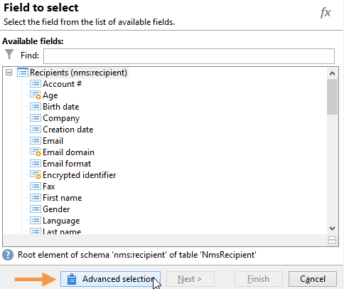
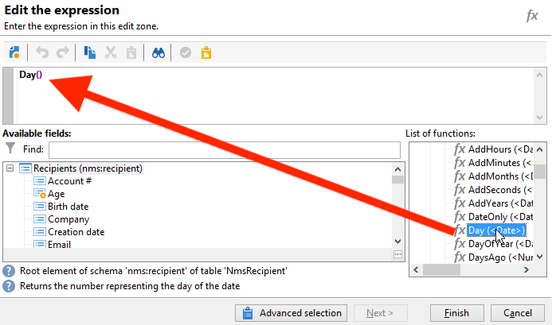
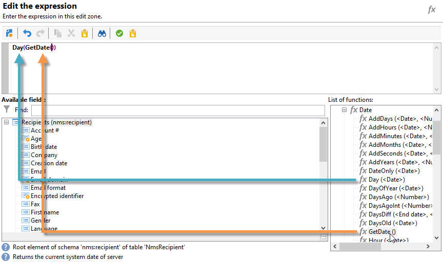
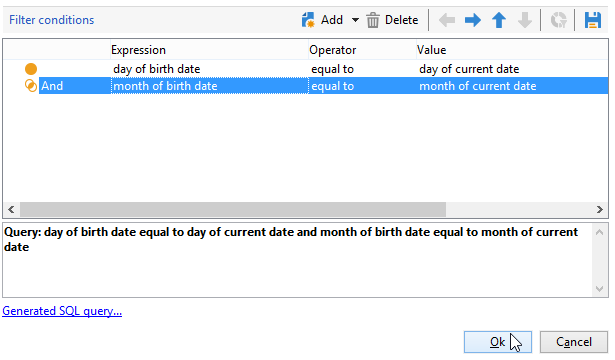
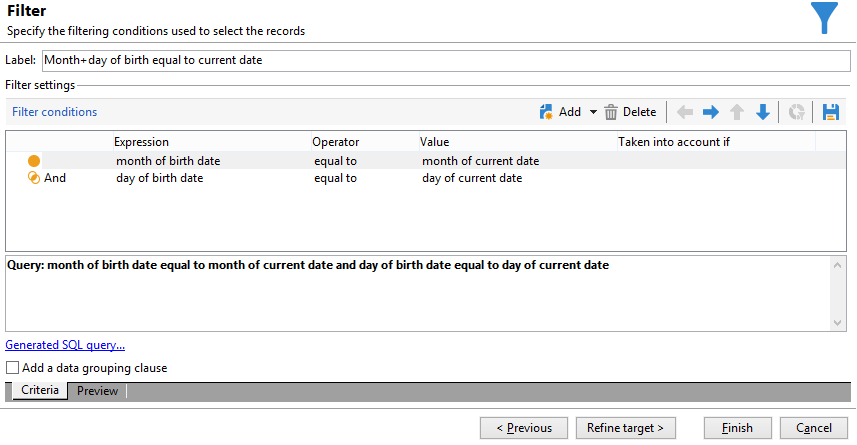
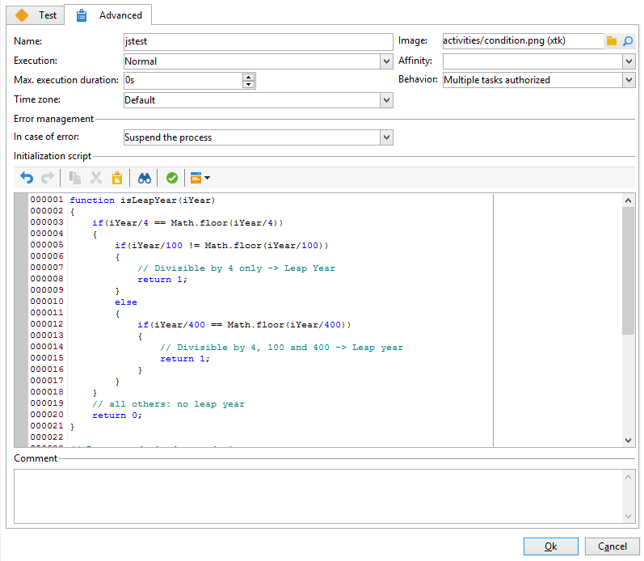
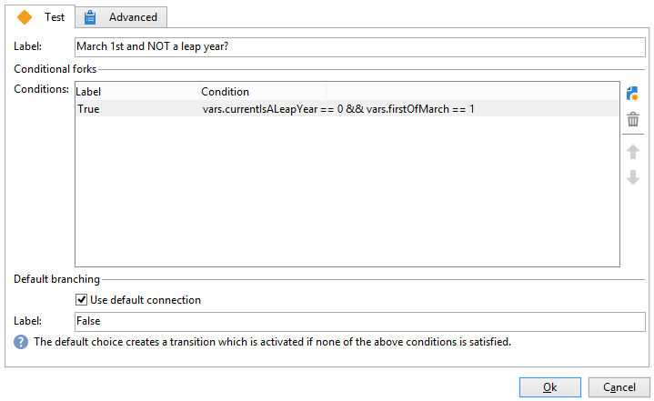
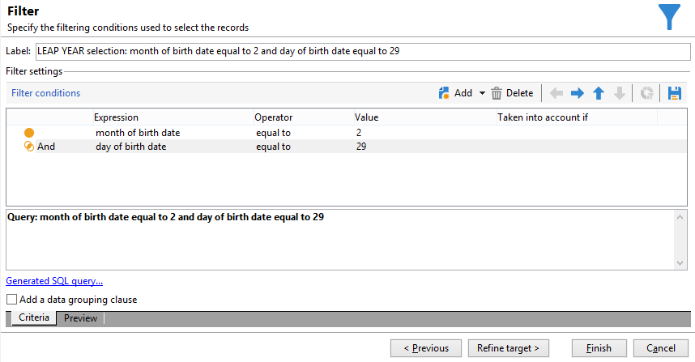

# 誕生日メールの送信{#sending-a-birthday-email}

この使用例では、リスト内の受信者に対し誕生日に繰り返し E メールを送信する方法を説明します。

この使用例を設定するうえで、以下のターゲティングワークフローを作成しました。


この（日々実行される）ワークフローでは、現在の日付が誕生日であるすべての受信者を選択します。

これをおこなうには、キャンペーンを作成し、 [キャンペーンワークフロー](campaign-workflows.md).

次に、以下に示す手順に従います。

## その日が誕生日の受信者を特定します {#identifying-recipients-whose-birthday-it-is}

ワークフローが毎日起動するように「**[!UICONTROL スケジューラー]**」アクティビティを設定したら、誕生日が現在の日付の受信者をすべて特定します。

それには、次の手順に従います。

1. ワークフローに「**[!UICONTROL クエリ]**」アクティビティをドラッグ＆ドロップし、ダブルクリックします。
1. 「**クエリを編集**」リンクをクリックし、「**[!UICONTROL フィルター条件]**」を選択します。

   

1. 「**[!UICONTROL 式]**」列の最初のセルをクリックし、**[!UICONTROL 式を編集]**&#x200B;をクリックして式エディターを開きます。

   

1. 「**[!UICONTROL 詳細選択]**」をクリックして、フィルターモードを選択します。

   

1. 「**[!UICONTROL 式を使用して数式を編集]**」を選択し、「**[!UICONTROL 次へ]**」をクリックして式エディターを表示します。
1. 関数のリストで、「**[!UICONTROL 日付]**」ノードからアクセスできる「**[!UICONTROL 日]**」をダブルクリックします。この関数は、パラメーターとして渡された日付に対応する日を表す数値を返します。

   

1. 使用可能フィールドのリストで、「**[!UICONTROL 生年月日]**」をダブルクリックします。エディターの上部セクションに、次の数式が表示されます。

   ```
   Day(@birthDate)
   ```

   「**[!UICONTROL 完了]**」をクリックして確定します。

1. クエリエディターで、「**[!UICONTROL 演算子]**」列の最初のセルで「**[!UICONTROL 次と等しい]**」を選択します。

   

1. 次に、2 番目の列（「**[!UICONTROL 値]**」）の最初のセルをクリックし、**[!UICONTROL 式を編集]**&#x200B;をクリックして式エディターを開きます。
1. 関数のリストで、「**[!UICONTROL 日付]**」ノードからアクセスできる「**[!UICONTROL 日]**」をダブルクリックします。
1. 「**[!UICONTROL GetDate]**」関数をダブルクリックして現在の日付を取得します。

   

   エディターの上部セクションに、次の数式が表示されます。

   ```
   Day(GetDate())
   ```

   「**[!UICONTROL 完了]**」をクリックして確定します。

1. この手順を繰り返して、現在の月に対応する誕生月を取得します。それには、「**[!UICONTROL 追加]**」をクリックし、「**[!UICONTROL Day]**」を「**[!UICONTROL Month]**」に置き換えて手順 3 から 10 を繰り返します。

   完成したクエリは次のようになります。

   

「**[!UICONTROL クエリ]**」アクティビティの結果を、「**[!UICONTROL E メール配信]**」アクティビティにリンクし、リストに記載されている受信者全員に誕生日の E メールを送信します。

## 2 月 29 日生まれの受信者を含める（オプション） {#including-recipients-born-on-february-29th--optional-}

2 月 29 日に生まれた受信者全員を含めたい場合、この使用例では、閏年かどうかに関わらず、リスト内の受信者に対し、誕生日に繰り返し E メールを送信する方法を示します。

この使用例の主な実装手順は次のとおりです。

* 受信者の選択
* 閏年であるかどうかを選択
* 2 月 29 日生まれの受信者をすべて選択

この使用例を設定するうえで、以下のターゲティングワークフローを作成しました。


現在の年が&#x200B;**閏年でなく**、ワークフローが 3 月 1 日に実行された場合、2 月 29 日が誕生日の受信者すべてを選択して、受信者のリストに追加する必要があります。その他の場合については追加のアクションは不要です。

### 手順 1:受信者を選択 {#step-1--selecting-the-recipients}

ワークフローが毎日起動するよう「**[!UICONTROL スケジューラー]**」アクティビティを設定したら、現在の日付が誕生日の受信者をすべて特定します。

>[!NOTE]
>
>今年が閏年の場合、2 月 29 日生まれの受信者すべてが自動的に対象になります。



現在の日付に対応する誕生日を持つ受信者の選択については、[その日が誕生日の受信者の識別](#identifying-recipients-whose-birthday-it-is)の節で説明しています。

### 手順 2：閏年かどうかの選択 {#step-2--select-whether-or-not-it-is-a-leap-year}

「**[!UICONTROL テスト]**」アクティビティでは、今年が閏年であるかどうか、また現在の日付が 3 月 1 日であるかどうかの確認ができます。

テストの結果、今年が閏年ではなくて 2 月 29 日は存在せず、さらに現在の日付が 3 月 1 日である場合、「**[!UICONTROL TRUE]**」トランザクションが有効になり、2 月 29 日生まれの受信者が 3 月 1 日の配信に追加されます。そうでない場合は、「**[!UICONTROL False]**」トランザクションが有効になり、3 月 1 日生まれの受信者だけが配信を受け取ります。

以下のコードを「**[!UICONTROL 詳細設定]**」タブの「**[!UICONTROL 初期化スクリプト]**」セクションにコピー＆ペーストします。

```
function isLeapYear(iYear)
{
    if(iYear/4 == Math.floor(iYear/4))
    {
        if(iYear/100 != Math.floor(iYear/100))
        {
            // Divisible by 4 only -> Leap Year
            return 1;
        }
        else
        {
            if(iYear/400 == Math.floor(iYear/400))
            {
                // Divisible by 4, 100 and 400 -> Leap year
                return 1;
            }
        }
    }
    // all others: no leap year
    return 0;
}

// Return today's date and time
var currentTime = new Date()
// returns the month (from 0 to 11)
var month = currentTime.getMonth() + 1
// returns the day of the month (from 1 to 31)
var day = currentTime.getDate()
// returns the year (four digits)
var year = currentTime.getFullYear()

// is current year a leap year?
vars.currentIsALeapYear = isLeapYear(year);

// is current date the first of march?
if(month == 3 && day == 1) {
  // today is 1st of march
vars.firstOfMarch = 1;
}
```



「**[!UICONTROL 条件付き分岐]**」セクションで以下の条件を追加します。

```
vars.currentIsALeapYear == 0 && vars.firstOfMarch == 1
```



### 手順 3：2 月 29 日生まれの全受信者の選択 {#step-3--select-any-recipients-born-on-february-29th}

**[!UICONTROL 分岐]**&#x200B;アクティビティを作成し、アウトバウンドトランジションの 1 つを&#x200B;**[!UICONTROL クエリ]**&#x200B;アクティビティとリンクします。

このクエリで、誕生日が 2 月 29 日の受信者すべてを選択します。



得られた結果を「**[!UICONTROL 和集合]**」アクティビティと結合します。

2 つの「**[!UICONTROL テスト]**」アクティビティ分岐の結果を「**[!UICONTROL E メール配信]**」アクティビティとリンクして、リストに記載のすべての受信者に対し、誕生日の E メールを送信します。2 月 29 日が誕生日の受信者には、閏年でない年にも E メールが送信されます。

## 繰り返し配信の作成 {#creating-a-recurring-delivery-in-a-targeting-workflow}

送信する誕生日メールテンプレートに基づいて、「**繰り返し配信**」アクティビティを追加します。

>[!CAUTION]
>
>ワークフローを実行するには、キャンペーンパッケージに関するテクニカルワークフローを開始する必要があります。詳しくは、[テクニカルワークフローのリスト](technical-workflows.md)の節を参照してください。
>
>キャンペーンに対して承認手順が有効になっている場合は、これらの手順が確認された後でのみ配信されます。詳しくは、を参照してください。


