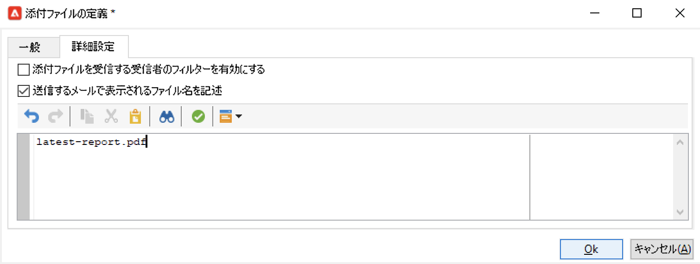

# リストへのレポートの送信{#send-a-report-to-a-list}

この使用例では、標準の月次「**[!UICONTROL トラッキング指標]**」レポートを PDF 形式で作成する方法と、そのレポートをリストに記載の受信者に送信する方法を詳しく説明します。


この使用例の主な実装手順は次のとおりです。

* このレポートの受信者のリストを作成します。 [詳細情報](#step-1--create-the-recipient-list)。
* ワークフローを実行するたびに新しい配信を作成する配信テンプレートを作成します。 [詳細情報](#step-2--create-the-delivery-template)。
* ワークフローを作成し、PDF形式でレポートを生成し、受信者のリストに送信します。 [詳細情報](#step-3--create-the-workflow)）。

## 手順 1:受信者リストの作成 {#step-1--create-the-recipient-list}

ターゲット受信者のリストを作成するには、次の手順に従います。

1. 次を参照： **[!UICONTROL プロファイルとターゲット]** タブで、 **[!UICONTROL リスト]** リンク。
1. 「**[!UICONTROL 作成]**」ボタンをクリックします。
1. 「**[!UICONTROL 新しいリスト]**」を選択し、レポートの送信先とする受信者のリストを新たに作成します。

リストの作成について詳しくは、 [この節](../../v8/audiences/create-audiences.md).

## 手順 2:配信テンプレートの作成 {#step-2--create-the-delivery-template}

配信テンプレートを作成するには、次の手順に従います。

1. 次を参照： **[!UICONTROL リソース/テンプレート/配信テンプレート]** Adobe Campaignエクスプローラーのノードに移動し、 **[!UICONTROL E メール配信]** 組み込みテンプレート。

   配信テンプレートの作成について詳しくは、 [この節](../../v8/send/create-templates.md).

1. テンプレートパラメーターを入力します。ラベル、ターゲット（以前に作成した受信者のリスト）、件名、コンテンツ。

   ワークフローが実行されるたびに、 **[!UICONTROL トラッキング指標]** レポートは、 [手順 3:ワークフローの作成](#step-3--creating-the-workflow)) をクリックします。

1. 配信に最新のレポートを含めるには、以下の手順で、**[!UICONTROL 計算による添付ファイル]**&#x200B;を追加する必要があります。

   * 次をクリック： **[!UICONTROL 添付ファイル]** リンクをクリックし、 **[!UICONTROL 追加]** 」ボタンをクリックします。 選択 **[!UICONTROL 計算済み添付ファイル…]**.

      

   * 内 **[!UICONTROL タイプ]** ドロップダウンリストから、最新のオプションを選択します。 **[!UICONTROL 各メッセージの配信中にファイル名を生成（受信者プロファイルを利用可）]**.

      

      「**[!UICONTROL ラベル]**」フィールドに入力された値は、最終の配信では表示されません。

   * テキストゾーンに、アクセスパスとファイルの名前を入力します。

      

      >[!CAUTION]
      >
      >パスと名前は、 **[!UICONTROL JavaScript コード]** ワークフローの「 」アクティビティを入力します。詳しくは、 [手順 3:ワークフローの作成](#step-3--creating-the-workflow).

   * 「**[!UICONTROL 詳細設定]**」タブを選択し、「**[!UICONTROL 送信するメールで表示されるファイル名を記述]**」チェックボックスをオンにします。テキストゾーンに、最終の配信で使用する添付ファイルの名前を入力します。

      

## 手順 3:ワークフローの作成 {#step-3--creating-the-workflow}

この使用例で使用するワークフローを次のように作成します。


次の 3 つのアクティビティを使用します。

* A **[!UICONTROL スケジューラ]** 月に 1 回、ワークフローを実行する「 」アクティビティ
* A **[!UICONTROL JavaScript コード]** 「PDF」形式のレポートを生成するアクティビティ
* A **[!UICONTROL 配信]** 前に作成した配信テンプレートを参照するアクティビティ。

このワークフローを構築するには、次の手順に従います。

1. 次を参照： **[!UICONTROL 管理/プロダクション/テクニカルワークフロー]** Campaign エクスプローラーのノードを作成し、ワークフローを保存する新しいフォルダーを作成します。
1. 新しいワークフローを作成します。

   

1. まず、「**[!UICONTROL スケジューラー]**」タイプアクティビティを追加し、月の最初の月曜日にワークフローが実行されるようアクティビティを設定します。

   

   スケジューラーの設定について詳しくは、[スケジューラー](scheduler.md)を参照してください。

1. 次に、「**[!UICONTROL JavaScript コード]**」タイプアクティビティを追加します。

   

   編集ゾーンで次のコードを入力します。

   ```sql
   var reportName = "indicators";
   var path = "/tmp/indicators.pdf";
   var exportFormat = "PDF";
   var reportURL = "<PUT THE URL OF THE REPORT HERE>";
   var _ctx = <ctx _context="global" _reportContext="deliveryFeedback" />
   var isAdhoc = 0;
   
   xtk.report.export(reportName, _ctx, exportFormat, path, isAdhoc);
   ```


   を次の変数に置き換えます。

   * **var reportName**：ダブルコーテーションで囲い、レポートの内部名を入力します。このケースでは、「**トラッキング指標**」レポートの内部名は「deliveryFeedback」になります。
   * **var パス**:ファイルの保存パス (「tmp」)、ファイルに与える名前 (「deliveryFeedback」)、ファイルの拡張子 (「.pdf」) を入力します。 このケースでは、ファイル名に内部名を使用します。それぞれの値は、ダブルコーテーションで囲い、「+」の文字で区切る必要があります。

      >[!CAUTION]
      >
      >ファイルはサーバー上に保存されている必要があります。同じパスと同じ名前を **[!UICONTROL 一般]** 計算済み添付ファイルの編集ウィンドウのタブ（詳細） [ここ](#step-2--create-the-delivery-template)) をクリックします。

   * **var exportFormat**：ファイルのエクスポートフォーマット（「PDF」）を入力します。
   * **var _ctx**（コンテキスト）：このケースでは、グローバルコンテキストに「**[!UICONTROL トラッキング指標]**」レポートを使用します。

1. を追加して完了 **[!UICONTROL 配信]** 「 」アクティビティに次のオプションが含まれています。

   

   * **[!UICONTROL 配信]**：「**[!UICONTROL 新規（テンプレートから作成）]**」を選択し、前に作成した配信テンプレートを選択します。
   * 「**[!UICONTROL 受信者]**」フィールドと「**[!UICONTROL コンテンツ]**」フィールドで「**[!UICONTROL 配信で指定]**」を選択します。
   * **[!UICONTROL 実行するアクション]**:選択 **[!UICONTROL 準備と開始]**.
   * をオフにします。 **[!UICONTROL アウトバウンドトランジションを生成]** および **[!UICONTROL エラーを処理]** オプション。

1. 変更を保存し、ワークフローを開始します。 メッセージは毎月第 1 月曜日に受信者のリストに送信され、レポートが添付されます。