# リストへのレポートの送信{#sending-a-report-to-a-list}


この使用例では、標準の月次「**[!UICONTROL トラッキング指標]**」レポートを PDF 形式で作成する方法と、そのレポートをリストに記載の受信者に送信する方法を詳しく説明します。

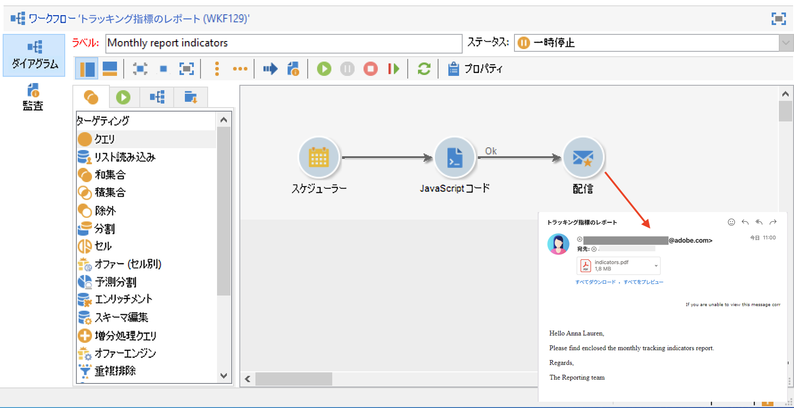

この使用例の主な実装手順は次のとおりです。

* 配信先の受信者のリストの作成（[手順 1：受信者リストの作成](#step-1--creating-the-recipient-list)を参照）。
* ワークフローが実行されるたびに新しい配信を生成できる配信テンプレートの作成（[手順 2：配信テンプレートの作成](#step-2--creating-the-delivery-template)を参照）。
* PDF 形式のレポートを生成してリストに記載の受信者に送信可能なワークフローの作成（[手順 3：ワークフローの作成](#step-3--creating-the-workflow)を参照）。

## 手順 1：受信者リストの作成 {#step-1--creating-the-recipient-list}

「**[!UICONTROL プロファイルとターゲット]**」タブに移動し、「**[!UICONTROL リスト]**」リンクをクリックしてから、「**[!UICONTROL 作成]**」ボタンをクリックします。「**[!UICONTROL 新しいリスト]**」を選択し、レポートの送信先とする受信者のリストを新たに作成します。

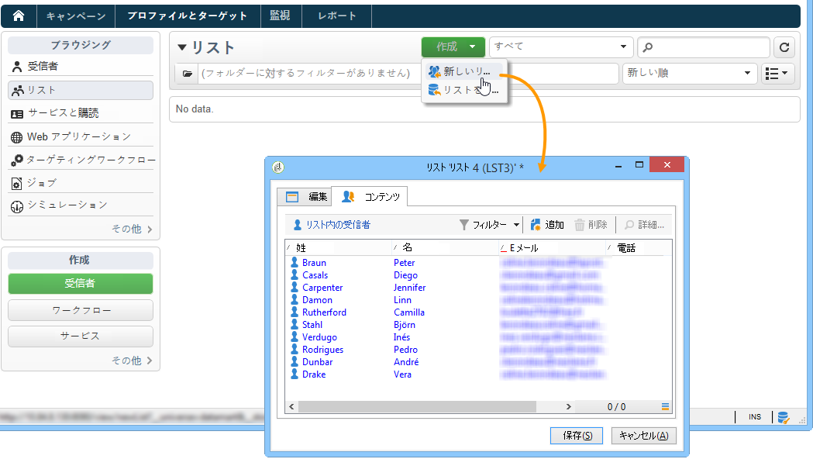

リストの作成について詳しくは、この節を参照してください。

## 手順 2：配信テンプレートの作成 {#step-2--creating-the-delivery-template}

1. Adobe Campaign エクスプローラーで、**[!UICONTROL リソース／テンプレート／配信テンプレート]**&#x200B;ノードに移動し、標準の「**[!UICONTROL E メール配信]**」テンプレートを複製します。

   

   配信テンプレートの作成について詳しくは、この節を参照してください。

1. ラベル、ターゲット（前に作成した受信者のリスト）など、各種テンプレートパラメーターのほか、件名、コンテンツを入力します。

   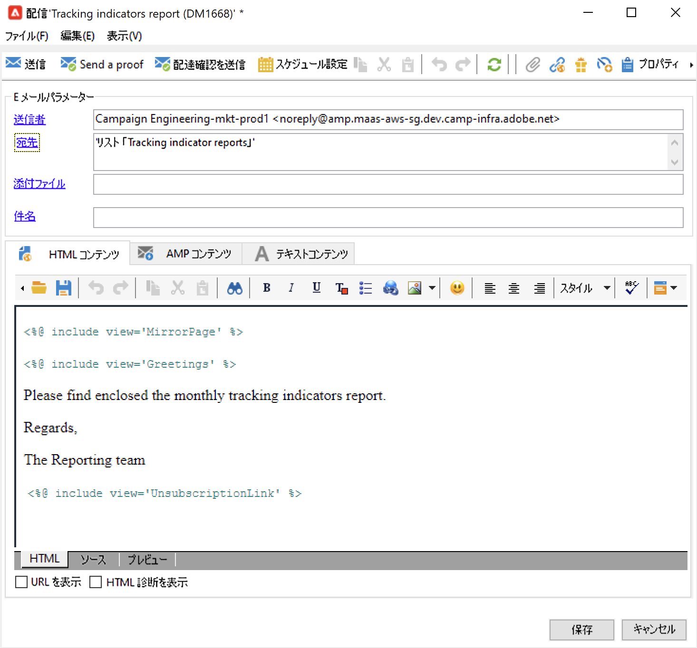

1. ワークフローが実行されるたびに、「**[!UICONTROL トラッキング指標]**」レポートが更新されます（[手順 3：ワークフローの作成](#step-3--creating-the-workflow)を参照）。配信に最新のレポートを含めるには、以下の手順で、**[!UICONTROL 計算による添付ファイル]**&#x200B;を追加する必要があります。

   計算による添付ファイルの作成について詳しくは、この節を参照してください。

   * 「**[!UICONTROL 添付ファイル]**」リンク、「**[!UICONTROL 追加]**」の順にクリックし、「**[!UICONTROL 計算による添付ファイル]**」を選択します。

      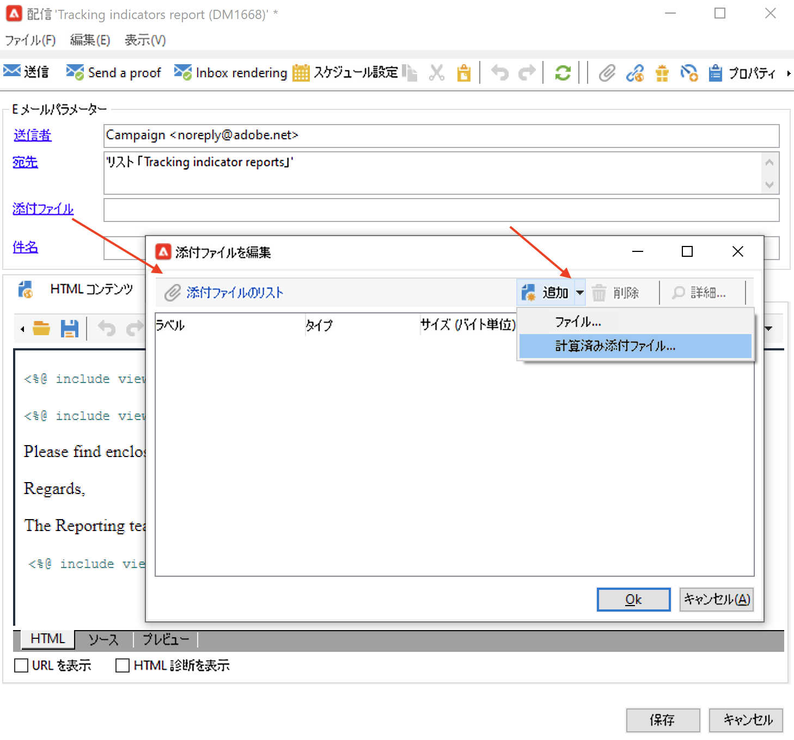

   * 「**[!UICONTROL タイプ]**」フィールドに移動して、4 つ目のオプション、「**[!UICONTROL 各メッセージの配信中にファイル名を計算する（受信者のプロファイルの利用可）]**」を選択します。

      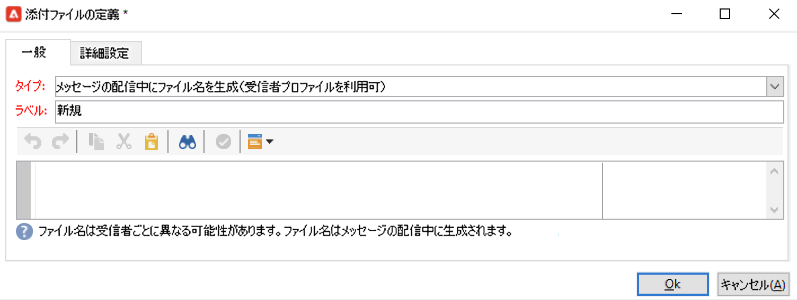

      「**[!UICONTROL ラベル]**」フィールドに入力された値は、最終の配信では表示されません。

   * 編集ゾーンに移動し、アクセスパスとファイルの名前を入力します。

      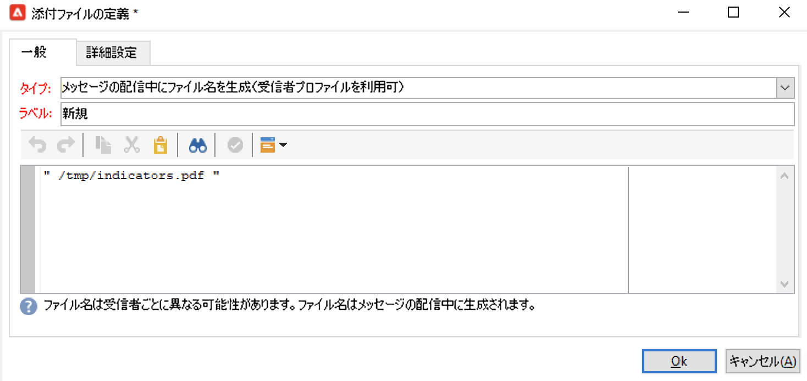

      >[!CAUTION]
      >
      >ファイルはサーバー上に置かれている必要があります。ファイルのパスと名前は、ワークフローの **[!UICONTROL JavaScript コード]**&#x200B;タイプアクティビティに入力したものと同一でなければなりません（[手順 3：ワークフローの作成](#step-3--creating-the-workflow)を参照）。

   * 「**[!UICONTROL 詳細設定]**」タブを選択し、「**[!UICONTROL 送信するメールで表示されるファイル名を記述]**」チェックボックスをオンにします。編集ゾーンに移動し、最終の配信で使用する添付ファイルの名前を入力します。

      

## 手順 3：ワークフローの作成 {#step-3--creating-the-workflow}

この使用例では、次のようなワークフローを作成しています。アクティビティは 3 つあります。

* 1 ヶ月に 1 回、ワークフローを実行する 1 つの&#x200B;**[!UICONTROL スケジューラー]**&#x200B;タイプアクティビティ
* PDF 形式のレポートを生成する 1 つの **[!UICONTROL JavaScript コード]**&#x200B;タイプアクティビティ
* 作成済みの配信テンプレートを使用する 1 つの「**[!UICONTROL 配信]**」タイプアクティビティ

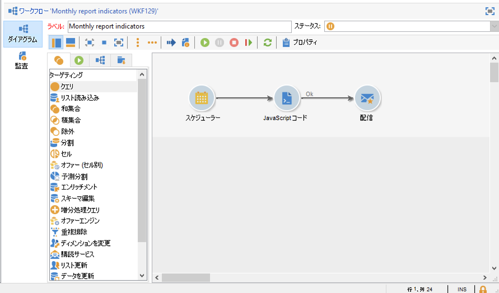

1. **[!UICONTROL 管理／プロダクション／テクニカルワークフロー]**&#x200B;の順にノードを移動し、新規のワークフローを作成します。

   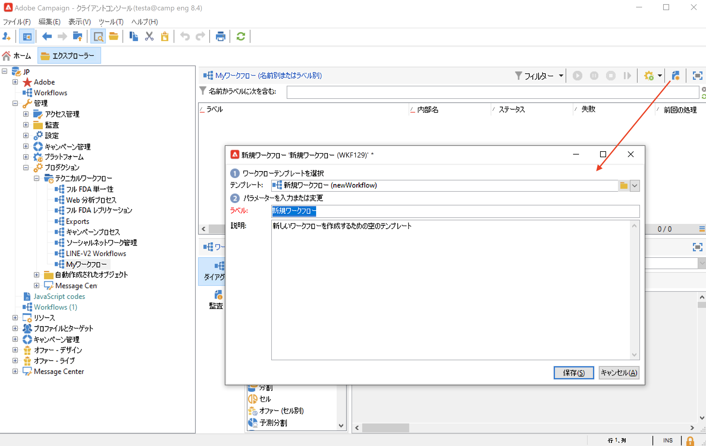

1. まず、「**[!UICONTROL スケジューラー]**」タイプアクティビティを追加し、月の最初の月曜日にワークフローが実行されるようアクティビティを設定します。

   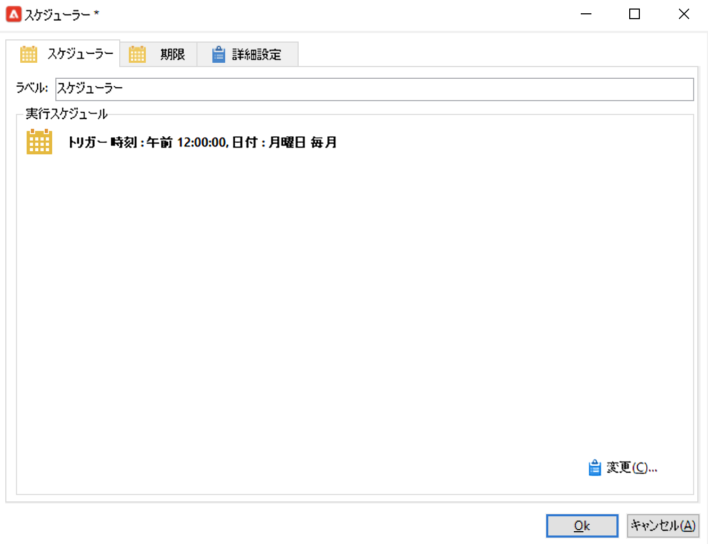

   スケジューラーの設定について詳しくは、[スケジューラー](scheduler.md)を参照してください。

1. 次に、「**[!UICONTROL JavaScript コード]**」タイプアクティビティを追加します。

   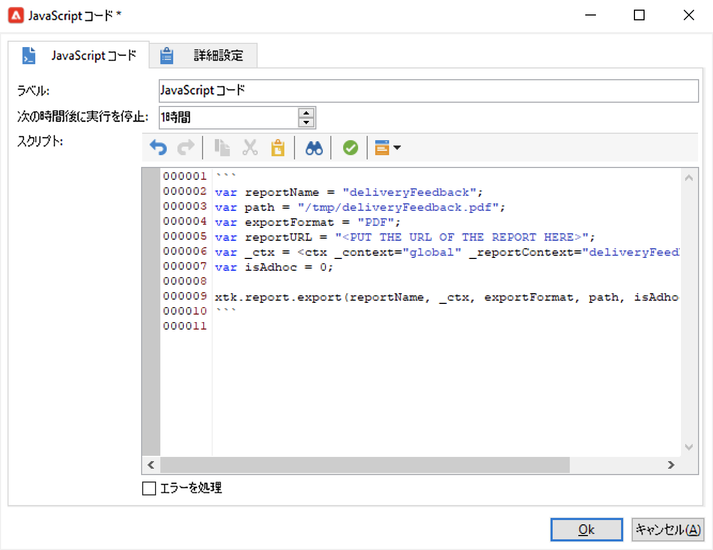

   編集ゾーンで次のコードを入力します。

   ```
   var reportName = "deliveryFeedback";
   var path = "/tmp/deliveryFeedback.pdf";
   var exportFormat = "PDF";
   var reportURL = "<PUT THE URL OF THE REPORT HERE>";
   var _ctx = <ctx _context="global" _reportContext="deliveryFeedback" />
   var isAdhoc = 0;
   
   xtk.report.export(reportName, _ctx, exportFormat, path, isAdhoc);
   ```

   次の変数が使用されます。

   * **var reportName**：ダブルコーテーションで囲い、レポートの内部名を入力します。このケースでは、「**トラッキング指標**」レポートの内部名は「deliveryFeedback」になります。
   * **var path**：ファイルの保存先のパス（「tmp/files/」）、ファイルに付与する名前（「deliveryFeedback」）、およびファイルの拡張子（「.pdf」）を入力します。このケースでは、ファイル名に内部名を使用します。それぞれの値は、ダブルコーテーションで囲い、「+」の文字で区切る必要があります。

      >[!CAUTION]
      >
      >ファイルはサーバー上に保存されている必要があります。計算済み添付ファイルの編集ウィンドウの「**[!UICONTROL 一般]**」タブで使用するのと同じパスと名前を入力する必要があります（[手順 2：配信テンプレートの作成](#step-2--creating-the-delivery-template)を参照）。

   * **var exportFormat**：ファイルのエクスポートフォーマット（「PDF」）を入力します。
   * **var _ctx**（コンテキスト）：このケースでは、グローバルコンテキストに「**[!UICONTROL トラッキング指標]**」レポートを使用します。

1. 「**[!UICONTROL 配信]**」タイプアクティビティに以下のオプションを追加して作業を完了します。

   * **[!UICONTROL 配信]**：「**[!UICONTROL 新規（テンプレートから作成）]**」を選択し、前に作成した配信テンプレートを選択します。
   * 「**[!UICONTROL 受信者]**」フィールドと「**[!UICONTROL コンテンツ]**」フィールドで「**[!UICONTROL 配信で指定]**」を選択します。
   * **[!UICONTROL 実行するアクション]**：「**[!UICONTROL 準備と開始]**」を選択します。
   * 「**[!UICONTROL アウトバウンドトランジションを生成]**」チェックボックスと「**[!UICONTROL エラーを処理]**」チェックボックスをオフにします。
   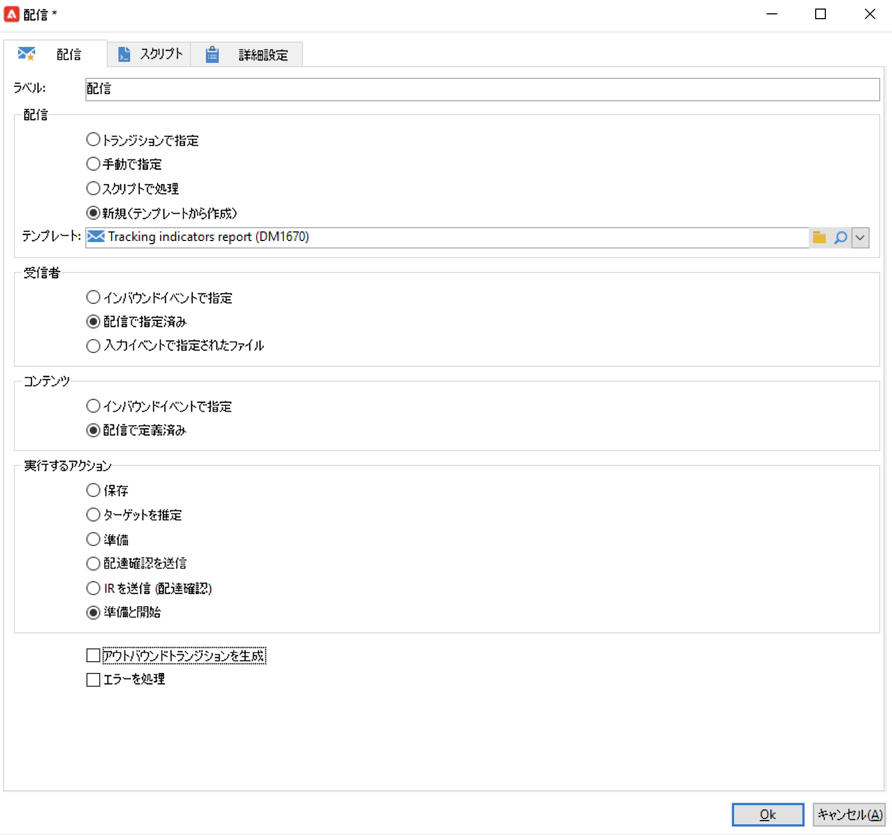
