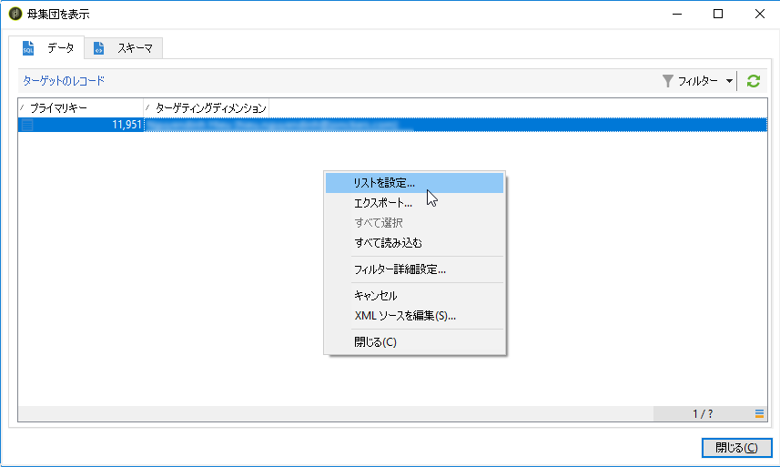
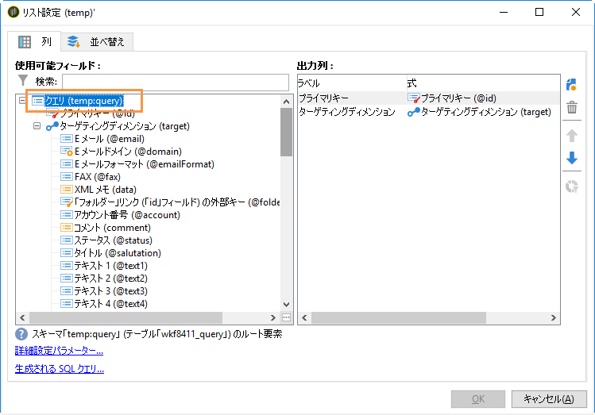
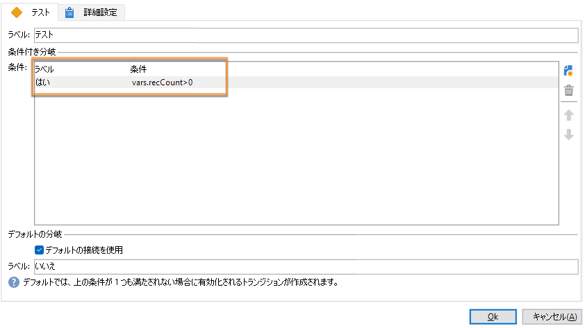
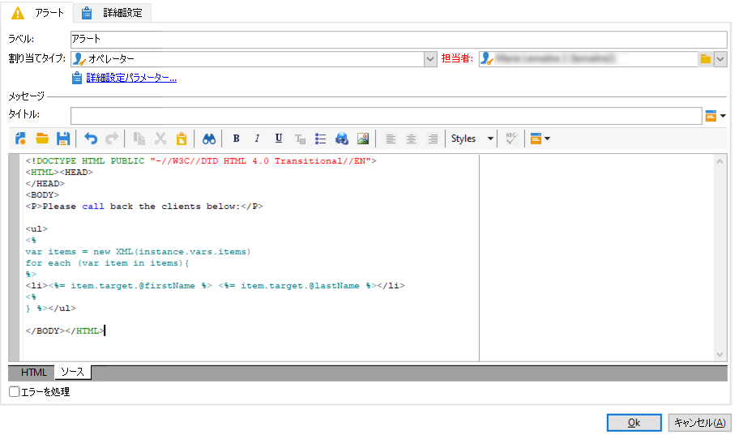

# パーソナライズされたアラートをオペレーターへ送信{#sending-personalized-alerts-to-operators}


この例では、ニュースレターを開封したがそれに含まれるリンクをクリックしなかったプロファイルの名前を記載したアラートをオペレーターに送信します。

プロファイルの氏名フィールドは&#x200B;**[!UICONTROL 受信者]**&#x200B;ターゲティングディメンションにリンクされているのに対して、**[!UICONTROL アラート]**&#x200B;アクティビティは&#x200B;**[!UICONTROL オペレーター]**&#x200B;ターゲティングディメンションにリンクされています。結果として、2 つのターゲティングディメンション間で、紐付けを実行し、氏名フィールドを取得して、アラートアクティビティに表示するのに使用できるフィールドはありません。

このプロセスでは、次のようにワークフローを構築できます。

1. **[!UICONTROL クエリ]**&#x200B;アクティビティを使用して、データをターゲットにします。
1. **[!UICONTROL JavaScript コード]**&#x200B;アクティビティをワークフローに追加して、クエリからインスタンス変数に母集団を保存します。
1. **[!UICONTROL テスト]**&#x200B;アクティビティを使用して、母集団の数を確認します。
1. **[!UICONTROL アラート]**&#x200B;アクティビティを使用して、**[!UICONTROL テスト]**&#x200B;アクティビティの結果に応じて、オペレーターにアラートを送信します。


## インスタンス変数への母集団の保存 {#saving-the-population-to-the-instance-variable}

以下のコードを **[!UICONTROL JavaScript コード]**&#x200B;アクティビティに追加します。

```
var query = xtk.queryDef.create(  
    <queryDef schema="temp:query" operation="select">  
      <select>  
       <node expr="[target/recipient.@firstName]"/>  
       <node expr="[target/recipient.@lastName]"/>  
      </select>  
     </queryDef>  
  );  
  var items = query.ExecuteQuery();
```

JavaScript コードがワークフロー情報に対応していることを確認します。

* **[!UICONTROL queryDef schema]** タグは、クエリアクティビティで使用されるターゲティングディメンションの名前に対応している必要があります。
* **[!UICONTROL node expr]** タグは、取得するフィールドの名前に対応している必要があります。


これらの情報を取得するには、以下の手順に従います。

1. 「**[!UICONTROL クエリ]**」アクティビティからのアウトバウンドトランジションを右クリックし、「**[!UICONTROL ターゲットを表示]**」を選択します。

   

1. リストを右クリックして、「**[!UICONTROL リストを設定]**」を選択します。

   

1. クエリターゲティングディメンションおよびフィールド名がリストに表示されます。

   

## 母集団数のテスト {#testing-the-population-count}

以下のコードを「**[!UICONTROL テスト]**」アクティビティに追加すると、ターゲットにした母集団が少なくとも 1 つのプロファイルを含んでいるかどうかを確認できます。

```
var.recCount>0
```



## アラートの設定 {#setting-up-the-alert}

これで、母集団が目的のフィールドを含むインスタンス変数に追加されたので、これらの情報を&#x200B;**[!UICONTROL アラート]**&#x200B;アクティビティに追加できます。

そのためには、「**[!UICONTROL ソース]**」タブに以下のコードを追加します。

```
<ul>
<%
var items = new XML(instance.vars.items)
for each (var item in items){
%>
<li><%= item.target.@firstName %> <%= item.target.@lastName %></li>
<%
} %></ul>
```

>[!NOTE]
>
>**[!UICONTROL 「&lt;%= item.target.recipient.@fieldName %>」]** コマンドを使用すると、**[!UICONTROL JavaScript コード]**&#x200B;アクティビティでインスタンス変数に保存したフィールドのいずれかを追加できます。\
>フィールドが JavaScript コードに追加されている限り、フィールドを好きな数だけ追加できます。


