# 分割{#split}

「**分割**」タイプのアクティビティはターゲットを複数のサブセットに分割します。ターゲットは、受信したすべての結果から構築されます。したがって、すべての先行アクティビティは、このアクティビティが実行される前に完了している必要があります。

このアクティビティは、インバウンド母集団の和集合をトリガーしません。複数のトランジションが、1 つの分割アクティビティに入れられる場合、その前に「**[!UICONTROL 和集合]**」アクティビティを挿入することをお勧めします。

分割アクティビティの使用例については、[この節](targeting-workflows.md#create-subsets-using-the-split-activity)を参照してください。

フィルター条件を使用してターゲットを別々の母集団にセグメント化する分割アクティビティの使用方法を示した例については、[この節](cross-channel-delivery-workflow.md)を参照してください。

分割アクティビティでのインスタンス変数の使用方法を示した例については、[この節](javascript-scripts-and-templates.md)を参照してください。

このアクティビティを設定するには、「**[!UICONTROL サブセット]**」タブでサブセットコンテンツとラベルを定義してから、「**[!UICONTROL 一般]**」タブでターゲティングディメンションを選択します。

## サブセットの作成 {#create-subsets}

サブセットを作成するには：

1. 該当するフィールド内のラベルをクリックし、適用するフィルターを選択します。
1. インバウンド母集団をフィルターするには、「**[!UICONTROL フィルター条件を追加]**」オプションを選択して、「**[!UICONTROL 編集...]**」リンクをクリックします。

   このセットに含めるデータに適用するフィルターのタイプを選択します。

   プロセスは、「**クエリ**」タイプアクティビティの場合と同じです。

   >[!NOTE]
   >
   >最大 2 個の外部データベース（FDA）のデータをフィルターできます。

1. ターゲットから抽出してサブセットを作成するレコードの最大数を指定できます。それには、「**[!UICONTROL 選択レコード数の制限]**」オプションをチェックして、「**[!UICONTROL 編集...]**」リンクをクリックします。

   ウィザードが表示されたら、このサブセットのレコードの選択モードを選択します。[詳細情報](#limit-the-number-of-subset-records)。

   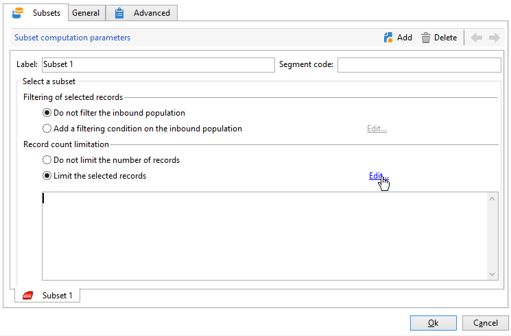

1. 必要な場合は、「**追加**」ボタンを使用して、**[!UICONTROL 他のサブセットを追加]**&#x200B;できます。

   

   >[!NOTE]
   >
   >「**[!UICONTROL 出力母集団の重複を可能にする]**」オプションが選択されていない場合、サブセットはタブの順序で作成されます。ウィンドウの右上にある矢印を使用して、タブ間を移動できます。例えば、最初のサブセットが初期母集団の 70% を取り出す場合、次のサブセットの選択条件は残りの 30% のみに適用されます。

   作成される各サブセットについて、アウトバウンドトランジションが分割アクティビティに追加されます。

   

   1 つのアウトバウンドトランジションの生成を選択することもできます（そして、セグメントコードを使用するセットを特定します）。それには、「**[!UICONTROL 一般]**」タブで「**[!UICONTROL 同じテーブルにすべてのサブセットを生成]**」を選択します。

   完了したら、各サブセットのセグメントコードは自動的に追加列に保存されます。この列は、配信レベルのパーソナライゼーションフィールドでアクセス可能です。

## サブセットレコード数の制限 {#limit-the-number-of-subset-records}

サブセット内に含まれている母集団を一部だけ使用したい場合、サブセットに含まれるレコード数を制限することができます。

1. サブセットの編集ウィンドウで、「**[!UICONTROL 選択レコード数の制限]**」オプションをチェックして、「**[!UICONTROL 編集...]**」リンクをクリックします。
1. 適用する制限タイプを選択します。

   * **[!UICONTROL ランダムサンプリングを有効化]**：レコードにランダムサンプリングを適用します。適用されるランダムサンプリングのタイプは、データベースエンジンに依存します。
   * **[!UICONTROL 並べ替えの後に最初のレコードのみ保持]**：1 つ以上の並べ替え順に基づいて、制限を定義できます。並べ替えの基準として「**[!UICONTROL 年齢]**」フィールドを選択し、しきい値として 100 を定義した場合、年齢が若いほうから 100 人の受信者が母集団に残されます。
   * **[!UICONTROL 並べ替え後の最初の項目を保持 (条件、ランダム)]**：このオプションは、前の 2 つのオプションを組み合わせます。1 つまたは複数の並べ替え順に基づいて制限を定義し、定義された条件と同じ値を含むレコードが複数ある場合、最初のレコードにランダム選択を適用できます。

      例えば、「**[!UICONTROL 年齢]**」フィールドを並べ替え基準として選択し、制限を 100 と定義したとします。データベースに 18 歳の受信者が 2,000 人見つかった場合、100 人の受信者は 2,000 人の 18 歳の中からランダムに選択されます。
   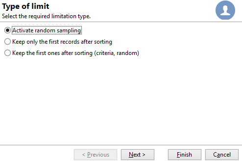

1. 並べ替え基準を定義する場合、追加の手順で、列と並べ替え順を定義することができます。

   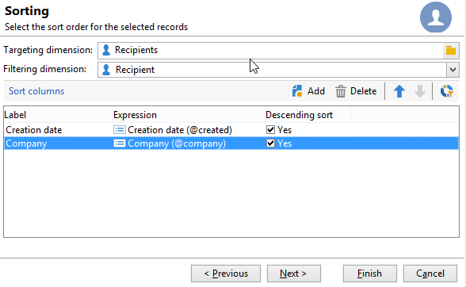

1. その後、データの制限方法を選択します。

   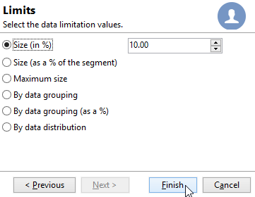

   それには、いくつかの方法があります。

   * **[!UICONTROL サイズ（%）]**：レコードの割合。例えば、以下の設定では、母集団の合計の 10% を抽出します。

      この割合は、アクティビティの結果ではなく、初期母集団に適用されます。

   * **[!UICONTROL サイズ（セグメントの %）]**：初期母集団ではなく、サブセットにのみ関連するレコードの割合。
   * **[!UICONTROL 最大サイズ]**：レコードの最大数。
   * **[!UICONTROL データグループ別]**：インバウンド母集団の指定のフィールドの値に応じて、レコード数の上限を設定できます。[詳細情報](#limit-the-number-of-subset-records-by-data-grouping)。
   * **[!UICONTROL データグループ別 (%)]**：インバウンド母集団の指定のフィールドの値に応じて、レコード数の上限をパーセント値で設定できます。[詳細情報](#limit-the-number-of-subset-records-by-data-grouping)。
   * **[!UICONTROL データ配分別]**：グループ化フィールドに含まれる値が多すぎる場合、または新規の分割アクティビティを作成するたびに値を入力したくない場合、Adobe Campaign で「**[!UICONTROL データ配分別]**」制限を設定できます（オプションの分散型マーケティングモジュールを使用）。[詳細情報](#limit-the-number-of-subset-records-per-data-distribution)。

1. 「**[!UICONTROL 完了]**」をクリックして、レコード選択の基準を承認します。定義した設定が、エディターのウィンドウの中央部分に表示されます。

## データのグループ化によるサブセットレコード数の制限 {#limit-the-number-of-subset-records-by-data-grouping}

データのグループ化により、レコードの数を制限できます。この制限は、固定値またはパーセント値を使用して実行されます。

例えば、「**[!UICONTROL 言語]**」フィールドをグループフィールドとして選択した場合、各言語のレコードのリストを定義できます。

1. データの制限値を選択した後で、「**[!UICONTROL データグループ別]**」または「**[!UICONTROL データグループ別（%）]**」を選択し、「**[!UICONTROL 次へ]**」を選択します。

   

1. 次に、グループ化フィールド（「**[!UICONTROL 言語]**」フィールドなど）を選択し、「**[!UICONTROL 次へ]**」をクリックします。

   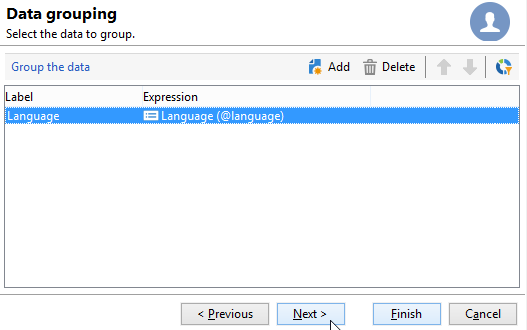

1. 最後に、データのグループ化のしきい値を指定します（以前に選択したグループ化の方法に応じて、固定値またはパーセント値を使用）。すべての値に同じしきい値を設定するには、例えば各言語のレコード数を 10 個に設定する場合、「**[!UICONTROL すべてのデータグループが同じサイズです]**」オプションを選択します。値ごとに異なる制限を設定するには、「**[!UICONTROL グループ値別の制限]**」オプションを選択します。これにより、英語やフランス語など、言語ごとに異なる制限を選択することもできます。

   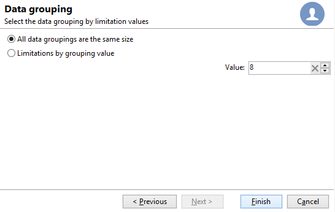

1. 「**[!UICONTROL 完了]**」をクリックして、制限を承認し、分割アクティビティの編集に戻ります。

## データ配分ごとのサブセットレコード数の制限 {#limit-the-number-of-subset-records-per-data-distribution}

グループ化フィールドに含まれる値が多すぎる場合、または新規分割アクティビティを作成するたびに値を再設定したくない場合、Adobe Campaign でデータ配分ごとに制限を設定できます。[データの制限値](#create-subsets)を選択する場合、「**[!UICONTROL データ配分別]**」オプションを選択して、ドロップダウンメニューからテンプレートを選択します。データ配分テンプレートの作成については、以降で詳しく説明します。

配分テンプレートを使用した「**[!UICONTROL ローカルの承認]**」アクティビティの例については、[このページ](local-approval-activity.md)を参照してください。

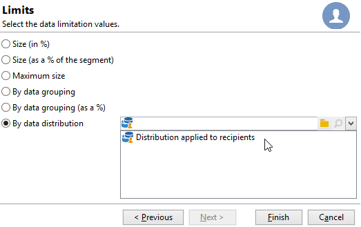

>[!CAUTION]
>
>この関数は、[分散型マーケティングアドオン](../distributed-marketing/about-distributed-marketing.md)でのみ利用できます。使用許諾契約書を確認してください。

データ配分テンプレートを使用すると、グループ値のリストを使用してレコードの数を制限できます。データ配分テンプレートを作成するには、次の手順に従います。

1. データ配分テンプレートを作成するには、**[!UICONTROL リソース／キャンペーン管理／データ配分]**&#x200B;の順にノードを移動し、「**[!UICONTROL 新規]**」をクリックします。

   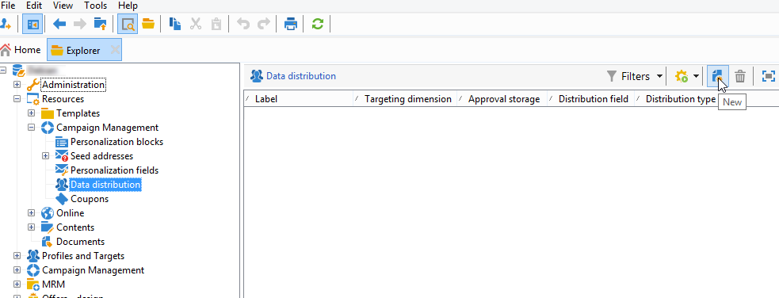

1. 「**[!UICONTROL 一般]**」タブでは、ラベルおよび配分の実行コンテキストを入力できます（ターゲティングディメンション、配分フィールド）。

   

   以下のフィールドの内容を入力する必要があります。

   * **[!UICONTROL ラベル]**：配分テンプレートのラベル。
   * **[!UICONTROL ターゲティングディメンション]**：例えば、「**[!UICONTROL 受信者]**」など、データ配分が適用されるターゲティングディメンションを入力します。このスキーマは、ターゲティングワークフローで使用されるデータとの互換性を常に維持する必要があります。
   * **[!UICONTROL 配分フィールド]**：ターゲティングディメンション経由でフィールドを選択します。例えば、「**[!UICONTROL E メールドメイン]**」フィールドを選択すると、受信者のリストはドメイン別に分類されて表示されます。
   * **[!UICONTROL 配分タイプ]**：「**[!UICONTROL 配分]**」タブでターゲットの制限値の内訳を表示する方法（**[!UICONTROL 割合]**&#x200B;または&#x200B;**[!UICONTROL 固定]**）を設定します。
   * **。
   * **[!UICONTROL 承認ストレージ]**：ターゲティングワークフローで「[ローカルの承認](local-approval.md)」アクティビティを使用する場合、承認結果が保存されるスキーマを入力します。ターゲティングスキーマごとに、1 つのストレージスキーマを指定する必要があります。「**[!UICONTROL 受信者]**」ターゲティングスキーマを使用する場合、デフォルトの「**[!UICONTROL 受信者のローカル承認]**」ストレージスキーマを入力します。

      ローカルの承認を伴わないデータのグループ化によるシンプルな制限を使用する場合、「**[!UICONTROL 承認ストレージ]**」を入力する必要はありません。

1. 「[ローカルの承認](local-approval.md)」アクティビティを使用する場合、配分テンプレートの「**[!UICONTROL 詳細設定]**」を入力します。

   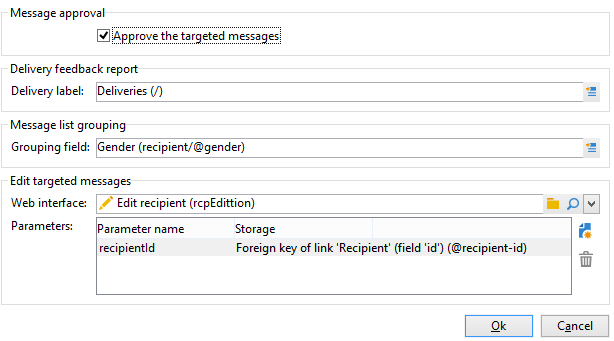

   以下のフィールドの内容を入力する必要があります。

   * **[!UICONTROL ターゲティングされたメッセージを承認]**：すべての受信者を、承認する受信者のリストから事前に選択しておきたい場合、このオプションを選択します。このオプションを選択していない場合、受信者は事前に選択されません。

      >[!NOTE]
      >
      >このオプションはデフォルトで選択されています。

      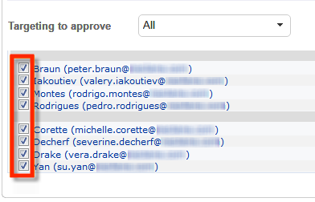

   * **[!UICONTROL 配信ラベル]**：配信通知に配信ラベルを表示する式を定義できます。デフォルトの式は、配信の標準ラベルに関する情報を提供します（自動生成された文字列）。この式を変更することができます。

      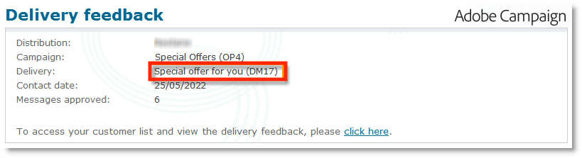

   * **[!UICONTROL グループ化フィールド]**：承認通知と配信通知の受信者の表示に使用するグループ化を定義できます。

      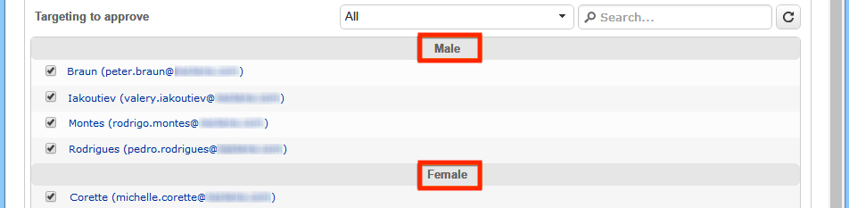

   * **[!UICONTROL Web インターフェイス]**：Web アプリケーションを受信者リストとリンクさせます。承認と配信通知内で、各受信者は、選択された Web アプリケーションへのクリック可能なリンクとして表示されます。「**[!UICONTROL パラメーター]**」フィールド（**[!UICONTROL recipientId]** など）では、URL と Web アプリケーションで使用される追加のパラメーターを設定できます。

1. 「**[!UICONTROL 分類]**」タブでは、配信値のリストを定義できます。

   

   * **[!UICONTROL 値]**：配信値を入力します。
   * **[!UICONTROL 割合 / 固定値]**：レコードの上限数（パーセント値または固定値）を入力します。

      この列は、「**[!UICONTROL 一般]**」タブ内の「**[!UICONTROL 配分タイプ]**」フィールドによって定義されます。

   * **[!UICONTROL ラベル]**：各値にリンクされたラベルを入力します。
   * **[!UICONTROL グループまたはオペレーター]**：「[ローカルの承認](local-approval.md)」アクティビティを使用している場合、各配信値に割り当てるオペレーターまたはオペレーターグループを選択します。

      ローカルの承認を伴わないデータのグループ化によるシンプルな制限を使用する場合、「**[!UICONTROL グループまたはオペレーター]**」を入力する必要はありません。

      >[!CAUTION]
      >
      >オペレーターには必ず適切な権限を付与するようにしてください。

## フィルタリングパラメーター {#filtering-parameters}

「**[!UICONTROL 一般]**」タブをクリックし、アクティビティのラベルを入力します。分割のターゲットおよびフィルターディメンションを選択します。必要に応じて、指定されたサブセットについて、これらのディメンションを変更できます。

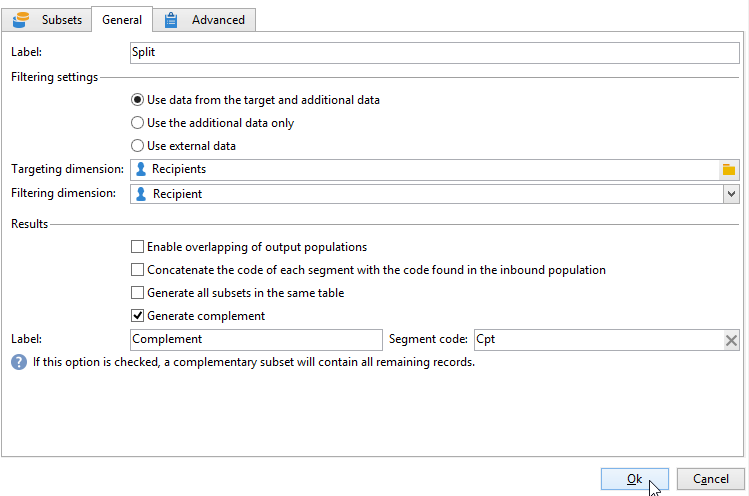

残りの母集団を利用するには、「**[!UICONTROL 補集合を生成]**」オプションをチェックします。補集合は、インバウンドターゲットからサブセットの和集合を引いた部分です。その後、次の図のように、追加のアウトバウンドトランジションがアクティビティに追加されます。

このオプションが正しく機能するには、インバウンドデータにプライマリキーが必要です。

例えば、「**[!UICONTROL データ読み込み（RDBMS）]**」アクティビティ経由で、データが Netezza のような外部データベース（インデックスの概念をサポートしない）から直接読み取られる場合、「**[!UICONTROL 分割]**」アクティビティによって生成される補集合が不正確なものになります。

これを回避するには、「**[!UICONTROL 分割]**」アクティビティの直前に「**[!UICONTROL エンリッチメント]**」アクティビティをドラッグ＆ドロップします。「**[!UICONTROL エンリッチメント]**」アクティビティで、「**[!UICONTROL メインセットからのすべての追加データを維持]**」を選択し、「**[!UICONTROL 分割]**」アクティビティのフィルター設定に使用する追加データを指定します。「**[!UICONTROL 分割]**」アクティビティのインバウンドトランジションからのデータが Adobe Campaign サーバーの一時テーブル内にローカルに保存され、正しい補集合が生成されます。

「**[!UICONTROL 出力母集団の重複を可能にする]**」オプションにより、複数のサブセットに属している母集団を管理できます。

* このオプションを選択していないと、サブセットの条件を複数満たす場合でも、受信者は複数の出力トランジションに表示されません。受信者は、一致した基準の 1 番目のタブのターゲットになります。
* このオプションを選択していると、サブセットのフィルター条件を複数満たす場合、受信者は複数のサブセットに表示されます。Adobe Campaign は、排他的な条件の使用をお勧めします。

## 入力パラメーター {#input-parameters}

* tableName
* schema

各インバウンドイベントは、これらのパラメーターによって定義されるターゲットを指定する必要があります。

## 出力パラメーター {#output-parameters}

* tableName
* schema
* recCount

この 3 つの値セットは、除外によって生成されたターゲットを識別します。**[!UICONTROL tableName]** はターゲットの識別子を記録するテーブル名、**[!UICONTROL schema]** は母集団のスキーマ（通常は nms:recipient）、**[!UICONTROL recCount]** はテーブル内の要素の数です。

補集合に関連付けられたトランジションは、同じパラメーターを持ちます。
