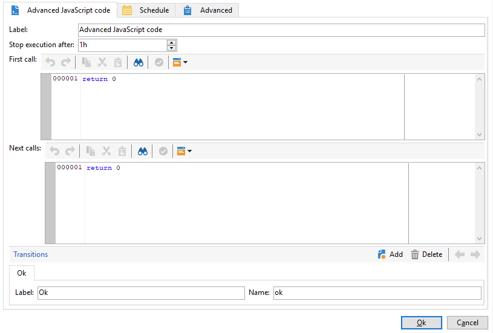

# SQL コードと JavaScript コード{#sql-code-and-javascript-code}


## SQL コード {#sql-code}

「**[!UICONTROL SQL コード]**」アクティビティは、SQL スクリプトを実行します。スクリプトは、JST テンプレートです。


* **[!UICONTROL スクリプト]**

   エディターの中央部に、実行されるスクリプトが含まれています。このスクリプトは、JST テンプレートであり、ワークフローのコンテキストに応じて設定できます。

* **[!UICONTROL エラーを処理]**

   [エラーを処理](monitor-workflow-execution.md#processing-errors)を参照してください。

## JavaScript コードと高度な JavaScript コード {#javascript-code}

**[!UICONTROL JavaScript コード]**&#x200B;と&#x200B;**[!UICONTROL 高度な JavaScript コード]**&#x200B;アクティビティは、ワークフローのコンテキストで JavaScript スクリプトを実行します。スクリプトについて詳しくは、以下の節を参照してください。

* [JavaScript のスクリプトとテンプレート](javascript-scripts-and-templates.md)
* [ワークフローでの JavaScript コードの例](javascript-in-workflows.md)

### 実行遅延 {#exec-delay}

20.2 リリース以降、**[!UICONTROL JavaScript コード]**&#x200B;と&#x200B;**[!UICONTROL 高度な JavaScript コード]**&#x200B;のアクティビティに実行遅延が追加されました。 デフォルトでは、実行フェーズは 1 時間を超えることはできません。 この遅延の後、エラーメッセージが表示されてプロセスが中止され、アクティビティの実行が失敗します。

この遅延は、アクティビティの「**[!UICONTROL 次の時間後に実行を停止]**」フィールドで変更できます。

この制限を無視するには、値を **0** に設定する必要があります。

### JavaScript コード {#js-code-desc}


* **[!UICONTROL スクリプト]**：実行されるスクリプトがエディターの中央部に記述されています。

* **[!UICONTROL エラーを処理]**：[エラーの処理](monitor-workflow-execution.md#processing-errors)を参照してください。

### 高度な JavaScript コード {#adv-js-code-desc}



* **[!UICONTROL 最初の呼び出し]**：エディターの最初のゾーンには、最初の呼び出し時に実行するスクリプトが含まれます。
* **[!UICONTROL 次の呼び出し]**：エディターの 2 番目のゾーンには、2 回目以降の呼び出し時に実行するスクリプトが含まれます。
* **[!UICONTROL トランジション]**：アクティビティの出力トランジションを複数定義できます。
* **[!UICONTROL スケジュール]**：「**[!UICONTROL スケジュール]**」タブでは、アクティビティをトリガーするタイミングをスケジュール設定できます。

高度な JavaScript は永続的なタスクであり、完了とマークされていない限り定期的に呼び出されます。 タスクを終了し、今後の再呼び出しを防ぐには、「**[!UICONTROL 次の呼び出し]**」セクションで **task.setCompleted()** メソッドを使用する必要があります。

```
task.postEvent(task.transitionByName("ok")); // to transition to Ok branch
task.setCompleted();

return 0;
```
