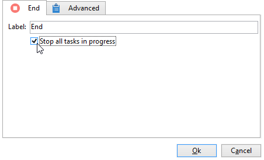
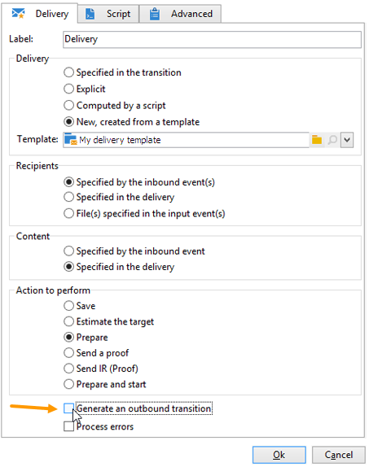

# 開始と終了{#start-and-end}

「**[!UICONTROL 開始]**」アクティビティおよび「**[!UICONTROL 終了]**」アクティビティを使用して、ワークフローの開始と終了を視覚的に示します。これらのアクティビティは、機能上の影響はないので、省略可能です。

* **[!UICONTROL 開始]**

   ワークフローの実行は、インバウンドトランジションのないアクティビティと、「開始」タイプアクティビティから開始します。

   

* **[!UICONTROL 終了]**

   進行中のすべてのタスクを中断する「**[!UICONTROL 終了]**」アクティビティを設定できます。それには、アクティビティをダブルクリックしてプロパティを標示し、適切なオプションを選択します。

   

   ワークテーブル内のデータは、「終了」アクティビティが有効になると自動的に削除されます。
データを削除する必要がなく、不要な負荷を避けたい場合は、最後のアクティビティ出力でトランジションを無効にすることもできます。例えば、配信出力でプロセスが何もスケジュールされていない場合、次に示す関連オプションのチェックを外します。

   
