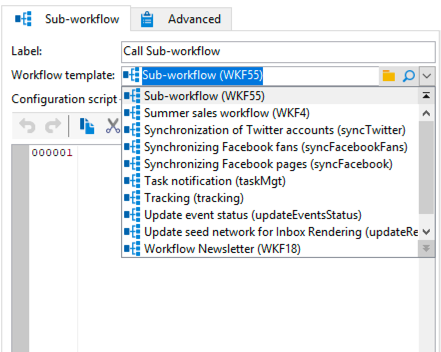
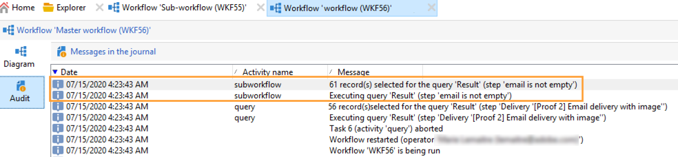

# サブワークフロー{#sub-workflow}

**[!UICONTROL サブワークフロー]**&#x200B;を使用すれば、別のワークフローの実行をトリガーし、結果を取得できます。このアクティビティにより、簡素化されたインターフェイス経由で、複雑なワークフローを使用できます。

1 つのワークフローで複数のサブワークフローを呼び出すことができます。サブワークフローは、同期して実行されます。

以下の例では、プライマリワークフローが、ジャンプを使用してサブワークフローを呼び出しています。ジャンプタイプのグラフィカルオブジェクトについて詳しくは、[この節](jump--start-point-and-end-point-.md)を参照してください。

1. 別のワークフローでサブワークフローとして使用するワークフローを作成します。
1. ワークフローの最初に、優先度が 1 の&#x200B;**[!UICONTROL ジャンプ (終了点)]** アクティビティを挿入します。「終了点」タイプのジャンプが複数ある場合、Adobe Campaign は一番小さい数の「終了点」ジャンプを使用します。
1. ワークフローの最後に、優先度が 2 の&#x200B;**[!UICONTROL ジャンプ (開始点)]** アクティビティを挿入します。「開始点」タイプのジャンプが複数ある場合、Adobe Campaign は一番大きい数の「開始点」ジャンプを使用します。

   

   >[!NOTE]
   >
   >サブワークフローアクティビティが複数の&#x200B;**[!UICONTROL ジャンプ]**&#x200B;アクティビティを伴うワークフローを参照している場合、サブワークフローは一番小さい数の「終了点」ジャンプと、一番大きい数の「開始点」ジャンプの間に実行されます。
   >
   >サブワークフローが正常に動作するよう、一番小さい数の「終了点」ジャンプを 1 つのみ、一番大きい数の「開始点」ジャンプを 1 つのみにする必要があります。

1. この「サブワークフロー」を完了して保存します。
1. プライマリワークフローを作成します。
1. **[!UICONTROL サブワークフロー]**&#x200B;アクティビティを挿入して開きます。
1. **[!UICONTROL ワークフローテンプレート]**&#x200B;ドロップダウンリストから、使用するワークフローを選択します。

   

1. さらに、参照先ワークフローを変更するための設定スクリプトを追加することもできます。
1. 「**[!UICONTROL OK]**」をクリックします。これにより、選択したワークフローから、**[!UICONTROL ジャンプ (開始点)]** アクティビティラベルのついたアウトバウンドトランジションを自動的に作成します。

   

1. ワークフローを実行します。

実行すると、サブワークフローとして呼び出されたワークフローは、「**[!UICONTROL 編集中]**」ステータスのままになります。つまり、

* トランジションを右クリックしてターゲットを表示することはできません。
* 中間母集団の数は表示できません。
* サブワークフローのログは、プライマリワークフローに表示されます。

   

>[!NOTE]
>
>サブワークフローでエラーが発生した場合は、プライマリワークフローが一時停止し、サブワークフローのコピーが作成されます。

## 入力パラメーター（オプション） {#input-parameters--optional-}

* tableName
* schema

各インバウンドイベントは、これらのパラメーターによって定義されるターゲットを指定する必要があります。

## 出力パラメーター {#output-parameters}

* tableName
* スキーマ
* recCount

この 3 つの値セットは、クエリのターゲットとなる母集団を識別します。**[!UICONTROL tableName]** はターゲットの識別子を記録するテーブル名、**[!UICONTROL schema]** は母集団のスキーマ（通常は nms:recipient）、**[!UICONTROL recCount]** はテーブル内の要素の数です。

* targetSchema：この値は、ワークテーブルのスキーマです。
このパラメーターは、**[!UICONTROL tableName]** と **[!UICONTROL schema]** のすべてのトランジションで有効です。
