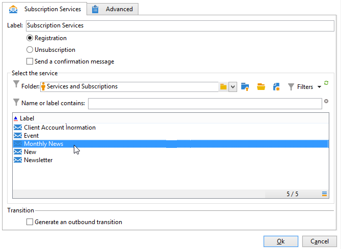

# 購読サービス{#subscription-services}

「**購読サービス**」タイプのアクティビティでは、トランジションで指定された母集団の情報サービスに対する購読を作成または削除できます。

購読サービスを設定するには、次の例に示すように、アクティビティを編集してラベルを入力します。その後、実行するアクション（購読または購読解除）と該当するサービスを選択します。

1. アクティビティのラベルを入力します。
1. 実行の最後にトランジションを作成する場合は、「**[!UICONTROL アウトバウンドトランジションを生成]**」を選択します。

   通常、ターゲットの情報サービスの購読は、ターゲティングワークフローの終わりを示します。そのため、このオプションはデフォルトでは有効にされていません。

1. 選択した情報サービスに対して、指定した母集団の購読をおこなう場合は「**[!UICONTROL 購読]**」を、購読を解除する場合は「**[!UICONTROL 購読解除]**」を選択します。
1. 「**[!UICONTROL 確認メッセージを送信]**」を選択すると、サービスの購読または購読解除が受信者に通知されます。

   このメッセージの内容は、情報サービスに関連付けられた配信テンプレートで指定されています。詳しくは、こちらを参照してください。

## 例：受信者リストのニュースレターへの登録 {#example--subscribe-a-list-of-recipients-to-a-newsletter}

次のワークフローは、1 回の操作で、ニュースレター購読の資格のある受信者のリストを作成することを目的としています。パリに住んでいる人々に働きかけ、購読を申し込んでもらうことがねらいです。

そのためには、既に登録されている受信者を除外する必要があります。

>[!CAUTION]
>
>手動で受信者をサービスに登録する前に、これらの受信者がメッセージを受けることを承諾していることを確認してください。

1. 次の 3 つのクエリを追加します。

   * 1 番目のクエリは、18 歳～ 60 歳の受信者をターゲティングしています。
   * 2 番目のクエリは、パリに住んでいる受信者をターゲティングしています。
   * 3 番目のクエリは、ニュースレターを現在購読していない受信者をターゲティングしています。

1. それぞれの結果を相互参照させるために、積集合アクティビティを追加します。
1. 必要に応じて、リスト更新アクティビティを挿入すれば、購読者のリストを最新状態に維持できます。
1. 購読サービスアクティビティを挿入したら、これをクリックして設定します。
1. アクティビティのラベルを入力し、「**[!UICONTROL 購読]**」を選択します。

   受信者にニュースレターの購読を通知する必要がある場合は、「**[!UICONTROL 確認メッセージを送信]**」チェックボックスを選択します。

1. ニュースレターが含まれているフォルダーを選択し、フォルダー内のリストからニュースレターを選択します。
1. このアクティビティがワークフローの終了をマークできるように、「**[!UICONTROL アウトバウンドトランジションを生成]**」を選択解除しておき、「**[!UICONTROL OK]**」をクリックします。

ワークフローの実行中、この 3 つのすべてのクエリに該当する受信者はリストに追加され、ニュースレターの購読者として登録されます。

登録が成功したかどうかを確認するには、「**[!UICONTROL 購読]**」タブを開き、該当する受信者を確認します。

## 入力パラメーター {#input-parameters}

* tableName
* schema

各インバウンドイベントは、これらのパラメーターによって定義されるターゲットを指定する必要があります。
