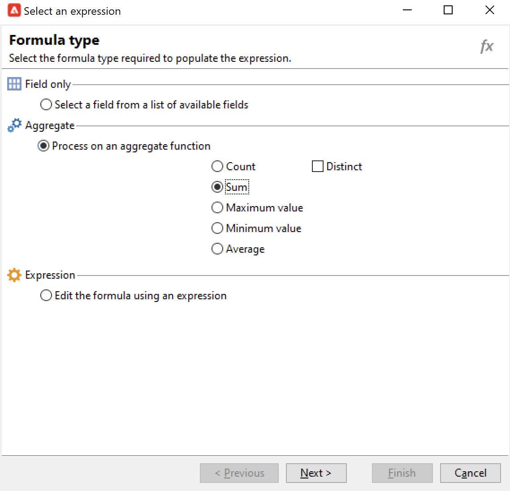

# ターゲティングワークフローの作成{#target-data}

ワークフローを使用すると、データベースに対するクエリを実行し、データをセグメント化できます。キャンペーンワークフローモジュールは、データ管理アクティビティの実行、データの抽出、強化、変換、オーディエンスの管理、母集団の調整を行う強力なツールです。

ターゲティングワークフローにより、配信ターゲットをいくつか作成できます。ワークフローアクティビティを使用して、クエリを作成し、指定した条件に基づく和集合または除外を定義して、スケジューリングを追加することができます。このターゲティングの結果は、配信アクションのターゲットとして機能するリストに自動転送できます。

これらのアクティビティに加えて、データ管理の各種オプションを使用することで、データを操作して、高度な機能にアクセスし、複雑なターゲティングの問題を解決できます。詳しくは、[データ管理](targeting-workflows.md#data-management)を参照してください。

これらのアクティビティはすべて、1 番目のワークフロータブにあります。

>[!NOTE]
>
>ターゲティングアクティビティについて詳しくは、この[節](activities.md)を参照してください。

ターゲティングワークフローは、Adobe Campaign ツリーの&#x200B;**[!UICONTROL プロファイルとターゲット／ジョブ／ターゲティングワークフロー]**&#x200B;ノード経由、または&#x200B;**[!UICONTROL プロファイルとターゲット／ターゲティングワークフロー]**&#x200B;メニューから作成し、編集できます。

キャンペーンのフレームワーク内のターゲティングワークフローは、すべてのキャンペーンワークフローとともに保存されます。

## ターゲティングワークフローを作成するための主な手順 {#implementation-steps-}

ターゲティングワークフローを作成する手順については、次の節を参照してください。

1. データベース内の **ID** データ - [クエリの作成](#create-queries)を参照
1. 配信ニーズに合わせたデータの&#x200B;**準備** - [データのエンリッチメントと変更](#enrich-and-modify-data)を参照
1. データを&#x200B;**使用**&#x200B;して更新を実行または配信内で使用 - [データベースの更新](use-workflow-data.md#update-the-database)を参照

ターゲティング中に実行されたすべてのエンリッチメントと処理の結果はパーソナライゼーションフィールドに保存され、このフィールド経由でアクセスされます。具体的には、特にパーソナライズしたメッセージの作成などに使用されます。詳しくは、[ターゲットデータ](use-workflow-data.md#target-data)を参照してください。。

## ターゲティングとフィルタリングディメンション {#targeting-and-filtering-dimensions}

データのセグメント化操作では、ターゲティングキーは、フィルタリングディメンションとマッピングされます。ターゲティングディメンションは、受信者、契約の受益者、オペレーター、購読者など、ターゲットされる母集団を操作ごとに定義します。フィルタリングディメンションを使用して契約の所有者、ニュースレターの購読者など、特定の条件に基いて母集団を選択できます。

例えば、5 年以上生命保険の契約を持つ顧客を選択するには、ターゲティングディメンションで&#x200B;**クライアント**&#x200B;を選択し、フィルタリングディメンションで「**契約保持者**」を選択します。次に、クエリアクティビティ内でフィルタリング条件を定義します。

ターゲティングディメンションの選択ステージでは、互換性のあるフィルタリングディメンションだけがインターフェイスに表示されます。

これらの 2 つのディメンションは、関連付けられている必要があります。つまり、「**[!UICONTROL フィルタリングディメンション]**」リストの内容は、リストフィールド内に指定されたターゲティングディメンションにより異なります。

例えば、受信者の場合（「**受信者**」）、次のフィルタリングディメンションが使用可能になります。

**訪問者**&#x200B;の場合、リストには次のフィルタリングディメンションが表示されます。

## クエリの作成 {#create-queries}

### 追加データで作業する {#select-data}

「**[!UICONTROL クエリ]**」アクティビティでは、ターゲット母集団を作成するために必要な基本データを選択できます。詳しくは、[この節](query.md#create-a-query)を参照してください。

データベースからデータをクエリおよび絞り込むには、「[増分処理クエリ](incremental-query.md)」および「[リスト読み込み](read-list.md)」アクティビティも使用できます。

ワークフローのライフサイクルを通じて転送され、処理される追加情報を収集することができます。詳しくは、[データの追加](query.md#add-data)および[追加データの編集](#edit-additional-data)を参照してください。

### 追加データを編集 {#edit-additional-data}

追加のデータが追加されたら、編集したり、クエリアクティビティで定義されたターゲットの調整に使用することができます。

「**[!UICONTROL 追加データを編集...]**」リンクを使用して、追加データを表示し、編集したり、さらにデータを追加できます。

前に定義した出力列にデータを追加するには、使用可能なフィールドのリストからフィールドを選択します。新しい出力列を作成するには、「**[!UICONTROL 追加]**」アイコンをクリックしてからフィールドを選択し、「**[!UICONTROL 式を編集]**」をクリックします。

「**詳細選択**」ボタンをクリックします。

例えば集計など、追加するフィールドの計算モードを定義します。

「**[!UICONTROL サブ項目を追加]**」オプションを使用して、自動生成したデータをコレクションに添付できます。これにより、コレクションから、追加データを選択したり、コレクション要素に対する集計計算を定義できます。

サブ要素は、マッピング先のコレクションのサブツリーに表されます。

コレクションが「**[!UICONTROL コレクション]**」サブタブに表示されます。収集された要素は、選択したコレクションの「**[!UICONTROL 詳細]**」アイコンをクリックしてフィルターできます。フィルターウィザードでは、収集したデータを選択し、コレクション内のデータに適用するフィルター条件を指定できます。

### 追加データを使用してターゲットの絞り込む {#refine-the-target-using-additional-data}

収集された追加データを使用して、データベース内でのフィルターされたデータを絞り込むことができます。それには、「**[!UICONTROL 追加データを使用してターゲットを絞り込み...]**」リンクをクリックします。このリンクを使用して、追加したデータをフィルターできます。

### データの均質化 {#homogenize-data}

「**[!UICONTROL 和集合]**」タイプまたは「**[!UICONTROL 積集合]**」タイプのアクティビティで、共有される追加データのみを保持するよう選択し、データの一貫性を維持することができます。この場合、このアクティビティの一時的な出力ワークテーブルには、すべてのインバウンドセットで見つかった追加データのみが含まれます。

### 追加データとの紐付け {#reconciliation-with-additional-data}

データの紐付けフェーズ（**[!UICONTROL 和集合]**、**[!UICONTROL 積集合]**&#x200B;などのアクティビティ）の間、データの紐付けに使用される列を追加の列から選択できます。それには、列の選択の紐付けを設定し、メインセットを指定します。次に、以下の例に示すように、ウィンドウ下部の列から列を選択します。

式を選択し、確定します。

### サブセットの作成 {#create-subsets}

「**[!UICONTROL 分割]**」アクティビティにより、抽出クエリ経由で定義された条件に基づくサブセットを作成できます。各サブセットについて、母集団に対するフィルター条件を編集する場合、標準クエリアクティビティにアクセスし、ターゲットのセグメント化条件を定義します。

追加データのみを、またはターゲットデータと追加データをフィルター条件として使用し、ターゲットを複数のサブセットに分割できます。さらに、**Federated Data Access** オプションを購入済みの場合は、外部データも使用できます。

詳しくは、[この節](#create-subsets-using-the-split-activity)を参照してください。

## セグメントデータ {#segment-data}

### 複数のターゲットの組み合わせ（和集合）  {#combine-several-targets--union-}

和集合アクティビティでは、1 つのトランジション内で複数のアクティビティの結果を組み合わせることができます。セットは、同質である必要はありません。

次のデータ紐付けオプションを使用できます。

* **[!UICONTROL キーのみ]**

   このオプションは、入力母集団が同質である場合に使用できます。

* **[!UICONTROL すべての共有列]**

   このオプションでは、ターゲットの各種母集団すべてに共通する共有列に基づいてデータを紐付けできます。

   Adobe Campaign は、名前に基づいて列を識別します。許容しきい値を使用できます。この値を使用すると、例えば、Email 列は @email 列と同じであると認識されます。

* **[!UICONTROL 列の選択]**

   このオプションを選択し、データの紐付けが適用される列のリストを定義します。

   まず、メインセットを選択し（ソースデータが含まれるセット）、次に結合に使用される列を選択します。

   

   >[!CAUTION]
   >
   >データの紐付け中、母集団は重複排除されません。

   レコード数を指定することで、母集団のサイズを制限できます。それには、適切なオプションをクリックし、保持するレコード数を指定します。

   さらに、インバウンド母集団の優先度を指定します。ウィンドウの下部セクションには、和集合アクティビティのインバウンドトランジションがリストされます。このリストを、ウィンドウ右側の青い矢印を使用して並べ替えます。

   レコードは、最初のインバウンドトランジションの母集団から取り出され、その時点で最大値に達しなければ、次に 2 番目のインバウンドトランジションの母集団から取り出されます。

   

### 結合データの抽出（積集合）  {#extract-joint-data--intersection-}

積集合は、インバウンドトランジションの母集団で共有される行のみを取り出します。このアクティビティは、和集合アクティビティと同様に設定されます。

さらに、列の選択だけ、またはインバウンド母集団によって共有される列だけを保持することもできます。

積集合アクティビティについて詳しくは、[積集合](intersection.md)の節で説明しています。

### 母集団の除外（除外）  {#exclude-a-population--exclusion-}

除外アクティビティを使用して、異なるターゲット母集団からターゲットの要素を除外できます。このアクティビティの出力ターゲティングディメンションは、メインセットからのものになります。

必要に応じて、インバウンドテーブルの操作も可能です。別のディメンションからターゲットを除外するには、このターゲットが同じターゲティングディメンションをメインターゲットとして返します。それには、「**[!UICONTROL 追加]**」ボタンをクリックし、ディメンションの変更条件を指定します。

データの紐付けは、識別子、変更軸、結合を使用して実行されます。

### 分割アクティビティを使用したサブセットの作成 {#create-subsets-using-the-split-activity}

**[!UICONTROL 分割]**&#x200B;アクティビティは、1 つまたは複数のフィルタリングディメンション経由で、必要な数のセットをすべて作成できる標準アクティビティです。また、サブセットごとに 1 つの出力トランジション、または固有のトランジションのいずれかを生成します。

インバウンドトランジションによって伝達された追加データは、フィルター条件内で使用できます。

これを設定するには、最初に条件を選択する必要があります。

1. ワークフローで、**[!UICONTROL 分割]**&#x200B;アクティビティをドラッグ＆ドロップします。
1. 「**[!UICONTROL 一般]**」タブで、「**[!UICONTROL ターゲットからのデータと追加データを使用]**」、「**[!UICONTROL 追加データのみを使用]**」、「**[!UICONTROL 外部データを使用]**」のいずれかから、目的のオプションを選択します。
1. 「**[!UICONTROL ターゲットからのデータと追加データを使用]**」オプションが選択されている場合、ターゲティングディメンションでは、インバウンドトランジションによって伝達されるすべてのデータを使用できます。

   

   サブセットが作成されると、前述のフィルタリングパラメーターが使用されます。

   フィルター条件を定義するには、「**[!UICONTROL インバウンド母集団に対するフィルター条件を追加]**」オプションを選択して、「**[!UICONTROL 編集...]**」リンクをクリックします。次に、このサブセットを作成するためのフィルタリング条件を指定します。

   

   **[!UICONTROL 分割]**&#x200B;アクティビティでフィルター条件を使用して、ターゲットを別々の母集団にセグメント化する方法を示した例については、[この節](cross-channel-delivery-workflow.md)を参照してください。

   「**[!UICONTROL ラベル]**」フィールドでは、新しく作成したサブセットに、アウトバウンドトランジションと一致する名前を付けることができます。

   さらに、サブセットに識別用のセグメントコードを割り当てて、母集団のターゲティングにそのコードを使用できます。

   必要に応じて、作成したい各サブセットについて、ターゲティングおよびフィルタリングディメンションを個別に変更できます。それには、サブセットのフィルタリング条件を編集し、「**[!UICONTROL 特定のフィルタリングディメンションを使用]**」オプションをチェックします。

   

1. 「**[!UICONTROL 追加データのみを使用]**」オプションが選択されている場合、追加データのみがサブセットのフィルターに提供されます。

1. 「**Federated Data Access**」オプションが有効になっている場合、「**[!UICONTROL 外部データを使用]**」により、設定済みの外部データベース内のデータを処理したり、新しい接続をデータベースに対して作成できます。

次に、新しいサブセットを追加する必要があります。

1. 「**[!UICONTROL 追加]**」ボタンをクリックし、フィルター条件を定義します。

   

1. アクティビティの「**[!UICONTROL 一般]**」タブでフィルタリングディメンションを定義します（上の節を参照）。これは、デフォルトですべてのサブセットに適用されます。

   

1. 必要に応じて、各サブセットで個別にフィルタリングディメンションを変更できます。これにより、同じ 1 つの分割アクティビティを使用して、ゴールドカード所有者のセットを 1 つと、最新のニュースレター内でクリックした受信者のセットを 1 つ、過去 30 日間に店舗で購入をおこなった 18 歳から 25 歳の人々のセットを 1 つ作成できます。それには、「**[!UICONTROL 特定のフィルタリングディメンションを使用]**」オプションを選択して、データのフィルターのコンテキストを選択します。

サブセットが作成されたら、分割アクティビティは、デフォルトでサブセットと同数の出力トランジションを表示します。

すべてのサブセットを、1 つの出力トランジションにグループ化できます。この場合、それぞれのサブセットへのリンクは、セグメントコード内に表示されます。それには、「**[!UICONTROL 同じテーブルにすべてのサブセットを生成]**」オプションを選択します。

例えば、1 つの配信アクティビティを配置し、各受信者セットのセグメントコードに基づいて配信コンテンツをパーソナライズすることができます。

サブセットは、**[!UICONTROL セル]**&#x200B;アクティビティを使用して作成することもできます。詳しくは、[セル](cells.md)の節を参照してください。

### ターゲットデータの使用 {#using-targeted-data}

識別され、準備されたデータは、次のコンテキストで使用できます。

* 各種ワークフローステージで、データ操作の後でデータベース内のデータを更新できます。

   詳しくは、[データを更新](update-data.md)を参照してください。

* さらに、既存のリストのコンテンツを更新できます。

   詳しくは、[リストの更新](list-update.md)を参照してください。

* ワークフロー内で直接、配信を準備または開始できます。

   詳しくは、[配信](delivery.md)、[配信コントロール](delivery-control.md)および[連続配信](continuous-delivery.md)を参照してください。

## データ管理 {#data-management}

Adobe Campaign では、より効率的で柔軟なツールを提供することで複雑なターゲティングの課題を解決できるように、データ管理によってアクティビティセットを組み合わせます。これにより、契約や購読、配信に対する反応などに関連する情報を使用して、連絡先とのすべての通信の一貫した管理の実装が可能になります。データ管理によって、セグメント化の操作時にデータのライフサイクルをトラッキングできます。具体例を以下に示します。

* データマートでモデル化されていないデータを含めることで、ターゲティングプロセスを簡素化し、最適化する（新規テーブルを作成：設定に応じた各ターゲティングワークフローへのローカル拡張）。
* 特にターゲットの構築フェーズで、またはデータベース管理中に、バッファ計算を保持し、伝達する。
* 外部データベースへのアクセス（オプション）：ターゲティングプロセス中に、異種データベースを処理する。

これらの操作を実装するために、Adobe Campaign は以下を提供します。

* データ収集アクティビティは、[ファイル転送](file-transfer.md)、[データ読み込み（ファイル）](data-loading--file-.md)、[データ読み込み（RDBMS）](data-loading--rdbms-.md)、[データ更新](update-data.md)です。データ収集の最初の手順では、その他のアクティビティ内で処理するためにデータを準備します。ワークフローを正確に実行し、予測した結果が確実に得られるようにするには、複数のパラメーターを監視する必要がります。例えば、データをインポートする場合、データのプライマリキー（Pkey）は、レコードごとに一意である必要があります。
* ターゲティングアクティビティを強化するデータ管理オプションは、[クエリ](query.md)、[和集合](union.md)、[積集合](intersection.md)、[分割](split.md)です。これにより、データの紐付けが可能な場合、様々なターゲティングディメンションから和集合または積集合を設定できます。
* データ変換アクティビティは、[エンリッチメント](enrichment.md)、[ディメンションを変更](change-dimension.md)です。

>[!CAUTION]
>
>2 つのワークフローがリンクされている場合、ソーステーブル要素を削除することは、その要素にリンクされているすべてのデータの削除を意味するわけではありません。
>  
>例えば、ワークフロー経由で受信者を削除しても、受信者の配信履歴すべてが削除されることはありません。ただし、受信者フォルダーから直接受信者を削除すると、その受信者にリンクされたすべてのデータが削除されます。

### データのエンリッチメントと変更 {#enrich-and-modify-data}

ターゲティングディメンションに加えて、フィルタリングディメンションでも、収集したデータの特性を指定できます。[この節](targeting-workflows.md#targeting-and-filtering-dimensions)を参照してください。

識別され、収集されたデータに対して、ターゲットの構築を最適化するために、エンリッチメントや集計、操作を行うことができます。それには、[この節](#segmen-data)で詳述するデータ操作アクティビティに加えて、以下を使用します。

* 「**[!UICONTROL エンリッチメント]**」アクティビティを使用して、スキーマに即座にコラムを追加したり、特定の要素に情報を追加できます。詳しくは、アクティビティのリポジトリの[エンリッチメント](enrichment.md)の節で説明しています。
* **[!UICONTROL スキーマを編集]**&#x200B;アクティビティを使用して、スキーマの構造を変更できます。詳しくは、アクティビティのリポジトリの[スキーマを編集](edit-schema.md)の節で説明しています。
* 「**[!UICONTROL ディメンションを変更]**」アクティビティを使用して、ターゲットの構築サイクル中にターゲティングディメンションを変更できます。詳しくは、[ディメンションを変更](change-dimension.md)の節で説明しています。
