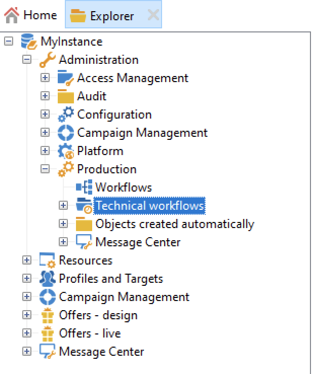
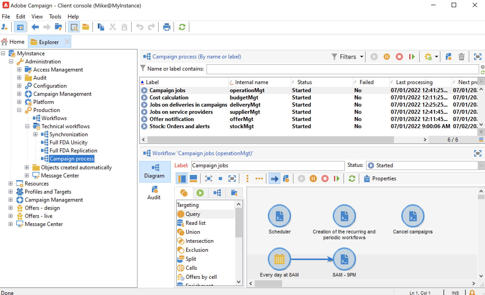

# テクニカルワークフロー{#about-technical-workflows}

Adobe Campaign には、一連のビルトインテクニカルワークフローが付属しています。 これらのワークフローでは、サーバー上で定期的に実行するようにスケジュールされた操作およびジョブを制御します。テクニカルワークフローでは、Campaign データベースに対するメンテナンス操作の実行、配信に関するトラッキングデータの管理、配信に関する暫定的なプロセスの設定を行います。

デフォルトでは、テクニカルワークフローは、**[!UICONTROL 管理]**／**[!UICONTROL プロダクション]**／**[!UICONTROL テクニカルワークフロー]**&#x200B;ノードのサブフォルダーで使用できます。

{width="50%" align="left" zoomable="yes"}

>[!NOTE]
>
>* 各モジュールにインストールされているテクニカルワークフローのリストについて詳しくは、[この節](#list-technical-workflows)を参照してください。
>
>* Message Center アドオンに関連するテクニカルワークフローは、デフォルトでは、**[!UICONTROL 管理]**／**[!UICONTROL プロダクション]**／**[!UICONTROL Message Center]**／**[!UICONTROL テクニカルワークフロー]**&#x200B;ノードに保存されています。

タスク通知や在庫管理、コスト計算といった、キャンペーンでのプロセスの実行に必要なワークフローは、**[!UICONTROL キャンペーンプロセス]**&#x200B;サブフォルダーで集中管理されます。

## テクニカルワークフローの管理と作成 {#manage-tech-workflows}

テクニカルワークフローの開始と変更は、**管理者**&#x200B;権限を持つオペレーターのみが実施できます。テクニカルワークフローを監視する方法について詳しくは、[この節](monitor-technical-workflows.md)を参照してください。

カスタムのテクニカルワークフローは、ツリー構造の&#x200B;**[!UICONTROL 管理／プロダクション／テクニカルワークフロー]**&#x200B;ノードで作成できます。テクニカルワークフローの作成には、ネイティブテンプレートを使用できます。ニーズに合わせて、テンプレートをカスタマイズできます。ただし、このプロセスを実行できるのは、エキスパートユーザーに限られます。テクニカルワークフローで使用できるアクティビティは、ターゲティングワークフローで提供されるものと同じです。[詳細情報](targeting-workflows.md)。

## ビルトインのテクニカルワークフロー {#list-technical-workflows}

このページで詳しく説明するワークフローは、Adobe Campaign ビルトインのパッケージと共にインストールされます。これらのパッケージと関連テクニカルワークフローは、ライセンス契約とアドオンによって異なります。

| テクニカルワークフロー | パッケージ | 説明 |
|------|--------|-----------|
| **エイリアスクレンジング**（aliasCleansing） | デフォルトでインストール | このワークフローは、[ 列挙 ](../../v8/config/enumerations.md#alias-cleansing) 値を標準化します。 デフォルトで、毎日午前 3 時にトリガーされます。 |
| **請求**（請求） | デフォルトでインストール | このワークフローでは、「請求」担当者にメールでシステムアクティビティレポートを送信します。マーケティングインスタンスで、毎月25日にトリガーされます。 |
| **Campaign ジョブ**（operationMgt） | デフォルトでインストール | マーケティングキャンペーンに関するジョブ（ターゲティングの開始、ファイル抽出など）を管理します。また、繰り返しキャンペーンと定期的キャンペーンに関連するワークフローも作成します。 |
| **ヒートマップサービスのデータを収集**（collectDataHeatMapService） | デフォルトでインストール | このワークフローは、ヒートマップサービスに必要なデータを取得します。 |
| **プライバシーリクエストを収集**（collectPrivacyRequests） | プライバシーデータ保護規則 | このワークフローでは、Adobe Campaign に保存されている受信者のデータを生成し、プライバシーリクエストの画面でダウンロードできるようにします。 |
| **原価計算**（budgetMgt） | デフォルトでインストール | 予算、プラン、プログラム、キャンペーン、配信およびタスクに関する費用行とコスト行の計算を開始します。 |
| **データベースのクリーンアップ**（クリーンアップ） | デフォルトでインストール | データベースのメンテナンスワークフローです。統計とプロセスの各種の計算をおこない、デプロイメントアシスタント内の定義済みの設定に応じてデータベースから古いデータを削除します。デフォルトで、毎日午前 4 時にトリガーされます。 |
| **ブロックした LINE ユーザーを削除**（deleteBlockedLineUsersV2） | LINE チャネル | このワークフローは、LINE 公式アカウントにブロックされてから 180 日が経過した後に LINE V2 ユーザーのデータを削除するようにします。 |
| **プライバシーリクエストデータを削除**（deletePrivacyRequestsData） | プライバシーデータ保護規則 | このワークフローでは、Adobe Campaign に保存されている受信者のデータを削除します。 |
| **配信達成度**（deliveryIndicators） | デフォルトでインストール | 配達の配信トラッキング指標を更新します。デフォルトでは、1 時間おきにトリガーされます。 |
| **直ちに FFDA をデプロイ**（ffdaDeploy） | [Campaign Enterprise（FFDA）デプロイメント](../../v8/architecture/enterprise-deployment.md)にのみデフォルトでインストール | クラウドデータベースへの即時デプロイメントを実行します。[データレプリケーションの詳細情報](../../v8/architecture/replication.md) |
| **分散型マーケティングプロセス**（centralLocalMgt） | セントラル／ローカルマーケティング（分散型マーケティング） | 分散型マーケティングモジュールの使用に関連するプロセスを開始します。ローカルキャンペーンの作成を開始し、オーダーとキャンペーンパッケージの可用性に関連付けられた通知を管理します。 |
| **イベントパージ**（webAnalyticsPurgeWebEvents） | Web 分析コネクタ | 存続期間フィールドで設定した期間に基づいてデータベースフィールドからすべてのイベントを削除できます。 |
| **Adobe Experience Cloud へのオーディエンスのエクスポート**（exportSharedAudience） | Adobe Experience Cloud との統合 | このワークフローは、共有されたオーディエンスおよびセグメントとしてオーディエンスをエクスポートします。これらのオーディエンスは、お使いの他の Adobe Experience Cloud ソリューションで使用できます。 |
| **予測**（予測） | デフォルトでインストール | 暫定カレンダー（暫定ログを作成）に保存された配信を分析します。デフォルトで、毎日午前 1 時にトリガーされます。 |
| **完全な集計計算（propositionrcp キューブ）**（agg_nmspropositionrcp_full） | オファーエンジン（インタラクション） | オファーの提案キューブのために完全な集計を更新します。デフォルトで、毎日午前 6 時にトリガーされます。この集計が取得するディメンションは、チャネル、配信、マーケティングオファーおよび日付です。オファーの提案キューブは、オファーに基づいてレポートを生成するために使用します。キューブについて詳しくは、[この節](../../v8/reporting/gs-cubes.md)を参照してください。 |
| **変換済み連絡先の特定**（webAnalyticsFindConverted） | Web 分析コネクタ | リマーケティングキャンペーンの後で、購入を完了したサイトの訪問者をインデックス化します。このワークフローで収集されたデータは、リマーケティングの効率レポートでアクセスできます（このページを参照）。 |
| **Adobe Experience Cloud からのオーディエンスのインポート**（importSharedAudience） | Adobe Experience Cloud との統合 | このワークフローでは、別の Adobe Experience Cloud ソリューションのオーディエンスおよびセグメントを Adobe Campaign にインポートできます。 |
| **キャンペーンの配信ジョブ**（deliveryMgt） | デフォルトでインストール | 承認された配信をトリガーし、外部配信のサービスプロバイダーの後処理を開始します。また、承認通知とリマインダーも送信します。 |
| **サービスプロバイダーのジョブ**（supplierMgt） | デフォルトでインストール | このワークフローでは、配信が承認されると、プロバイダーの処理（発送担当者へのメール送信および後処理）を開始します。 |
| **MID から LINE ユーザー ID への移行**（MIDToUserIDMigration） | LINE チャネル | このワークフローは、LINE V1 から LINE V2 へ移行用に、LINE V2 ユーザーの ID を生成します。 |
| **Message Center>external_account_name>**（mcSynch_&lt;external_account_name>） | トランザクションメッセージコントロール（Message Center - コントロール） | このワークフローの機能は次のとおりです。 <ul><li>操作によって処理されるイベントリストを復元します。</li><li>配信メッセージの選定を復元するために NmsBroadLogMsg テーブルと同期します。</li><li>NmsBroadLogMsg テーブルとの同期が完了するとただちに、イベント配信ログを復元します。</li><li>配信 URL のトラッキングを復元するために NmsTrackingUrl テーブルと同期します。</li><li>NmsTrackingUrl テーブルとの同期が完了するとただちに、イベントトラッキング URL を復元します。</li><li>配信の送信後 3 時間おきに、強制隔離されたすべてのメールアドレスを復元できます。</li></ul> |
| **MessageCenter の完全な集計計算**（agg_messageCenter_full） | トランザクションメッセージコントロール（Message Center - コントロール） | このワークフローは、Message Center キューブのための完全な集計を更新します。デフォルトで、毎日午前 3 時にトリガーされます。この集計は、チャネル、日付、ステータス、イベントタイプの各ディメンションを取り込みます。次に、Message Center キューブを使用して、イベントに基づいてレポートを生成します。キューブについて詳しくは、こちらを参照してください。 |
| **ミッドソーシング（配信カウンター）**（defaultMidSourcingDlv） | ミッドソーシング転送 | ミッドソーシングサーバー上の配信のカウント情報を収集します。カウント情報には、送信された配信の数など、一般的な配信達成度が含まれています。開封数などのトラッキング情報は含まれていません。デフォルトで、10 分おきにトリガーされます。 |
| **ミッドソーシング（配信ログ）**（defaultMidSourcingLog） | ミッドソーシング転送 | ミッドソーシングサーバー上の配信ログを収集します。デフォルトで、1 時間おきにトリガーされます。 |
| **NMAC オプトアウト管理**（mobileAppOptOutMgt） | モバイルアプリチャネル（プッシュ） | モバイルデバイスの通知の購読解除を更新します。午前 1 時から午前 0 時の間で、6 時間ごとにトリガーします。 |
| **オファー通知**（offerMgt） | デフォルトでインストール | 承認されたオファーと、オファーカタログに含まれるすべてのカテゴリをオンライン環境にデプロイします。 |
| **一時停止されたワークフローのクリーンアップ**（cleanupPausedWorkflows） | デフォルトでインストール | このワークフローは、重要度が通常に設定された一時停止中のワークフローを分析し、長期間一時停止状態が続いている場合に警告と通知をトリガーします。1 ヶ月後、一時停止中のテクニカルワークフローは無条件で停止されます。デフォルトで、毎週月曜日の午前 5 時にトリガーされます。詳しくは、[一時停止されたワークフローの処理](monitor-workflow-execution.md#handling-of-paused-workflows)を参照してください。 |
| **プライバシーリクエストのクリーンアップ**（cleanupPrivacyRequests） | プライバシーデータ保護規則 | このワークフローでは、90 日より古いアクセス要求ファイルが消去されます。 |
| **バッチイベントの処理**（batchEventsProcessing） | トランザクションメッセージ実行（Message Center - 実行） | メッセージテンプレートに関連付ける前に、バッチイベントをキューに入れます。 |
| **リアルタイムイベントの処理**（rtEventsProcessing） | トランザクションメッセージ実行（Message Center - 実行） | メッセージテンプレートに関連付ける前に、リアルタイムイベントをキューに入れます。 |
| **提案の同期**（propositionSynch） | 実行インスタンスによるオファーエンジンのコントロール | このワークフローは、インタラクションで使用するマーケティングインスタンスと実行インスタンスの間で提案を同期します。 |
| **Web イベントの復元**（webAnalyticsGetWebEvents） | Web 分析コネクタ | 指定したサイトでのインターネットユーザーの行動に関するセグメントを 1 時間に 1 回ダウンロードし、Adobe Campaign データベースに格納してリマーケティングワークフローを開始します。 |
| **直ちに FFDA データをレプリケート**（ffdaReplicate） | [Campaign Enterprise（FFDA）デプロイメント](../../v8/architecture/enterprise-deployment.md)にのみデフォルトでインストール | 指定の外部アカウントの XS データをレプリケートします。[データレプリケーションの詳細情報](../../v8/architecture/replication.md) |
| **nmsDelivery キューをレプリケート**（ffdaReplicateQueueDelivery） | [Campaign Enterprise（FFDA）デプロイメント](../../v8/architecture/enterprise-deployment.md)にのみデフォルトでインストール | `nms:delivery` テーブルのキュー。[データレプリケーションの詳細情報](../../v8/architecture/replication.md) |
| **nmsDlvExclusion キューをレプリケート**（ffdaReplicateQueueDlvExclusion） | [Campaign Enterprise（FFDA）デプロイメント](../../v8/architecture/enterprise-deployment.md)にのみデフォルトでインストール | `nms:dlvExclusion` テーブルのキュー。[データレプリケーションの詳細情報](../../v8/architecture/replication.md) |
| **nmsDlvMidRemoteIdRel キューをレプリケート**（ffdaReplicateQueueDlvMidRemoteIdRel） | [Campaign Enterprise（FFDA）デプロイメント](../../v8/architecture/enterprise-deployment.md)にのみデフォルトでインストール | `nms:dlvRemoteIdRel` テーブルのキュー。[データレプリケーションの詳細情報](../../v8/architecture/replication.md) |
| **nmsTrackingUrl キューをレプリケート**（ffdaReplicateQueueTrackingUrl） **nmsTrackingUrl キューを並行してレプリケート**（ffdaReplicateQueueTrackingUrl_2） | [Campaign Enterprise（FFDA）デプロイメント](../../v8/architecture/enterprise-deployment.md)にのみデフォルトでインストール | `nms:trackingUrl` テーブルに対して並行してキューを作成し、2 つのワークフローを利用して、異なる優先度に基づいてリクエストを処理することで効率を向上させます。[データレプリケーションの詳細情報](../../v8/architecture/replication.md) |
| **参照テーブルをレプリケート**（ffdaReplicateReferenceTables） | [Campaign Enterprise（FFDA）デプロイメント](../../v8/architecture/enterprise-deployment.md)にのみデフォルトでインストール | Campaign のローカルデータベース（PostgreSQL）とクラウドデータベース（[!DNL Snowflake]）に不可欠なビルトインのテーブルの自動レプリケーションを実行します。毎日 1 時間ごとに実行するようにスケジュールされます。**lastModified** フィールドが存在する場合、レプリケーションは増分的に行われます。存在しない場合はテーブル全体がレプリケートされます。[データレプリケーションの詳細情報](../../v8/architecture/replication.md) |
| **ステージングデータをレプリケート**（ffdaReplicateStagingData） | [Campaign Enterprise（FFDA）デプロイメント](../../v8/architecture/enterprise-deployment.md)にのみデフォルトでインストール | 単一の呼び出し用にステージングデータをレプリケートします。毎日 1 時間ごとに実行するようにスケジュールされます。[データレプリケーションの詳細情報](../../v8/architecture/replication.md) |
| **レポート集計**（reportingAggregates） | 配信 | レポートで使用される集計を更新します。デフォルトで、毎日午前 2 時にトリガーされます。 |
| **指標とキャンペーン属性の送信**（webAnalyticsSendMetrics） | Web 分析コネクタ | このワークフローを使用すると、Adobe® Analytics コネクタ経由で、Adobe Campaign から Adobe Experience Cloud スイートにメールキャンペーンの指標を送信できます。該当する指標は、送信済み（iSent）、オープン数合計（iTotalRecipientOpen）、クリックした受信者の合計数（iTotalRecipientClick）、エラー（iError）、オプトアウト（opt-out）（iOptOut）です。 |
| **在庫 : オーダーおよびアラート**（stockMgt） | デフォルトでインストール | このワークフローは、受注明細に対する在庫計算を開始し、警告アラートのしきい値を管理します。 |
| **Adobe Experience Platform データ収集からモバイルアプリを同期**（syncWithLaunch） | v8.5 以降、デフォルトでインストール | このワークフローは、データ収集からモバイルプロパティを Adobe Campaign に自動的に同期します。 |
| **トラッキング**（トラッキング) | デフォルトでインストール | トラッキング情報のリカバリと紐付けを実行します。トラッキングおよび配信の統計情報、特に Message Center のアーカイブワークフローで使用される統計情報の再計算を保証します。デフォルトでは、1 時間に 1 回トリガーされます。 |
| **イベントステータスを更新**（updateEventsStatus） | トランザクションメッセージ実行（Message Center - 実行） | イベントにステータスを割り当てます。イベントのステータスには次のものがあります。<ul><li>保留中：イベントはキューで待機中です。イベントはまだメッセージテンプレートと関連付けられていません。</li><li>配信保留：イベントはキューに入っており、メッセージテンプレートが関連付けられ、現在配信処理中です。</li><li>送信済み：このステータスは配信ログからコピーされます。配信が送信されたことを示します。</li><li>配信で無視：このステータスは配信ログからコピーされます。配信が無視されたことを示します。</li><li>配信エラー：このステータスは配信ログからコピーされます。配信に失敗したことを示します。</li><li>対象外のイベント：イベントを、メッセージテンプレートに関連付けられませんでした。イベントは再処理されません。</li></ul> |
| **配信品質の更新**（deliverabilityUpdate） | デフォルトでインストール | 配信品質の監視（メール配信品質）パッケージがインストールされると、このワークフローは夜間に実行され、バウンスメールの選定ルールのほか、ドメインと MX のリストを管理します。それには、プラットフォームで HTTPS ポートを開く必要があります。 |
| **購読解除の更新**（ffdaUnsubscribe） | [Campaign Enterprise（FFDA）デプロイメント](../../v8/architecture/enterprise-deployment.md)にのみデフォルトでインストール | このワークフローでは、（`<mailto>` リスト登録解除メソッドの使用を通じて）バウンスメールとして返信された登録解除を処理します。これは、エンタープライズ（FFDA）デプロイメントのマーケティングインスタンスでのみ、1 時間ごとに毎日実行されます。  ワークフローでは、inMail モジュールによって登録解除バウンスとしてマークされた（NmsBroadLog テーブルの iFlags 列にマークが設定されている）特定の時間範囲（前回の処理時間と現在の時間）のブロードログを確認し、ブロードログのサービスが設定されているかどうかに応じて登録解除を処理します。<ul><li>serviceId が 0（未定義）の場合、受信者はブロックリストに登録されます。</li><li>serviceId が 0（既存のサービスにリンク済み）ではない場合、受信者はそのサービスから登録解除されます。</li></ul> メモ：このワークフローでは、バウンス登録解除のみを処理します。オプトアウトリンクおよびワンクリック登録解除（URL メソッド）による登録解除は、このワークフローの外部で個別に処理されます。 |
