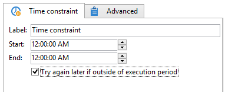

# 時間制限{#time-constraint}

**時間制限**&#x200B;アクティビティでは、タスクの実行を延期または中止できます。

アクティビティのラベルを入力し、ワークフロータスクを実行できる時間枠を指定します。 ワークフローは、この定義された実行ウィンドウ中にのみ実行され、その外で一時停止されたままになります。

「**[!UICONTROL 実行期間外で後でもう一度試す]**」オプションが選択されている場合、実行時間枠外でタスクを再開できます。 ワークフローアクションを休止した後に破棄する場合は、このオプションの選択を解除します。

