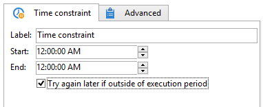

# 時間制限{#time-constraint}

**時間制限**&#x200B;アクティビティでは、タスクの実行を延期または中止できます。

アクティビティのラベルを入力し、ワークフロータスクを実行できる時間枠を指定します。 ワークフローは、この定義された実行ウィンドウ中にのみ実行され、その外で一時停止されたままになります。

「**[!UICONTROL 実行期間外の場合は後で再試行]**」オプションが選択されている場合、実行期間外でも、タスクを再起動できます。 停止期間の後で、ワークフローのアクションを完全に中止する場合、このオプションの選択を解除します。

