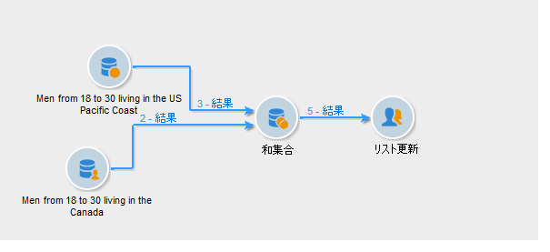

# 和集合{#union}

**[!UICONTROL 和集合]**&#x200B;は、複数のインバウンドアクティビティの結果を 1 つのターゲットにグループ化します。ターゲットは、受信したすべての結果から作成されます。そのため、すべての先行アクティビティは、和集合が実行される前に完了している必要があります。

>[!NOTE]
>
>**[!UICONTROL 和集合]**&#x200B;アクティビティの設定と使用について詳しくは、[このページ](targeting-workflows.md#combining-several-targets--union-)を参照してください。

## 和集合の例 {#union-example}

次の例では、リストを更新するために、2 つのクエリからの結果が結合されています。2 つのクエリは、受信者をターゲティングしています。このため、結果は同じテーブルに基づいています。

1. 「**[!UICONTROL 和集合]**」タイプのアクティビティを、2 つのクエリの直後、リストの更新タイプアクティビティの前に挿入してから開きます。
1. ラベルを入力できます。
1. この例では、クエリから生成された母集団に一貫したデータが含まれるので、「**[!UICONTROL キーのみ]**」紐付けメソッドを選択します。
1. クエリのために追加データを追加した場合、共有されているデータのみを保持するように指定できます。
1. 最終的な母集団のサイズを制限したい場合は、「**[!UICONTROL 生成された母集団のサイズを制限]**」オプションを選択します。

   受信者の最大数を入力するか、母集団が優先されるクエリを選択することによって、この最終的な数を指定します。

1. **[!UICONTROL 和集合]**&#x200B;アクティビティを承認してから、[リスト更新](list-update.md)アクティビティを設定します。
1. ワークフローを開始します。結果数が表示され、リスト更新アクティビティ内に定義されたリストが作成または更新されます。このリストには、両方のクエリのための受信者のセット、または該当する場合は前述の手順で定義した数が含まれます。

   

## 入力パラメーター {#input-parameters}

* tableName
* schema

各インバウンドイベントは、これらのパラメーターによって定義されるターゲットを指定する必要があります。

## 出力パラメーター {#output-parameters}

* tableName
* スキーマ
* recCount

この 3 つの値セットは、和集合によって生成されたターゲットを識別します。**[!UICONTROL tableName]** はターゲットの識別子を記録するテーブル名、**[!UICONTROL schema]** は母集団のスキーマ（通常は nms:recipient）、**[!UICONTROL recCount]** はテーブル内の要素の数です。
