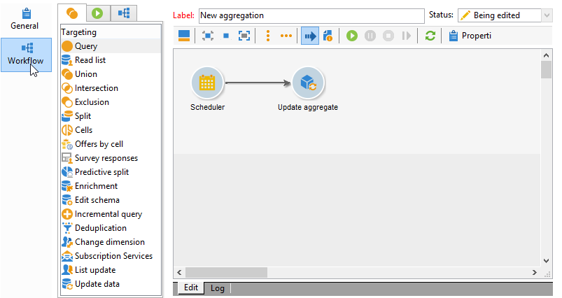

# 集計の更新{#update-aggregate}

集計は、レポーティングの目的のためキューブレベルで定義できます。集計の設定は、「**[!UICONTROL ワークフロー]**」タブでおこないます。

キューブおよび Adobe Campaign での集計の使用について詳しくは、[Campaign Classic v7 ドキュメント](https://experienceleague.adobe.com/docs/campaign-classic/using/reporting/designing-reports-with-cubes/about-cubes.html?lang=ja){target=&quot;_blank&quot;}を参照してください。

集計を更新するには、**[!UICONTROL 集計を更新]**&#x200B;アクティビティを編集し、キューブと更新する集計を選択します。

**完全更新**&#x200B;または&#x200B;**部分更新**&#x200B;を実行できます。

デフォルトでは、各計算時に完全更新が実行されます。部分的更新を有効にするには、該当するオプションを選択し、更新の条件を定義します。

**ベストプラクティス**：アクティビティを使用して、計算の更新頻度をスケジュール設定できる「**[!UICONTROL スケジューラー]**」アクティビティ。

