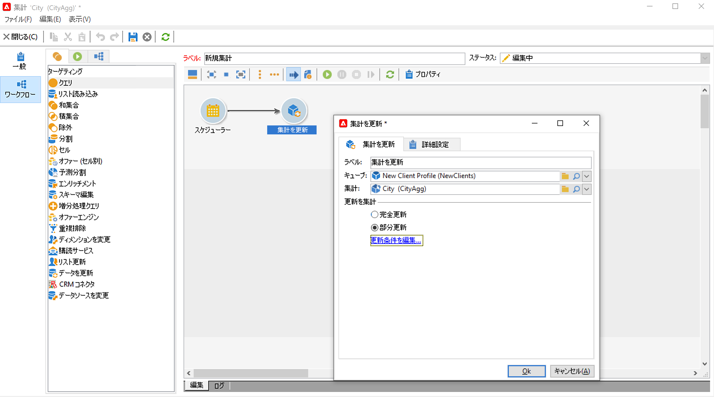
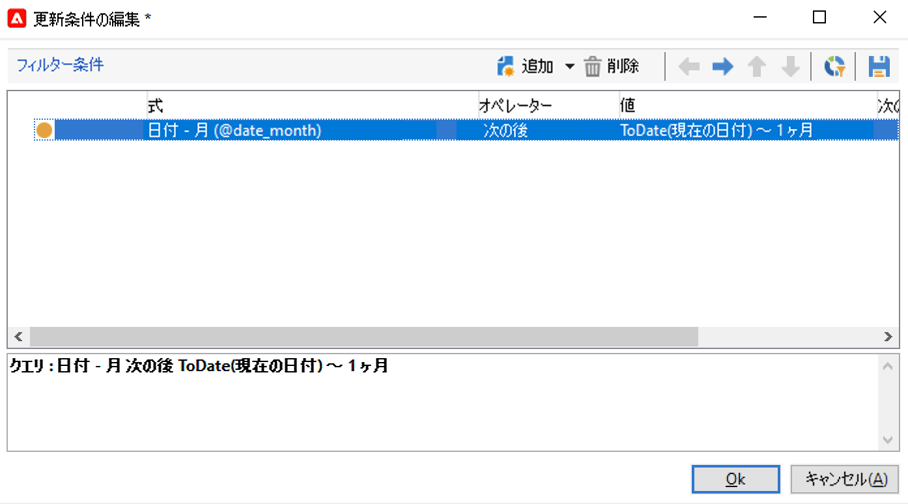

# 集計の更新{#update-aggregate}

レポート目的で[キューブ](../../v8/reporting/gs-cubes.md)に定義された集計は、特定のアクティビティで更新できます。集計の設定は、「**[!UICONTROL ワークフロー]**」タブで行います。

キューブと集計について詳しくは、[この節](../../v8/reporting/customize-cubes.md#calculate-and-use-aggregates)を参照してください。

集計を更新するには、**[!UICONTROL 集計を更新]**&#x200B;アクティビティを編集し、キューブと更新する集計を選択します。

**完全更新**&#x200B;または&#x200B;**部分更新**&#x200B;を設定できます。

デフォルトでは、各計算時に完全更新が実行されます。部分更新を有効にするには、オプションを選択し、更新の条件を定義します。

**[!UICONTROL スケジューラー]**&#x200B;アクティビティを追加して、計算の更新頻度を設定することをお勧めします。
