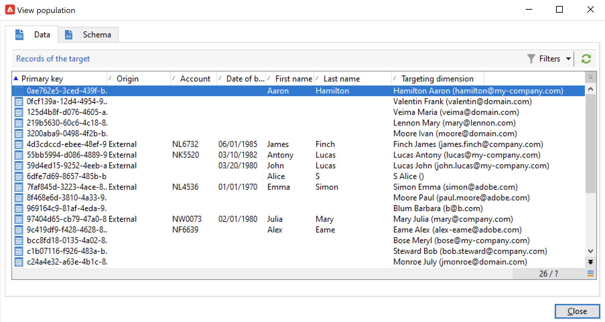
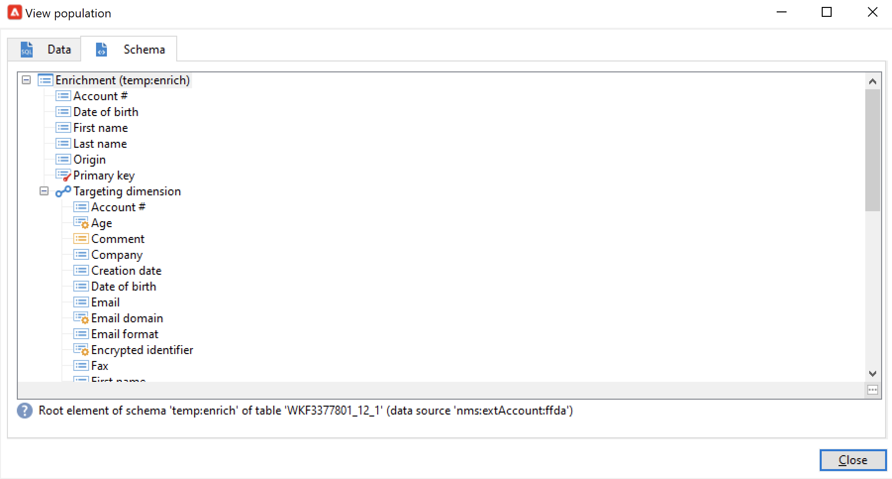
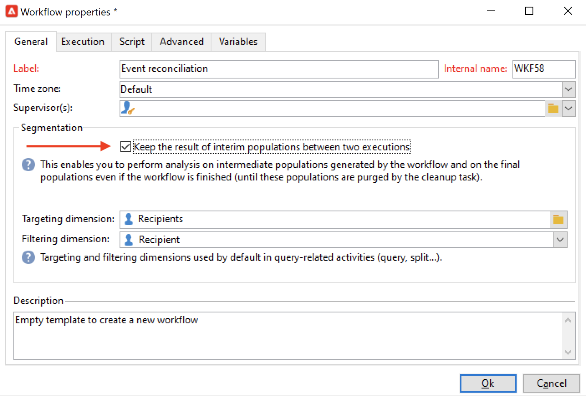
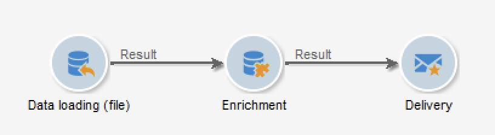
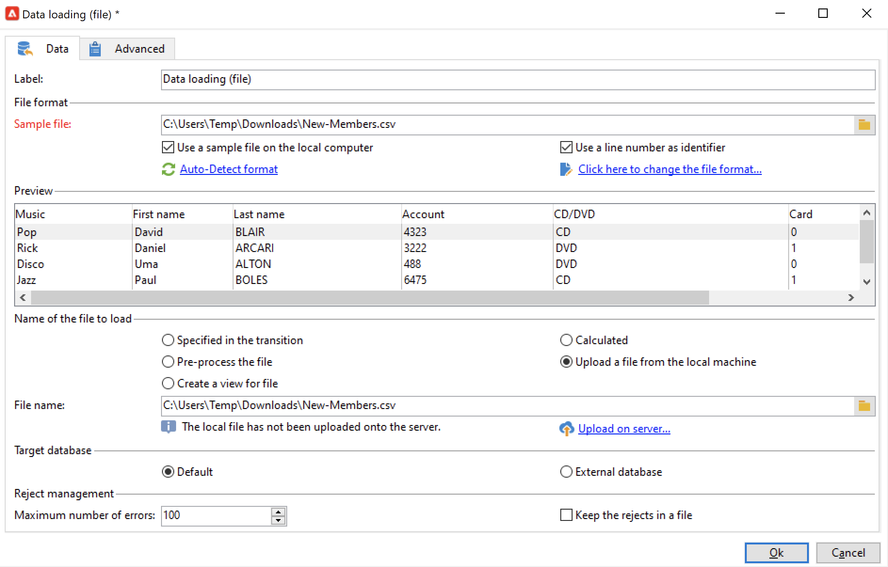
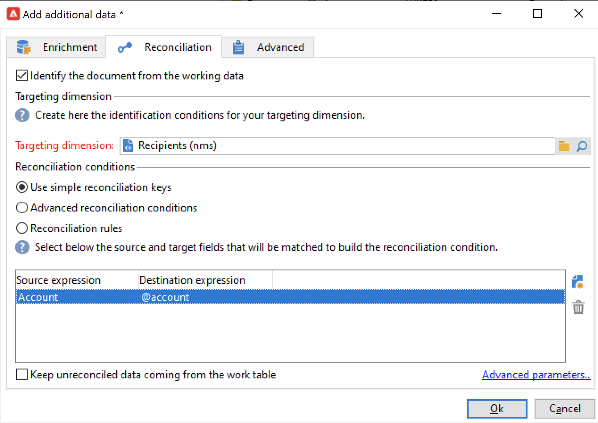
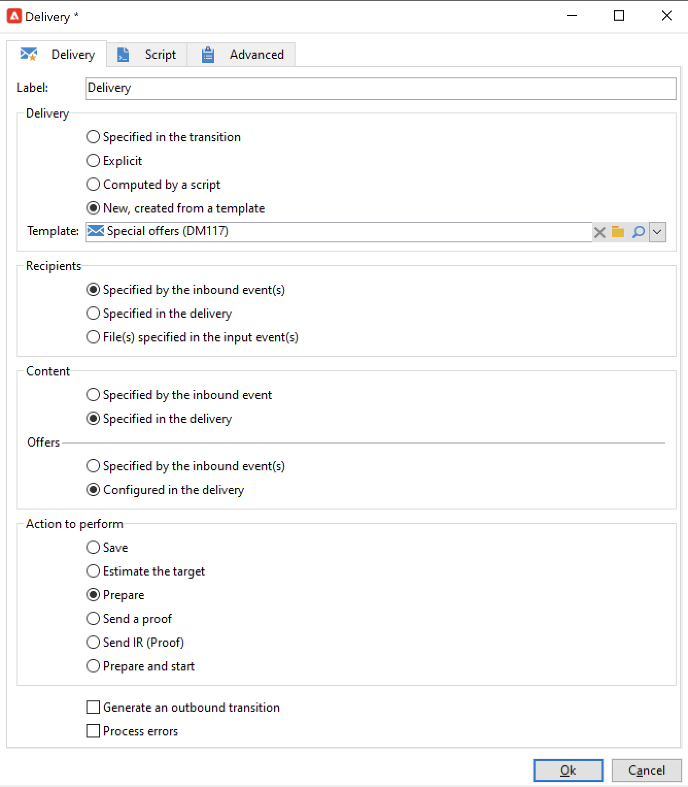
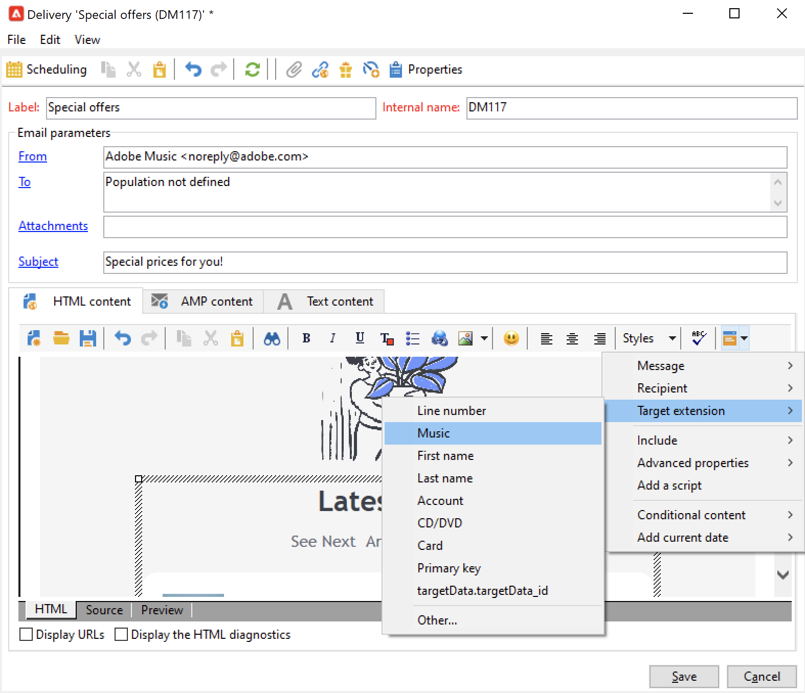
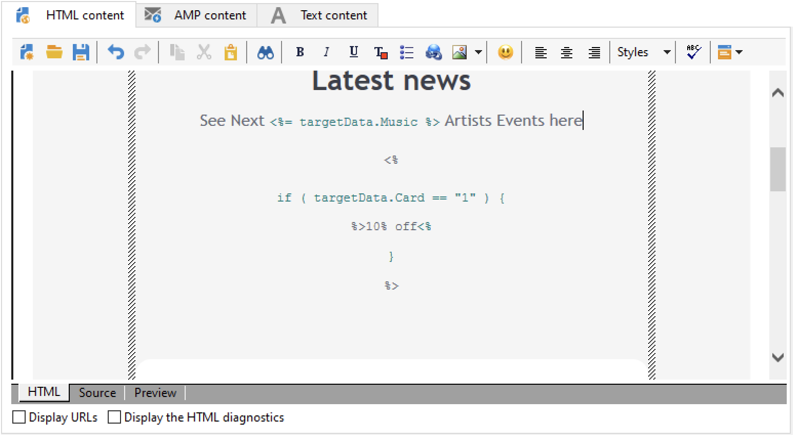
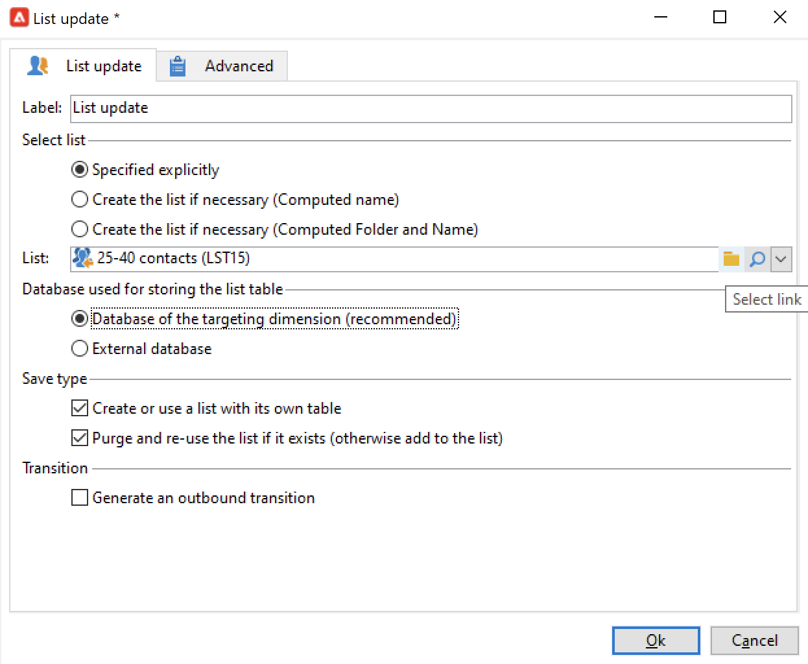

# ワークフローデータの使用{#how-to-use-workflow-data}

ワークフローアクティビティを使用すると、複数のタスクを実行できます。リストの作成によるデータベースの更新、購読の管理、ワークフローを介したメッセージの送信、配信とオーディエンスのエンリッチメントなどの使用例を以下に示します。

ワークフローの一連のユースケースについては、[この節](workflow-use-cases.md)を参照してください。

## データのライフサイクル {#data-life-cycle}

### ワークフローの一時ワークテーブル {#work-table}

ワークフローでは、1 つのアクティビティから別のアクティビティへ移されたデータは、一時的なワークテーブルに保存されます。


このデータは、適切なトランジションを右クリックすることで、表示して分析することができます。


これを実行するには、該当するメニューを選択します。

* **[!UICONTROL ターゲットを表示...]**

   このメニューには、ターゲット母集団に関して使用可能なデータが表示されます。

   

   ワークテーブルの構造にアクセスするには、「**[!UICONTROL スキーマ]**」タブをクリックします。

   

   詳しくは、[この節](monitor-workflow-execution.md#worktables-and-workflow-schema)を参照してください。

* **[!UICONTROL ターゲットを分析...]**

   このメニューは、トランジションのデータの統計とレポートを作成できる記述的分析ウィザードを表示します。

   詳しくは、[Campaign Classic v7 ドキュメント](https://experienceleague.adobe.com/docs/campaign-classic/using/reporting/analyzing-populations/about-descriptive-analysis.html?lang=ja){target=&quot;_blank&quot;}を参照してください。

ワークフローが実行されると、ターゲットデータはパージされます。最後のワークテーブルだけにアクセスできます。
ワークフローを設定し、すべての作業用テーブルをアクセス可能なまま維持することもできます。それには、「**[!UICONTROL 2 つの実行間の中間母集団の結果を保存]**」オプションを選択します。



>[!CAUTION]
>
>**実稼働**&#x200B;ワークフローでは、このオプションを&#x200B;**選択しない**&#x200B;でください。このオプションは、結果の分析に利用され、テスト目的でのみ設計されたものですので、開発環境またはステージング環境のみに限定して使用する必要があります。


### ターゲットデータの活用 {#target-data}

ワークフローの一時ワークテーブルに保存されたデータは、パーソナライゼーションタスクに使用できます。データは、パーソナライゼーションフィールドで使用できます。

これにより、例えば、配信のリストから収集したデータを使用できます。それには、次の構文を使用します。

```
%= targetData.FIELD %
```

「**[!UICONTROL ターゲット式]**」（targetData）タイプのパーソナライゼーション要素は、ターゲティングワークフローには使用できません。配信ターゲットは、ワークフロー内に作成され、配信のインバウンドトランジション内に指定される必要があります。

次の例では、パーソナライズしたメールで使用するために、顧客に関する情報のリストを収集しようとしています。次の手順に従います。

1. 情報を収集するワークフローを作成し、既にデータベース内にあるデータと紐付けをおこなってから、配信を開始します。

   

1. この例では、ファイルの内容は次のようになります。

   ```
   Music,First name,Last name,Account,CD/DVD,Card
   Pop,David,BLAIR,4323,CD,0
   Rock,Daniel,ARCARI,3222,DVD,1
   Disco,Uma,ALTON,0488,DVD,0
   Jazz,Paul,BOLES,6475,CD,1
   Jazz,David,BOUKHARI,0841,DVD,1
   [...]
   ```

   ファイルを読み込むには、**[!UICONTROL データ読み込み (ファイル)]** アクティビティを次のように設定します。

   

1. **[!UICONTROL エンリッチメント]**&#x200B;アクティビティを設定して、収集したデータを、既に Adobe Campaign データベース内にあるデータと紐付けます。ここでは、紐付けキーがアカウント番号です。

   

1. 次に、テンプレートに基づいて作成され、インバウンドトランジションによって受信者が指定された「**[!UICONTROL 配信]**」を設定します。

   

   >[!CAUTION]
   >
   >トランジションに含まれているデータのみが、配信のパーソナライズに使用されます。「**targetData**」タイプのパーソナライゼーションフィールドは、「**[!UICONTROL 配信]**」アクティビティのインバウンドの母集団用にのみ使用可能です。

1. 配信テンプレートで、ワークフローで収集したフィールドを使用します。

   それには、「**[!UICONTROL ターゲット式]**」タイプのパーソナライゼーションフィールドを挿入します。

   

   ここでは、ワークフローで収集されたファイル内に記述された顧客の好きな音楽ジャンルとメディアタイプ（CD または DVD）を挿入します。

   さらに、ロイヤルティのあるカード所有者（例えば Card の値が 1 と等しい受信者）にクーポンを追加します。


   

   「**[!UICONTROL ターゲット式]**」（targetData）タイプのデータが、すべてのパーソナライゼーションフィールドと同じ特性を使用して、配信に挿入されます。これらのデータは、本文、リンクラベル、またはリンク自体に使用されます。


## データベースの更新 {#update-the-database}

収集したすべてのデータは、データベースを更新するために、または配信内で使用できます。例えば、メッセージのコンテンツのパーソナライゼーション機能をエンリッチメントすること（メッセージ内に契約件数を含める、過去 1 年間のショッピングカートの平均購入額を指定するなど）や、母集団のターゲティングを詳細におこなうこと（契約の共有者にメッセージを送る、オンラインサービスの高額契約者上位 1,000 人をターゲティングするなど）ができます。このデータは、リストにエクスポートまたはアーカイブできます。

### リストの更新  {#list-updates}

Adobe Campaign データベースのデータおよび既存のリストは、2 つの専用アクティビティを使用して更新できます。

* 「**[!UICONTROL リスト更新]**」アクティビティを使用して、データリスト内にワークテーブルを保存できます。

   既存のリストを選択するか、新規リストを作成することができます。ここでは、名前が自動生成されます（場合によってはレコードフォルダーも）。

   

   [リストの更新](list-update.md)を参照してください。

* **[!UICONTROL データを更新]**&#x200B;アクティビティでは、データベースのフィールドを一括で更新します。

   詳しくは、[データを更新](update-data.md)を参照してください。

### 購読の管理 {#subscription-management}

ワークフローを介した受信者の情報サービスへの購読登録と情報サービスからの購読登録解除については、[購読サービス](subscription-services.md)を参照してください。
