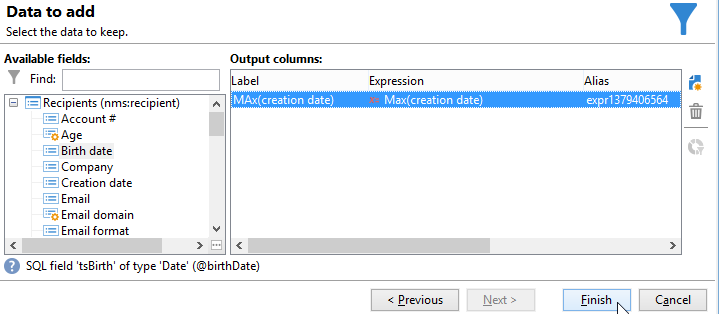
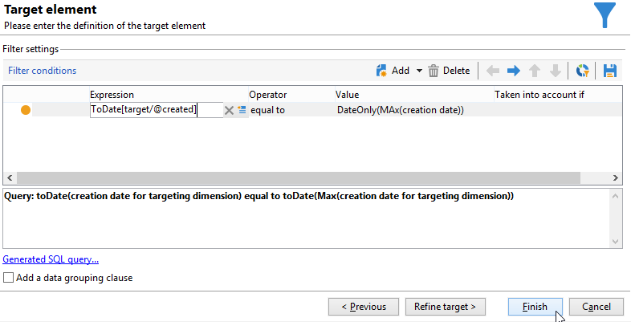

# 集計の使用{#using-aggregates}

この使用例では、データベースに追加された最新の受信者を自動的に特定する方法を詳しく説明します。

集計を使用して受信者を作成した既知の最新の日付と、データベース内にある受信者の作成日付を、次のプロセスを使用して比較します。同じ日に作成された受信者もすべて選択されます。

受信者に対して「**作成日付 = 最大（作成日付）**」タイプフィルターを実行するには、ワークフローを実行して、以下のプロセスに従う必要があります。

1. 基本的なクエリを使用して、データベース内の受信者を取得します。この手順について詳しくは、[クエリの作成](query.md#creating-a-query)を参照してください。
1. 「**最大（作成日付）**」集計機能で生成された結果を使用して受信者を作成した最新の既知の日付を割り出します。
1. 各受信者を、同じスキーマの、集計機能の結果とリンクします。
1. 編集済みのスキーマで集計をおこない、受信者をフィルタリングします。

## 手順 1：集計結果の計算 {#step-1--calculating-the-aggregate-result}

1. クエリを作成します。ここでの目標は、データベース内のすべての受信者について、最新の既知の作成日付を割り出すことにあります。そのため、クエリには、フィルターは含まれません。
1. 「**[!UICONTROL データを追加]**」を選択します。
1. 開いているウィンドウで「**[!UICONTROL フィルタリングディメンションにリンクされたデータ]**」を選択し、次に、「**[!UICONTROL フィルタリングディメンションデータ]**」を選択します。
1. **[!UICONTROL 追加するデータ]**&#x200B;ウィンドウで、受信者テーブルの「**作成日**」フィールドの最大値を割り出す列を追加します。式エディターを使用するか、「**max(@created)**」と「**[!UICONTROL 式]**」列のフィールドに直接入力します。「**[!UICONTROL 終了]**」ボタンをクリックします。

   

1. 「**[!UICONTROL 追加データを編集]**」をクリックし、「**[!UICONTROL 詳細設定パラメーター...]**」をクリックします。「**[!UICONTROL ターゲティングディメンションのプライマリキーの自動追加を無効にする]**」オプションをクリックします。

   このオプションにより、どの受信者も結果として表示されなくなり、明示的に追加したデータは維持されません。このケースでは、受信者を作成した最新の日付を参照します。

   「**[!UICONTROL 重複行を削除（DISTINCT）]**」オプションのチェックボックスをオンのままにします。

## 手順 2：集計機能で得られた結果と受信者とのリンク {#step-2--linking-the-recipients-and-the-aggregation-function-result}

受信者を処理するクエリと、集計の計算をおこなうクエリをリンクするに、「スキーマ編集」アクティビティを使用する必要があります。

1. 受信者について問い合わせるクエリをメインセットとして定義します。
1. 「**[!UICONTROL リンク]**」タブで新しいリンクを追加し、以下の手順に従い、開いているウィンドウに情報を入力します。

   * 集計に関係する一時なスキーマを選択します。このスキーマのデータは、メインセットのメンバーに追加されます。
   * 「**[!UICONTROL 単純結合を使用]**」を選択して、メインセットのすべての受信者に集計結果をリンクします。
   * 最後に、リンクが「**[!UICONTROL タイプ 11 シンプルリンク]**」となるように指定します。

   

これにより、集計結果がすべての受信者とリンクします。

## 手順 3：集計を使用した受信者のフィルタリング {#step-3--filtering-recipients-using-the-aggregate-}

リンクが確立すると、集計結果と対象の受信者は同じ一時スキーマの一部となります。そのため、このスキーマ上にフィルターを作成して、受信者の作成日付と最新の既知の日付とを比較することができます。これらの日付は集計機能により表示されます。このフィルターは「分割」アクティビティを使用して実行します。

1. 「**[!UICONTROL 一般]**」タブでターゲティングディメンションとして「**受信者**」を、また、（「インバウンドトランジションスキーマ」アクティビティでフィルタリングをおこなう）フィルタリングディメンションとして「**スキーマを編集**」をそれぞれ選択します。
1. 「**[!UICONTROL サブセット]**」タブで「**[!UICONTROL インバウンド母集団に対するフィルター条件を追加]**」を選択し、「**[!UICONTROL 編集...]**」をクリックします。
1. 式エディターを使用して、集計で割り出した作成日付と受信者の作成日付との間に等価基準を追加します。

   データベースのデータタイプフィールドは通常、ミリ秒で保存されます。そのため、同じミリ秒内だけに作成された受信者を取得しないよう、ミリ秒を 1 日に拡張する必要があります。

   これをおこなうには、「**ToDate**」関数を使用して日付と時間をシンプルなものに変換します。この関数は式エディターで使用できます。

   この基準に使用する式は次のようになります。

   * **[!UICONTROL 式]**：`toDate([target/@created])`。
   * **[!UICONTROL 値]**：`toDate([datemax/expr####])`。ここで、expr#### は、集計機能のクエリで指定した集計と関連があります。

   

この結果、「分割」アクティビティで得られる結果は、最新の既知の作成日付と同じ日付に作成された受信者と関連性があります。

これにより、「リスト更新」や「配信」などのほかのアクティビティを追加してワークフローをエンリッチメントすることができます。
