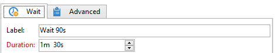

# 待機{#wait}

「**待機**」アクティビティは、数秒から数ヶ月間の任意の遅延時間が経過した後で、トランジションを有効化します。待機は、ほかのタスクの実行をブロックしません。ワークフローは、このタスクが保留になっている間に並行してタスクを実行できます。

下例の図に示すように、エディターを使用してラベルと待機時間を入力できます。

「**[!UICONTROL 期間]**」フィールドの値は、選択した単位（オペレーターの地域設定）で表すことができます。

* 地域設定が指定されていない場合は、**s**（秒）、**m**（分）、**h**（時間）、**d**（日）、**y**（年）になります。承認時に、値は最も読みやすい単位に自動的に変換されます。

   デフォルトの単位は日（**d**）です。

* 一方、例えば、地域設定が「Français」に設定されている場合は、**s**（秒）、**mn**（分）、**h**（時間）、**j**（日）、**m**（月）、**a**（年）のようになります。承認時に、値は最も読みやすい単位に自動的に変換されます。上の例では、「**90s**」は「**1mn 30s**」のように変換されます。

   デフォルトの単位は日（**d**）です。
