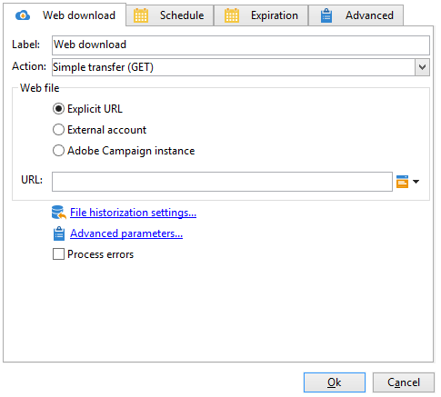

# Web ダウンロード{#web-download}

「**Web ダウンロード**」アクティビティは、明示的 URL、外部アカウント、Adobe Campaign インスタンス上のファイルのダウンロードを開始します。HTTP プロトコルが使用されます。GET または POST のいずれかによるダウンロードです。

## プロパティ {#properties}

1. **Web ファイルの選択**

   インターネット経由でファイルをダウンロードする方法としては、ファイルの URL を直接指定する方法、ファイルが保存されている外部の HTTP アカウントを使用する方法、Adobe Campaign インスタンスからファイルをダウンロードする方法があります。使用できるパラメーターは以下のとおりです。

   * ダウンロードするファイルの URL を直接指定するには、「**[!UICONTROL 明示的 URL]**」オプションを選択し、該当するフィールドに URL を入力します。この URL は変数データで構成することもできます。

      

   * 「**[!UICONTROL 外部アカウント]**」を使用する場合は、ドロップダウンからアカウントを選択し、ダウンロードするファイルを指定します。

      外部アカウントは、Adobe Campaign ツリーの&#x200B;**[!UICONTROL 管理／プラットフォーム／外部アカウント]**&#x200B;ノードで設定できます。**[!UICONTROL リンクを編集]**&#x200B;アイコンをクリックすると、外部アカウントのパラメーターを編集できます。

      

   * Adobe Campaign インスタンスからファイルをダウンロードするには、「**[!UICONTROL Adobe Campaign インスタンス]**」オプションを選択します。

      

1. **ファイルの履歴化**

   「**[!UICONTROL ファイル履歴化設定...]**」リンクを使用して、ファイルのストレージディレクトリとこのディレクトリのパージ頻度を指定できます。

   

   次のオプションを使用できます。

   * **[!UICONTROL デフォルトストレージディレクトリを使用]**：ファイルの処理がおこなわれる前に、必ずファイルを移動します。このオプションを選択すると、ファイルはデフォルトのストレージディレクトリ（Adobe Campaign インストールフォルダーの **vars** ディレクトリ）に移されます。ストレージディレクトリを指定するには、チェックボックスの選択を解除し、「**[!UICONTROL ストレージディレクトリ]**」フィールドにディレクトリのパスを入力します。
   * **[!UICONTROL ファイル数]**：ストレージディレクトリに保持するファイルの最大数を入力します。
   * **[!UICONTROL 最大サイズ（MB 単位）]**：ストレージディレクトリの最大容量（MB）を指定します。

   各ファイルは、定義したパージルールが適用されるまで、ディレクトリに 24 時間保持されます。パージはアクティビティの開始直前におこなわれるので、作業中のワークフローファイルには影響しません。

   ファイルは、作成日にしたがって古いものから削除されます。最も古いファイルは、両方のパージルールが確定するまでパージされます。したがって、ファイルの最大数を 100 に設定した場合、ワークフローが開始される前に、常に最新の 100 個のファイルがストレージディレクト内に存在し、それらのファイルが進行中のワークフローで処理されていきます。

   ファイルの数とディレクトリの容量を制限しない場合は、「**[!UICONTROL ファイル数]**」と「**[!UICONTROL 最大サイズ（MB 単位）]**」オプションの値をそれぞれ 0 に設定します。

1. **詳細設定パラメーター**

   「**[!UICONTROL 詳細設定パラメーター]**」リンクを使用して、次の追加オプションを設定できます。

   

   「**[!UICONTROL エラーを処理]**」オプションについて詳しくは、[エラーを処理](monitor-workflow-execution.md#processing-errors)を参照してください。

## 出力パラメーター {#output-parameters}

* filename：ダウンロードしたファイルの完全名。
