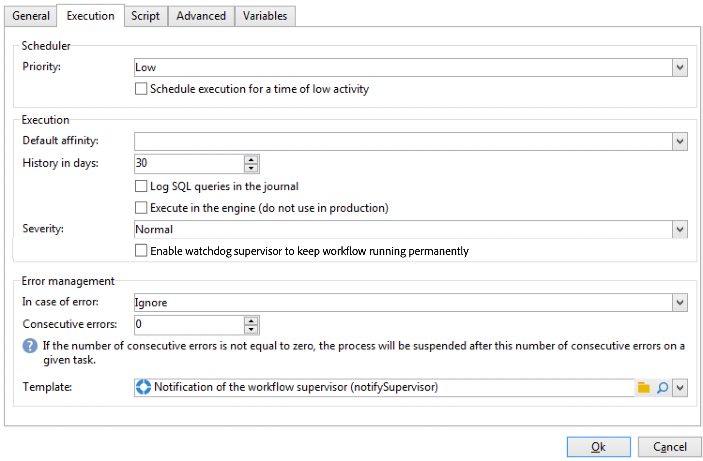

# ワークフローのプロパティ{#workflow-properties}

## 「実行」タブ {#execution-tab}

ワークフローの&#x200B;**[!UICONTROL プロパティ]**&#x200B;ウィンドウの「**[!UICONTROL 実行]**」タブは次の 3 つのセクションに分かれています。

### スケジューラー {#scheduler}

このセクションは、キャンペーンワークフローにのみ表示されます。

* **[!UICONTROL 優先順位]**

   このワークフローエンジンは、このフィールドに定義された優先度の基準に応じて、ワークフローの実行を処理します。
例えば、優先順位が「**[!UICONTROL 平均]**」のワークフローはすべて、優先順位が「**[!UICONTROL 低]**」のワークフローの前に実行されます。

* **[!UICONTROL 実行スケジュールを低アクティビティの時間に設定]**

   このオプションでは、ワークフローの起動を低アクティビティの時間帯へと延期することができます。一部のワークフローはデータベースエンジンのリソースの観点からみて、コストが割高になることがあります。このような場合、実行スケジュールを夜間などの低アクティビティの時間に設定するようお勧めします。低アクティビティの時間設定は、「**[!UICONTROL キャンペーンのプロセス]**」テクニカルワークフローでおこないます。

### 実行 {#execution}

* **[!UICONTROL デフォルトのアフィニティ]**

   インストールに複数のワークフローサーバーが存在する場合、このフィールドを使用して、ワークフローを実行するマシンを選択します。このフィールドで定義した値がどのサーバーにも存在しない場合、ワークフローは保留中となります。

* **[!UICONTROL 履歴（日数）]**

   データベースのワークテーブルには、タスク、イベント、ログなどの実行履歴が保存されています。
このフィールドでは、対象のワークフローをアーカイブしておく日数を定義できます。最も古いアーカイブはクリーンアッププロセスが 1 日に 1 回削除します。このフィールドの値がゼロの場合、アーカイブは削除されません。

* **[!UICONTROL SQL クエリをジャーナルに記録]**

   この機能を設定できるのは上級ユーザーに限られます。クエリ、和集合、積集合などのターゲット設定アクティビティを含むワークフローに関係する機能です。このオプションのチェックボックスがオンであると、ワークフローの実行中にデータベースに送信される SQL クエリが Adobe Campaign に表示されるので、この内容を分析することで、クエリの最適化や問題の診断が可能になります。

   このオプションが有効な場合、キャンペーンワークフローを除くワークフローや「**[!UICONTROL プロパティ]**」アクティビティに追加される「**[!UICONTROL SQL ログ]**」タブに、クエリが表示されます。「**[!UICONTROL 監査]**」タブには、SQL クエリが含まれます。

   

* **[!UICONTROL エンジン内で実行]**

   このオプションはデバッグのみで使用し、本番では絶対に使用しないでください。このオプションが有効になると、対象のワークフローのみが優先され、そのワークフローが完了するまで、ほかのワークフローはすべて停止されます。

### エラー管理 {#error-management}

* **[!UICONTROL トラブルシューティング]**

   このフィールドでは、ワークフロータスクでエラーが発生した場合におこなうアクションを定義できます。次の 2 つのオプションが使用可能です。

   * **[!UICONTROL プロセスの停止]**：ワークフローは自動的に停止され、ワークフローのステータスは「**[!UICONTROL 失敗]**」に変わります。問題が解決したら、「**[!UICONTROL 開始]**」ボタンまたは「**[!UICONTROL 再開]**」ボタンを使用してワークフローを再起動します。
   * **[!UICONTROL 無視]**：エラーをトリガーしたタスクのステータスは「**[!UICONTROL 失敗]**」に変わりますが、ワークフローのステータスは「**[!UICONTROL 開始済み]**」のままです。この設定は繰り返しタスクと関係があり、分岐にスケジューラーが含まれる場合、ワークフローは次に実行されるときに、正常に起動します。

* **[!UICONTROL 連続エラー]**

   このフィールドは、「**[!UICONTROL エラーの場合]**」フィールドで「**[!UICONTROL 無視]**」の値が選択されたときに有効になります。プロセスを停止するまでに無視するエラーの数を指定できます。この数に達すると、ワークフローのステータスが「**[!UICONTROL 失敗]**」に変わります。このフィールドの値が 0 の場合、エラーの数にかかわらず、ワークフローが停止することはありません。

* **[!UICONTROL テンプレート]**

   このフィールドでは、ステータスが「**[!UICONTROL 失敗]**」に変わったときにワークフロースーパーバイザーに送信する通知テンプレートを選択できます。

   テンプレートのプロファイルに E メールアドレスが記入されている場合は、E メールで通知がおこなわれます。ワークフロースーパーバイザーを定義するには、プロパティ（「**[!UICONTROL 一般]**」タブ）の「**[!UICONTROL スーパーバイザー]**」フィールドに移動します。

   

   ログオン後に受信者が問題の解決にあたれるよう、「**[!UICONTROL ワークフロースーパーバイザーへの通知]**」デフォルトテンプレートには、Web 経由で Adobe Campaign コンソールにアクセスするためのリンクがあります。

   パーソナライズされたテンプレートを作成するには、**[!UICONTROL 管理／キャンペーン管理／技術配信／テンプレート]**&#x200B;の順に移動します。
