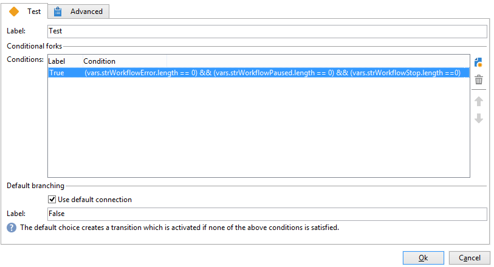
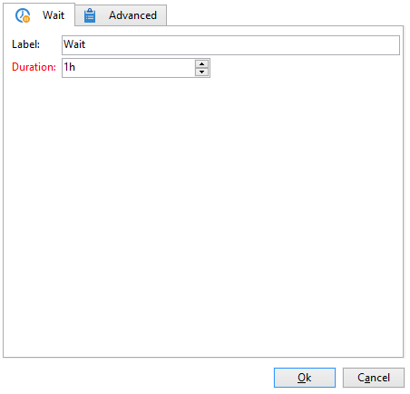
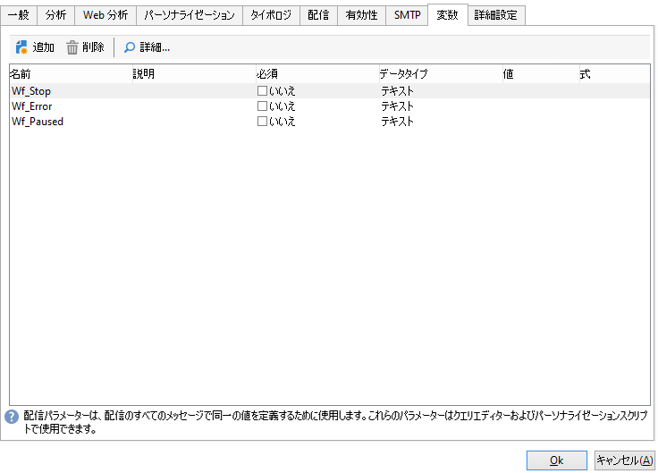
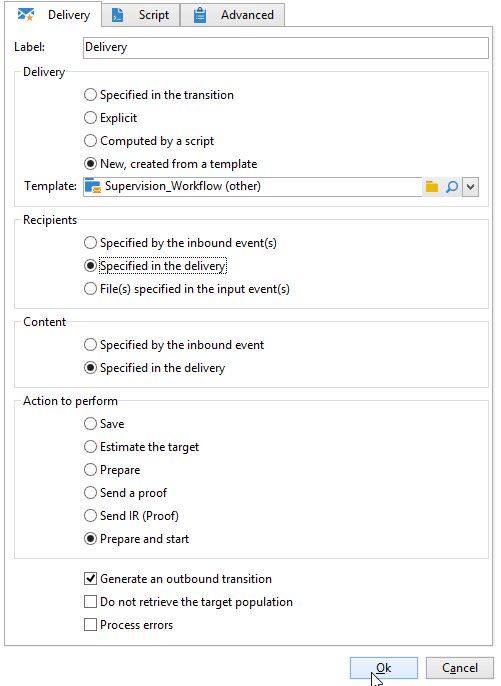
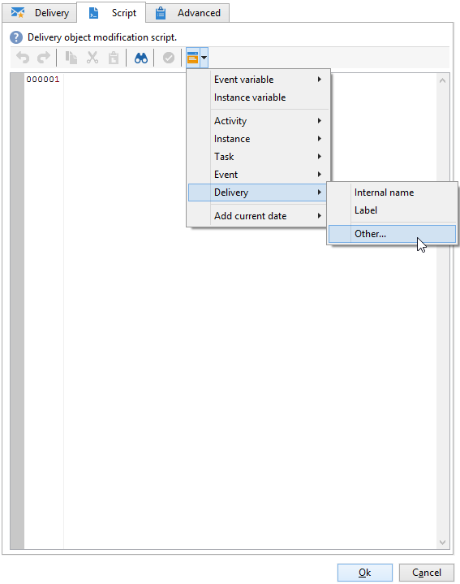
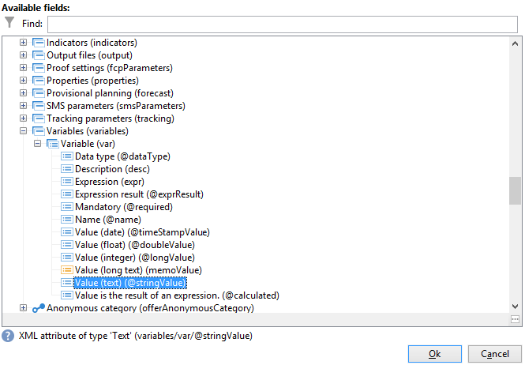

# ユースケース：ワークフローの監視{#supervising-workflows}

この使用例では、一連のワークフローの状態（一時停止、停止、エラーあり）を監視するワークフローの作成について詳しく説明します。

目的は次のとおりです。

* ワークフローを使用して、ビジネスワークフローの集合を管理する
* 「配信」アクティビティ経由でスーパーバイザーにメッセージを送信する

一連のワークフローの状態を監視するには、次の手順に従う必要があります。

1. 監視ワークフローの作成
1. ワークフローが一時停止、停止、エラーありの状態であるかどうかを判断するための JavaScript の記述
1. **[!UICONTROL テスト]**&#x200B;アクティビティの作成
1. 配信テンプレートの準備

>[!NOTE]
>
>ワークフローに加え、キャンペーン&#x200B;**ワークフローヒートマップ**&#x200B;を使用することで、現在実行中のワークフローの詳細を分析することができます。詳しくは、[該当する節](heatmap.md)を参照してください。
>
>**ワークフローの実行を監視**&#x200B;する方法について詳しくは、[この節](monitor-workflow-execution.md)を参照してください。

## 手順 1：監視ワークフローの作成 {#step-1--creating-the-monitoring-workflow}

監視対象のワークフローフォルダーは「**CustomWorkflows**」フォルダーです。このフォルダーは&#x200B;**管理／プロダクション／テクニカルワークフロー**&#x200B;ノードに保存されています。このフォルダーには、ビジネスワークフローのセットが含まれています。

**監視ワークフロー**&#x200B;は、「テクニカルワークフロー」フォルダーのルートに保存されます。使用するラベルは、「**監視**」です。

以下のスキーマは、アクティビティのシーケンスを表します。


このワークフローは次の要素から構成されます。

* 1 つの「**開始**」アクティビティ
* ビジネスワークフローフォルダーの分析をおこなう 1 つの「**JavaScript コード**」アクティビティ
* スーパーバイザーへの配信と、ワークフローの再起動をおこなう 1 つの「**テスト**」アクティビティ
* メッセージのレイアウトをおこなう 1 つの「**配信**」アクティビティ
* ワークフローの反復処理の間のリードタイムを制御する 1 つの「**待機**」アクティビティ

## 手順 2：JavaScript の記述 {#step-2--writing-the-javascript}

JavaScript コードの 1 番目の箇所は、ワークフローが「一時停止」（@state == 13）、「エラー」（@failed == 1）、「停止」（@state == 20）の状態であるかどうかを特定する&#x200B;**クエリ（queryDef）**&#x200B;に相当します。

監視対象のワークフローフォルダーの&#x200B;**内部名**&#x200B;は次の条件に基づき付与されます。

```
<condition boolOperator="AND" expr="[folder/@name] = 'Folder20'" internalId="1"/>
```

```
var strError = "";
var strPaused = "";
var strStop = "";

var queryWkfError = xtk.queryDef.create(
  <queryDef schema="xtk:workflow" operation="select">
    <select>
      <node expr="@internalName"/>
      <node expr="@state"/>
      <node expr="@label"/>
      <node expr="@failed"/>
      <node expr="@state"/>   
    </select>
    <where id="12837805386">
      <condition boolOperator="AND" expr="[folder/@name] = 'Folder20'" internalId="1"/>
        <condition boolOperator="AND" internalId="2">
          <condition boolOperator="OR" expr="@state = 20" internalId="3"/>
          <condition expr="@state = 13" internalId="4"/>
        </condition>  
    </where>
  </queryDef>
);
var ndWkfError = queryWkfError.ExecuteQuery(); 
```

JavaScript コードの 2 番目の箇所は、クエリの実行中に回復がおこなわれた場合にその状態に応じて、**各ワークフローについてのメッセージを表示します**。

>[!NOTE]
>
>作成した文字列は、ワークフローのイベント変数に読み込む必要があります。

```
for each ( var wkf in ndWkfError.workflow ) 
{
  if ( wkf.@state == 13 )  // Status 13 = paused
  {
    if ( wkf.@failed == 1 )
      strError += "<li>Workflow '" + wkf.@internalName + "' with the label '" + wkf.@label + "'</li>";
    else
      strPaused += "<li>Workflow '" + wkf.@internalName + "' with the label '" + wkf.@label + "'</li>";
  }
  
  if ( wkf.@state == 20 )  // Status 20 = stop
    strStop += "<li>Workflow '" + wkf.@internalName + "' with the label '" + wkf.@label + "'</li>";
}

vars.strWorkflowError = strError;
vars.strWorkflowPaused = strPaused;
vars.strWorkflowStop = strStop;
```

## 手順 3：「テスト」アクティビティの作成 {#step-3--creating-the--test--activity}

「テスト」アクティビティでは、配信をおこなう必要があるかどうか、「待機」アクティビティに基づき監視ワークフローで別のサイクルを実行する必要があるかどうかを判断できます。

**3 つのイベント変数、「vars.strWorkflowError」、「vars.strWorkflowPaused」、「vars.strWorkflowStop」のうち少なくとも 1 つが有効であると、**&#x200B;スーパーバイザーに配信がおこなわれます。



「待機」アクティビティは、一定間隔でワークフローの監視を再起動するよう設定することができます。この使用例では、**待機時間は 1 時間に設定**&#x200B;されています。



## 手順 4：配信の準備 {#step-4--preparing-the-delivery}

「**配信**」アクティビティは、**リソース／テンプレート／配信テンプレート**&#x200B;ノードに保存されている配信テンプレートに基づき実行されます。

このテンプレートには次の内容を含める必要があります。

* **スーパーバイザーの E メールアドレス**
* **パーソナライズされたテキストを挿入するための HTML コンテンツ**

   

   宣言する 3 つの変数（WF_Stop、WF_Paused、WF_Error）は、3 つのワークフローイベント変数に相当します。

   これらの変数は、配信テンプレートプロパティの「**変数**」タブで宣言する必要があります。

   **ワークフローイベント変数の内容**&#x200B;を復元するには、JavaScript コードで返される値で初期化する配信に固有の変数を宣言する必要があります。

   配信テンプレートには次のコンテンツがあります。

   

テンプレートが作成され承認されたら、「**配信**」アクティビティを設定して次のことをおこなう必要があります。

* 前に作成した配信テンプレートに「配信」アクティビティをリンクする
* 配信テンプレートに固有の変数にワークフローのイベント変数をリンクする

「**配信**」アクティビティをダブルクリックして、次のオプションを選択します。

* 配信：「**新規（テンプレートから作成）**」を選択し、前に作成した配信テンプレートを選択します。
* **「受信者」フィールドと「コンテンツ」フィールド**&#x200B;で「**配信で指定**」を選択します。
* 実行するアクション：「**準備と開始**」を選択します。
* 「**エラーを処理**」オプションのチェックボックスをオフにします。

   

* 「**配信**」アクティビティの「**スクリプト**」タブに移動し、パーソナライゼーションフィールドメニューから 3 つの&#x200B;**文字列**&#x200B;タイプ変数を追加します。

   

   

   これらの変数は次のように宣言します。

   ```
   delivery.variables._var[0].stringValue = vars.strWorkflowError;
   delivery.variables._var[1].stringValue = vars.strWorkflowPaused;
   delivery.variables._var[2].stringValue = vars.strWorkflowStop; 
   ```

モニタリングワークフローが起動されると、サマリーが受信者に送信されます。
