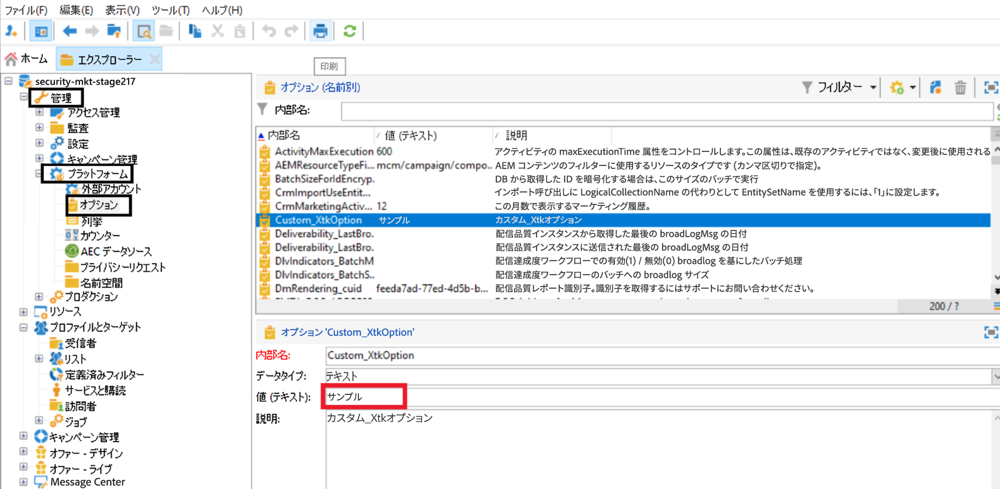
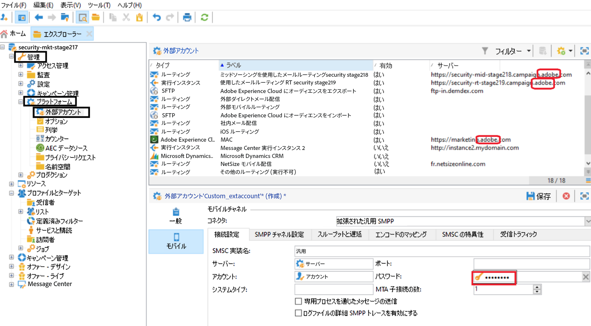

# テクニカルノート：資格情報ローテーションガイド {#ac-customer-credentials}

お客様は、侵害のリスクを軽減するために、定期的に資格情報を新しいセットへと置き換える責任があります。

## Adobe Campaign オプションの資格情報 {#ac-options-credentials}

Adobe Campaign エクスプローラーから、**管理／プラットフォーム／オプション**&#x200B;ノードを使用すると、Adobe Campaign オプションを修正できます。ここに資格情報を保存している場合は、必ずローテーションしてください。

## 外部アカウントの資格情報 {#ac-accounts-credentials}

**管理／プラットフォーム／外部アカウント**&#x200B;ノードを使用すると、Adobe Campaign 外部アカウントを修正できます。

外部アカウントに保存されているすべての資格情報をローテーションしてください。

>[!CAUTION]
>
>アドビが管理する資格情報は変更&#x200B;**しない**&#x200B;でください。`adobe` 関連サーバーを持つ外部アカウントは変更しないでください。

特定の技術的な `mc*`（例：mc1、mc2 など）および `Interaction*`（例：interaction1、interaction2 など）オペレーターについては、以下の 2 つのアプローチのいずれかに従うことができます。

1. アドビでは、このようなオペレーターの資格情報を変更して、お客様と共有できます。お客様側でこれらのオペレーターの資格情報を更新するまで、これらのオペレーターを使用するすべての統合は機能を停止します。

1. アドビでは、既存の各オペレーターに対応する&#x200B;**新しい**&#x200B;オペレーターを作成し、お客様と共有できます。お客様がこれらの新しいオペレーターに切り替えた後、アドビ側で古いオペレーターをすべて削除します。

## Mobile Services 秘密鍵／証明書  {#ac-key-credentials}

Mobile Services 関連の秘密鍵と証明書のローテーションについては、以下のリンクを参照してください。

* Android については、[このドキュメント](https://experienceleague.adobe.com/ja/docs/campaign-classic/using/sending-messages/sending-push-notifications/configure-the-mobile-app/configuring-the-mobile-application-android){target="_blank"}を参照してください。
**Android モバイルアプリケーションの作成／API バージョンの設定**&#x200B;の節を参照してください。

* iOS については、[このドキュメント](https://experienceleague.adobe.com/ja/docs/campaign-classic/using/sending-messages/sending-push-notifications/configure-the-mobile-app/configuring-the-mobile-application){target="_blank"}を参照してください。
**iOS モバイルアプリの作成／認証モード**&#x200B;の節を参照してください。

## GPG キー {#ac-gpg-credentials}

GPG キーのローテーションについては、次の手順に従う必要があります。

1. 既存のキーを使用して、既存のデータを復号化します。[詳細情報](https://experienceleague.adobe.com/ja/docs/control-panel/using/instances-settings/gpg-keys-management#decrypting-data){target="_blank"}

1. 新規 GPG キーペアを作成します。GPG キーの管理について詳しくは、[このドキュメント](https://experienceleague.adobe.com/ja/docs/control-panel/using/instances-settings/gpg-keys-management#decrypting-data){target="_blank"}を参照してください。

1. すべてのワークフローで使用されている既存の GPG キーを、新しく作成したキーに置き換えます。

1. 既存の GPG キーを削除します。