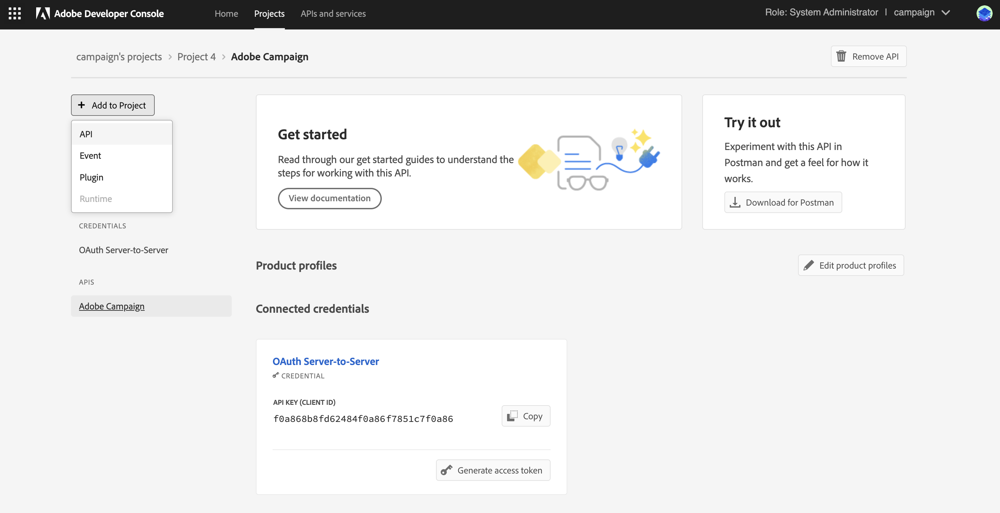

# Adobe Developer Console への Campaign テクニカルオペレーターの移行 {#migrate-tech-users-to-ims}

セキュリティと認証プロセスを強化する取り組みの一環として、Campaign v8.5 以降、Campaign v8 への認証プロセスが改善されています。 テクニカルオペレーターは、 [AdobeIdentity Managementシステム (IMS)](https://helpx.adobe.com/jp/enterprise/using/identity.html){target="_blank"} to connect to Campaign. Learn more about the new server to server authentication process in [Adobe Developer Console documentation](https://developer.adobe.com/developer-console/docs/guides/authentication/ServerToServerAuthentication/){target="_blank"}.

テクニカルオペレーターは、API 統合用に明示的に作成された Campaign ユーザープロファイルです。この記事では、Adobe Developerコンソールを使用してテクニカルオペレーターをテクニカルアカウントに移行するために必要な手順について詳しく説明します。


## 影響の有無{#ims-impacts}

Campaign の外部にあるシステムから Campaign マーケティングインスタンスまたはリアルタイム Message Center インスタンスに API 呼び出しをおこなう場合は、以下に説明するように、技術オペレーターをAdobe Developerコンソールからテクニカルアカウントに移行する必要があります。

この変更は、Campaign v8.5 以降に適用されます。


## 移行プロセス {#ims-migration-procedure}

Adobe Developerコンソール内でテクニカルアカウントを作成し、新しく作成したアカウントを使用して、Adobe Campaignで API 呼び出しをおこなうすべての外部システムの認証方法を変更できるようにするには、以下の手順に従います。

手順の概要を次に示します。

* Adobe Developer Console 内でのプロジェクトの作成
* 新しく作成されたプロジェクトへの適切な API の割り当て
* プロジェクトへの必要な Campaign 製品プロファイルの付与
* 新しく作成したテクニカルアカウント資格情報を使用するように API を更新する
* Campaign インスタンスから従来のテクニカルオペレーターを削除する

### 移行の前提条件{#ims-migration-prerequisites}

テクニカルオペレーターに代わるテクニカルアカウントを作成するには、すべての Campaign インスタンスのAdmin Console内に適切な Campaign 製品プロファイルが存在することの前提条件を検証する必要があります。 製品プロファイルについて詳しくは、製品コンソールのAdobeを参照してください。 [Adobe Developer Console ドキュメント](https://developer.adobe.com/developer-console/docs/guides/projects/){target="_blank"}.

Message Center インスタンスへの API 呼び出しの場合、Campaign v8.5 へのアップグレード中またはインスタンスのプロビジョニング中に、製品プロファイルが作成されている必要があります。 この製品プロファイルの名前は次のとおりです。

`campaign - <your campaign instance> - messagecenter`

既に Campaign へのユーザーアクセスに IMS ベースの認証を使用している場合、API 呼び出しに必要な製品プロファイルがAdmin Console内に存在している必要があります。 マーケティングインスタンスへの API 呼び出しに Campaign 内でカスタムオペレーターグループを使用する場合は、Admin Console内でその製品プロファイルを作成する必要があります。

その他の場合は、Adobeの技術チームが既存のオペレーターグループとネームド権限をAdmin Console内の製品プロファイルに移行できるように、Adobe移行マネージャーに問い合わせる必要があります。


### 手順 1 - Adobe Developerコンソール内で Campaign プロジェクトを作成する {#ims-migration-step-1}

統合は、Adobe Developer Console 内の&#x200B;**プロジェクト**&#x200B;の一部として作成されます。プロジェクトについて詳しくは、[Adobe Developer Console ドキュメント](https://developer.adobe.com/developer-console/docs/guides/projects/){target="_blank"}を参照してください。

以前に作成した任意のプロジェクトを使用するか、新しいプロジェクトを作成することができます。プロジェクトを作成する手順について詳しくは、[Adobe Developer Console ドキュメント](https://developer.adobe.com/developer-console/docs/guides/getting-started/){target="_blank"}を参照してください。主な手順は以下のとおりです。

<!--
For this migration, you must add below APIs in your project: **I/O Management API** and **Adobe Campaign**.

-->

新しいプロジェクトを作成するには、 **新規プロジェクトを作成** をAdobe Developerコンソールのメイン画面から削除します。


以下を使用すると、 **プロジェクトを編集** ボタンをクリックして、このプロジェクトの名前を変更します。


### 手順 2 — プロジェクトに API を追加する {#ims-migration-step-2}

新しく作成したプロジェクト画面から、API で、このプロジェクトをAdobe Campaignへの API 呼び出しのテクニカルアカウントとして使用できるように、を追加します。

プロジェクトに API を追加するには、次の手順に従います。

1. クリック： **API を追加** をクリックして、プロジェクトに追加する API を選択します。
   
1. Adobe Campaignカードの右上隅にあるチェックボックスをオンにして、カードにマウスポインターを置くと表示されるAdobe Campaign API を選択し、プロジェクトに追加します。
   
1. クリック **次へ** 画面の下部に表示されます。

### 手順 3 — 認証タイプの選択  {#ims-migration-step-3}

Adobe Analytics の **API の設定** 画面で、必要な認証タイプを選択します。 **OAuth サーバー間通信** このプロジェクトには認証が必要です。 これが選択されていることを確認し、「 **次へ** 画面の下部に表示されます。


<!--
Once your project is created in the Adobe Developer Console, add an API that uses Server-to-Server authentication. Learn how to set up the OAuth Server-to-Server credential in [Adobe Developer Console documentation](https://developer.adobe.com/developer-console/docs/guides/authentication/ServerToServerAuthentication/implementation/){target="_blank"}.

When the API has been successfully connected, you can access the newly generated credentials including Client ID and Client Secret, as well as generate an access token.-->

### 手順 4 — 製品プロファイルの選択 {#ims-migration-step-4}

前提条件の節で説明したように、プロジェクトで使用する適切な製品プロファイルを割り当てる必要があります。 この手順では、作成するテクニカルアカウントで使用する製品プロファイルを選択する必要があります。

このテクニカルアカウントを使用して Message Center インスタンスに対する API 呼び出しをおこなう場合は、次の語句で終わるAdobe作成製品プロファイルを必ず選択してください。 `messagecenter`.

マーケティングインスタンスへの API 呼び出しの場合、インスタンスとオペレーターグループに対応する製品プロファイルを選択します。

必要な製品プロファイルを選択したら、をクリックします。 **設定済み API を保存** 画面の下部に表示されます。

<!--
You can now add your Campaign product profile to the project, as detailed below:

1. Open the Adobe Campaign API.
1. Click the **Edit product profiles** button

    

1. Assign all the relevant Product Profiles to the API, for example 'messagecenter', and save your changes.
1. Browse to the **Credential details** tab of your project, and copy the **Technical Account Email** value.-->

### 手順 5 - I/O 管理 API をプロジェクトに追加する {#ims-migration-step-5}


プロジェクト画面で、 **[!UICONTROL +プロジェクトに追加]** を選択します。 **[!UICONTROL API]** （画面の左上）をクリックして、I/O Management API をこのプロジェクトに追加できます。



Adobe Analytics の **API を追加** 画面、下にスクロールして **I/O 管理 API** カード。 カードの上にマウスポインターを置いたときに表示されるチェックボックスをクリックして選択します。 次に、「 **次へ** 画面の下部に表示されます。


Adobe Analytics の **API の設定** 画面に、OAuth サーバー間認証が既に存在している。 クリック **設定済み API を保存** 画面の下部に表示されます。


これにより、新しく作成したプロジェクトの I/O 管理 API 内のプロジェクト画面に戻ります。 画面上部のパンくずリストでプロジェクト名をクリックすると、メインのプロジェクトの詳細ページに戻ります。


### 手順 6 — プロジェクト設定を確認する {#ims-migration-step-6}

プロジェクトをレビューし、で以下のように表示されることを確認します。 **I/O 管理 API** および **Adobe Campaign API** 「製品とサービス」セクションに表示され、 **OAuth サーバー間通信** 」をクリックします。


### 手順 7 - 設定を検証 {#ims-migration-step-7}

接続を試すには、 [Adobe Developer Console 資格情報ガイド](https://developer.adobe.com/developer-console/docs/guides/authentication/ServerToServerAuthentication/implementation/#generate-access-tokens){target="_blank"} アクセストークンを生成し、提供されたサンプル cURL コマンドをコピーする場合。 これらの資格情報を使用して SOAP 呼び出しを作成し、Adobe Campaignインスタンスを正しく認証して接続できるかどうかをテストできます。 サードパーティの API 統合に対してすべての変更をおこなう前に、この検証をおこなうことをお勧めします。

### 手順 8 — サードパーティ API 統合を更新する {#ims-migration-step-8}

新しく作成したテクニカルアカウントを使用するには、API 統合を更新し、Adobe Campaignへの呼び出しをおこなう必要があります。

統合をスムーズにおこなうためのサンプルコードを含む、API 統合手順について詳しくは、 [Adobe Developer Console 認証ドキュメント](https://developer.adobe.com/developer-console/docs/guides/authentication/ServerToServerAuthentication/){target="_blank"}.

以下に、サードパーティシステムの移行前と移行後の呼び出しを示す SOAP 呼び出しの例を示します。

移行プロセスを完了して検証すると、SOAP 呼び出しは次のように更新されます。


* 移行前：テクニカルアカウントのアクセストークンはサポートされていませんでした。

  ```sql
  POST /nl/jsp/soaprouter.jsp HTTP/1.1
  Host: localhost:8080
  Content-Type: application/soap+xml;
  SOAPAction: "nms:rtEvent#PushEvent"
  charset=utf-8
  
  <?xml version="1.0" encoding="utf-8"?>  <soapenv:Envelope xmlns:soapenv="http://schemas.xmlsoap.org/soap/envelope/" xmlns:urn="urn:nms:rtEvent">
  <soapenv:Header/>
  <soapenv:Body>
      <urn:PushEvent>
          <urn:sessiontoken>SESSION_TOKEN</urn:sessiontoken>
          <urn:domEvent>
              <!--You may enter ANY elements at this point-->
              <rtEvent type="type" email="name@domain.com"/>
          </urn:domEvent>
      </urn:PushEvent>
  </soapenv:Body>
  </soapenv:Envelope>
  ```

* 移行後：テクニカルアカウントのアクセストークンはサポートされます。アクセストークンは、ベアラートークンとして `Authorization` ヘッダーで提供されることが予想されます。以下の SOAP 呼び出しのサンプルに示すように、ここではセッショントークンの使用を無視する必要があります。

  ```sql
  POST /nl/jsp/soaprouter.jsp HTTP/1.1
  Host: localhost:8080
  Content-Type: application/soap+xml;
  SOAPAction: "nms:rtEvent#PushEvent"
  charset=utf-8
  Authorization: Bearer <IMS_Technical_Token_Token>
  
  <?xml version="1.0" encoding="utf-8"?>  <soapenv:Envelope xmlns:soapenv="http://schemas.xmlsoap.org/soap/envelope/" xmlns:urn="urn:nms:rtEvent">
  <soapenv:Header/>
  <soapenv:Body>
      <urn:PushEvent>
          <urn:sessiontoken></urn:sessiontoken>
          <urn:domEvent>
              <!--You may enter ANY elements at this point-->
              <rtEvent type="type" email="name@domain.com"/>
          </urn:domEvent>
      </urn:PushEvent>
  </soapenv:Body>
  </soapenv:Envelope>
  ```


### 手順 9 - （オプション）Campaign クライアントコンソール内でテクニカルアカウントオペレーターを更新する {#ims-migration-step-9}

この手順はオプションで、Message Center インスタンス内ではなく、マーケティングインスタンス内でのみ使用できます。 割り当てられたオペレーターグループを介さずに、テクニカルオペレーターに対して特定のフォルダー権限またはネームド権限が定義されている場合。 次に、Admin Consoleで新しく作成したテクニカルアカウントユーザーを更新して、必要なフォルダー権限またはネームド権限を付与する必要があります。

Campaign インスタンスに対して 1 つ以上の API 呼び出しがおこなわれるまで、テクニカルアカウントユーザーはAdobe Campaignに存在しません。その際、IMS は Campaign 内にユーザーを作成します。 Campaign 内で技術ユーザーが見つからない場合は、概要を説明する API 呼び出しを正常に送信できることを確認してください [手順 7 で](#ims-migration-step-7).

1. 新しいテクニカルアカウントユーザーに必要な変更を適用するには、Campaign クライアントコンソール内で、E メールアドレスでそのユーザーを探します。 この電子メールアドレスは、上記のプロジェクトの作成および認証手順で作成されました。

   この電子メールアドレスは、 **OAuth サーバー間通信** 見出し **資格情報** を参照してください。

   

   「資格情報」画面で、下にスクロールして「**テクニカルアカウント電子メール**」を探し、 **コピー** 」ボタンをクリックします。

   

1. ここでは、Adobe Campaign クライアントコンソールで新しく作成したテクニカルオペレーターを更新する必要があります。既存のテクニカルオペレーターフォルダーの権限を新しいテクニカルオペレーターに適用する必要があります。


   このオペレーターを更新するには、次の手順に従います。

   1. Campaign クライアントコンソールのエクスプローラーから、**管理／アクセス管理／オペレーター**&#x200B;を参照します。
   1. API に使用される既存のテクニカルオペレーターにアクセスします。
   1. フォルダー権限を参照し、権限を確認します。
   1. 新しく作成したテクニカルオペレーターに同じ権限を適用します。このオペレーターのメールアドレスは、以前にコピーした&#x200B;**テクニカルアカウントメールアドレス**&#x200B;の値です。
   1. 変更内容を保存します。


>[!CAUTION]
>
>新しいテクニカルオペレーターは、Campaign クライアントコンソールに追加される API 呼び出しを 1 回以上実行する必要があります。
>

### 手順 10 — 古い技術オペレーターをAdobe Campaignから削除する {#ims-migration-step-10}

すべてのサードパーティシステムを移行して、新しいテクニカルアカウントと IMS 認証を使用したら、Campaign クライアントコンソールから古いテクニカルオペレーターを削除できます。

これをおこなうには、Campaign クライアントコンソールにログインし、次の場所に移動します。 **管理/アクセス管理/オペレーター** 古い技術ユーザーを特定し、削除する。
