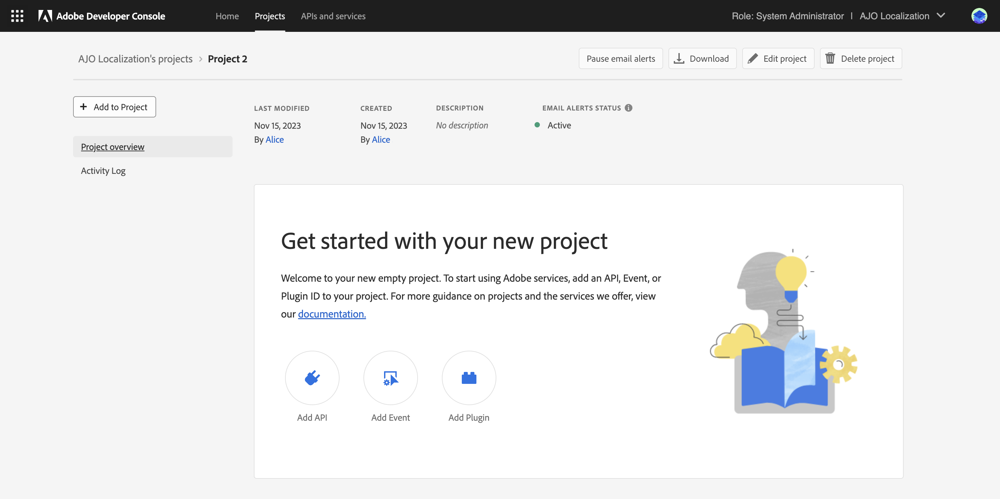
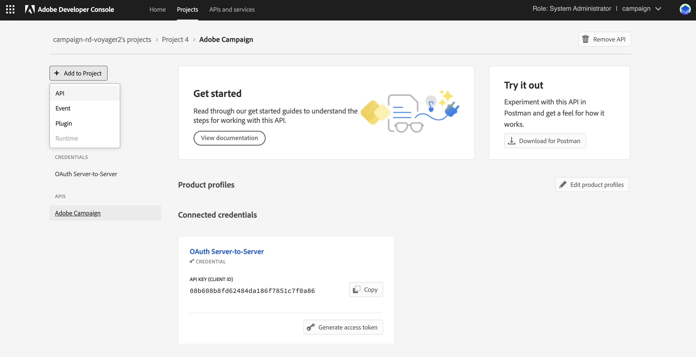

# Adobe Developer Console への Campaign テクニカルオペレーターの移行 {#migrate-tech-users-to-ims}

セキュリティと認証プロセスを強化する取り組みの一環として、Campaign v8.5 以降、Campaign v8 への認証プロセスが改善されています。テクニカルオペレーターは、[Adobe Identity Management System（IMS）](https://helpx.adobe.com/jp/enterprise/using/identity.html){target="_blank"}を使用して Campaign に接続できるようになりました。新しいサーバー間の認証プロセスについて詳しくは、[Adobe Developer Console ドキュメント](https://developer.adobe.com/developer-console/docs/guides/authentication/ServerToServerAuthentication/){target="_blank"}を参照してください。

テクニカルオペレーターは、API 統合用に明示的に作成された Campaign ユーザープロファイルです。この記事では、Adobe Developer Console からテクニカルオペレーターをテクニカルアカウントに移行するために必要な手順について詳しく説明します。


## 影響の有無{#ims-impacts}

Campaign の外部システムから Campaign マーケティングインスタンスまたはリアルタイム Message Center インスタンスのいずれかに API 呼び出しを行っている場合は、以下で説明するように、Adobe Developer Console を通じてテクニカルオペレーターをテクニカルアカウントに移行する必要があります。

この変更は、Campaign v8.5 以降に適用され、Campaign v8.6 以降は&#x200B;**必須**&#x200B;となります。


## 移行プロセス {#ims-migration-procedure}

以下の手順に従って、Adobe Developer Console 内でテクニカルアカウントを作成し、新しく作成したアカウントを使用して、Adobe Campaign で API 呼び出しを行うすべての外部システムの認証方法を変更できるようにします。

手順の概要を以下に示します。

* Adobe Developer Console 内でのプロジェクトの作成
* 新しく作成したプロジェクトへの適切な API の割り当て
* プロジェクトへの必要な Campaign 製品プロファイルの付与
* 新しく作成したテクニカルアカウント資格情報を使用する API の更新
* Campaign インスタンスからの従来のテクニカルオペレーターの削除

### 移行の前提条件{#ims-migration-prerequisites}

<!--To be able to create the technical accounts which replace the technical operators, the prerequisite that the proper Campaign Product Profiles exist within the Admin Console for all Campaign instances need to be validated. You can learn more about Product Profiles within the Adobe Console in [Adobe Developer Console documentation](https://developer.adobe.com/developer-console/docs/guides/projects/){target="_blank"}.-->

Message Center インスタンスへの API 呼び出しの場合、Campaign v8.5 へのアップグレード中や、インスタンスのプロビジョニング中に製品プロファイルを作成する必要があります。この製品プロファイルの名前を以下に示します。

`campaign - <your campaign instance> - messagecenter`

Campaign へのユーザーアクセスに IMS ベースの認証を既に使用している場合は、API 呼び出しに必要な製品プロファイルが Admin Console 内に既に存在している必要があります。マーケティングインスタンスへの API 呼び出しに Campaign 内のカスタムオペレーターグループを使用する場合は、Admin Console 内でその製品プロファイルを作成する必要があります。

それ以外の場合は、アドビのテクニカルチームが既存のオペレーターグループとネームド権限を Admin Console 内の製品プロファイルに移行できるように、アドビトランジションマネージャーに問い合わせる必要があります。


### 手順 1 - Adobe Developer Console 内で Campaign プロジェクトを作成 {#ims-migration-step-1}

統合は、Adobe Developer Console 内の&#x200B;**プロジェクト**&#x200B;の一部として作成されます。プロジェクトについて詳しくは、[Adobe Developer Console ドキュメント](https://developer.adobe.com/developer-console/docs/guides/projects/){target="_blank"}を参照してください。

以前に作成した任意のプロジェクトを使用するか、新しいプロジェクトを作成することができます。プロジェクトを作成する手順について詳しくは、[Adobe Developer Console ドキュメント](https://developer.adobe.com/developer-console/docs/guides/getting-started/){target="_blank"}を参照してください。主な手順を以下に示します

<!--
For this migration, you must add below APIs in your project: **I/O Management API** and **Adobe Campaign**.

-->

新しいプロジェクトを作成するには、Adobe Developer Console のメイン画面で「**新しいプロジェクトを作成**」をクリックします。


「**プロジェクトを編集**」ボタンを使用すると、このプロジェクトの名前を変更できます。


### 手順 2 - プロジェクトに API を追加 {#ims-migration-step-2}

新しく作成したプロジェクト画面から、Adobe Campaign への API 呼び出しのテクニカルアカウントとしてこのプロジェクトを使用可能にするために必要な API を追加します。

プロジェクトに API を追加するには、次の手順に従います。

1. 「**API を追加**」をクリックして、プロジェクトに追加する API を選択します。
   
1. Adobe Campaign カードにポインタを合わせると表示される Adobe Campaign カードの右上隅にあるチェックボックスをオンして、Adobe Campaign API を選択してプロジェクトに追加します
   
1. 画面の下部にある「**次へ**」をクリックします。

### 手順 3 - 認証タイプを選択  {#ims-migration-step-3}

**API を設定**&#x200B;画面で、必要な認証タイプを選択します。このプロジェクトには **OAuth サーバー間**&#x200B;認証が必要です。選択されていることを確認し、画面の下部にある「**次へ**」をクリックします。


<!--
Once your project is created in the Adobe Developer Console, add an API that uses Server-to-Server authentication. Learn how to set up the OAuth Server-to-Server credential in [Adobe Developer Console documentation](https://developer.adobe.com/developer-console/docs/guides/authentication/ServerToServerAuthentication/implementation/){target="_blank"}.

When the API has been successfully connected, you can access the newly generated credentials including Client ID and Client Secret, as well as generate an access token.-->

### 手順 4 - 製品プロファイルを選択 {#ims-migration-step-4}

前提条件の節で説明したように、プロジェクトで使用する適切な製品プロファイルを割り当てる必要があります。この手順では、作成するテクニカルアカウントで使用する製品プロファイルを選択する必要があります。

このテクニカルアカウントを使用して Message Center インスタンスへの API 呼び出しを行う場合は、`messagecenter` で終わるアドビ製品プロファイルの作成を選択する必要があります。

マーケティングインスタンスへの API 呼び出しの場合は、インスタンスとオペレーターグループに対応する製品プロファイルを選択します。

必要な製品プロファイルを選択したら、画面の下部にある「**設定済み API を保存**」をクリックします。

<!--
You can now add your Campaign product profile to the project, as detailed below:

1. Open the Adobe Campaign API.
1. Click the **Edit product profiles** button

    

1. Assign all the relevant Product Profiles to the API, for example 'messagecenter', and save your changes.
1. Browse to the **Credential details** tab of your project, and copy the **Technical Account Email** value.-->

### 手順 5 - I/O Management API をプロジェクトに追加 {#ims-migration-step-5}


プロジェクト画面で「**[!UICONTROL + プロジェクトに追加]**」をクリックし、画面左上の「**[!UICONTROL API]**」を選択して、I/O Management API をこのプロジェクトに追加できるようにします。



**API を追加**&#x200B;画面で、下にスクロールして **I/O Management API** カードを見つけます。これを選択するには、カードにポインタを合わせると表示されるチェックボックスをクリックします。次に、画面の下部にある「**次へ**」をクリックします。


**API を設定**&#x200B;画面では、OAuth サーバー間認証が既に存在しています。画面の下部にある「**設定済み API を保存**」をクリックします。


これにより、新しく作成したプロジェクトの I/O Management API 内のプロジェクト画面に戻ります。画面上部のパンくずリストのプロジェクト名をクリックすると、メインのプロジェクトの詳細ページに戻ります。


### 手順 6 - プロジェクト設定を確認 {#ims-migration-step-6}

プロジェクトを確認して、「製品とサービス」セクションに **I/O Management API** と **Adobe Campaign API** が表示され、「資格情報」セクションに **OAuth サーバー間**&#x200B;が表示され、以下のようになっていることを確認します。


### 手順 7 - 設定を検証 {#ims-migration-step-7}

接続を試すには、[Adobe Developer Console 資格情報ガイド](https://developer.adobe.com/developer-console/docs/guides/authentication/ServerToServerAuthentication/implementation/#generate-access-tokens){target="_blank"}で説明しているアクセストークンの生成手順に従って、提供されているサンプル cURL コマンドをコピーします。これらの資格情報を使用して SOAP 呼び出しを作成し、Adobe Campaign インスタンスを正しく認証して接続できるかどうかをテストできます。サードパーティ API 統合にすべての変更を行う前に、この検証を行うことをお勧めします。

### 手順 8 - サードパーティ API 統合を更新 {#ims-migration-step-8}

新しく作成したテクニカルアカウントを使用するには、Adobe Campaign を呼び出すすべての API 統合を更新する必要があります。

スムーズな統合のためのサンプルコードなど、API 統合手順について詳しくは、[Adobe Developer Console 認証ドキュメント](https://developer.adobe.com/developer-console/docs/guides/authentication/ServerToServerAuthentication/){target="_blank"}を参照してください。

サードパーティシステムの移行前と移行後のサンプル SOAP 呼び出しを以下に示します。

Adobe Identity Management System（IMS）認証を使用する際、WSDL ファイルを生成するには、Postman 呼び出しに `Authorization: Bearer <IMS_Technical_Token_Token>` を追加する必要があります。

```
curl --location --request POST 'https://<instance_url>/nl/jsp/schemawsdl.jsp?schema=nms:rtEvent' \--header 'Authorization: Bearer <Technical account access token>'
```

移行プロセスを完了して検証すると、SOAP 呼び出しは次のように更新されます。

* 移行前：テクニカルアカウントのアクセストークンはサポートされていませんでした。

  ```sql
  POST /nl/jsp/soaprouter.jsp HTTP/1.1
  Host: localhost:8080
  Content-Type: application/soap+xml;
  SOAPAction: "nms:rtEvent#PushEvent"
  charset=utf-8
  
  <?xml version="1.0" encoding="utf-8"?>  <soapenv:Envelope xmlns:soapenv="http://schemas.xmlsoap.org/soap/envelope/" xmlns:urn="urn:nms:rtEvent">
  <soapenv:Header/>
  <soapenv:Body>
      <urn:PushEvent>
          <urn:sessiontoken>SESSION_TOKEN</urn:sessiontoken>
          <urn:domEvent>
              <!--You may enter ANY elements at this point-->
              <rtEvent type="type" email="name@domain.com"/>
          </urn:domEvent>
      </urn:PushEvent>
  </soapenv:Body>
  </soapenv:Envelope>
  ```

* 移行後：テクニカルアカウントのアクセストークンはサポートされます。アクセストークンは、ベアラートークンとして `Authorization` ヘッダーで提供されることが予想されます。以下の SOAP 呼び出しのサンプルに示すように、ここではセッショントークンの使用を無視する必要があります。

  ```sql
  POST /nl/jsp/soaprouter.jsp HTTP/1.1
  Host: localhost:8080
  Content-Type: application/soap+xml;
  SOAPAction: "nms:rtEvent#PushEvent"
  charset=utf-8
  Authorization: Bearer <IMS_Technical_Token_Token>
  
  <?xml version="1.0" encoding="utf-8"?>  <soapenv:Envelope xmlns:soapenv="http://schemas.xmlsoap.org/soap/envelope/" xmlns:urn="urn:nms:rtEvent">
  <soapenv:Header/>
  <soapenv:Body>
      <urn:PushEvent>
          <urn:sessiontoken></urn:sessiontoken>
          <urn:domEvent>
              <!--You may enter ANY elements at this point-->
              <rtEvent type="type" email="name@domain.com"/>
          </urn:domEvent>
      </urn:PushEvent>
  </soapenv:Body>
  </soapenv:Envelope>
  ```

### 手順 9 -（オプション）Campaign クライアントコンソール内でテクニカルアカウントオペレーターを更新 {#ims-migration-step-9}

この手順はオプションで、Message Center インスタンス内ではなく、マーケティングインスタンス内でのみ使用できます。特定のフォルダー権限またはネームド権限が、割り当てられたオペレーターグループ経由ではなくテクニカルオペレーターに対して定義されている場合。ここで、Admin Console で新しく作成したテクニカルアカウントユーザーを更新して、必要なフォルダー権限またはネームド権限を付与する必要があります。

テクニカルアカウントユーザーは、Campaign インスタンスに対して少なくとも 1 回の API 呼び出しが行われるまで、Adobe Campaign には存在しません。その時点で、IMS は Campaign 内にユーザーを作成します。Campaign 内でテクニカルユーザーが見つからない場合は、[手順 7](#ims-migration-step-7) で説明したように API 呼び出しを正常に送信できることを確認します。

1. 新しいテクニカルアカウントユーザーに必要な変更を適用するには、Campaign クライアントコンソール内でメールアドレスを使用してユーザーを見つけます。このメールアドレスは、上記のプロジェクトの作成と認証の手順で作成されたものです。

   このメールアドレスを見つけるには、プロジェクトの「**資格情報**」セクションにある「**OAuth サーバー間**」見出しをクリックします。

   

   資格情報画面で、下にスクロールして **テクニカルアカウントのメール** を見つけて、「**コピー**」ボタンをクリックします。

   

1. ここで、Adobe Campaign クライアントコンソールで新しく作成したテクニカルオペレーターを更新する必要があります。既存のテクニカルオペレーターフォルダーの権限を新しいテクニカルオペレーターに適用する必要があります。

   このオペレーターを更新するには、次の手順に従います。

   1. Campaign クライアントコンソールのエクスプローラーから、**管理／アクセス管理／オペレーター**&#x200B;の順に移動します。
   1. API に使用される既存のテクニカルオペレーターにアクセスします。
   1. フォルダー権限を参照し、権限を確認します。
   1. 新しく作成したテクニカルオペレーターに同じ権限を適用します。このオペレーターのメールアドレスは、以前にコピーした&#x200B;**テクニカルアカウントメールアドレス**&#x200B;の値です。
   1. 変更内容を保存します。


>[!CAUTION]
>
>新しいテクニカルオペレーターは、Campaign クライアントコンソールに追加される API 呼び出しを 1 回以上実行する必要があります。
>

### 手順 10 - Adobe Campaign から古いテクニカルオペレーターを削除 {#ims-migration-step-10}

IMS 認証で新しいテクニカルアカウントを使用するようにすべてのサードパーティシステムを移行したら、Campaign クライアントコンソールから古いテクニカルオペレーターを削除できます。

これを行うには、Campaign クライアントコンソールにログインし、**管理／アクセス管理／オペレーター**&#x200B;に移動し、古いテクニカルユーザーを見つけて削除します。
