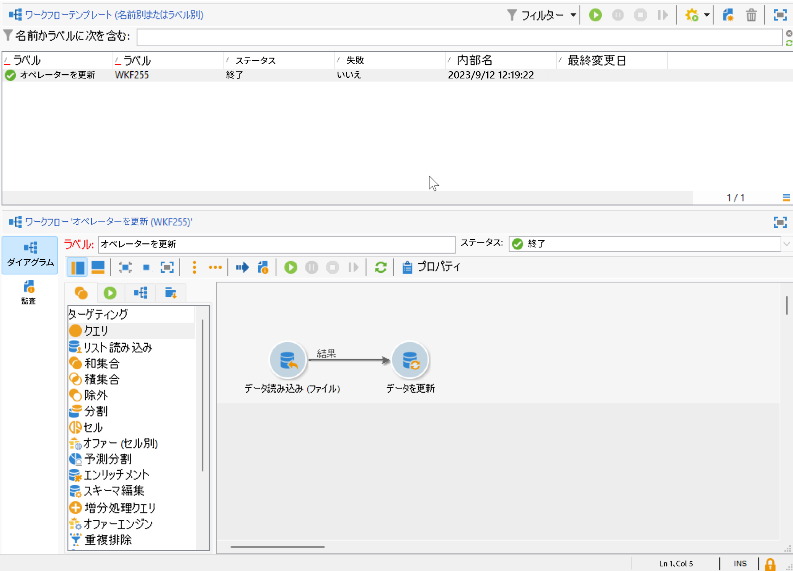
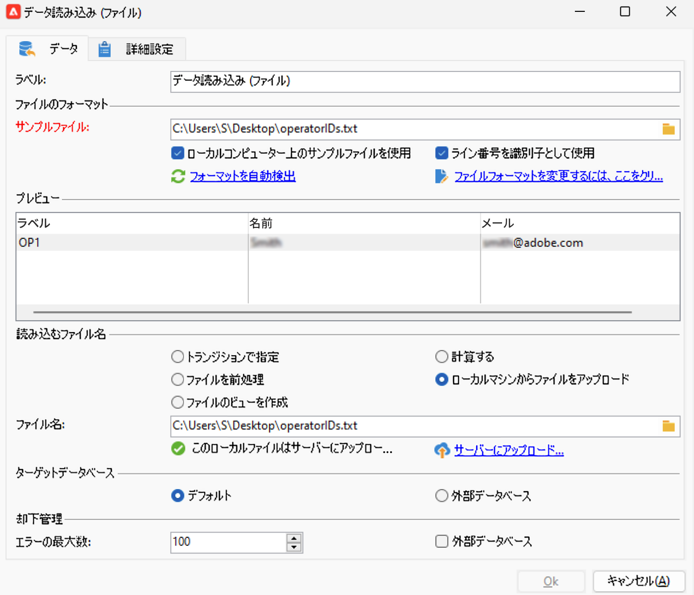
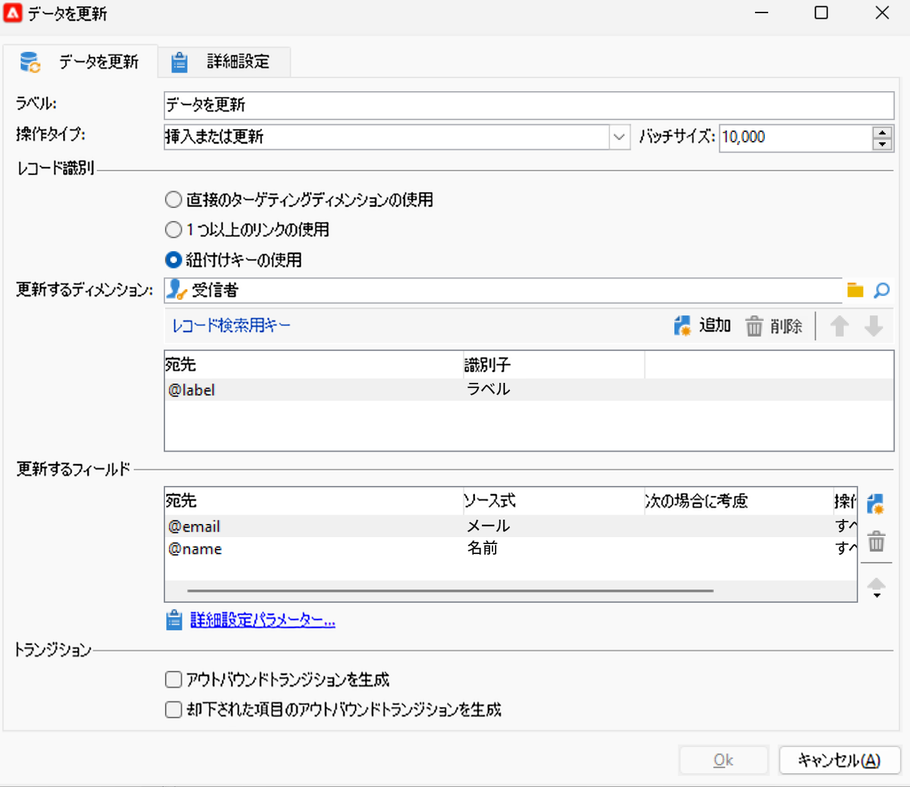
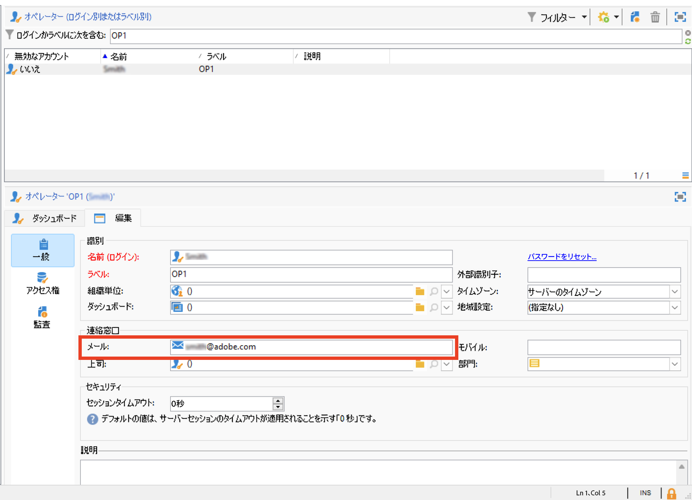
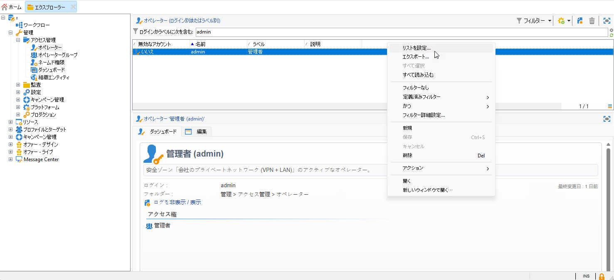
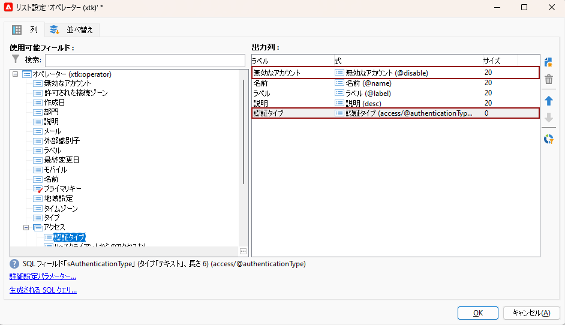
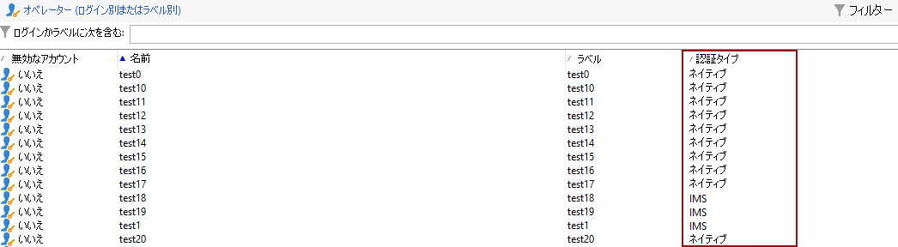

# Campaign オペレーターの Adobe Identity Management System（IMS）への移行 {#migrate-users-to-ims}

Campaign v8.6 以降、Campaign v8 への認証プロセスが改善されています。すべてのオペレーターは、[Adobe Identity Management System（IMS）](https://helpx.adobe.com/jp/enterprise/using/identity.html){target="_blank"}を Campaign に接続する場合に&#x200B;**のみ**&#x200B;使用します。ユーザー／パスワードを使用した接続（別名ネイティブ認証）は許可されなくなります。アドビでは、Campaign v8.6 にスムーズに移行できるように、Campaign v8.5.2 でこの移行を実行することをお勧めします。

また、この手順は、Campaign Classic v7 マネージドサービスのお客様が Campaign v8 に移行する場合にも適用されます。

この記事では、Adobe Developer Console でテクニカルオペレーターをテクニカルアカウントに移行するために必要な手順について詳しく説明します。

## 変更点{#move-to-ims-changes}

Campaign v8 では、すべての標準ユーザーは、Adobe Identity Management System（IMS）により、Adobe ID を使用して Adobe Campaign クライアントコンソールに既に接続しています。ただし、一部の以前の設定では、ユーザー／パスワード接続が引き続き使用可能でした。**この設定は、Campaign v8.6 以降では使用できなくなります。**

さらに、セキュリティと認証プロセスを強化する取り組みの一環として、Adobe Campaign クライアントアプリケーションは、IMS テクニカルアカウントトークンを使用して Campaign API を直接呼び出すようになりました。テクニカルオペレーターの移行について詳しくは、[このページ](ims-migration.md)にある専用の記事を参照してください。

この変更は、Campaign v8.5.2 以降に適用され、Campaign v8.6 以降は&#x200B;**必須**&#x200B;となります。

## 影響の有無{#migrate-ims-impacts}

組織内のオペレーターが Campaign クライアントコンソールにログイン／パスワード（別名ネイティブ認証）を使用して接続している場合は影響を受けるので、以下で説明するようにこれらのオペレーターを Adobe IMS に移行する必要があります。

[Adobe Identity Management System（IMS）](https://helpx.adobe.com/jp/enterprise/using/identity.html){target="_blank"}への移行は、他の Adobe Experience Cloud ソリューションやアプリのほとんどは既に IMS 上にあるので、環境を安全かつ標準化するためにセキュリティ上不可欠です。

## 移行方法{#ims-migration-procedure}

### 前提条件{#ims-migration-prerequisites}

移行プロセスを開始する前に、アドビのテクニカルチームが既存のオペレーターグループとネームド権限を Adobe Identity Management System（IMS）に移行できるように、アドビ担当者（トランジションマネージャー）にお問い合わせする必要があります。

### 主な手順 {#ims-migration-steps}

この移行の主な手順を以下に示します。

1. アドビでは、環境を Campaign v8.5.2 にアップグレードします。
1. アップグレード後も、ネイティブユーザーまたは IMS の両方の方法で新しいユーザーを引き続き作成できます。
1. 内部の Campaign 管理者は、Campaign クライアントコンソール上のすべてのネイティブユーザーに一意のメールアドレスを追加し、これが完了したらアドビトランジションマネージャーに確認する必要があります。この手順について詳しくは、[この節](#ims-migration-id)を参照してください。
1. アドビと連携して、技術に詳しくないユーザー（オペレーター）と製品プロファイルの自動移行をアドビが実行する日付を確保します。この手順には、インスタンスのダウンタイムが発生しない 1 時間の時間枠が必要です。
1. 内部の Campaign 管理者がこれらの変更を検証し、サインオフします。この移行後は、ログイン名とパスワードで認証するオペレーターをさらに作成する必要はありません。

テクニカルオペレーターを Adobe Developer Console に移行できるようになりました。詳しくは、[このテクニカルノート](ims-migration.md)を参照してください。この手順は、Campaign API を使用する場合に必須です。

この移行が完了したら、アドビトランジションマネージャーに確認します。アドビは移行を完了としてマークし、新しいネイティ ユーザーの作成とネイティブユーザーのログインをブロックします。これにより、環境が保護され、標準化されます。

## よくある質問 {#ims-migration-faq}

### 移行を開始できるのはいつですか？ {#ims-migration-start}

[Adobe Identity Management System（IMS）](https://helpx.adobe.com/jp/enterprise/using/identity.html){target="_blank"}への移行の前提条件は、環境を Campaign v8.5.2 にアップグレードすることです。

Campaign v8.5.2 にアップグレードしたら、ステージング環境で IMS への移行を開始し、それに応じて実稼動環境を計画できます。

### Campaign v8.5.2 にビルドをアップグレードすると、どうなりますか？ {#ims-migration-after-upgrade}

環境を Campaign v8.5.2 にアップグレードしたら、[Adobe Identity Management System（IMS）](https://helpx.adobe.com/jp/enterprise/using/identity.html){target="_blank"}への移行を開始できます。

IMS への移行が完了するまでは、新しいネイティブユーザーを引き続き作成できます。

### 移行が完了するのはいつですか？ {#ims-migration-end}

エンドユーザーと技術ユーザーを Adobe Identity Management System（IMS）に移行する処理が完了したら、アドビトランジションマネージャーに連絡し、アドビが移行を完了としてマーク、クライアントコンソールからのユーザー作成をブロック、ネイティブユーザーログインを無効にできるようにする必要があります。

### 移行後にユーザーを作成するにはどうすればよいですか？ {#ims-migration-native}

IMS への完全な移行が完了すると、アドビは新しいネイティブユーザーの作成をブロックする制限を適用します。これらの制限は、IMS への移行が完了するまで適用されません。

新規顧客の場合 - ネイティブユーザーの新規作成は最初から許可されていません。

Campaign 管理者は、Adobe Admin Console と Campaign クライアントコンソールを通じて組織のユーザーに権限を付与できます。ユーザーは、Adobe ID を使用して Adobe Campaign にログオンします。詳しくは、[このドキュメント](../../v8/start/gs-permissions.md)を参照してください。

### 現在のネイティブユーザー用のメールアドレスを追加するにはどうすればよいですか？ {#ims-migration-id}

Campaign 管理者は、クライアントコンソールからすべてのネイティブユーザーにメール ID を追加する必要があります。手順は次のとおりです。

1. クライアントコンソールに接続し、**管理／アクセス管理／オペレーター**&#x200B;を参照します。
1. オペレーターリストで更新するオペレーターを選択します。
1. オペレーターフォームの「**連絡窓口**」セクションにオペレーターのメールアドレスを入力します。
1. 変更内容を保存します。

ワークフロースーパーバイザーまたは Campaign 管理者は、ワークフローを使用してオペレーターの一括更新を実行することもできます。

+++ワークフローでオペレーターを更新するための主な手順

ネイティブオペレーターの一括更新を実行するには、次の手順に従います。

1. ネイティブ認証モードで Campaign に接続しているすべてのオペレーターを CSV ファイルに抽出するワークフローを作成します。**クエリ**&#x200B;アクティビティと&#x200B;**データ抽出（ファイル）**&#x200B;アクティビティを使用して CSV ファイルを作成します。各オペレーターのプロファイルデータに基づいて、次の列をエクスポートできます。`Name, Label`

   **クエリ**&#x200B;アクティビティについて詳しくは、[このページ](../../automation/workflow/query.md)を参照してください。

   **データ抽出（ファイル）**&#x200B;アクティビティについて詳しくは、[このページ](../../automation/workflow/extraction-file.md)を参照してください。

1. オペレーターのメールを含む新しい列で CSV ファイルを更新します。

1. ワークフロー内の&#x200B;**データ読み込み（ファイル）**&#x200B;アクティビティと&#x200B;**データを更新**&#x200B;アクティビティを使用して、更新されたデータを読み込むワークフローを作成します。

   {width="70%"}

1. **データ読み込み（ファイル）**&#x200B;アクティビティを編集し、更新された CSV ファイルを読み込むための設定を定義します。以下にサンプルを示します。

   {width="70%"}

   **データ読み込み（ファイル）**&#x200B;アクティビティについて詳しくは、[このページ](../../automation/workflow/data-loading-file.md)を参照してください。

1. **データを更新**&#x200B;アクティビティを編集し、以下のサンプルに従って設定を定義します。**更新するディメンション**&#x200B;が `Operators (xtk)` に変更されていることに注意してください。

   {width="70%"}

   **データを更新**&#x200B;アクティビティについて詳しくは、[このページ](../../automation/workflow/update-data.md)を参照してください。

1. ワークフローを実行し、結果を確認します。オペレーターのプロファイルにメールアドレスが追加されました。

   {width="70%"}

+++

### IMS 経由で Campaign にログインするにはどうすればよいですか？ {#ims-migration-log}

Campaign と Adobe ID の接続方法については、[この節](../../v8/start/connect.md)を参照してください。

### この移行中にダウンタイムは発生しますか？ {#ims-migration-downtime}

移行（ユーザーと製品プロファイルの移行）を完了するには、アドビでは、どのインスタンス（ワークフローなど）もダウンタイムなしで 1 時間の時間枠を必要とします。

この期間中、すべての Campaign ユーザーはログオフし、IMS への移行が完了したら Adobe ID を使用して再度ログインする必要があります。

### IMS ユーザーの移行中にログインしているユーザーはどうなりますか？ {#ims-migration-log-off}

アドビでは、移行期間中はすべてのユーザーをログオフすることを強くお勧めします。

### 組織内のユーザーは既に IMS を使用していますが、引き続き IMS への移行を実行する必要がありますか？{#ims-migration-needed}

この移行には、エンドユーザーの移行と技術ユーザーの移行（カスタムコードの API で使用）という 2 つの側面があります。

すべてのユーザー（Campaign オペレーター）が IMS を使用している場合、この移行を実行する必要はありません。ただし、カスタムコードで使用した可能性のある技術ユーザーを移行する必要があります。詳しくは、[このページ](ims-migration.md)を参照してください。

この移行が完了したら、アドビトランジションマネージャーにお問い合わせして、アドビが移行を完了するように依頼する必要があります。

### オペレーターの認証タイプを表示するにはどうすればよいですか？

Campaign でオペレーターの認証タイプを表示する方法について説明します。

1. 次から： **エクスプローラ**，アクセス **管理** `>` **アクセス管理** `>` **演算子**.

1. ヘッダー行を右クリックし、**リストを設定**&#x200B;メニューを選択します。

   

1. **無効なアカウント**&#x200B;と&#x200B;**認証タイプ**&#x200B;を&#x200B;**出力列**&#x200B;として追加します。

   

これで、**オペレーター**&#x200B;とその&#x200B;**認証タイプ**&#x200B;のリストが表示されます。

## 便利なリンク {#ims-useful-links}

* [Adobe Developer Console へのテクニカルユーザーの移行](ims-migration.md)
* [Adobe Campaign v8 への接続方法](../../v8/start/connect.md)
* [Adobe Campaign v8 でのアクセスと権限](../../v8/start/gs-permissions.md)
* [Adobe Campaign v8 リリースノート](../../v8/start/release-notes.md)
* [Adobe Identity Management System（IMS）とは](https://helpx.adobe.com/jp/enterprise/using/identity.html){target="_blank"}
