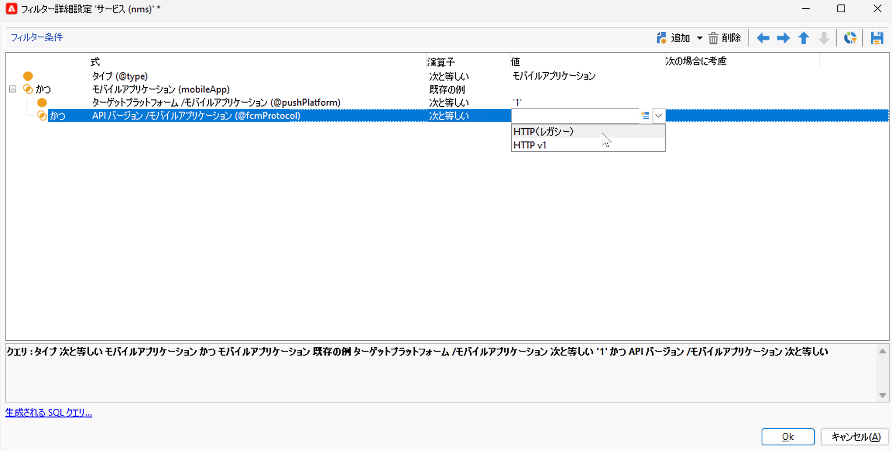
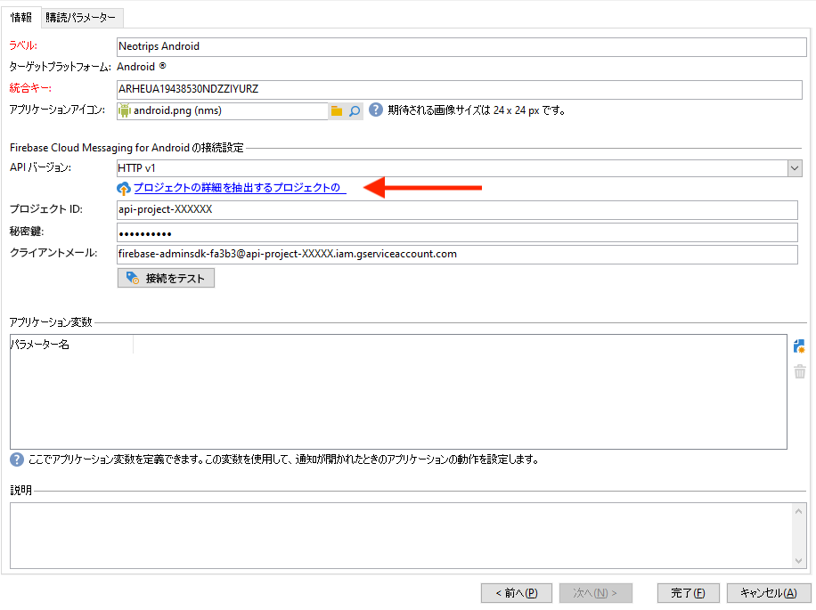
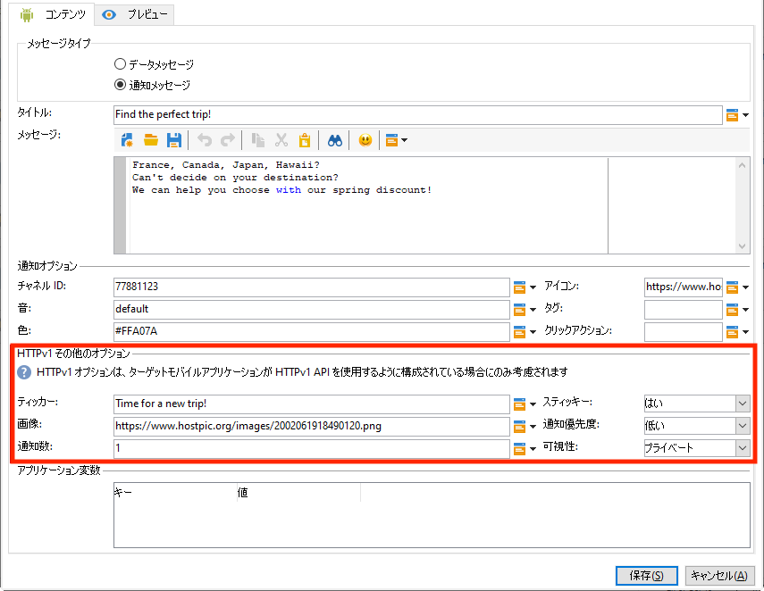

# プッシュ通知チャネルの今後の変更 {#push-upgrade}

Campaign を使用して、Android デバイスでプッシュ通知を送信できます。 これをおこなうには、Campaign は特定の Android 外部アカウントおよび購読サービスに依存しています。 Android Firebase Cloud Messaging(FCM) サービスに対する重要な変更の一部は 2024 年にリリースされ、Adobe Campaignの実装に影響を与える可能性があります。

## 変更点 {#fcm-changes}

Googleのサービス向上のための継続的な取り組みの一環として、従来の FCM API は、 **2024 年 6 月 21 日**. Firebase Cloud Messaging HTTP プロトコルについて詳しくは、 [Googleドキュメント](https://firebase.google.com/docs/cloud-messaging/http-server-ref){target="_blank"}.

Adobe Campaign Classic v7 およびAdobe Campaign v8 は、既にプッシュ通知メッセージを送信する最新の API をサポートしています。 ただし、古い実装の中には、依然としてレガシー API に依存するものもあります。 これらの実装は更新する必要があります。

## 影響の有無 {#fcm-impact}

現在の実装が、レガシー API を使用した FCM への接続をサポートしている場合は、影響が出ます。 サービスの分散を避けるには、最新の API への移行が必須です。 その場合、Adobeチームから連絡が来ます。

影響を受けているかどうかを確認するには、 **サービスと購読** 以下のフィルターに従って：

* アクティブなプッシュ通知キャンペーンのいずれかで **HTTP （レガシー）** API では、この変更による設定の直接の影響を受けます。 現在の設定を確認し、以下に説明するように、新しい API に移行する必要があります。

* 設定で **HTTP v1** Android プッシュ通知用の API を使用する場合、既にコンプライアンス状態にあり、追加のアクションは必要ありません。

## 移行方法{#fcm-migration-procedure}

### 前提条件{#fcm-migration-prerequisites}

* Campaign Classicv7 の場合、HTTP v1 のサポートは 20.3.1 リリースで追加されました。 環境が古いバージョンで実行されている場合、HTTP v1 への移行の前提条件は、環境を [最新のCampaign Classicビルド](https://experienceleague.adobe.com/docs/campaign-classic/using/release-notes/latest-release.html?lang=ja){target="_blank"}. Campaign v8 の場合、HTTP v1 はすべてのリリースでサポートされます。 アップグレードは必要ありません。

* 移行を実行するには、モバイルアプリケーションを HTTPv1 に移動させるために、Android Firebase Admin SDK サービスのアカウント JSON ファイルが必要です。 これを参照してください。 [ページ](https://firebase.google.com/docs/admin/setup#initialize-sdk){target="_blank"}.

* ハイブリッド、ホストおよびManaged Servicesのデプロイメントの場合は、Adobeに連絡して、リアルタイム (RT) 実行サーバーを更新してください。

### 移行手順 {#fcm-migration-steps}

環境を HTTP v1 に移行するには、マーケティングサーバーとリアルタイム実行サーバーで次の手順に従います。

1. 次のリストを参照： **サービスと購読**.

1. を使用してすべてのモバイルアプリを見つける **HTTP （レガシー）** API バージョン。

1. これらの各モバイルアプリケーションに対して、 **API バージョン** から **HTTP v1**.

1. 次をクリック： **[!UICONTROL プロジェクトの詳細を抽出するプロジェクトの json ファイルを読み込む…]** リンクを使用して、JSON キーファイルを直接読み込みます。

   次の詳細を手動で入力することもできます。
   * **[!UICONTROL プロジェクト ID]**
   * **[!UICONTROL 秘密鍵]**
   * **[!UICONTROL クライアントメール]**

   

1. 「**[!UICONTROL 接続をテスト]**」をクリックして、設定が正しいこと、およびマーケティングサーバーが FCM にアクセスできることを確認します。ミッドソーシングデプロイメントの場合、 **[!UICONTROL 接続をテスト]** ボタンは、サーバーが Android Firebase Cloud Messaging(FCM) サービスにアクセスできるかどうかを確認できません。

1. オプションとして、必要に応じ、**[!UICONTROL アプリケーション変数]**&#x200B;を使用してプッシュメッセージのコンテンツを強化できます。これらは完全にカスタマイズ可能で、モバイルデバイスに送信されるメッセージペイロードの一部です。

1. 「**[!UICONTROL 終了]**」、「**[!UICONTROL 保存]**」の順にクリックします。

以下に、プッシュ通知をさらにパーソナライズするための FCM ペイロード名を示します。

| メッセージタイプ | 設定可能なメッセージ要素（FCM ペイロード名） | 設定可能なオプション（FCM ペイロード名） |
|:-:|:-:|:-:|
| データメッセージ | 該当なし | validate_only |
| 通知メッセージ | title、body、android_channel_id、icon、sound、tag、color、click_action、image、ticker、sticky、visibility、notification_priority、notification_count   | validate_only |

>[!NOTE]
>
>HTTP v1 API への切り替えは、すべての新しい配信に適用されます。 再試行中、処理中、使用中の配信では、HTTP（レガシー）API を引き続き使用します。

### Android アプリに対する影響は何ですか？ {#fcm-apps}

Android モバイルアプリケーションのコードに特別な変更は必要なく、通知動作は変更しないでください。

ただし、HTTP v1 では、を使用してプッシュ通知をさらにパーソナライズできます。 **[!UICONTROL HTTPV1 その他のオプション]**.

* 以下を使用します。 **[!UICONTROL ティッカー]** フィールドを使用して、通知のティッカーテキストを設定します。
* 以下を使用します。 **[!UICONTROL 画像]** フィールドを使用して、通知に表示する画像の URL を設定します。
* 以下を使用します。 **[!UICONTROL 通知数]** フィールド：アプリケーションアイコンに直接表示する新しい未読情報の数を設定します。
* を設定します。 **[!UICONTROL 固定]** オプションを false に設定した場合、ユーザーがクリックすると通知が自動的に閉じられます。 true に設定した場合、ユーザーがクリックしても通知は表示されます。
* を設定します。 **[!UICONTROL 通知優先度]** 通知のレベルをデフォルト、最小、低、高のいずれかに設定します。
* を設定します。 **[!UICONTROL 表示]** パブリック、プライベート、秘密のいずれに対する通知レベル。

詳しくは、 **[!UICONTROL HTTP v1 その他のオプション]** これらのフィールドに入力する方法については、 [FCM ドキュメント](https://firebase.google.com/docs/reference/fcm/rest/v1/projects.messages#androidnotification){target="_blank"}.

