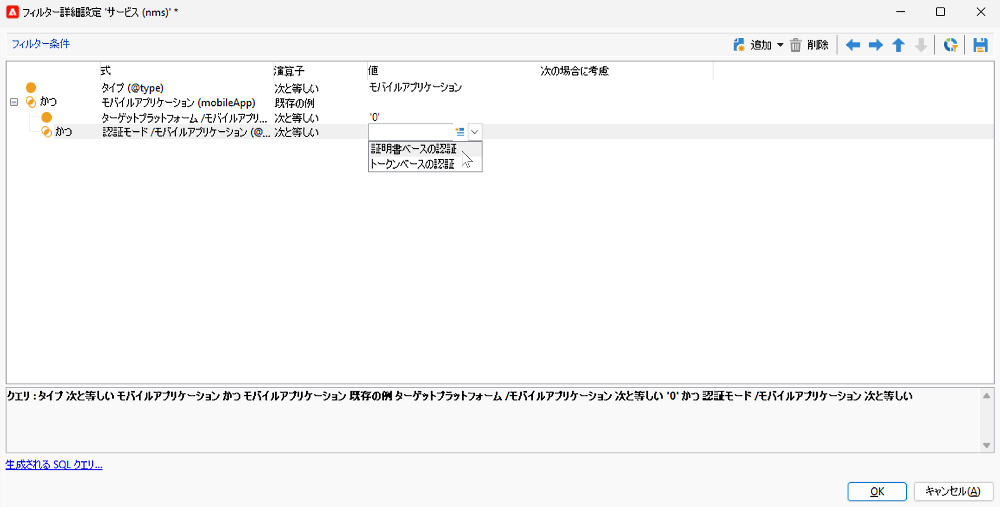
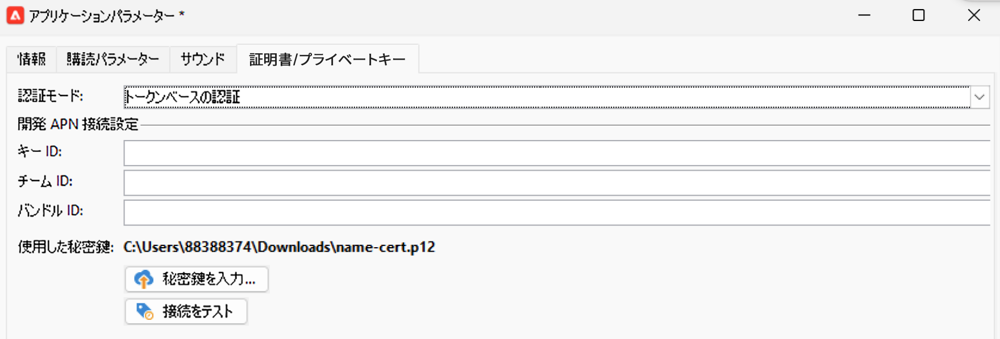

# プッシュ通知チャネルの変更 {#push-upgrade}

Campaign を使用すると、iOS および Android デバイスにプッシュ通知を送信できます。これを実行するには、Campaign をモバイルアプリケーションの購読サービスに依存させます。

2024 年に Android Firebase Cloud Messaging（FCM）サービスに対するいくつかの重要な変更をリリースします。このリリースは、Adobe Campaign の実装に影響を与える場合があります。この変更をサポートするには、Android プッシュメッセージの購読サービス設定を更新する必要がある場合があります。

さらに、アドビでは、証明書ベースの接続ではなく、より安全で拡張性の高いトークンベースの APN への接続に移行することを強くお勧めします。

## Google Android Firebase Cloud Messaging（FCM）サービス {#fcm-push-upgrade}

### 変更点 {#fcm-changes}

Google のサービス向上への継続的な取り組みの一環として、レガシー FCM API は **2024年6月20日（PT）**&#x200B;に廃止されます。Firebase Cloud Messaging HTTP プロトコルについて詳しくは、[Google Firebase ドキュメント](https://firebase.google.com/docs/cloud-messaging/http-server-ref?hl=ja){target="_blank"}を参照してください。

Adobe Campaign Classic v7 および Adobe Campaign v8 では、プッシュ通知メッセージを送信するための最新の API を既にサポートしています。ただし、古い実装の中には、依然としてレガシー API に依存するものもあります。これらの実装は更新する必要があります。

### 影響の有無 {#fcm-impact}

現在の実装がレガシー API を使用して FCM に接続する購読サービスをサポートしている場合は、影響を受けます。サービスの中断を避けるために、最新の API へのトランジションは必須です。その場合、アドビのチームがご連絡させていただきます。

影響を受けるかどうかを確認するには、以下のフィルターに従って&#x200B;**サービスと購読**&#x200B;をフィルタリングします。

* アクティブなプッシュ通知サービスのいずれかで **HTTP（レガシー）** API を使用している場合、設定はこの変更によって直接影響を受けます。現在の設定を確認し、以下で説明する新しい API に移行する必要があります。

* 設定で Android プッシュ通知用の **HTTP v1** API のみを使用している場合は、既に準拠しているので、追加のアクションは必要ありません。

### 更新方法 {#fcm-transition-procedure}

#### 前提条件 {#fcm-transition-prerequisites}

* Campaign Classic v7 の場合、20.3.1 リリースで HTTP v1 のサポートを追加しました。環境が古いバージョンで実行されている場合、HTTP v1 へのトランジションの前提条件は、環境を[最新の Campaign Classic ビルド](https://experienceleague.adobe.com/docs/campaign-classic/using/release-notes/latest-release.html?lang=ja){target="_blank"}にアップグレードすることです。Campaign v8 の場合、HTTP v1 はすべてのリリースでサポートされ、アップグレードは必要ありません。

* モバイルアプリケーションを HTTP v1 に移行するには、Android Firebase Admin SDK サービスのアカウント JSON ファイルが必要です。このファイルを取得する方法について詳しくは、[Google Firebase ドキュメント](https://firebase.google.com/docs/admin/setup?hl=ja#initialize-sdk){target="_blank"}を参照してください。

* ハイブリッド、ホストおよび Managed Services のデプロイメントの場合は、以下のトランジション手順に加えて、アドビに連絡してリアルタイム（RT）実行サーバーを更新してください。ミッドソーシングサーバーは影響を受けません。

* Campaign Classic v7 オンプレミスユーザーは、マーケティング実行サーバーとリアルタイム実行サーバーの両方をアップグレードする必要があります。ミッドソーシングサーバーは影響を受けません。

#### トランジション手順 {#fcm-transition-steps}

環境を HTTP v1 に移行するには、次の手順に従います。

1. **サービスと購読**&#x200B;のリストを参照します。
1. **HTTP（レガシー）** API バージョンを使用しているすべてのモバイルアプリケーションをリストします。
1. これらの各モバイルアプリケーションに、**API バージョン**&#x200B;を **HTTP v1** に設定します。
1. 「**[!UICONTROL プロジェクトの詳細を抽出するプロジェクトの JSON ファイルを読み込む...]**」リンクをクリックして、JSON キーファイルを直接読み込みます。

   次の詳細を手動で入力することもできます。

   * **[!UICONTROL プロジェクト ID]**
   * **[!UICONTROL 秘密鍵]**
   * **[!UICONTROL クライアントメール]**

   

1. 「**[!UICONTROL 接続をテスト]**」をクリックして、設定が正しいこと、およびマーケティングサーバーが FCM にアクセスできることを確認します。ミッドソーシングデプロイメントの場合、「**[!UICONTROL 接続をテスト]**」ボタンでは、サーバーが Android Firebase Cloud Messaging（FCM）サービスにアクセスできるかどうかを確認できません。
1. オプションとして、必要に応じ、**[!UICONTROL アプリケーション変数]**&#x200B;を使用してプッシュメッセージのコンテンツを強化できます。これらは完全にカスタマイズ可能で、モバイルデバイスに送信されるメッセージペイロードの一部です。
1. 「**[!UICONTROL 終了]**」、「**[!UICONTROL 保存]**」の順にクリックします。

以下に、プッシュ通知をさらにパーソナライズするための FCM ペイロード名を示します。これらのオプションについて詳しくは、[こちら](#fcm-apps)を参照してください。

| メッセージタイプ | 設定可能なメッセージ要素（FCM ペイロード名） | 設定可能なオプション（FCM ペイロード名） |
|:-:|:-:|:-:|
| データメッセージ | 該当なし | validate_only |
| 通知メッセージ | title、body、android_channel_id、icon、sound、tag、color、click_action、image、ticker、sticky、visibility、notification_priority、notification_count   | validate_only |

>[!NOTE]
>
>これらの変更をすべてのサーバーに適用すると、Android デバイスへのすべての新しいプッシュ通知配信で HTTP v1 API が使用されます。再試行中、処理中、使用中の既存のプッシュ配信では、HTTP（レガシー）API を引き続き使用します。

### Android アプリに対する影響 {#fcm-apps}

Android モバイルアプリケーションのコードに特別な変更は必要ありません。通知動作を変更しないでください。

ただし、HTTP v1 では、**[!UICONTROL HTTPV1 その他のオプション]**&#x200B;を使用してプッシュ通知をさらにパーソナライズできます。

以下を行うことができます。

* 「**[!UICONTROL ティッカー]**」フィールドを使用して、通知のティッカーテキストを設定します。
* 「**[!UICONTROL 画像]**」フィールドを使用して、通知に表示する画像の URL を設定します。
* 「**[!UICONTROL 通知数]**」フィールドを使用して、アプリケーションアイコンに直接表示する新しい未読情報の数を設定します。
* 「**[!UICONTROL スティッキー]**」オプションを false に設定すると、ユーザーがクリックする際に、通知が自動的に閉じられます。true に設定した場合、ユーザーがクリックしても通知が表示されます。
* 通知の&#x200B;**[!UICONTROL 通知優先度]**&#x200B;レベルを、デフォルト、最小、低、高のいずれかに設定します。
* 通知の&#x200B;**[!UICONTROL 表示]**&#x200B;レベルをパブリック、プライベート、秘密のいずれかに設定します。

**[!UICONTROL HTTP v1 その他のオプション]**&#x200B;とこれらのフィールドを設定する方法について詳しくは、[FCM ドキュメント](https://firebase.google.com/docs/reference/fcm/rest/v1/projects.messages?hl=ja#androidnotification){target="_blank"}を参照してください。

## Apple iOS プッシュ通知サービス（APNs） {#apns-push-upgrade}

### 変更点 {#ios-changes}

Apple の推奨に従って、ステートレス認証トークンを使用して Apple プッシュ通知サービス（APNs）との通信を保護する必要があります。

トークンベースの認証では、APNs と通信するためのステートレスな方法を提供します。ステートレス通信は、APNs が証明書やプロバイダーサーバーに関連するその他の情報を検索する必要がないので、証明書ベースの通信より高速です。トークンベースの認証を使用することには他にも次のようなメリットがあります。

* 複数のプロバイダーサーバーから同じトークンを使用できます。

* 1 つのトークンを使用して、会社のすべてのアプリに関する通知を配布できます。

APNs へのトークンベースの接続について詳しくは、[Apple 開発者向けドキュメント](https://developer.apple.com/documentation/usernotifications/establishing-a-token-based-connection-to-apns){target="_blank"}を参照してください。

Adobe Campaign Classic v7 および Adobe Campaign v8 は、トークンベースの接続と証明書ベースの接続の両方をサポートします。実装が証明書ベースの接続に依存している場合、アドビではトークンベースの接続に更新することを強くお勧めします。

### 影響の有無 {#ios-impact}

現在の実装が APNs への接続に証明書ベースのリクエストに依存している場合、影響を受けます。トークンベースの接続へのトランジションをお勧めします。

影響を受けるかどうかを確認するには、以下のフィルターに従って&#x200B;**サービスと購読**&#x200B;をフィルタリングします。

* アクティブなプッシュ通知サービスのいずれかが&#x200B;**証明書ベースの認証**&#x200B;モード（.p12）を使用している場合は、現在の実装を確認し、以下で説明するように&#x200B;**トークンベースの認証**&#x200B;モード（.p8）に移行する必要があります。

* 設定で iOS プッシュ通知に&#x200B;**トークンベースの認証**&#x200B;モードのみを使用している場合、実装は既に最新なので、追加のアクションは必要ありません。

### 更新方法 {#ios-transition-procedure}

#### 前提条件 {#ios-transition-prerequisites}

* Campaign Classic v7 の場合、**トークンベースの認証**&#x200B;モードのサポートを 20.2 リリースで追加しました。環境が古いバージョンで実行されている場合、この変更の前提条件は、環境を[最新の Campaign Classic ビルド](https://experienceleague.adobe.com/docs/campaign-classic/using/release-notes/latest-release.html?lang=ja){target="_blank"}にアップグレードすることです。Campaign v8 の場合、**トークンベースの認証**&#x200B;モードはすべてのリリースでサポートされ、アップグレードは必要ありません。

* サーバーが使用するトークンを生成するには、APNs 認証トークン署名キーが必要です。[Apple 開発者向けドキュメント](https://developer.apple.com/documentation/usernotifications/establishing-a-token-based-connection-to-apns){target="_blank"}で説明するように、Apple 開発者アカウントからこのキーをリクエストします。

* ハイブリッド、ホストおよび Managed Services のデプロイメントの場合は、以下のトランジション手順に加えて、アドビに連絡してリアルタイム（RT）実行サーバーを更新してください。ミッドソーシングサーバーは影響を受けません。

* Campaign Classic v7 オンプレミスユーザーは、マーケティング実行サーバーとリアルタイム実行サーバーの両方をアップグレードする必要があります。ミッドソーシングサーバーは影響を受けません。

#### トランジション手順 {#ios-transition-steps}

iOS モバイルアプリケーションをトークンベースの認証モードに移行するには、次の手順に従います。

1. **サービスと購読**&#x200B;のリストを参照します。
1. **証明書ベースの認証**&#x200B;モード（.p12）を使用してすべてのモバイルアプリケーションをリストします。
1. これらの各モバイルアプリケーションを編集し、「**証明書／秘密鍵**」タブを参照します。
1. **認証モード**&#x200B;ドロップダウンから、**トークンベースの認証**&#x200B;モード（.p8）を選択します。
1. APNs 接続設定の&#x200B;**[!UICONTROL キー ID]**、**[!UICONTROL チーム ID]**、**[!UICONTROL バンドル ID]** を入力し、「**[!UICONTROL 秘密鍵を入力...]**」をクリックして p8 証明書を選択します。

   

1. 「**[!UICONTROL 接続をテスト]**」をクリックして、設定が正しいこと、およびサーバーが APNs にアクセスできることを確認します。ミッドソーシングデプロイメントの場合、「**[!UICONTROL 接続をテスト]**」ボタンでは、サーバーが APNs にアクセスできるかどうかを確認できません。
1. 「**[!UICONTROL 次へ]**」をクリックして本番アプリケーションの設定を行い、上記と同じ手順に従います。
1. 「**[!UICONTROL 終了]**」、「**[!UICONTROL 保存]**」の順にクリックします。

これで、iOS アプリケーションがトークンベースの認証モードに移行しました。
