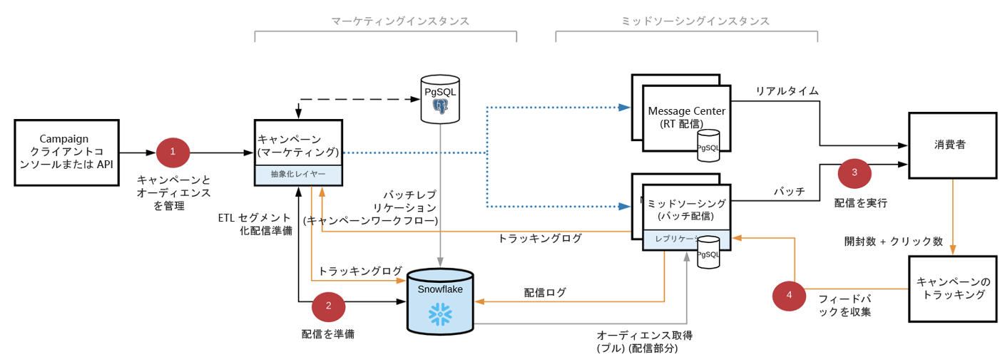

# [!DNL Campaign] FFDA デプロイメント{#gs-ac-ffda}

クラウドデータベース技術である [[!DNL Snowflake]](https://www.snowflake.com/) を活用することで、Adobe Campaign Enterprise Full Federated Access（FFDA）デプロイメントは速度と拡張性を劇的に改善し、管理できる顧客プロファイルの数を大幅に増加させ、1 時間あたりの配信率やトランザクション数を大幅に向上させました。

## 利点 {#ffda-benefits}

Campaign v8 Enterprise（FFDA）では、ターゲティングから最終的なレポートまで、プロセスのあらゆる段階において規模の拡大・縮小をエンドツーエンドで行えます。

* 処理可能なデータ量を拡張（8 TB まで）
* セグメント化とターゲティングのためのクエリのパフォーマンスと、データの取り込みと取り出しのパフォーマンスを拡張
* 配信準備の拡大・縮小（数時間から数分まで）

これは、基本的なソフトウェアアーキテクチャの変更です。データはリモートに格納され、Campaign によってプロファイルを含むデータ全体が統合されます。[!DNL Campaign] プロセスは、ターゲティングからメッセージの実行に至るまで、エンドツーエンドで拡張できるようになりました。データの取り込み、セグメント化、ターゲティング、クエリ、配信などは通常、数分で実行されます。この新しいバージョンでは、柔軟性と拡張性のレベルを保ちながら、拡大および縮小の課題を解決します。プロファイルの数にはほとんど制限がなく、データの保持期間も延長できます。

クラウドストレージは、**[!DNL Snowflake]** で実行されます。新しいビルトインの&#x200B;**外部アカウント**により、クラウドデータベースとの接続を確保します。
この設定はアドビがおこない、変更できません。[詳細](../config/external-accounts.md)

クラウドデータベースで移動や複製が必要なビルトインのスキーマやテーブルには、**xxl** 名前空間にビルトインのスキーマ拡張機能が付属しています。この拡張機能には、ビルトインスキーマを [!DNL Campaign] ローカルデータベースから [!DNL Snowflake] クラウドデータベースに移動して、構成を適切に調整するために必要な変更（新しい UUID、リンクの更新など）が含まれます。

>[!CAUTION]
>
> 顧客データは、ローカルの [!DNL Campaign] データベースには格納されません。そのため、カスタムテーブルはクラウドデータベース内に作成する必要があります。

## Campaign Enterprise（FFDA）アーキテクチャ{#ffda-archi}

[エンタープライズ（FFDA）デプロイメント](../architecture/enterprise-deployment.md)で、[!DNL Adobe Campaign] v8 は 2 つのデータベースで動作します。1 つ目はユーザーインターフェイスのリアルタイムメッセージングや単一クエリ、API 経由での書き込みを行うローカル [!DNL Campaign] データベース、もう 1 つはキャンペーンの実行、バッチクエリ、ワークフローの実行を行うクラウド [!DNL Snowflake] データベースです。

Campaign v8 Enterprise では、**Full Federated Data Access**（FFDA）の概念が導入されており、すべてのデータがリモートのクラウドデータベース上にあります。

ローカルデータベースとクラウドデータベースの間でデータを管理するには、特定の API を使用できます。これらの新しい API の動作と使い方については、[このページ](new-apis.md)を参照してください。

サーバーとプロセス間の一般的な通信は、次のスキーマに従って実行されます。

* 実行とバウンスの管理モジュールがインスタンスで無効になっています。
* アプリケーションは、SOAP 呼び出し（HTTP または HTTPS 経由）を使用して駆動されるリモートの「ミッドソース」サーバーでメッセージを実行するように設定されています。

マーケティングサイドの [!DNL Snowflake] のデータベースは、次の目的で使用されます。

* すべての顧客データを保存：プロファイルや、トランザクション、製品、場所などのカスタムデータ。
* 配信ログ、トラッキングログ、プッシュ登録など、Campaign で生成または収集されたすべてのイベントと行動データの保存。
* 上記のすべてのデータ集計の保存。
* 参照テーブル（配信、列挙、国など）のコピー（h + 1）の保存（ワークフロー、キャンペーン、レポートで使用されます）。
* すべてのバッチプロセスとワークロードの実行

マーケティングインスタンス上の PostgreSQL データベースは、次の目的で使用されます。

* ボリュームの少ない API など、特定のワークロードの実行。
* 配信とキャンペーンの設定、ワークフロー、サービスの定義を含む、すべての Campaign データの保存。
* すべてのビルトイン参照テーブル（列挙、国など）の保存（[!DNL Snowflake] に複製されます）。

   ただし、次の操作はできません。
   * 顧客データのカスタマイズを作成（例えば、PostgreSQL では世帯テーブルを作成せず、Snowflake でのみ作成します）。
   * 配信ログ、トラッキングログなどの保存（FFDA ターゲティングディメンション上）。
   * 大量データの保存。

ミッドソーシングインスタンス上の PostgreSQL データベースは、次の目的で使用されます。

* バッチ配信とリアルタイム（RT）配信の実行。
* 配信およびトラッキングログの送信 - 配信およびトラッキングログ ID は、32 ビット ID ではなく UUID です。
* トラッキングデータの収集および保存。

## 影響{#ffda-impacts}

### [!DNL Campaign] API のステージングメカニズム{#staging-api}

[!DNL Campaign] Cloud データベースでは、パフォーマンス（待ち時間と同時実行性）のため、単一呼び出しのブラストは推奨されません。バッチ操作は常に推奨されます。API の最適なパフォーマンスを保証するために、Campaign は API 呼び出しの処理をローカルデータベースレベルで継続します。

 [API のステージングメカニズム について詳しくは、このページを参照してください。](staging.md)

### 新しい API{#new-apis}

[!DNL Campaign] ローカルデータベースと Cloud データベース間のデータ同期を管理する新しい API をご利用いただけます。また、遅延を回避し、全体的なパフォーマンスを向上させるために、ローカルデータベースレベルで API 呼び出しを処理する新しいメカニズムが導入されました。

 [新しい API について詳しくは、このページを参照してください。](new-apis.md)

### データのレプリケーション{#data-replication}

Campaign のローカルデータベースとクラウドデータベースの両側に存在する必要があるテーブルは、特定のテクニカルワークフローでレプリケーションを処理します。このワークフローは 1 時間ごとにトリガーされ、新規のビルトイン JavaScript ライブラリを活用します。

>[!NOTE]
>
> テーブルのサイズ（XS、XL など）に基づいて、複数のレプリケーションポリシーが作成されます。
> テーブルの中には、リアルタイムで複製されるものと、1 時間単位で複製されるものがあります。テーブルには、増分更新をおこなうものと、完全に更新されるものがあります。

[データレプリケーションについて説明します](replication.md)

### ID 管理{#id-mgt-ffda}

Campaign v8 オブジェクトは、**UUID（ユニバーサルに一意の ID）**&#x200B;を使用するようになりました。これにより、一意の値（無制限）でデータを識別できます。

この ID は文字列で、連続していません。Campaign v8 ではプライマリキーは数値ではないため、スキーマで **autouuid** 属性と **autopk** 属性を使用する必要があります。

Campaign Classic v7 以前のバージョンでは、スキーマ（テーブルなど）のキーの単一性はデータベースエンジンのレベルで処理されます。一般的に、従来のデータベースエンジン（PostgreSQL、Oracle、SQL Server など）では、プライマリキーや一意のインデックスの列を使用して、重複行を挿入しないようにするためのメカニズムをネイティブで備えています。適切なインデックスとプライマリキーがデータベースレベルで設定されている限り、これらのバージョンでは ID の重複は発生しません。

Adobe Campaign v8 には、コアデータベースとして Snowflake が付属しています。クエリの規模が大幅に拡大するため、Snowflake データベースの分散アーキテクチャでは、テーブル内のキーの単一性を強制するそのようなメカニズムは提供されません。そのため、Adobe Campaign v8 では、重複したキーがテーブルに取り込まれるのを防ぐことはできません。エンドユーザーは、Adobe Campaign データベース内のキーの一貫性を確保する責任を負うようになりました。[詳細](keys.md)

**関連トピック**

* [データモデルのベストプラクティス](../dev/datamodel-best-practices.md)
