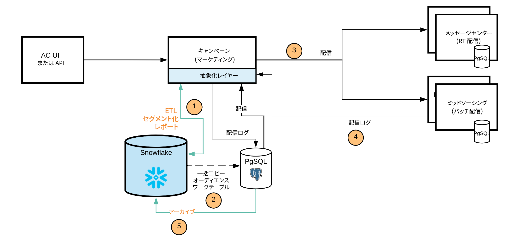

# [!DNL Campaign] FDA [!DNL Snowflake] デプロイメント{#gs-fda-snowflake}

[!DNL Snowflake] FDA（デフォルト）デプロイメントでは、[!DNL Adobe Campaign] v8 は [Federated Data Access](../connect/fda.md) 機能を通じて [!DNL Snowflake] に接続し、データにアクセスします。Adobe Campaign データの構造を変更することなく、[!DNL Snowflake] データベースに保存された外部データおよび情報にアクセスし、処理することができます。

## 利点{#fda-benefits}

このデプロイメントモデルには、次のような利点があります。

* **ストレージとパフォーマンス**
履歴データを [!DNL Snowflake] に移動させ、依存関係を Adobe Campaign ID 制限に減らすことができます。また、このアーキテクチャは、PostgreSQL のストレージとパフォーマンスの制限への依存を減らします。Campaign データベースに保存されるデータ量が少なくなるので、パフォーマンスが向上し、メンテナンスタスクを速く実行できます。

* **データモデル拡張機能とデータ管理**
[!DNL Snowflake] にテーブルを作成し、Adobe Campaign にリンクさせることができます。例えば、保存期間中にアーカイブされたデータを使用したり、優れたパフォーマンスでセグメント化プロセスを実行したりすることができます。

   また、このアーキテクチャを使用すると、[!DNL Snowflake] でデータ管理ワークフロー機能を使用することができます。パーソナライゼーションおよび配信の目的で、集計および一時テーブルのみが Campaign に移動されます。

## アーキテクチャ{#fda-archi}

このデプロイメントモデルを使用すると、Adobe Campaign のユーザーは、データを [!DNL Snowflake] に拡張し、統合された単一のデータプラットフォームの利点を活用して、強力なマーケティングキャンペーンのデータインサイトをリアルタイムで得ることができます。統合され、単一で使いやすいデータ分析用プラットフォームを提供することで、ユーザーはデータから重要な価値を引き出すことができます。クラウドデータプラットフォームは、Adobe Campaign のあらゆる量のマーケティングデータをサポートするように広範囲でスケーリングできるので、管理の必要はありません。

サーバーとプロセス間の一般的な通信は、次のスキーマに従って実行されます。

PostgreSQL はプライマリデータベースで、Snowflake はセカンダリデータベースです。データモデルを拡張し、データを Snowflake に保存できます。その後、優れたパフォーマンスを持つ大規模なデータセットに対して ETL、セグメント化、レポートを実行できます。
