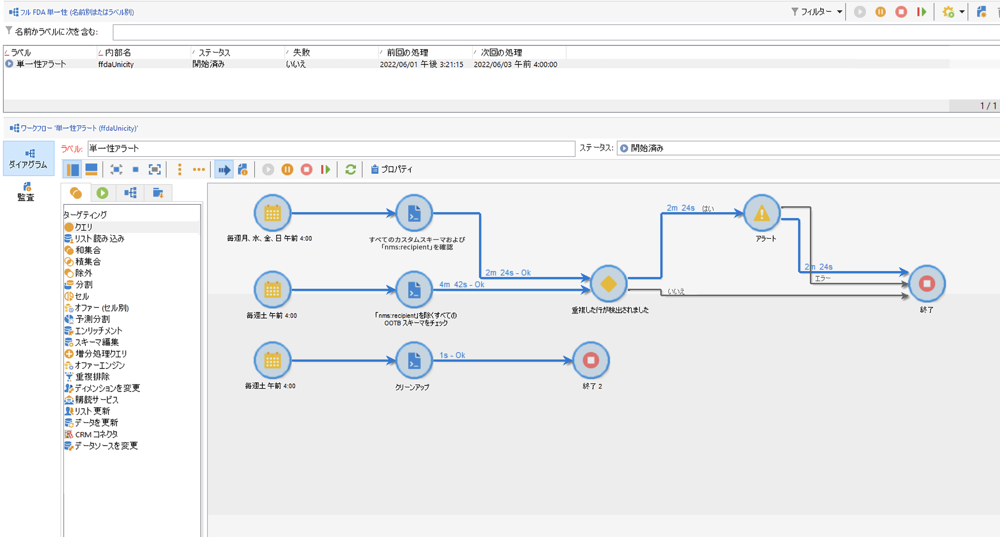
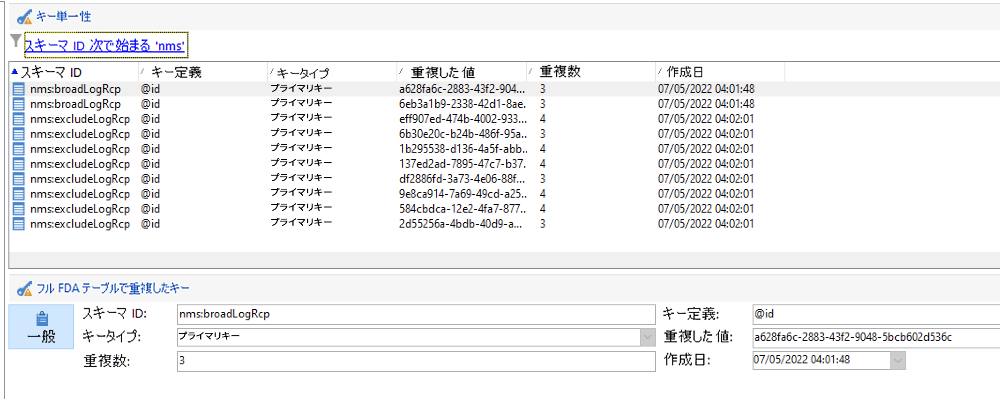
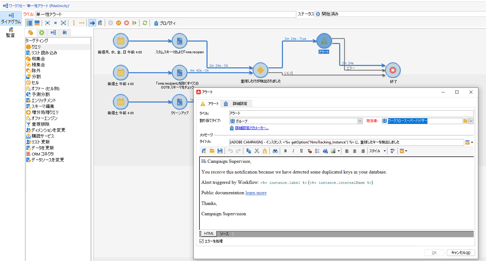
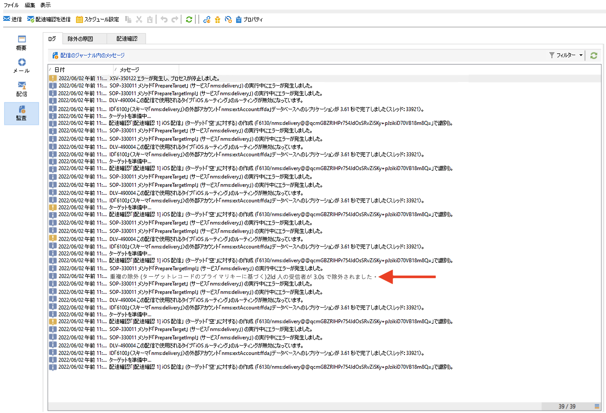
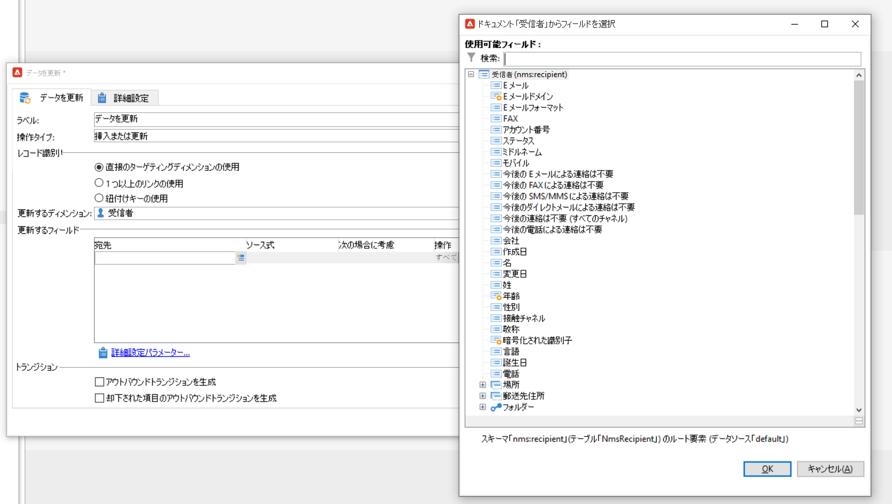
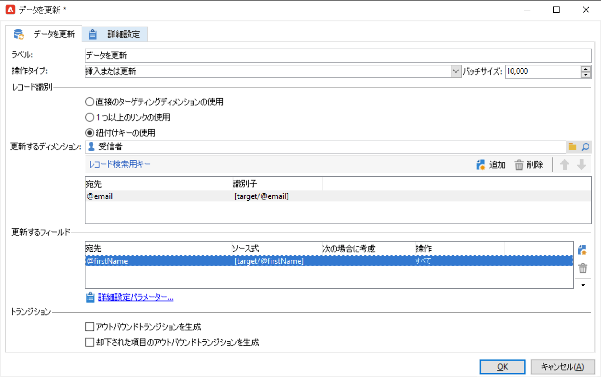
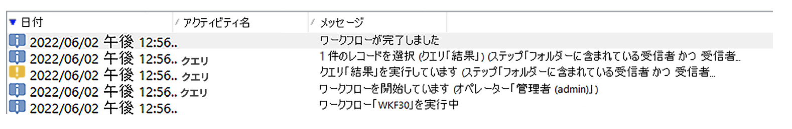

# 鍵の管理と単一性 {#key-management}

[エンタープライズ（FFDA）デプロイメント](enterprise-deployment.md)のコンテキストでは、プライマリキーは文字列であるユニバーサル固有識別子（UUID）です。UUID を作成するには、スキーマのメイン要素に **autouuid** 属性と **autopk** 属性を含め、**true** に設定する必要があります。

Adobe Campaign v8 は [!DNL Snowflake] をコアデータベースとして使用します。[!DNL Snowflake] データベースの分散アーキテクチャには、テーブル内のキーの単一性を管理するメカニズムはありません。Adobe Campaign データベース内のキーの一貫性は、エンドユーザーが確保する必要があります。

リレーショナルデータベースの一貫性を維持するには、キー（特にプライマリキー）の重複を避けることが必須です。プライマリキーが重複すると、**クエリ**、**紐付け**、**データの更新**&#x200B;などのデータ管理ワークフローのアクティビティに問題を引き起こします。[!DNL Snowflake] テーブルの更新時に適切な紐付け条件を定義する際に重要です。

>[!CAUTION]
>
>キーの重複は、UUID に限って発生するわけではありません。カスタムテーブルで作成されたカスタムキーを含む ID で発生する可能性があります。

## Unicity Service{#unicity-service}

Unicity Service は、Cloud Database テーブル内の一意のキー制約の整合性を保持および監視するのに役立つ Cloud Database Manager コンポーネントです。これにより、重複したキーを挿入するリスクを軽減できます。

Cloud Database は単一性の制約を実施しないので、Unicity Service は Adobe Campaign でデータを管理する際に重複を挿入するリスクを軽減します。

### 単一性ワークフロー{#unicity-wf}

Unicity Service は専用の&#x200B;**[!UICONTROL 単一性アラート]**&#x200B;ビルトインワークフローを備えており、単一性の制約を監視し、重複が検出された際にアラートします。

これらのテクニカルワークフローは、Campaign Explorer の&#x200B;**[!UICONTROL 管理／本番環境／テクニカルワークフロー／フル FFDA 単一性]**&#x200B;ノードから利用できます。**これは変更できません**。

このワークフローは、すべてのカスタムおよびビルトインスキーマをチェックし、重複した行を検出します。

**[!UICONTROL 単一性アラート]**（ffdaUnicity）ワークフローが重複キーを検出した場合、スキーマ名、キーのタイプ、影響を受ける行数、日付を含む特定の&#x200B;**単一性監査**&#x200B;テーブルに追加されます。**[!UICONTROL 管理／監査／キー単一性]**&#x200B;ノードの重複したキーにアクセスすることができます。

データベース管理者は SQL アクティビティを使用して重複を削除するか、アドビカスタマーケアに詳細をお問い合わせください。

### アラート{#unicity-wf-alerting}

重複したキーが検出された場合、特定の通知が&#x200B;**[!UICONTROL ワークフロースーパーバイザー]**&#x200B;オペレーターグループに送信されます。このアラートのコンテンツとオーディエンスは、**[!UICONTROL 単一性アラート]**&#x200B;ワークフローの&#x200B;**アラート**&#x200B;アクティビティで変更できます。

## 追加のガードレール{#duplicates-guardrails}

キャンペーンは、[!DNL Snowflake] データベースで重複したキーが挿入されるのを防ぐための一連の新しいガードレールを備えています。

>[!NOTE]
>
>これらのガードレールは、Campaign v8.3 以降で使用できます。バージョンを確認するには、[この節](../start/compatibility-matrix.md#how-to-check-your-campaign-version-and-buildversion)を参照してください。

### 配信準備{#remove-duplicates-delivery-preparation}

Adobe Campaign は、配信の準備中に重複した UUID をオーディエンスから自動的に削除します。このメカニズムは、配信の準備中にエラーが発生するのを防ぎます。エンドユーザーは、配信ログの「キーが重複しているため、一部の受信者はメインターゲットから除外されます」という情報を確認できます。その際、次の警告が表示されます。`Exclusion of duplicates (based on the primary key or targeted records)`

### ワークフロー内のデータ更新{#duplicates-update-data}

[エンタープライズ（FFDA）デプロイメント](enterprise-deployment.md)のコンテキストでは、内部キー（UUID）をフィールドとして選択して、ワークフロー内のデータを更新することはできません。

明示的な紐付けキーを使用する場合、**データを更新**&#x200B;アクティビティは、次の方法で、このキーに基づいて宛先スキーマの単一性を自動的に保証します。

1. （トランジションから）受信データの重複排除
1. 宛先テーブルとのデータの重複排除（結合）

>[!CAUTION]
>
>このガードレールはオプション「**[!UICONTROL 紐付けキーの使用]**」でのみ適用されます。

### 重複を含むスキーマのクエリ{#query-with-duplicates}

ワークフローがスキーマに対するクエリの実行を開始すると、Adobe Campaign は重複したレコードが[監査単一性テーブル](#unicity-wf)で報告されているかを確認します。その場合、ワークフローは、重複したデータに対する後続の操作がワークフローの結果に影響を与える可能性があるという警告をログに記録します。

このチェックは、次のワークフローアクティビティで実行されます。

* クエリ
* 増分クエリ
* リスト読み込み