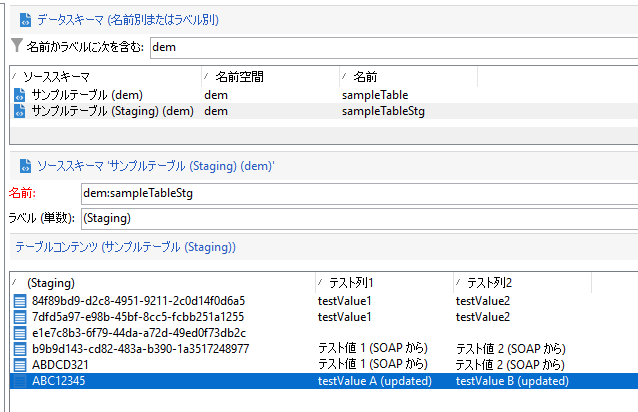

# Campaign の新しい API{#gs-new-api}

のコンテキストでは、 [エンタープライズ (FFDA) デプロイメント](enterprise-deployment.md)Campaign v8 には、Campaign のローカルデータベースと Cloud データベースの間のデータを管理するための 2 つの新しい API が付属しています。 これらを使用するための前提条件は、スキーマ上でステージングメカニズムを有効にすることです。 [詳細](staging.md)

* 取得 API：**xtk.session.ingest**

   この API は、データ挿入専用です。 [詳細情報](#data-insert-api)

* データ更新／削除 API：**xtk.session.ingestExt**

   この API は、データを更新または削除するために使用されます。 [詳細情報](#data-update-api)

専用のビルトインワークフローが、Cloud データベースのデータを同期します。

## データの挿入{#data-insert-api}

**xtk.session.ingest** API は、データ挿入専用です。 更新／削除はありません。

### 紐付けなしで挿入

**ワークフロー内**

**Javascript コード**&#x200B;アクティビティで次のコードを使用して、紐付けなしで Cloud データベースにデータを挿入します。

```
var xmlStagingSampleTable = <sampleTableStg
                                testcol1="testValue1"
                                testcol2="testValue2"
                                xtkschema="dem:sampleTableStg">
                            </sampleTableStg>;
strUuid = xtk.session.Ingest(xmlStagingSampleTable);
logInfo(strUuid);
```

ワークフローが実行されると、ステージングテーブルが期待どおりにフィードされます。

**SOAP 呼び出しから**

1. 認証トークンを取得します。
1. API のトリガー。 ペイロードは次のとおりです。

   ```
   <soapenv:Envelope xmlns:soapenv="http://schemas.xmlsoap.org/soap/envelope/" xmlns:urn="urn:xtk:session">
   <soapenv:Header/>
   <soapenv:Body>
       <urn:Ingest>
           <urn:sessiontoken>___xxxxxxx-xxxx-xxx-xxx-xxxxxxxxxxx</urn:sessiontoken>
           <urn:domDoc>
               <sampleTableStg
                   testcol1="Test Value 1 (from SOAP)"
                   testcol2="Test Value 2 (from SOAP)"
                   xtkschema="dem:sampleTableStg">
               </sampleTableStg>
           </urn:domDoc>
       </urn:Ingest>
   </soapenv:Body>
   </soapenv:Envelope>
   ```

1. UUID が SOAP 応答に返されます。

   ```
   <SOAP-ENV:Envelope xmlns:xsd="http://www.w3.org/2001/XMLSchema" xmlns:xsi="http://www.w3.org/2001/XMLSchema-instance" xmlns:ns="urn:wpp:default" xmlns:SOAP-ENV="http://schemas.xmlsoap.org/soap/envelope/">
   <SOAP-ENV:Body>
       <IngestResponse SOAP-ENV:encodingStyle="http://schemas.xmlsoap.org/soap/encoding/" xmlns="urn:wpp:default">
           <pstrSUuids xsi:type="xsd:string">e1e7c8b3-6f79-44da-a72d-49ed0f73db2c</pstrSUuids>
       </IngestResponse>
   </SOAP-ENV:Body>
   </SOAP-ENV:Envelope>
   ```

その結果、ステージングテーブルが期待どおりにフィードされます。


### 紐付けして挿入

**ワークフロー内**

**Javascript コード**&#x200B;アクティビティで次のコードを使用し、紐付けを使用して Cloud データベースにデータを挿入します。

```
var xmlStagingSampleTable = <sampleTableStg  _key="@id" id="ABC12345"
                              testcol1="testValue1"
                              testcol2="testValue2"
                              xtkschema="dem:sampleTableStg">
                            </sampleTableStg>;         
strUuid = xtk.session.Ingest(xmlStagingSampleTable);
logInfo(strUuid);
```

ワークフローが実行されると、ステージングテーブルが期待どおりにフィードされます。




**SOAP 呼び出しから**

1. 認証トークンを取得します。
1. API のトリガー。 ペイロードは次のとおりです。

   ```
   <soapenv:Envelope xmlns:soapenv="http://schemas.xmlsoap.org/soap/envelope/" xmlns:urn="urn:xtk:session">
   <soapenv:Header/>
   <soapenv:Body>
     <urn:Ingest>
        <urn:sessiontoken>___5e71f4bf-d38a-4ba8-ac15-35a958f7f138</urn:sessiontoken>
        <urn:domDoc>
           <sampleTableStg  _key="@id" id="ABDCD321"
                testcol1="Test Value 1 (from SOAP)"
                testcol2="Test Value 2 (from SOAP)"
                xtkschema="dem:sampleTableStg">
            </sampleTableStg>
        </urn:domDoc>
     </urn:Ingest>
    </soapenv:Body>
   </soapenv:Envelope>
   ```

1. この場合、UUID はペイロードで提供されているため、応答には返されません。応答は次のとおりです。

   ```
   <SOAP-ENV:Envelope xmlns:xsd="http://www.w3.org/2001/XMLSchema" xmlns:xsi="http://www.w3.org/2001/XMLSchema-instance" xmlns:ns="urn:wpp:default" xmlns:SOAP-ENV="http://schemas.xmlsoap.org/soap/envelope/">
   <SOAP-ENV:Body>
       <IngestResponse SOAP-ENV:encodingStyle="http://schemas.xmlsoap.org/soap/encoding/" xmlns="urn:wpp:default">
           <pstrSUuids xsi:type="xsd:string"/>
       </IngestResponse>
   </SOAP-ENV:Body>
   </SOAP-ENV:Envelope>
   ```

その結果、ステージングテーブルが期待どおりにフィードされます。

## データの更新または削除{#data-update-api}

**xtk.session.IngestExt** API は、データの更新／削除用に最適化されています。 挿入のみをおこなう場合は、**xtk.session.ingest** を選択します。 レコードキーがステージングテーブルにない場合でも、挿入は機能します。

### 挿入／更新

**ワークフロー内**

**JavaScript コード**&#x200B;アクティビティで次のコードを使用して、Cloud データベース内のデータを更新します。

```
var xmlStagingRecipient = <sampleTableStg  _key="@id" id="ABC12345"
                              testcol1="testValue A (updated)"
                              testcol2="testValue B (updated)"
                              xtkschema="dem:sampleTableStg">
                            </sampleTableStg>;
xtk.session.IngestExt(xmlStagingRecipient);
```

ワークフローが実行されると、ステージングテーブルが期待どおりに更新されます。


**SOAP 呼び出しから**


1. 認証トークンを取得します。
1. API のトリガー。 ペイロードは次のとおりです。

   ```
   <soapenv:Envelope xmlns:soapenv="http://schemas.xmlsoap.org/soap/envelope/" xmlns:urn="urn:xtk:session">
   <soapenv:Header/>
   <soapenv:Body>
       <urn:IngestExt>
           <urn:sessiontoken>___444cd168-a1e2-4fb6-a2a8-73be9f133489</urn:sessiontoken>
           <urn:domDoc>
           <sampleTableStg  _key="@id" id="ABDCD321"
                   testcol1="Test Value E (from SOAP)"
                   testcol2="Test Value F (from SOAP)"
                   xtkschema="dem:sampleTableStg">
               </sampleTableStg>
           </urn:domDoc>
       </urn:IngestExt>
   </soapenv:Body>
   </soapenv:Envelope>
   ```

1. SOAP 応答は次のとおりです。

   ```
   <SOAP-ENV:Envelope xmlns:xsd="http://www.w3.org/2001/XMLSchema" xmlns:xsi="http://www.w3.org/2001/XMLSchema-instance" xmlns:ns="urn:wpp:default" xmlns:SOAP-ENV="http://schemas.xmlsoap.org/soap/envelope/">
   <SOAP-ENV:Body>
       <IngestExtResponse SOAP-ENV:encodingStyle="http://schemas.xmlsoap.org/soap/encoding/" xmlns="urn:wpp:default"/>
   </SOAP-ENV:Body>
   </SOAP-ENV:Envelope>
   ```

その結果、ステージングテーブルは期待どおりに更新されます。

## 購読管理 {#sub-apis}

Campaign の購読管理については、[このページ](../start/subscriptions.md)を参照してください。

購読や購読解除のデータは、Campaign ローカルデータベースの[ステージングメカニズム](staging.md)を使用して挿入されます。購読者の情報は、ローカルデータベースのステージングテーブルにいったん格納され、同期ワークフローによってローカルデータベースからクラウドデータベースに送信されます。 そのため、購読や購読解除のプロセスは&#x200B;**非同期**&#x200B;でおこなわれます。オプトインやオプトアウトのリクエストは、特定のテクニカルワークフローによって 1 時間ごとに処理されます。 [詳細情報](replication.md#tech-wf)


**関連トピック**

* [Campaign Classic v7 JSAPI](https://experienceleague.adobe.com/developer/campaign-api/api/p-1.html?lang=ja)
