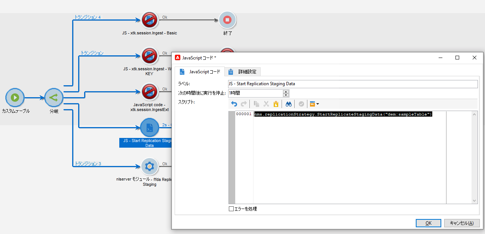
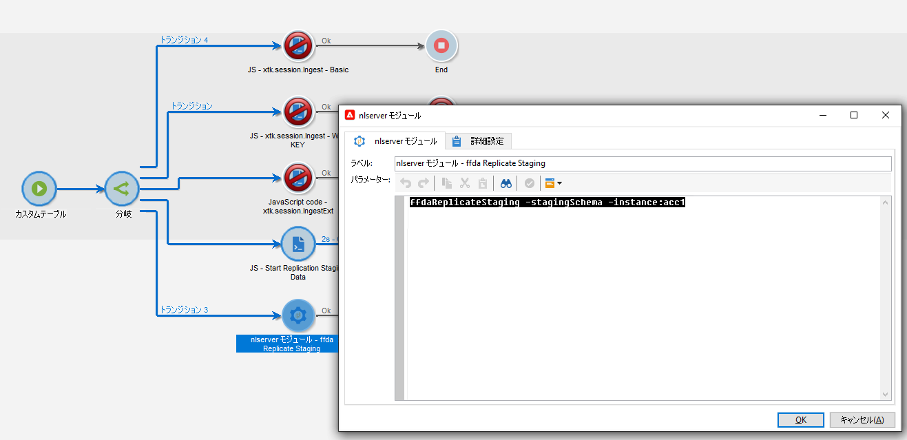

# データレプリケーション {#wf-data-replication}

## 原則

[エンタープライズ（FFDA）デプロイメント](enterprise-deployment.md)のコンテキストでは、データレプリケーションにより、Campaign のローカルデータベース（PostgreSQL）とクラウドデータベース（[!DNL Snowflake]）の 2 つのデータベースが並行して動作し、リアルタイムで同期された状態が維持されます。

クラウドデータベース（[!DNL Snowflake]）は、100 万個のアドレスの更新など、大規模なデータバッチの処理に最適化されています。 一方、Campaign のローカルデータベース（PostgreSQL）は、個別の操作や少量の操作（単一のシードアドレスの更新など）に適しています。 同期はバックグラウンドで自動的かつ透過的に行われ、Campaign のローカルデータベース（PostgreSQL）のデータがクラウドデータベース（[!DNL Snowflake]）にリアルタイムで複製され、両方のデータベースの同期が維持されます。 データ同期には、スキーマ、テーブルおよびデータが含まれます。

➡️ [ビデオでデータレプリケーションの仕組みを詳しく見る](#video)

## レプリケーションモード {#modes}

データレプリケーションは、ユースケースに応じて様々なモードで実行できます。

* **オンザフライレプリケーション**&#x200B;は、リアルタイム複製が不可欠な場合に対応します。 拡散の作成やシードアドレスの更新などのユースケースでは、特定のテクニカルスレッドに依存してデータを即座にレプリケートします。
* **スケジュールされたレプリケーション**&#x200B;は、即時の同期が不要な場合に使用されます。 スケジュールされたレプリケーションでは、タイポロジルールなどのデータを同期するために、1 時間ごとに実行される特定の[テクニカルワークフロー](#workflows)が使用されます。

## レプリケーションポリシー

レプリケーションポリシーは、Campaign のローカルデータベース（PostgreSQL）テーブルからレプリケートされるデータの量を定義します。 これらのポリシーは、テーブルのサイズと特定のユースケースによって異なります。 増分的に更新されるテーブルもあれば、全体がレプリケートされるテーブルもあります。 レプリケーションポリシーには、主に次の 3 つのタイプがあります。

* **XS**：このポリシーは、比較的小さいサイズのテーブルに使用されます。 テーブル全体が一度にレプリケートされます。 増分レプリケーションでは、タイムスタンプポインタを使用して最近の変更のみをレプリケートすることで、同じデータが繰り返しレプリケートされるのを回避します。
* **SingleRow**：このポリシーは、一度に 1 行のみをレプリケートします。 これは通常、現在の Campaign オブジェクトと関連オブジェクトを含むオンザフライレプリケーションに使用されます。
* **SomeRows**：このポリシーは、クエリ定義またはフィルターを使用して、限られたデータのサブセットをレプリケートするために設計されています。 これは、選択的レプリケーションが必要な大規模なテーブルに使用されます。

## レプリケーションワークフロー {#workflows}

Campaign v8 は、スケジュールされたデータレプリケーションを管理するための特定のテクニカルワークフローに依存しています。 これらのテクニカルワークフローは、Campaign エクスプローラーの&#x200B;**[!UICONTROL 管理／本番環境／テクニカルワークフロー／フル FFDA レプリケーション]**&#x200B;ノードから利用できます。 **これらは変更できません。**

テクニカルワークフローは、サーバーで定期的にスケジュールされたプロセスやジョブを実行します。 すべてのテクニカルワークフローのリストについて詳しくは、[このページ](https://experienceleague.adobe.com/docs/campaign/automation/workflows/introduction/wf-type/technical-workflows.html?lang=ja){target="_blank"}を参照してください。

データレプリケーションを確保するテクニカルワークフローは次のとおりです。

| テクニカルワークフロー | 説明 |
|------|-----------|
| **[!UICONTROL 参照テーブルをレプリケート]**（ffdaReplicateReferenceTables） | Campaign のローカルデータベース（PostgreSQL）とクラウドデータベース（[!DNL Snowflake]）に不可欠なビルトインのテーブルの自動レプリケーションを実行します。 毎日 1 時間ごとに実行するようにスケジュールされます。 **lastModified** フィールドが存在する場合、レプリケーションは増分的に行われます。存在しない場合はテーブル全体がレプリケートされます。 |
| **[!UICONTROL ステージングデータをレプリケート]**（ffdaReplicateStagingData） | 単一の呼び出し用にステージングデータをレプリケートします。 毎日 1 時間ごとに実行するようにスケジュールされます。 |
| **[!UICONTROL 直ちに FFDA をデプロイ]**（ffdaDeploy） | クラウドデータベースへの即時デプロイメントを実行します。 |
| **[!UICONTROL 直ちに FFDA データをレプリケート]**（ffdaReplicate） | 指定の外部アカウントの XS データをレプリケートします。 |

必要に応じて、データの同期を手動で開始できます。 これを実行するには、**スケジューラー**&#x200B;アクティビティを右クリックし、「**保留中のタスクを今すぐ実行**」を選択します。

ビルトインの&#x200B;**参照テーブルをレプリケート**&#x200B;テクニカルワークフローに加えて、次のいずれかの方法を使用してワークフローでデータレプリケーションを強制できます。

+++データレプリケーションを強制する方法

* 次のコードを使用して、特定の **JavaScript コード**&#x200B;アクティビティを追加する：

  ```
  nms.replicationStrategy.StartReplicateStagingData("dem:sampleTable")
  ```

  

* 次のコマンドを使用して、特定の **nlmodule** アクティビティを追加する：

  ```
  nlserver ffdaReplicateStaging -stagingSchema -instance:acc1
  ```

  

+++

<br/>

>[!NOTE]
>
>オンザフライレプリケーションは、ワークフローではなく、特定のテクニカルスレッドで処理されます。 このモードの設定は、serverConf.xml ファイルで管理されます。 XS テーブル全体ではなく増分的にレプリケートすることをリクエストするなど、特定のユースケースに合わせて serverConf.xml を設定できます。 詳しくは、アドビ担当者にお問い合わせください。

## API

API を使用すると、Campaign のローカルデータベース（PostgreSQL）からクラウドデータベース（[!DNL Snowflake]）へのカスタムデータと標準データの両方のレプリケーションが可能になります。 これらの API を使用すると、定義済みのワークフローをバイパスし、カスタムテーブルのレプリケートなど、特定の要件に合わせてレプリケーションをカスタマイズできます。

例：

```
var dataSource = "nms:extAccount:ffda";
var xml = xtk.builder.CopyXxlData(
    <params dataSource={dataSource} policy="xs">
        <srcSchema name="cus:recipient"/>
    </params>
);
```

## レプリケーションキュー

大量のレプリケーションリクエストが同時に行われると、結合操作中のテーブルレベルのロックにより、クラウドデータベース（[!DNL Snowflake]）でパフォーマンスの問題が発生する場合があります。 この問題を軽減するために、一元化されたレプリケーションワークフローでは、リクエストをキューにグループ化します。

各キューは、テクニカルワークフローで処理され、特定のテーブルのレプリケーションを管理し、保留中のリクエストを単一の結合操作として実行します。 これらのワークフローは、20 秒ごとにトリガーされ、新しいレプリケーションリクエストを処理します。

| テクニカルワークフロー | 説明 |
|------|-----------|
| **nmsDelivery キューをレプリケート**（ffdaReplicateQueueDelivery） | `nms:delivery` テーブルのキュー。 |
| **nmsDlvExclusion キューをレプリケート**（ffdaReplicateQueueDlvExclusion） | `nms:dlvExclusion` テーブルのキュー。 |
| **nmsDlvMidRemoteIdRel キューをレプリケート**（ffdaReplicateQueueDlvMidRemoteIdRel） | `nms:dlvRemoteIdRel` テーブルのキュー。 |
| **nmsTrackingUrl キューをレプリケート**（ffdaReplicateQueueTrackingUrl）<br/>**nmsTrackingUrl キューを並行してレプリケート**（ffdaReplicateQueueTrackingUrl_2） | `nms:trackingUrl` テーブルに並行してキューを作成し、2 つのワークフローを利用して、異なる優先度に基づいてリクエストを処理することで効率を向上させます。 |

## チュートリアル {#video}

このビデオでは、Adobe Campaign v8 が使用するデータベース、データがレプリケートされる理由、レプリケートされるデータおよびレプリケーションプロセスの仕組みに関する主な概念について説明します。

>[!VIDEO](https://video.tv.adobe.com/v/3417456?captions=jpn&quality=12)

Campaign v8 クライアントコンソールに関するその他のチュートリアルについては、[こちら](https://experienceleague.adobe.com/ja/docs/campaign-learn/tutorials/overview)を参照してください。
