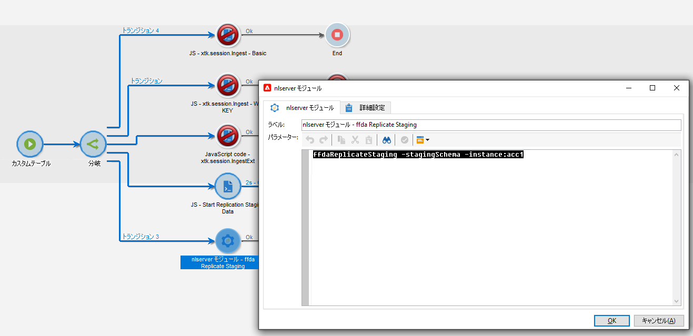

# データのレプリケーション {#wf-data-replication}

## 原則

[ エンタープライズ（FFDA）デプロイメント ](enterprise-deployment.md) のコンテキストでは、データレプリケーションによって、Campaign のローカルデータベース（PostgreSQL）とクラウドデータベース（[!DNL Snowflake]）の 2 つのデータベースが並行して動作し、リアルタイムで同期が維持されます。

クラウドデータベース（[!DNL Snowflake]）は、100 万アドレスの更新など、大きなデータバッチの処理に最適化されています。 一方、Campaign のローカルデータベース（PostgreSQL）は、単一のシードアドレスの更新など、個人の操作や少量の操作に適しています。 同期はバックグラウンドで自動的かつ透過的に行われ、Campaign のローカルデータベース（PostgreSQL）のデータがクラウドデータベース（[!DNL Snowflake]）でリアルタイムに複製され、両方のデータベースが同期されます。 データ同期には、スキーマ、テーブルおよびデータが含まれます。

➡️ [ データレプリケーションの仕組みをビデオで確認 ](#video)

## レプリケーションモード {#modes}

データレプリケーションは、使用例に応じて異なるモードで実行できます。

* **その場でのレプリケーション** は、リアルタイムの複製が不可欠な場合に対応します。 拡散の作成やシードアドレスの更新などのユースケースでデータをすぐにレプリケートするには、特定のテクニカルスレッドに依存します。
* **スケジュールされたレプリケーション** は、即時の同期が不要な場合に使用されます。 スケジュールされたレプリケーションでは、タイポロジルールなどのデータ同期のために 1 時間ごとに実行される特定の [ テクニカルワークフロー ](#workflows) を使用します。

## レプリケーションポリシー

レプリケーションポリシーでは、Campaign のローカルデータベース（PostgreSQL）テーブルからレプリケートするデータの量を定義します。 これらのポリシーは、テーブルのサイズと特定のユースケースによって異なります。 増分更新が行われるテーブルもあれば、完全にレプリケートされるテーブルもあります。 レプリケーション・ポリシーには、主に次の 3 つのタイプがあります。

* **XS**：このポリシーは、比較的小さいサイズのテーブルに使用されます。 テーブル全体が 1 回のショットでレプリケートされます。 増分レプリケーションでは、タイムスタンプポインターを使用して最近の変更のみをレプリケートすることで、同じデータが繰り返しレプリケートされるのを回避します。
* **SingleRow**：このポリシーは、一度に 1 つの行のみをレプリケートします。 通常は、現在の Campaign オブジェクトと関連オブジェクトを含むオンザフライのレプリケーションに使用されます。
* **SomeRows**：このポリシーは、クエリ定義またはフィルターを使用して、限られたデータのサブセットをレプリケートするように設計されています。 これは、選択的レプリケーションが必要な大きなテーブルに使用されます。

## レプリケーションワークフロー {#workflows}

Campaign v8 は、スケジュールされたデータレプリケーションを管理する特定のテクニカルワークフローに依存しています。 これらのテクニカルワークフローは、Campaign エクスプローラーの&#x200B;**[!UICONTROL 管理／本番環境／テクニカルワークフロー／フル FFDA レプリケーション]**&#x200B;ノードから利用できます。**これらは変更できません。**

テクニカルワークフローは、サーバーで定期的にスケジュールされたプロセスやジョブを実行します。 すべてのテクニカルワークフローのリストについて詳しくは、[このページ](https://experienceleague.adobe.com/docs/campaign/automation/workflows/introduction/wf-type/technical-workflows.html?lang=ja){target="_blank"}を参照してください。

データレプリケーションを確実にするテクニカルワークフローを次に示します。

| テクニカルワークフロー | 説明 |
|------|-----------|
| **[!UICONTROL 参照テーブルをレプリケート]** （ffdaReplicateReferenceTables） | Campaign のローカルデータベース（PostgreSQL）とクラウドデータベース（[!DNL Snowflake]）に不可欠なビルトインテーブルの自動レプリケーションを実行します。 毎日 1 時間ごとに実行するようにスケジュールされます。**lastModified** フィールドが存在する場合、レプリケーションは増分的に行われます。存在しない場合はテーブル全体がレプリケートされます。 |
| **[!UICONTROL ステージングデータをレプリケート]** （ffdaReplicateStagingData） | 単一の呼び出し用にステージングデータを複製します。 毎日 1 時間ごとに実行するようにスケジュールされます。 |
| **[!UICONTROL 直ちに FFDA をデプロイ]** （ffdaDeploy） | Cloud データベースへの即時デプロイメントを実行します。 |
| **[!UICONTROL 直ちに FFDA データをレプリケート]** （ffdaReplicate） | 指定された外部アカウントに対して、XS データをレプリケートします。 |

必要に応じて、データの同期を手動で開始できます。これを行うには、「**スケジューラー**」アクティビティを右クリックし、「**保留中のタスクを今すぐ実行**」を選択します。

ビルトインの **参照テーブルをレプリケート** テクニカルワークフローに加えて、次のいずれかの方法を使用して、ワークフローでデータレプリケーションを強制できます

+++データレプリケーションの強制方法

* 次のコードを使用して特定の **JavaScript コード** アクティビティを追加する：

  ```
  nms.replicationStrategy.StartReplicateStagingData("dem:sampleTable")
  ```

  

* 次のコマンドを使用して、特定の **nlmodule** アクティビティを追加する：

  ```
  nlserver ffdaReplicateStaging -stagingSchema -instance:acc1
  ```

  

+++

<br/>

>[!NOTE]
>
>その場のレプリケーションは、ワークフローではなく、特定のテクニカルスレッドで処理されます。 このモードの設定は、serverConf.xml ファイルで管理されます。 serverConf.xml を設定して、XS テーブルを完全にではなく増分的にレプリケートするよう要求するなど、特定の使用例に一致させることができます。 詳しくは、アドビ担当者にお問い合わせください。

## API

API を使用すると、Campaign ローカルデータベース（PostgreSQL）からクラウドデータベース（[!DNL Snowflake]）に、カスタムデータと標準データの両方をレプリケーションできます。 これらの API を使用すると、定義済みのワークフローを回避し、カスタムテーブルのレプリケーションなど、特定の要件に合わせてレプリケーションをカスタマイズできます。

例：

```
var dataSource = "nms:extAccount:ffda";
var xml = xtk.builder.CopyXxlData(
    <params dataSource={dataSource} policy="xs">
        <srcSchema name="cus:recipient"/>
    </params>
);
```

## レプリケーションキュー

大量のレプリケーション要求が同時に発生すると、MERGE 操作中にテーブルレベルのロックが原因で、クラウドデータベース（[!DNL Snowflake]）でパフォーマンスの問題が発生する場合があります。 これを軽減するために、一元化されたレプリケーションワークフローは、リクエストをキューにグループ化します。

各キューはテクニカルワークフローによって処理され、テクニカルワークフローは特定のテーブルのレプリケーションを管理し、保留中のリクエストを単一の MERGE 操作として実行します。 これらのワークフローは、新しいレプリケーション要求を処理するために 20 秒ごとにトリガーされます。

| テクニカルワークフロー | 説明 |
|------|-----------|
| **nmsDelivery キューをレプリケート** （ffdaReplicateQueueDelivery） | `nms:delivery` テーブルのキュー。 |
| **nmsDlvExclusion キューのレプリケート** （ffdaReplicateQueueDlvExclusion） | `nms:dlvExclusion` テーブルのキュー。 |
| **nmsDlvMidRemoteIdRel キューをレプリケート** （ffdaReplicateQueueDlvMidRemoteIdRel） | `nms:dlvRemoteIdRel` テーブルのキュー。 |
| **nmsTrackingUrl キューを複製** （ffdaReplicateQueueTrackingUrl） <br/>**nmsTrackingUrl キューを同時実行で複製** （ffdaReplicateQueueTrackingUrl_2） | `nms:trackingUrl` テーブル用に同時実行でキューを作成し、2 つのワークフローを利用して、異なる優先度に基づいてリクエストを処理することで効率を向上させます。 |

## チュートリアル {#video}

このビデオでは、Adobe Campaign v8 が使用するデータベース、データがレプリケートされる理由、レプリケートされるデータとレプリケーションプロセスの仕組みについて、重要な概念を説明します。

>[!VIDEO](https://video.tv.adobe.com/v/334460?quality=12)

Campaign v8 クライアントコンソールに関するその他のチュートリアルは [ こちら ](https://experienceleague.adobe.com/en/docs/campaign-learn/tutorials/overview) から利用できます。
