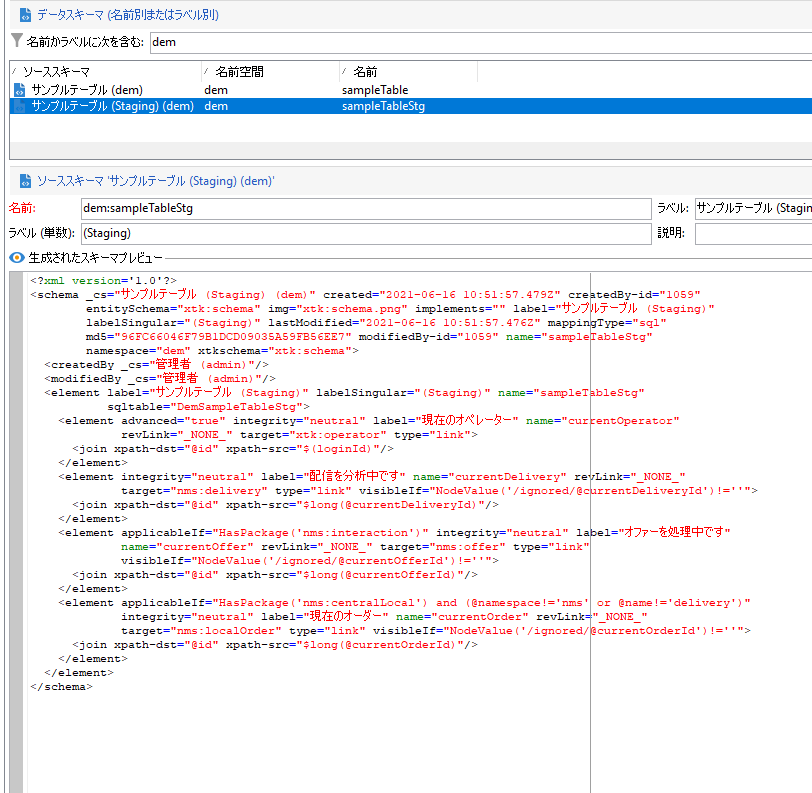

# Campaign API のステージングメカニズム

のコンテキストでは、 [エンタープライズ (FFDA) デプロイメント](enterprise-deployment.md)、パフォーマンス（待ち時間および同時実行性）に関して、単一呼び出しのブラストはお勧めしません。 バッチ操作は常に推奨されます。 パフォーマンスを向上させるために、取り込み API はローカルデータベースにリダイレクトされます。

一部のビルトインスキーマでは、デフォルトで、Campaign のステージング機能が有効になっています。任意のカスタムスキーマで有効にすることもできます。要約すると、次のようなステージングメカニズムです。

* データスキーマ構造がローカルのステージングテーブルにレプリケートされます。
* 取り込み用の新しい API は、ローカルステージングテーブルに直接送られます。[詳細情報](new-apis.md)
* スケジュールされたワークフローを 1 時間ごとにトリガーし、データをクラウドデータベースに同期します。 [詳細](replication.md)

一部のビルトインスキーマ（nmsSubscriptionRcp、nmsAppSubscriptionRcp、nmsRecipient など）は、デフォルトによりステージ化されます。

Campaign Classic v7 API は引き続き使用できますが、この新しいステージングメカニズムのメリットは得られません。API 呼び出しは、直接クラウドデータベースに送られます。 アドビでは、Campaign クラウドデータベースの全体的な負荷と待ち時間を減らすために、新しいステージングメカニズムをできる限り使用することをお勧めします。

>[!CAUTION]
>
>* この新しいメカニズムにより、購読の登録と解除、モバイル登録のデータ同期は、**非同期**&#x200B;になりました。
>
>* ステージングは、Cloud Database に格納されたスキーマにのみ適用されます。レプリケートされたスキーマのステージングを有効にしないでください。ローカルスキーマでステージングを有効にしないでください。ステージングスキーマでステージングを有効にしないでください
>


## 実装手順{#implement-staging}

Campaign のステージングメカニズムを特定のテーブルに実装するには、次の手順に従います。

1. Campaign クラウドデータベースでサンプルのカスタムスキーマを作成します。 この段階では、ステージングは有効になっていません。

   ```
   <srcSchema _cs="Sample Table (dem)" created="YYYY-DD-MM"
           entitySchema="xtk:srcSchema" img="xtk:schema.png" label="Sample Table"
           lastModified="YYYY-DD-MM HH:MM:SS.TZ" mappingType="sql" md5="XXX"
           modifiedBy-id="0" name="sampleTable" namespace="dem" xtkschema="xtk:srcSchema">
   <element autopk="true" autouuid="true" dataSource="nms:extAccount:ffda" label="Sample Table"
           name="sampleTable">
       <attribute label="Test Col 1" length="255" name="testcol1" type="string"/>
       <attribute label="Test Col 2" length="255" name="testcol2" type="string"/>
   </element>
   </srcSchema>
   ```

    カスタムスキーマの作成の詳細については、[このページ](../dev/create-schema.md)を参照してください。

1. データベース構造を保存して更新します。[詳細情報](../dev/update-database-structure.md)

1. **autoStg=&quot;true&quot;** パラメーターを追加して、スキーマ定義のステージングメカニズムを有効にします。

   ```
   <srcSchema _cs="Sample Table (dem)" "YYYY-DD-MM"
           entitySchema="xtk:srcSchema" img="xtk:schema.png" label="Sample Table"
           lastModified="YYYY-DD-MM HH:MM:SS.TZ" mappingType="sql" md5="XXX"
           modifiedBy-id="0" name="sampleTable" namespace="dem" xtkschema="xtk:srcSchema">
   <element autoStg="true" autopk="true" autouuid="true" dataSource="nms:extAccount:ffda" label="Sample Table"
           name="sampleTable">
       <attribute label="Test Col 1" length="255" name="testcol1" type="string"/>
       <attribute label="Test Col 2" length="255" name="testcol2" type="string"/>
   </element>
   </srcSchema>
   ```

1. 変更を保存します。 新しいステージングスキーマが使用可能になります。これは、初期スキーマのローカルコピーです。

   

1. データベース構造を更新します。ステージングテーブルが、Campaign ローカルデータベースに作成されます。
