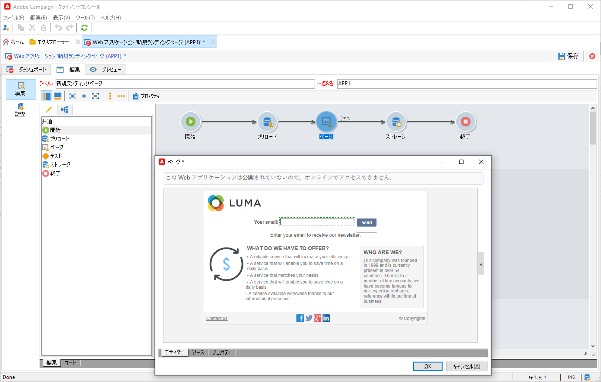

# Web フォームでのプロファイルの収集と更新

Campaign を使用して Web フォームを作成し、プロファイルデータを簡単かつ効率的に収集および管理します。 これらのフォームは web サイトで共有できるので、連絡先にとっても情報を提供しやすくなります。データは、プロファイルを作成または更新するために Campaign に送信されます。

 Web フォームの作成方法については、[Campaign Classic v7 ドキュメント](https://experienceleague.adobe.com/docs/campaign-classic/using/designing-content/web-forms/about-web-forms.html?lang=ja){target=&quot;_blank&quot;}を参照してください。
